# Solace-AI Architecture Diagrams

> **Version**: 1.0
> **Last Updated**: December 22, 2025
> **Purpose**: Visual representation of system architecture, data flows, and component interactions

---

## Table of Contents

1. [High-Level System Architecture](#1-high-level-system-architecture)
2. [Agent Orchestration Flow](#2-agent-orchestration-flow)
3. [Data Flow Diagram](#3-data-flow-diagram)
4. [Memory System Architecture](#4-memory-system-architecture)
5. [Diagnosis Pipeline Flow](#5-diagnosis-pipeline-flow)
6. [API Request Lifecycle](#6-api-request-lifecycle)
7. [Security & Authentication Flow](#7-security--authentication-flow)
8. [Component Dependency Graph](#8-component-dependency-graph)

---

## 1. High-Level System Architecture

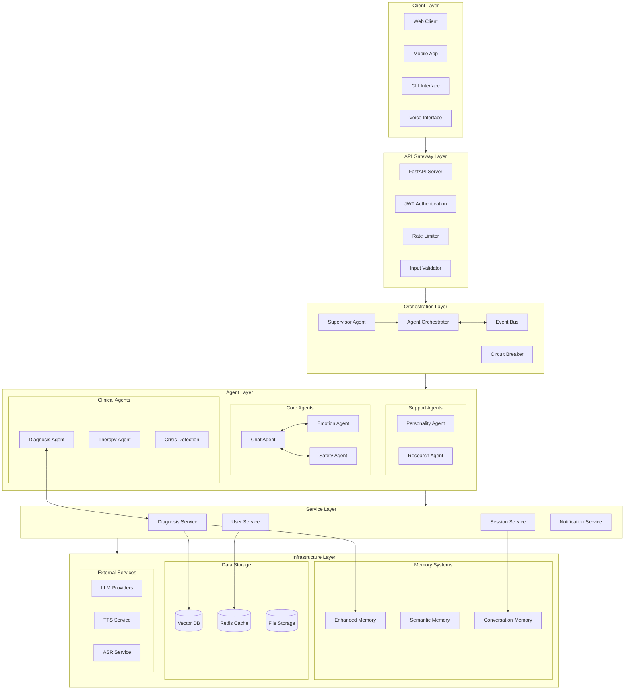

---

## 2. Agent Orchestration Flow

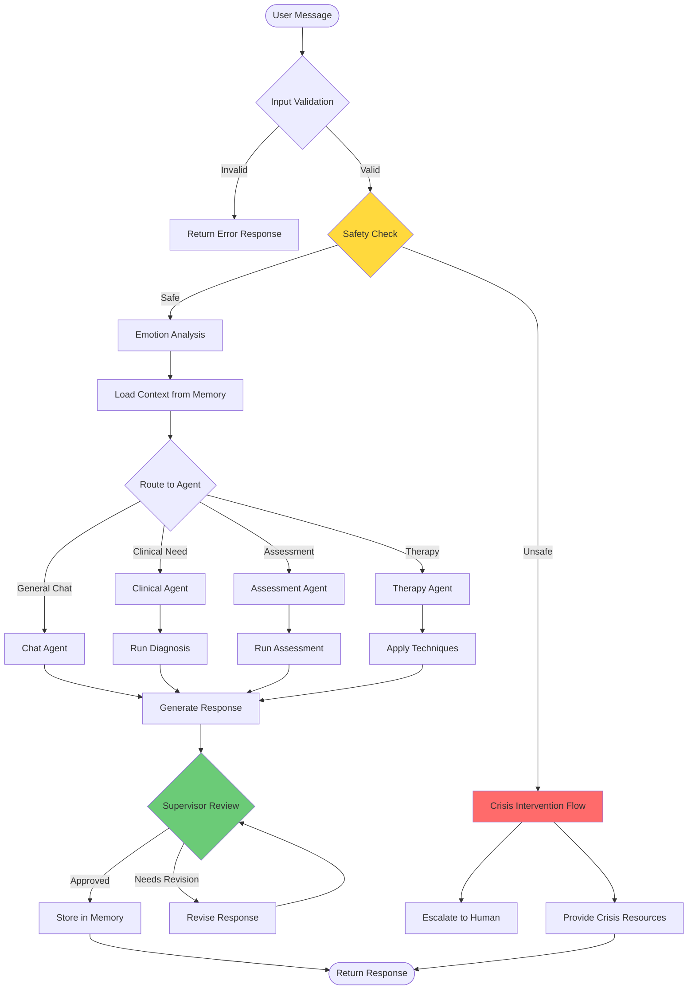

---

## 3. Data Flow Diagram

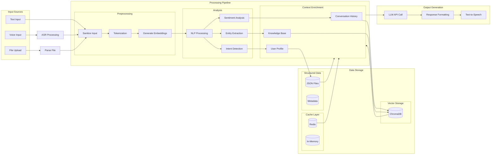

---

## 4. Memory System Architecture

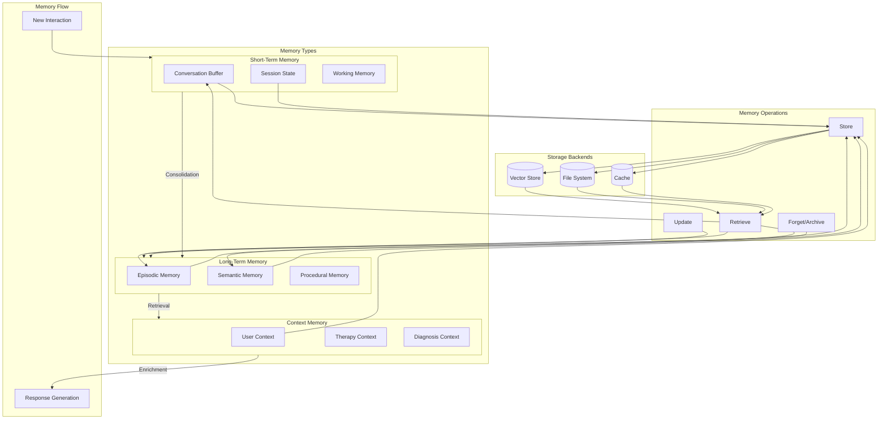

---

## 5. Diagnosis Pipeline Flow

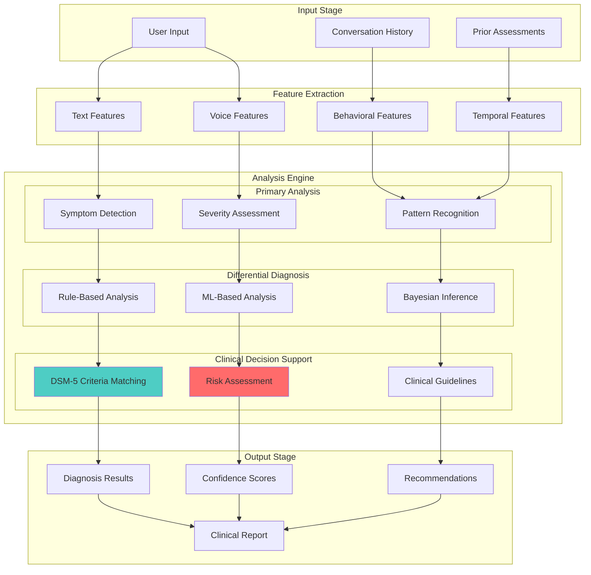

---

## 6. API Request Lifecycle

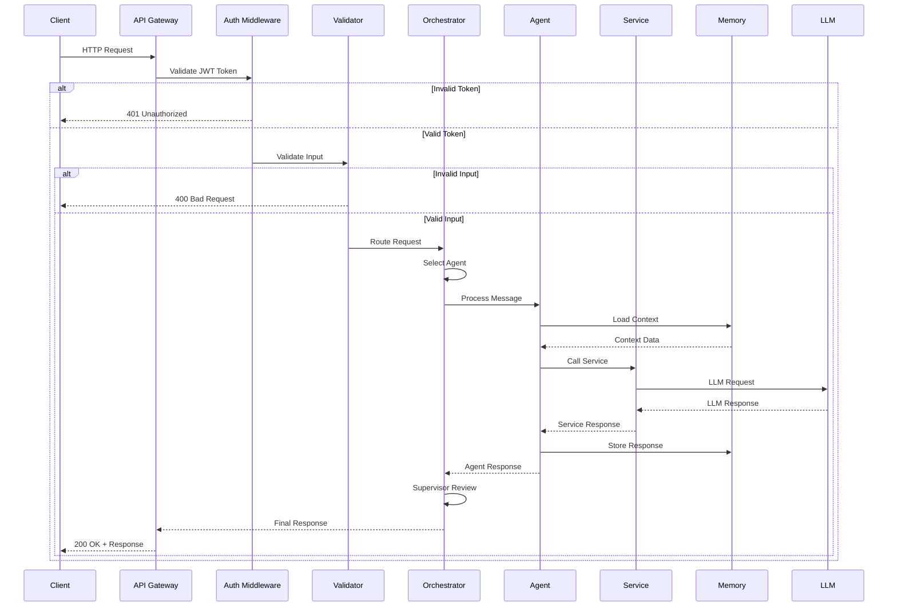

---

## 7. Security & Authentication Flow

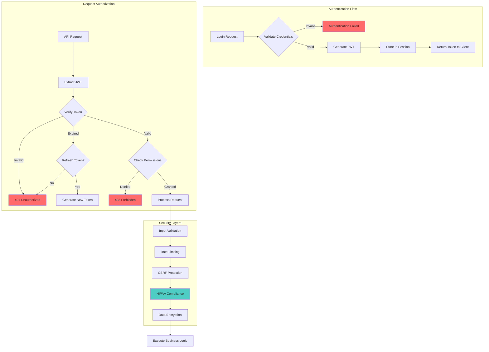

---

## 8. Component Dependency Graph

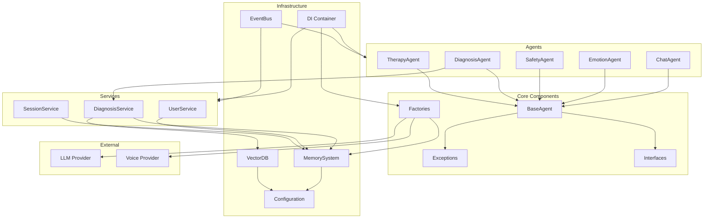

---

## Current vs Target Architecture

### Current State (Problematic)

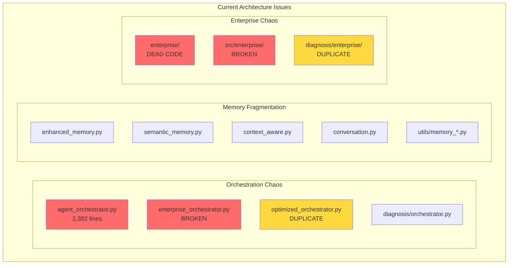

### Target State (Clean)

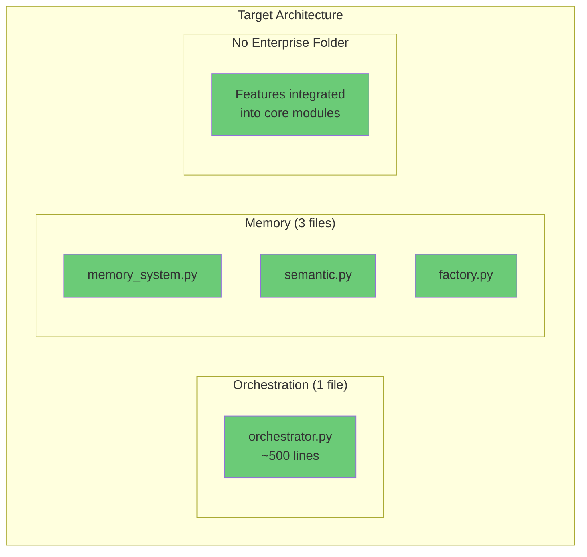

---

## Module Communication Patterns

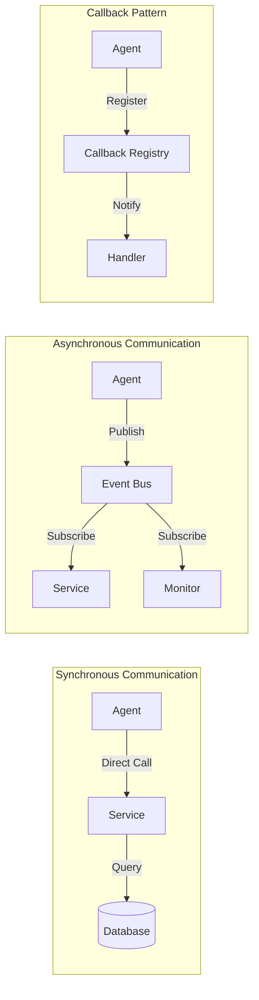

---

*Diagrams created for Solace-AI codebase visualization*
*Use Mermaid-compatible markdown viewer to render*
