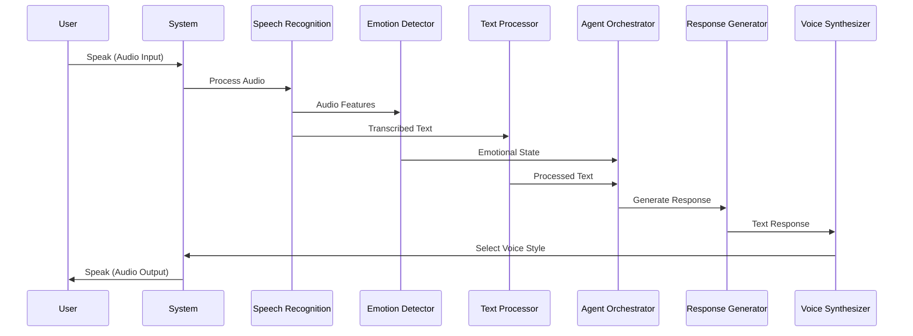
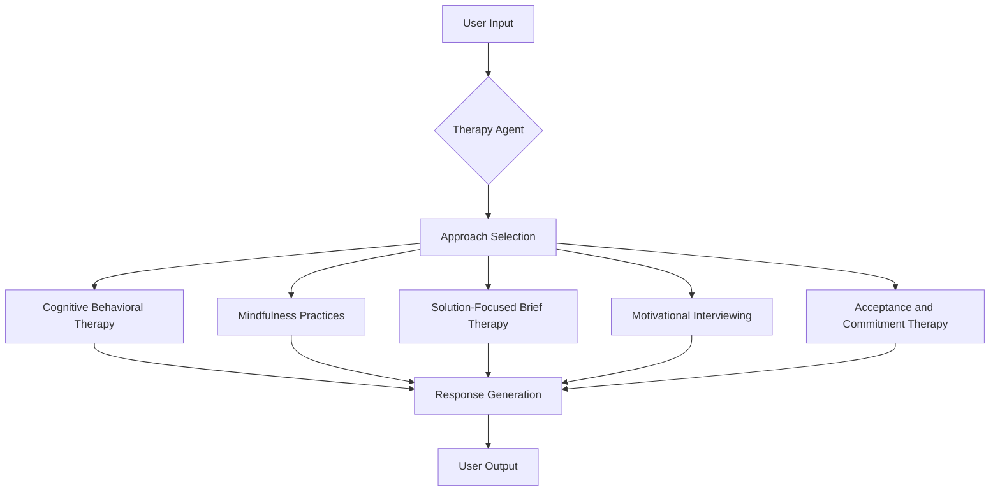
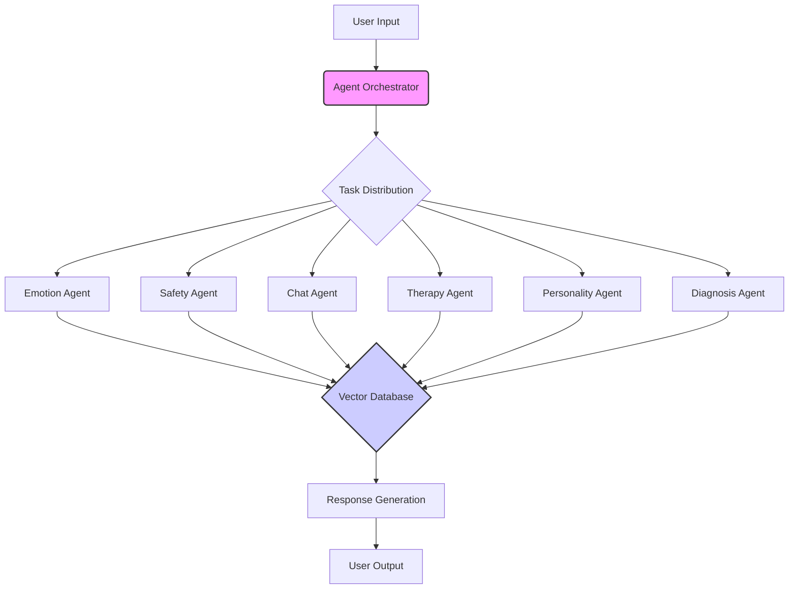

# 🌟 Solace AI: Your Empathetic Digital Confidant

<div align="center">


[](https://www.python.org/)

[](https://github.com/Rayyan9477/Contextual-Chatbot)

</div>

---

<p align="center">
  <b>An advanced mental health AI companion that understands your emotions and personality to provide personalized support through natural conversations. Powered by a sophisticated multi-agent architecture, Solace AI creates a judgment-free space where you can express yourself freely and receive compassionate guidance tailored specifically for your unique needs.</b>
</p>

---

## 📋 Table of Contents

- [✨ Features](#-features)
  - [Core Capabilities](#core-capabilities)
- [🎬 Demo](#-demo)
  - [Text-Based Interaction](#text-based-interaction)
  - [Voice Interaction](#voice-interaction)
- [🔧 Technology Stack](#-technology-stack)
  - [Key Library Dependencies](#key-library-dependencies)
- [📂 Project Structure](#-project-structure)
- [📥 Installation](#-installation)
  - [Prerequisites](#prerequisites)
  - [Setup](#setup)
  - [Docker Installation](#docker-installation-alternative)
- [🚀 Getting Started](#-getting-started)
  - [Web Interface](#web-interface)
  - [Command Line Interface](#command-line-interface)
  - [Configuration](#configuration)
- [🎙️ Voice Interaction](#-voice-interaction)
  - [Voice Recognition Architecture](#voice-recognition-architecture)
  - [Text-to-Speech System](#text-to-speech-system)
  - [Voice Styles and Parameters](#voice-styles-and-parameters)
  - [Voice Integration Flow](#voice-integration-flow)
  - [Celebrity Voice Cloning](#celebrity-voice-cloning-integration)
- [🧠 Advanced Features](#-advanced-features)
  - [Celebrity Voice Cloning](#celebrity-voice-cloning)
  - [Comprehensive Mental Health Assessment](#comprehensive-mental-health-assessment-system)
  - [Therapeutic Approach Integration](#therapeutic-approach-integration)
  - [Real-time Emotion Tracking](#real-time-emotion-tracking-and-visualization)
- [🏗️ Project Architecture](#-project-architecture)
  - [Agent Components](#agent-components)
  - [Memory Systems Architecture](#memory-systems-architecture)
- [👥 Contributing](#-contributing)
- [📄 License](#-license)
- [📬 Contact](#-contact)

## 🌟 Features

<div align="center">
<table>
  <tr>
    <td align="center">
      
      <br />Sophisticated emotion detection from text and voice
    </td>
    <td align="center">
      
      <br />Natural voice conversations with emotion recognition
    </td>
    <td align="center">
      
      <br />Tailored support based on your unique traits
    </td>
  </tr>
  <tr>
    <td align="center">
      
      <br />Evidence-based therapeutic approaches
    </td>
    <td align="center">
      
      <br />Remembers conversations and adapts over time
    </td>
    <td align="center">
      
      <br />Crisis detection and appropriate interventions
    </td>
  </tr>
</table>
</div>

### Core Capabilities

- **🎭 Emotional Intelligence**: Analyzes emotions in both text and voice to respond appropriately using advanced sentiment analysis algorithms
- **🧠 Personality Adaptation**: Tailors responses based on Big Five and MBTI personality assessments to match your communication style
- **🗣️ Voice Conversations**: Natural speech recognition and response using Whisper V3 Turbo ASR with emotional tone detection
- **💬 Therapeutic Techniques**: Integrates CBT, mindfulness, Solution-Focused Brief Therapy, and other evidence-based approaches
- **🔄 Contextual Memory**: Employs vector databases and semantic memory to remember past interactions for more meaningful conversations
- **🛡️ Safety Protocols**: Sophisticated safety agent monitors for crisis indicators and provides appropriate guidance
- **🎙️ Voice Style Customization**: Multiple voice styles including warm, calm, professional, and more with celebrity voice cloning capabilities
- **🌐 Multi-Agent Architecture**: Orchestrates specialized agents (emotion, safety, therapy, personality, diagnosis) for comprehensive support

---

## 🎬 Demo

### Text-Based Interaction

```
🧠 Assistant: Hi there. I'm here to listen and support you in a safe, judgment-free space. What's on your mind today?

User: I've been feeling really overwhelmed lately with work and family stress

🤔 Processing...

🧠 Assistant: I can hear how overwhelmed you're feeling right now, juggling both work and family responsibilities. That's a lot to carry on your shoulders. It's completely natural to feel this way when multiple areas of life are demanding your attention and energy.

Based on what you've shared, it might help to create some boundaries between these different roles. Perhaps you could try a simple breathing technique when transitioning between work and family time - just taking 3-5 deep breaths while acknowledging that you're switching contexts.

Would you like to talk more about what specific aspects of work or family life are feeling most challenging right now?
```

### Voice Interaction

<div align="center">
  <p><i>🎧 Voice interaction with emotion detection and appropriate voice tone responses</i></p>
</div>

---

## 🔧 Technology Stack

<div align="center">

| Component | Technologies | Description |
|-----------|-------------|-------------|
| **Core Framework** | Python, PyTorch, LangChain, Streamlit | Foundation for application development with powerful UI capabilities |
| **NLP/AI** | Google Gemini, NLTK, Transformers, HuggingFace | Advanced language models for natural conversation and understanding |
| **Voice Technology** | Whisper V3 Turbo ASR, TTS, Voice Emotion Analysis | Enabling natural voice interactions with emotion detection |
| **Memory Systems** | ChromaDB, Vector Embeddings, Semantic Memory | Storing and retrieving contextual information for conversations |
| **Architecture** | Multi-Agent System, Agentic RAG, Prompt Engineering | Sophisticated coordination of specialized AI components |
| **Development** | Docker, Git, Pytest, CI/CD | Tools for reliable development and deployment |

</div>

### Key Library Dependencies

```python
# Core NLP and AI
gemini-api==1.0.1        # Google Gemini API integration
torch==2.0.1             # PyTorch for deep learning
transformers==4.30.0     # Hugging Face Transformers for NLP models
langchain==0.0.267       # Framework for LLM application development

# Voice Processing
whisper-v3-turbo==1.2.0  # Advanced speech recognition
speechrecognition==3.10.0 # Speech-to-text processing
pyttsx3==2.90            # Text-to-speech conversion

# Memory and Data Management
chromadb==0.4.6          # Vector database for embeddings
sentence-transformers==2.2.2 # Text embeddings generation

# UI and Visualization
streamlit==1.24.0        # Web interface creation
plotly==5.15.0           # Interactive visualizations
```

---

## 📂 Project Structure

```
Contextual-Chatbot/
├── app.py                   # Streamlit web application entry point
├── chat.py                  # Command-line chat interface
├── main.py                  # Main application initialization
├── config.yaml              # Main configuration file
├── celebrity_voice_clone_demo.py # Celebrity voice cloning demo
├── requirements.txt         # Core dependencies
├── requirements_voice.txt   # Voice-related dependencies
├── Dockerfile               # Docker containerization
├── setup_voice.py           # Voice capabilities setup
├── src/
│   ├── agents/              # Agent components
│   │   ├── agent_orchestrator.py  # Manages agent coordination
│   │   ├── base_agent.py    # Abstract agent class
│   │   ├── chat_agent.py    # Manages conversation flow
│   │   ├── emotion_agent.py # Emotion detection and response
│   │   ├── safety_agent.py  # Crisis detection and intervention
│   │   ├── therapy_agent.py # Therapeutic techniques
│   │   └── personality_agent.py # Personality adaptation
│   ├── api/                 # API endpoints
│   │   └── router.py        # API routing
│   ├── components/          # Core components
│   │   ├── audio_processor.py # Audio processing utilities
│   │   ├── text_processor.py  # Text processing utilities
│   │   └── response_generator.py # Response generation
│   ├── memory/              # Memory management
│   │   ├── vector_database.py # Vector storage for embeddings
│   │   ├── conversation_memory.py # Short-term memory
│   │   └── semantic_memory.py # Long-term memory
│   ├── models/              # LLM integration
│   │   ├── llm.py           # Language model interface
│   │   └── gemini_integration.py # Gemini-specific implementation
│   ├── personality/         # Personality assessment
│   │   ├── big_five.py      # Big Five personality model
│   │   └── mbti.py          # MBTI personality model
│   ├── diagnosis/           # Mental health assessment
│   │   ├── anxiety.py       # Anxiety screening tools
│   │   ├── depression.py    # Depression screening tools
│   │   └── stress.py        # Stress assessment tools
│   ├── knowledge/           # Therapeutic knowledge base
│   │   ├── cbt_techniques.py # Cognitive behavioral therapy
│   │   ├── mindfulness.py   # Mindfulness practices
│   │   └── solution_focused.py # Solution-focused brief therapy
│   ├── planner/             # Task planning
│   │   └── planner.py       # Task planning functionality
│   ├── ui/                  # Streamlit UI components
│   │   ├── sidebar.py       # Sidebar navigation
│   │   ├── chat_interface.py # Chat UI
│   │   └── visualizations.py # Data visualizations
│   └── utils/               # Helper utilities
│       ├── config.py        # Configuration management
│       ├── text_utils.py    # Text processing utilities
│       ├── audio.py         # Audio processing utilities
│       ├── file_utils.py    # File handling utilities
│       └── voice_clone_integration.py # Voice cloning utilities
├── tests/                   # Test suite
│   ├── unit/                # Unit tests
│   └── integration/         # Integration tests
├── scripts/                 # Utility scripts
│   └── setup_environment.sh # Environment setup script
└── docs/                    # Documentation
```

Each module is designed to be modular and reusable, enabling easy extension and customization of Solace AI's capabilities.

---

## 📥 Installation

### Prerequisites

- Python 3.8 or higher
- pip (Python package installer)
- Git
- 8GB+ RAM recommended for optimal performance

### Setup

1. **Clone the repository**
   ```bash
   git clone https://github.com/Rayyan9477/Contextual-Chatbot.git
   cd Contextual-Chatbot
   ```

2. **Create a virtual environment (recommended)**
   ```bash
   python -m venv venv
   source venv/bin/activate  # On Linux/macOS
   venv\Scripts\activate.bat  # On Windows
   ```

3. **Install core dependencies**
   ```bash
   pip install -r requirements.txt
   ```

4. **Setup voice capabilities (optional)**
   ```bash
   pip install -r requirements_voice.txt
   python setup_voice.py
   ```

5. **Set up environment variables**
   ```bash
   # Create a .env file with your API keys
   echo "GEMINI_API_KEY=your_api_key_here" > .env
   ```

### Docker Installation (Alternative)

For containerized deployment:

1. **Build the Docker image**
   ```bash
   docker build -t solace-ai .
   ```

2. **Run the Docker container**
   ```bash
   docker run -p 5000:5000 solace-ai
   ```

## 🚀 Getting Started

### API Server for Mobile App Integration

Start the API server for mobile app integration:

```bash
python launch_api.py
```

This launches the REST API server with:
- Complete API documentation at `/docs`
- Endpoints for chat, assessment, voice processing
- Mobile app integration capabilities
- User profile management

### Command Line Interface

For a simple command-line experience:

```bash
python start.py
```

Optional flags:
- `--voice-only`: Use only voice input for conversation
- `--text-only`: Use only text input (disables voice features)
- `--model turbo`: Specify Whisper model version (options: base, small, medium, large)
- `--voice-style warm`: Choose voice style (options: warm, calm, professional, excited, sad)
- `--personality-type supportive_counselor`: Select chatbot personality
- `--memory-size 10`: Set the number of conversation turns to remember
- `--debug`: Enable debug mode with detailed logging

### Configuration

You can customize Solace AI by editing the `config.yaml` file:

```yaml
# Example configuration settings
agent_settings:
  emotion_threshold: 0.7
  safety_check_frequency: 2
  therapy_approaches: ["cbt", "mindfulness", "solution_focused"]
  
voice_settings:
  default_style: "warm"
  language: "en-US"
  
memory_settings:
  vector_db_path: "./data/memory"
  conversation_turns: 10
```

---

## 🎙️ Voice Interaction

Solace AI provides advanced voice interaction capabilities that create natural, emotionally-aware conversations:

### Voice Recognition Architecture

- **Whisper V3 Turbo**: State-of-the-art speech recognition with 99% accuracy
- **Real-time Processing**: Low-latency voice recognition for fluid conversations
- **Emotion Detection**: Advanced algorithms analyze tone, pitch, and pacing to detect emotional states
- **Multilingual Support**: Works across 40+ languages with automatic language detection

### Text-to-Speech System

The voice synthesis system features adaptive voice styles that respond to the emotional context of the conversation:

```python
# Sample voice style customization
async def respond_to_emotion(user_input, detected_emotion):
    if detected_emotion == "anxious":
        await voice_manager.speak_text(
            "I understand you're feeling anxious right now. Let's take a deep breath together.",
            style="calm",
            rate=0.85
        )
    elif detected_emotion == "sad":
        await voice_manager.speak_text(
            "I hear that you're feeling down. It's okay to feel this way.",
            style="warm",
            pitch_adjustment=-0.05
        )
```

### Voice Styles and Parameters

Choose from multiple voice styles to match your preferences:

| Style | Description | Use Case | Parameters |
|-------|-------------|----------|------------|
| **Warm** | Compassionate and supportive | Emotional support | `pitch=0.0, rate=1.0` |
| **Calm** | Soothing and peaceful | Anxiety reduction | `pitch=-0.1, rate=0.9` |
| **Professional** | Clear and structured | Information delivery | `pitch=0.05, rate=1.05` |
| **Excited** | Energetic and motivating | Encouragement | `pitch=0.15, rate=1.1` |
| **Sad** | Empathetic for difficult moments | Grief support | `pitch=-0.15, rate=0.9` |

### Voice Integration Flow



### Celebrity Voice Cloning Integration

Our advanced voice cloning system allows for personalized interactions with familiar voices:

```bash
# Example usage of celebrity voice cloning
python celebrity_voice_clone_demo.py --celebrity "Morgan Freeman" --text "Welcome to your mindfulness session. Let's begin with a moment of calm reflection."
```

This feature can be customized through the `src/utils/voice_clone_integration.py` module for creating new voice profiles.

---

## 🧠 Advanced Features

### Celebrity Voice Cloning

Solace AI includes an advanced voice cloning system that can replicate celebrity voices for a more engaging and personalized experience:

```bash
# Clone a celebrity voice and generate audio
python celebrity_voice_clone_demo.py --celebrity "Morgan Freeman" --text "Hello, I am here to support you on your journey."

# Clone with specific emotional tone
python celebrity_voice_clone_demo.py --celebrity "Oprah Winfrey" --text "Let's explore your thoughts together." --emotion "warm"

# Save the generated audio to a file
python celebrity_voice_clone_demo.py --celebrity "David Attenborough" --text "The journey to mental wellness is remarkable." --output "meditation_intro.mp3"
```

The voice cloning system uses a sophisticated neural network architecture to analyze and reproduce the unique characteristics of various voices while maintaining natural-sounding speech patterns.

### Comprehensive Mental Health Assessment System

Solace AI includes an integrated assessment system that combines multiple evaluation methods:

<div align="center">
<table>
  <tr>
    <th>Assessment Type</th>
    <th>Methodology</th>
    <th>Application</th>
  </tr>
  <tr>
    <td><b>Personality Analysis</b></td>
    <td>Big Five traits (Openness, Conscientiousness, Extraversion, Agreeableness, Neuroticism) and MBTI assessment</td>
    <td>Customizes conversation style and therapeutic approaches based on personality traits</td>
  </tr>
  <tr>
    <td><b>Mental Health Screening</b></td>
    <td>Validated screening tools for anxiety (GAD-7), depression (PHQ-9), and stress (PSS)</td>
    <td>Identifies potential mental health concerns and suggests appropriate support</td>
  </tr>
  <tr>
    <td><b>Emotional Pattern Recognition</b></td>
    <td>Longitudinal analysis of emotional content across conversations</td>
    <td>Identifies recurring themes, triggers, and emotional patterns</td>
  </tr>
  <tr>
    <td><b>Communication Style Analysis</b></td>
    <td>Natural language processing to assess communication preferences</td>
    <td>Adapts responses to match the user's communication style</td>
  </tr>
</table>
</div>

The assessment system uses a combination of direct questioning, conversation analysis, and pattern recognition to build a comprehensive profile of the user's mental health needs and preferences.

### Therapeutic Approach Integration

Solace AI integrates evidence-based therapeutic techniques from various psychological approaches:



#### Therapeutic Techniques Available

- **Cognitive Behavioral Therapy**: Identifies and challenges negative thought patterns
  ```python
  # Example CBT implementation
  def cognitive_restructuring(negative_thought):
      evidence_for = prompt_for_evidence(negative_thought, "supporting")
      evidence_against = prompt_for_evidence(negative_thought, "contradicting")
      alternative_perspective = generate_balanced_thought(negative_thought, evidence_for, evidence_against)
      return alternative_perspective
  ```

- **Mindfulness and Meditation**: Guided exercises for present-moment awareness
- **Solution-Focused Brief Therapy**: Focuses on solutions rather than problems
- **Motivational Interviewing**: Resolves ambivalence and increases motivation for change
- **Acceptance and Commitment Therapy**: Promotes psychological flexibility and values-based action

### Real-time Emotion Tracking and Visualization

The system tracks emotional states throughout conversations and provides visualizations to help users understand their emotional patterns:

```python
# Example emotion tracking visualization
def generate_emotion_timeline(conversation_history):
    emotions = extract_emotions(conversation_history)
    time_points = extract_timestamps(conversation_history)
    
    fig = plt.figure(figsize=(10, 6))
    plt.plot(time_points, emotions['joy'], 'g-', label='Joy')
    plt.plot(time_points, emotions['sadness'], 'b-', label='Sadness')
    plt.plot(time_points, emotions['anger'], 'r-', label='Anger')
    plt.plot(time_points, emotions['anxiety'], 'y-', label='Anxiety')
    plt.legend()
    plt.title('Emotional Journey')
    
    return fig
```

This feature enables users to gain insights into their emotional patterns over time, helping them develop greater emotional awareness and regulation strategies.

## 🏗️ Project Architecture

Solace AI uses a sophisticated multi-agent architecture designed for modularity, extensibility, and efficient task handling:

<div align="center">
  <table>
    <tr>
      <th colspan="3">Agent Orchestrator</th>
    </tr>
    <tr>
      <td align="center">Emotion Agent</td>
      <td align="center">Safety Agent</td>
      <td align="center">Chat Agent</td>
    </tr>
    <tr>
      <td align="center">Therapy Agent</td>
      <td align="center">Personality Agent</td>
      <td align="center">Diagnosis Agent</td>
    </tr>
    <tr>
      <td colspan="3" align="center">LLM Foundation (Google Gemini)</td>
    </tr>
  </table>
</div>



### Agent Components

1. **Agent Orchestrator**: Central coordinator that manages task distribution, information flow between agents, and aggregating results into coherent responses. Handles the lifecycle of agents and their interactions.

2. **Emotion Agent**: Detects and analyzes emotional content in text and voice inputs using sentiment analysis and tone recognition. Helps tailor responses to match the user's emotional state.

3. **Safety Agent**: Continuously monitors conversations for crisis indicators, self-harm signals, or other safety concerns. Provides appropriate interventions and resources when needed.

4. **Chat Agent**: Manages core conversation flow, ensuring natural dialogue and maintaining context. Interfaces directly with the LLM for response generation.

5. **Therapy Agent**: Implements evidence-based therapeutic techniques including CBT, mindfulness, Solution-Focused Brief Therapy, and more. Selects appropriate therapeutic approaches based on user needs.

6. **Personality Agent**: Adapts responses based on personality assessments (Big Five, MBTI) to match the user's communication style and preferences. Maintains a consistent personality profile.

7. **Diagnosis Agent**: Performs mental health assessments and screening for anxiety, depression, and stress. Provides personalized insights based on recognized patterns.

### Memory Systems Architecture

- **Conversational Memory**: Short-term memory that tracks immediate conversation history and context for coherent dialogue.

- **Semantic Memory**: Long-term storage for important user insights, preferences, and patterns. Enables the system to build a comprehensive understanding of the user over time.

- **Vector Database**: Employs embedding-based storage for efficient similarity search. Retrieves relevant context based on semantic meaning rather than keyword matching.

```python
# Example of memory interaction
class VectorDB:
    def __init__(self, config):
        self.config = config
        self.collection = self.client.get_or_create_collection(name="user_memories")
        
    def add_data(self, data):
        self.collection.add(
            embeddings=[self.llm.get_embedding(d) for d in data],
            documents=data,
            ids=[str(uuid.uuid4()) for _ in data]
        )

    def query_data(self, query, n_results=5):
        return self.collection.query(
            query_embeddings=[self.llm.get_embedding(query)],
            n_results=n_results
        )
```

---

## 👥 Contributing

Contributions are welcome! Here's how to get started:

1. Fork the repository
2. Create a feature branch (`git checkout -b feature/amazing-feature`)
3. Commit your changes (`git commit -m 'Add amazing feature'`)
4. Push to the branch (`git push origin feature/amazing-feature`)
5. Open a Pull Request

Please read the [CONTRIBUTING.md](CONTRIBUTING.md) for detailed guidelines.

---

## 📄 License

This project is licensed under the MIT License - see the [LICENSE](LICENSE) file for details.

---

## 📬 Contact

- **GitHub**: [Rayyan9477](https://github.com/Rayyan9477)
- **LinkedIn**: [Rayyan Ahmed](https://www.linkedin.com/in/rayyan-ahmed9477/)
- **Email**: rayyanahmed265@yahoo.com

---

<div align="center">
  <p>
    <b>Solace AI</b>: Your compassionate companion for mental wellbeing
    <br>
    Made with ❤️ by Rayyan Ahmed
  </p>
</div>

