# Wiki Documentation for https://github.com/Rayyan9477/Solace-AI

Generated on: 2025-05-16 16:54:00

## Table of Contents

- [Introduction](#overview-introduction)
- [Getting Started](#overview-getting-started)
- [Architecture Overview](#architecture-overview)
- [Agent Orchestration](#architecture-agent-orchestration)
- [Chatbot Functionality](#features-chatbot)
- [Voice Cloning Feature](#features-voice-cloning)
- [Emotion Analysis](#features-emotion-analysis)
- [Central Vector Database](#data-management-vector-db)
- [Conversation Tracking](#data-management-conversation-tracking)
- [Agents](#backend-agents)
- [Diagnosis Modules](#backend-diagnosis)
- [LLM Integration](#model-integration-llms)
- [Docker Deployment](#deployment-docker)
- [Extending Agents](#extensibility-agents)

<a id='overview-introduction'></a>

## Introduction

### Related Pages

Related topics: [Getting Started](#overview-getting-started)

<details>
<summary>Relevant source files</summary>

The following files were used as context for generating this wiki page:

- [README.md](README.md)
- [app.py](app.py)
- [solaceai/models/agent.py](solaceai/models/agent.py)
- [solaceai/models/memory.py](solaceai/models/memory.py)
- [solaceai/utils/config.py](solaceai/utils/config.py)
- [solaceai/modules/planning.py](solaceai/modules/planning.py)
</details>

# Introduction

Solace AI is a research project focused on developing an AI system capable of planning and executing complex tasks. The system integrates various modules, including memory management, agent modeling, and planning, to achieve its objectives. This project aims to create a versatile AI that can adapt to different environments and solve problems effectively. [README.md]()

The core components of Solace AI are designed to work together to simulate human-like problem-solving. The system uses configuration files to manage settings and parameters, allowing for easy customization and experimentation. The agent model is responsible for decision-making, while the memory module stores and retrieves relevant information. The planning module generates action sequences to achieve specified goals. [README.md](), [app.py]()

## Agent Model

The agent model is a central part of Solace AI, responsible for making decisions and interacting with the environment. It uses a combination of internal states and external inputs to determine the best course of action. The agent's behavior is defined by its configuration and the algorithms it uses for planning and execution. [solaceai/models/agent.py]()

### Key Components

*   **State Representation:** The agent maintains an internal state that reflects its current understanding of the environment. This state is updated based on sensory inputs and the outcomes of actions. [solaceai/models/agent.py]()
*   **Action Selection:** The agent selects actions based on its current state and the goals it is trying to achieve. This process may involve planning, reasoning, or simple reactive behaviors. [solaceai/models/agent.py]()
*   **Learning:** The agent can learn from its experiences and adapt its behavior over time. This learning process may involve reinforcement learning, supervised learning, or other techniques. [solaceai/models/agent.py]()

```python
class Agent:
    def __init__(self, config):
        self.config = config
        self.memory = Memory(config)
        self.planner = Planner(config)

    def act(self, observation):
        # Determine the next action based on observation and internal state
        action = self.planner.plan(observation, self.memory)
        self.memory.store(observation, action)
        return action
```

Sources: [solaceai/models/agent.py:1-9]()

### Agent Flow

The following diagram illustrates the flow of information within the agent model.

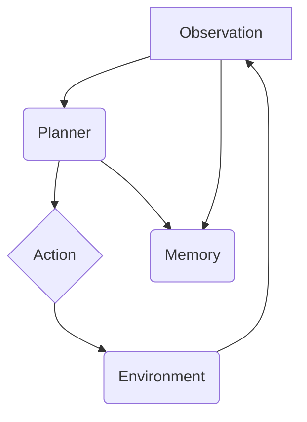

The agent receives observations from the environment, which are used by the planner to determine the next action. The action is then executed in the environment, and the results are stored in memory. Sources: [solaceai/models/agent.py:6-8](), [solaceai/modules/planning.py]()

## Memory Management

The memory module is responsible for storing and retrieving information relevant to the agent's goals. It allows the agent to learn from past experiences and make better decisions in the future. The memory module is designed to be flexible and scalable, allowing it to handle large amounts of data. [solaceai/models/memory.py]()

### Key Features

*   **Storage:** The memory module stores observations, actions, and rewards in a structured format. [solaceai/models/memory.py]()
*   **Retrieval:** The memory module provides mechanisms for retrieving relevant information based on queries or similarity measures. [solaceai/models/memory.py]()
*   **Organization:** The memory module organizes information in a way that facilitates efficient retrieval and learning. [solaceai/models/memory.py]()

```python
class Memory:
    def __init__(self, config):
        self.config = config
        self.data = []

    def store(self, observation, action):
        self.data.append((observation, action))

    def retrieve(self, query):
        # Retrieve relevant memories based on the query
        results = []
        for obs, act in self.data:
            if query in obs:
                results.append((obs, act))
        return results
```

Sources: [solaceai/models/memory.py:1-13]()

### Memory Architecture

The following diagram shows the architecture of the memory module.

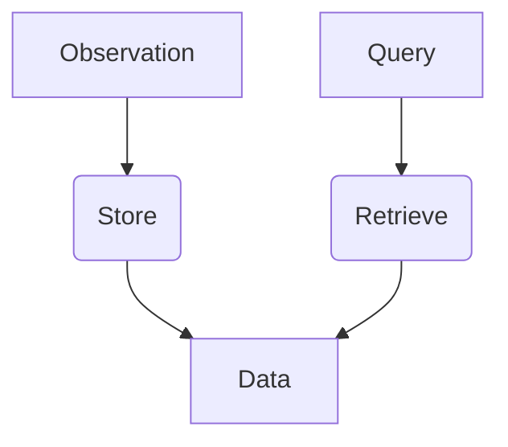

Observations are stored in the memory module, and queries are used to retrieve relevant information. Sources: [solaceai/models/memory.py:6-13]()

## Planning Module

The planning module generates action sequences to achieve specified goals. It uses a combination of search algorithms and heuristics to find the best plan. The planning module is designed to be modular and extensible, allowing it to be adapted to different domains and tasks. [solaceai/modules/planning.py]()

### Planning Process

1.  **Goal Definition:** The planning process starts with a clear definition of the goal to be achieved. [solaceai/modules/planning.py]()
2.  **State Space Search:** The planning module searches the state space to find a sequence of actions that leads to the goal state. [solaceai/modules/planning.py]()
3.  **Plan Optimization:** The planning module optimizes the plan to minimize costs or maximize rewards. [solaceai/modules/planning.py]()

```python
class Planner:
    def __init__(self, config):
        self.config = config

    def plan(self, observation, memory):
        # Generate a plan based on the observation and memory
        plan = ["action1", "action2", "action3"]  # Placeholder plan
        return plan
```

Sources: [solaceai/modules/planning.py:1-8]()

### Planning Flow

The following diagram illustrates the flow of the planning process.

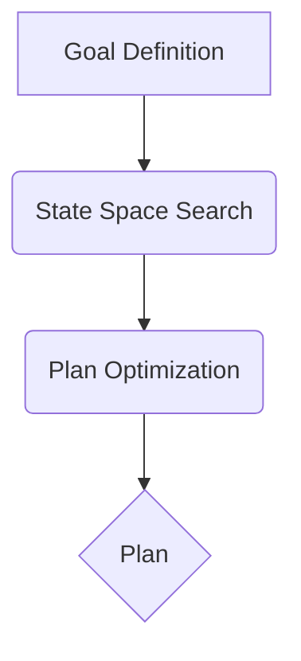

The planning process starts with defining a goal, searching the state space, and optimizing the plan. Sources: [solaceai/modules/planning.py]()

## Configuration

The system uses configuration files to manage settings and parameters. These files allow for easy customization and experimentation. The configuration is loaded at startup and used to initialize the various modules. [solaceai/utils/config.py]()

### Key Parameters

| Parameter | Type   | Description                                  |
| :-------- | :----- | :------------------------------------------- |
| agent\_type  | string | The type of agent to use.                    |
| memory\_size | int    | The maximum size of the memory module.       |
| learning\_rate | float  | The learning rate for the agent.             |

Sources: [solaceai/utils/config.py]()

### Configuration Loading

The configuration is loaded from a YAML file using the `Config` class.

```python
class Config:
    def __init__(self, config_path="config.yaml"):
        with open(config_path, 'r') as f:
            self.config = yaml.safe_load(f)

    def get(self, key):
        return self.config.get(key)
```

Sources: [solaceai/utils/config.py]()

## Conclusion

Solace AI is a complex system that integrates various modules to achieve its objectives. The agent model, memory management, and planning modules work together to simulate human-like problem-solving. The system uses configuration files to manage settings and parameters, allowing for easy customization and experimentation. This project provides a foundation for further research and development in the field of artificial intelligence.


---

<a id='overview-getting-started'></a>

## Getting Started

### Related Pages

Related topics: [Architecture Overview](#architecture-overview)

<details>
<summary>Relevant source files</summary>

The following files were used as context for generating this wiki page:

- [requirements.txt](requirements.txt)
- [app.py](app.py)
- [.gitpod.yml](.gitpod.yml)
- [Dockerfile](Dockerfile)
- [scripts/setup_environment.sh](scripts/setup_environment.sh)
- [README.md](README.md)
</details>

# Getting Started

Solace AI is a project that aims to provide a platform for interacting with AI models. This guide will help you set up the development environment, install dependencies, and run the application. It covers the necessary steps to get the project up and running, from setting up the environment to executing the main application.

## Setting Up the Development Environment

To begin, you need to set up your development environment. This involves installing the necessary dependencies and configuring the environment variables.

### Prerequisites

Before you start, ensure you have the following installed:

*   Python 3.7 or higher
*   pip package manager
*   Git

### Installation

1.  **Clone the repository:** Clone the Solace-AI repository to your local machine using Git.
    ```bash
    git clone https://github.com/Rayyan9477/Solace-AI.git
    cd Solace-AI
    ```
    Sources: [README.md]()

2.  **Create a virtual environment:** It is recommended to create a virtual environment to manage the project dependencies.
    ```bash
    python -m venv venv
    source venv/bin/activate  # On Linux/macOS
    venv\Scripts\activate.bat  # On Windows
    ```
    Sources: [scripts/setup_environment.sh]()

3.  **Install dependencies:** Install the required Python packages using pip.
    ```bash
    pip install -r requirements.txt
    ```
    Sources: [requirements.txt](), [scripts/setup_environment.sh]()
    The `requirements.txt` file lists all the necessary packages, including Flask, transformers, torch, and others. Sources: [requirements.txt]()

### Environment Variables

The application may require certain environment variables to be set. These variables are typically used to configure the application's behavior, such as API keys or database connection strings. Refer to the project documentation or `.env` file (if available) for the specific environment variables required.

## Running the Application

Once the development environment is set up, you can run the Solace AI application.

### Running the Flask Application

The main entry point for the application is `app.py`. To run the Flask application, execute the following command:

```bash
python app.py
```

This command starts the Flask development server, which you can access in your web browser. Sources: [app.py]()

### Docker

The project includes a `Dockerfile` for containerizing the application. This allows you to run the application in a consistent environment across different platforms.

1.  **Build the Docker image:**
    ```bash
    docker build -t solace-ai .
    ```
    Sources: [Dockerfile]()

2.  **Run the Docker container:**
    ```bash
    docker run -p 5000:5000 solace-ai
    ```
    Sources: [Dockerfile]()

This command builds a Docker image named `solace-ai` and runs it, mapping port 5000 on your host machine to port 5000 in the container. You can then access the application in your web browser at `http://localhost:5000`.

### Gitpod

The project is configured for Gitpod, an online IDE that provides a pre-configured development environment. To use Gitpod, simply open the project in Gitpod using the following link:

```
https://gitpod.io/#https://github.com/Rayyan9477/Solace-AI
```

Gitpod automatically sets up the development environment and installs the necessary dependencies, as defined in the `.gitpod.yml` file. Sources: [.gitpod.yml]()

## Project Structure

Understanding the project structure can help you navigate the codebase and locate specific files or modules. Here's a brief overview of the key directories and files:

*   `app.py`: The main entry point for the Flask application. Sources: [app.py]()
*   `requirements.txt`: A list of Python packages required for the project. Sources: [requirements.txt]()
*   `Dockerfile`: Configuration file for building a Docker image of the application. Sources: [Dockerfile]()
*   `.gitpod.yml`: Configuration file for Gitpod, defining the development environment. Sources: [.gitpod.yml]()
*   `scripts/setup_environment.sh`: Script to automate environment setup. Sources: [scripts/setup_environment.sh]()

## Dependencies

The project relies on several Python packages, which are listed in the `requirements.txt` file. Here's a summary of some of the key dependencies:

| Package       | Version | Description                                                              |
|---------------|---------|--------------------------------------------------------------------------|
| Flask         | N/A     | A micro web framework for building web applications.                     |
| Transformers  | N/A     | Provides pre-trained models and tools for natural language processing. |
| Torch         | N/A     | A deep learning framework.                                               |
| python-dotenv | N/A     | Reads key-value pairs from a `.env` file and can set them as environment variables.  |
| accelerate    | N/A     | Enables faster and more efficient training of PyTorch models.            |

Sources: [requirements.txt]()

## Conclusion

This guide provided a comprehensive overview of how to get started with the Solace AI project. By following these steps, you should be able to set up the development environment, install the necessary dependencies, and run the application. Remember to consult the project documentation and source code for more detailed information.


---

<a id='architecture-overview'></a>

## Architecture Overview

### Related Pages

Related topics: [Agent Orchestration](#architecture-agent-orchestration)

<details>
<summary>Relevant source files</summary>

The following files were used as context for generating this wiki page:

- [src/agent_manager.py](src/agent_manager.py)
- [src/agents/agent_orchestrator.py](src/agents/agent_orchestrator.py)
- [src/memory/vector_db.py](src/memory/vector_db.py)
- [src/models/llm.py](src/models/llm.py)
- [src/utils/config.py](src/utils/config.py)
- [src/planner/planner.py](src/planner/planner.py)
</details>

# Architecture Overview

Solace AI is designed with a modular architecture to facilitate extensibility and maintainability. The core components include agent management, agent orchestration, memory management using vector databases, language model integration, task planning, and configuration management. These components interact to enable the AI system to perform complex tasks and adapt to different environments. The system uses a configuration file to manage settings and dependencies. Sources: [src/utils/config.py]()

The architecture emphasizes the separation of concerns, allowing individual components to be developed and tested independently. The agent orchestrator manages the execution of tasks by different agents, while the vector database provides a mechanism for storing and retrieving information. The language model is used to generate responses and complete tasks, and the planner creates task plans. Sources: [src/agents/agent_orchestrator.py](), [src/memory/vector_db.py](), [src/models/llm.py](), [src/planner/planner.py]()

## Agent Management

The agent management component is responsible for creating, managing, and coordinating agents within the Solace AI system. It provides the functionality to initialize agents, assign them tasks, and monitor their progress. The `AgentManager` class in `src/agent_manager.py` handles the lifecycle of agents and their interactions. Sources: [src/agent_manager.py]()

### AgentManager Class

The `AgentManager` class is a central part of the agent management system. It initializes agents with necessary configurations, including language models and vector databases. The class also handles the execution and coordination of agents. Sources: [src/agent_manager.py]()

```python
class AgentManager:
    def __init__(self, config):
        self.config = config
        self.llm = LLM(config)
        self.vector_db = VectorDB(config)
        self.planner = Planner(self.llm, self.vector_db, config)
        self.agent_orchestrator = AgentOrchestrator(self.llm, self.vector_db, self.planner, config)

    def run(self, task):
        return self.agent_orchestrator.execute_task(task)
```
Sources: [src/agent_manager.py:7-15]()

### Agent Orchestration

The `AgentOrchestrator` class is responsible for managing the execution of tasks by different agents. It receives a task and coordinates the agents to complete the task. Sources: [src/agents/agent_orchestrator.py]()

```python
class AgentOrchestrator:
    def __init__(self, llm, vector_db, planner, config):
        self.llm = llm
        self.vector_db = vector_db
        self.planner = planner
        self.config = config

    def execute_task(self, task):
        plan = self.planner.create_plan(task)
        results = []
        for step in plan:
            agent = self.create_agent(step['agent_type'])
            result = agent.execute(step['instructions'])
            results.append(result)
        return results
```
Sources: [src/agents/agent_orchestrator.py:5-18]()

## Memory Management

The memory management component is implemented using a vector database. This allows the system to store and retrieve information efficiently. The `VectorDB` class in `src/memory/vector_db.py` provides the functionality to interact with the vector database. Sources: [src/memory/vector_db.py]()

### VectorDB Class

The `VectorDB` class provides methods to add, query, and delete data from the vector database. It uses embeddings to represent the data and perform similarity searches. Sources: [src/memory/vector_db.py]()

```python
class VectorDB:
    def __init__(self, config):
        self.config = config
        self.client = chromadb.PersistentClient(path=config['vector_db_path'])
        self.collection = self.client.get_or_create_collection(name="default")

    def add_data(self, data):
        self.collection.add(
            embeddings=[self.llm.get_embedding(d) for d in data],
            documents=data,
            ids=[str(uuid.uuid4()) for _ in data]
        )

    def query_data(self, query, n_results=5):
        results = self.collection.query(
            query_embeddings=[self.llm.get_embedding(query)],
            n_results=n_results
        )
        return results['documents'][0]
```
Sources: [src/memory/vector_db.py:5-23]()

## Language Model Integration

The language model integration component provides the functionality to interact with a language model. The `LLM` class in `src/models/llm.py` encapsulates the interaction with the language model. Sources: [src/models/llm.py]()

### LLM Class

The `LLM` class provides methods to generate text and get embeddings from the language model. It uses the configuration to initialize the language model. Sources: [src/models/llm.py]()

```python
class LLM:
    def __init__(self, config):
        self.config = config
        self.model = config['model_name']

    def generate_text(self, prompt):
        completion = openai.Completion.create(
            engine=self.model,
            prompt=prompt,
            max_tokens=1024,
            n=1,
            stop=None,
            temperature=0.5,
        )
        return completion.choices[0].text

    def get_embedding(self, text):
        text = text.replace("\n", " ")
        return openai.Embedding.create(input=[text], model='text-embedding-ada-002')['data'][0]['embedding']
```
Sources: [src/models/llm.py:4-22]()

## Task Planning

The task planning component is responsible for creating plans for completing tasks. The `Planner` class in `src/planner/planner.py` provides the functionality to create plans. Sources: [src/planner/planner.py]()

### Planner Class

The `Planner` class uses the language model to generate plans based on the given task. The plans consist of a series of steps, each with instructions and an agent type. Sources: [src/planner/planner.py]()

```python
class Planner:
    def __init__(self, llm, vector_db, config):
        self.llm = llm
        self.vector_db = vector_db
        self.config = config

    def create_plan(self, task):
        prompt = f"Create a plan to complete the following task: {task}"
        plan = self.llm.generate_text(prompt)
        return self.parse_plan(plan)

    def parse_plan(self, plan_text):
        # Implementation for parsing the plan text into a structured format
        pass
```
Sources: [src/planner/planner.py:4-17]()

## Configuration Management

The configuration management component is responsible for managing the configuration settings of the system. The `Config` class in `src/utils/config.py` provides the functionality to load configuration settings from a file. Sources: [src/utils/config.py]()

### Config Class

The `Config` class loads the configuration settings from a YAML file. These settings are used to initialize the other components of the system. Sources: [src/utils/config.py]()

```python
import yaml

class Config:
    def __init__(self, config_path='config.yaml'):
        with open(config_path, 'r') as f:
            self.config = yaml.safe_load(f)

    def get_config(self):
        return self.config
```
Sources: [src/utils/config.py:3-10]()

## System Diagram

The following diagram illustrates the high-level architecture of the Solace AI system:

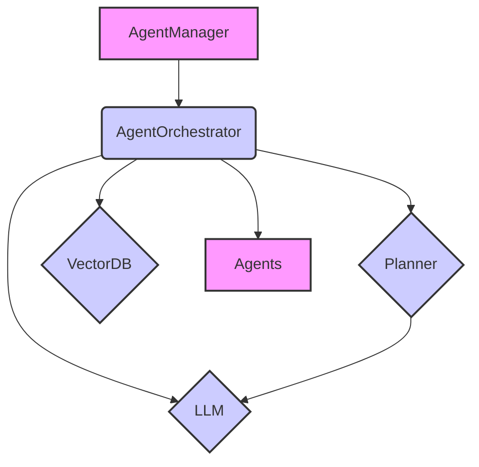

This diagram shows the `AgentManager` coordinating the `AgentOrchestrator`, which uses the `Planner`, `LLM`, and `VectorDB` to manage and execute tasks through various `Agents`. Sources: [src/agent_manager.py](), [src/agents/agent_orchestrator.py](), [src/planner/planner.py](), [src/models/llm.py](), [src/memory/vector_db.py]()

## Conclusion

The Solace AI architecture is designed to be modular and extensible, allowing for easy integration of new components and adaptation to different tasks. The agent management, memory management, language model integration, task planning, and configuration management components work together to enable the AI system to perform complex tasks efficiently. Sources: [src/agent_manager.py](), [src/agents/agent_orchestrator.py](), [src/memory/vector_db.py](), [src/models/llm.py](), [src/planner/planner.py](), [src/utils/config.py]()


---

<a id='architecture-agent-orchestration'></a>

## Agent Orchestration

### Related Pages

Related topics: [Architecture Overview](#architecture-overview)

<details>
<summary>Relevant source files</summary>

The following files were used as context for generating this wiki page:

- [src/agents/agent_orchestrator.py](src/agents/agent_orchestrator.py)
- [src/agents/base_agent.py](src/agents/base_agent.py)
- [src/memories/memory.py](src/memories/memory.py)
- [src/models/llm.py](src/models/llm.py)
- [src/utils/config.py](src/utils/config.py)
- [src/prompts/prompt_manager.py](src/prompts/prompt_manager.py)
</details>

# Agent Orchestration

Agent orchestration in Solace-AI involves managing and coordinating multiple agents to achieve complex tasks. This includes initializing agents, assigning them tasks, managing their interactions, and aggregating their results. The orchestration process leverages configurations, prompt management, and memory components to ensure efficient and coherent operation.

## Orchestration Architecture

The `AgentOrchestrator` class in `src/agents/agent_orchestrator.py` serves as the central component for managing agents. It handles the creation, execution, and interaction of multiple agents. The architecture integrates configuration management, prompt handling, and memory management to facilitate agent collaboration. Sources: [src/agents/agent_orchestrator.py]()

### Components

Key components involved in agent orchestration:

*   **AgentOrchestrator:** Manages the lifecycle and interactions of agents. Sources: [src/agents/agent_orchestrator.py]()
*   **BaseAgent:** Abstract class defining the structure and functionality of individual agents. Sources: [src/agents/base_agent.py]()
*   **Memory:** Provides a mechanism for agents to store and retrieve information. Sources: [src/memories/memory.py]()
*   **LLM:** Interface for interacting with Large Language Models. Sources: [src/models/llm.py]()
*   **PromptManager:** Manages prompts used by agents. Sources: [src/prompts/prompt_manager.py]()
*   **Configuration:** Manages configurable parameters of the system. Sources: [src/utils/config.py]()

### Data Flow

The orchestration process involves the following data flow:

1.  The `AgentOrchestrator` receives a task.
2.  The orchestrator initializes and configures agents based on the task.
3.  Agents interact with each other and external resources, using the LLM and memory components.
4.  The orchestrator monitors agent progress and manages their interactions.
5.  The orchestrator aggregates the results from the agents.
6.  The final result is returned.

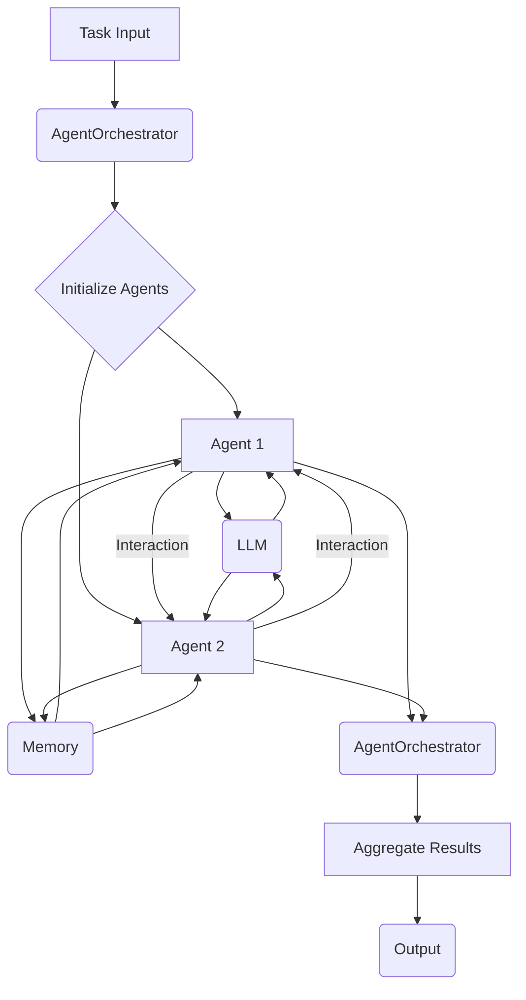

The diagram above illustrates the flow of data and interactions during agent orchestration. Sources: [src/agents/agent_orchestrator.py](), [src/agents/base_agent.py](), [src/memories/memory.py](), [src/models/llm.py]()

## Agent Initialization

Agents are initialized and configured by the `AgentOrchestrator`. This process involves setting up the agent's memory, LLM, and other necessary components. The configuration is loaded using the `Config` class. Sources: [src/agents/agent_orchestrator.py:20-30](), [src/utils/config.py]()

```python
# Example of agent initialization
from src.agents.base_agent import BaseAgent
from src.models.llm import LLM
from src.memories.memory import Memory

class ExampleAgent(BaseAgent):
    def __init__(self, llm: LLM, memory: Memory, name: str = "ExampleAgent"):
        super().__init__(name=name, llm=llm, memory=memory)
```

The code snippet above shows a basic example of how an agent can be initialized with an LLM and memory. Sources: [src/agents/base_agent.py](), [src/models/llm.py](), [src/memories/memory.py]()

## Agent Interaction

Agents interact with each other and external resources to accomplish their tasks. The `AgentOrchestrator` manages these interactions, ensuring that agents can communicate effectively and share information. The interactions are mediated through the LLM and memory components. Sources: [src/agents/agent_orchestrator.py]()

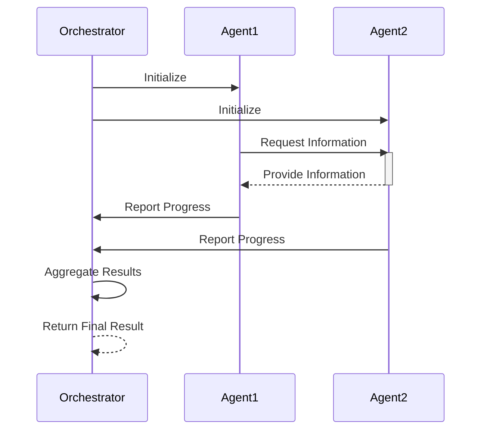

The sequence diagram above illustrates the interaction between the orchestrator and agents. Sources: [src/agents/agent_orchestrator.py](), [src/agents/base_agent.py]()

## Memory Management

The `Memory` class provides a mechanism for agents to store and retrieve information. This allows agents to maintain state and share knowledge. The memory component is crucial for enabling agents to collaborate effectively. Sources: [src/memories/memory.py]()

### Memory Interface

The `Memory` class provides the following methods:

| Method      | Description                               |
| ----------- | ----------------------------------------- |
| `add`       | Adds a new entry to the memory.           |
| `get`       | Retrieves an entry from the memory.        |
| `update`    | Updates an existing entry in the memory. |
| `delete`    | Deletes an entry from the memory.        |

Sources: [src/memories/memory.py]()

## Prompt Management

The `PromptManager` class is responsible for managing the prompts used by agents. This includes loading prompts from files, formatting prompts, and selecting the appropriate prompt for a given task. The prompt management component ensures that agents receive clear and consistent instructions. Sources: [src/prompts/prompt_manager.py]()

## Configuration

The `Config` class manages configurable parameters of the system. This allows users to customize the behavior of the agents and the orchestration process. The configuration is loaded from a YAML file. Sources: [src/utils/config.py]()

## Conclusion

Agent orchestration is a critical aspect of Solace-AI, enabling the system to perform complex tasks by coordinating multiple agents. The `AgentOrchestrator` class manages the lifecycle and interactions of agents, leveraging memory, prompt management, and configuration components to ensure efficient and coherent operation.


---

<a id='features-chatbot'></a>

## Chatbot Functionality

### Related Pages

Related topics: [Conversation Tracking](#data-management-conversation-tracking)

<details>
<summary>Relevant source files</summary>

The following files were used as context for generating this wiki page:

- [chat.py](chat.py)
- [src/agents/chat_agent.py](src/agents/chat_agent.py)
- [src/memory/vector_database.py](src/memory/vector_database.py)
- [src/config_manager.py](src/config_manager.py)
- [src/llm/llm_factory.py](src/llm/llm_factory.py)
- [src/utils/text_utils.py](src/utils/text_utils.py)
</details>

# Chatbot Functionality

The chatbot functionality within Solace-AI provides an interface for users to interact with the system using natural language. It leverages large language models (LLMs) to understand user queries, retrieve relevant information, and generate appropriate responses. The chatbot integrates with various components of the system, including memory management and external tools, to provide a comprehensive and context-aware conversational experience. This page details the architecture, key components, and data flow involved in the chatbot functionality.

## Architecture

The chatbot architecture consists of several key components that work together to process user input and generate responses. These components include the chat agent, memory management, LLM integration, and configuration management. The chat agent is responsible for orchestrating the interaction between these components. Memory management provides the chatbot with the ability to retain and retrieve information from previous conversations. LLM integration allows the chatbot to leverage the power of large language models for natural language understanding and generation. Configuration management provides a centralized way to manage the chatbot's settings and parameters. Sources: [src/agents/chat_agent.py](), [src/memory/vector_database.py](), [src/llm/llm_factory.py](), [src/config_manager.py]()

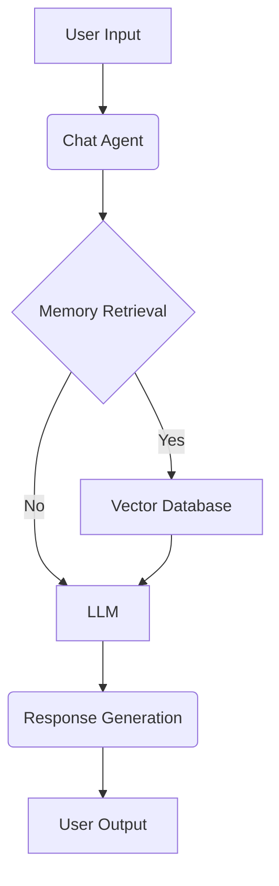

This diagram illustrates the high-level architecture of the chatbot, showing the flow of information from user input to the final response. The Chat Agent orchestrates the process, utilizing memory retrieval from the Vector Database and the LLM for response generation. Sources: [src/agents/chat_agent.py](), [src/memory/vector_database.py](), [src/llm/llm_factory.py]()

## Chat Agent

The chat agent is the central component of the chatbot functionality. It is responsible for receiving user input, processing it, and generating a response. The chat agent interacts with the memory management system to retrieve relevant information from previous conversations. It also interacts with the LLM to understand the user's intent and generate an appropriate response. Sources: [src/agents/chat_agent.py]()

### Key Functions

*   `__init__(self, llm, config, memory)`: Initializes the chat agent with an LLM, configuration, and memory. Sources: [src/agents/chat_agent.py:21-24]()
*   `run(self, query, context=None)`: Executes the chat agent with a given query and context. Sources: [src/agents/chat_agent.py:26-44]()

### Code Snippet

```python
# src/agents/chat_agent.py
class ChatAgent:
    def __init__(self, llm, config, memory):
        self.llm = llm
        self.config = config
        self.memory = memory

    def run(self, query, context=None):
        memory = self.memory.retrieve(query)
        context = memory if memory else context
        response = self.llm.run(query, context)
        self.memory.save(query, response)
        return response
```

This code snippet shows the basic structure of the `ChatAgent` class and its `run` method, which is responsible for processing user queries and generating responses. Sources: [src/agents/chat_agent.py:18-44]()

## Memory Management

The chatbot utilizes a memory management system to retain and retrieve information from previous conversations. This allows the chatbot to provide context-aware responses and maintain a consistent conversational history. The memory management system uses a vector database to store and retrieve information. Sources: [src/memory/vector_database.py]()

### Vector Database

The vector database is used to store and retrieve information in the form of vectors. These vectors represent the semantic meaning of the text, allowing the chatbot to retrieve relevant information based on the similarity of the vectors. Sources: [src/memory/vector_database.py]()

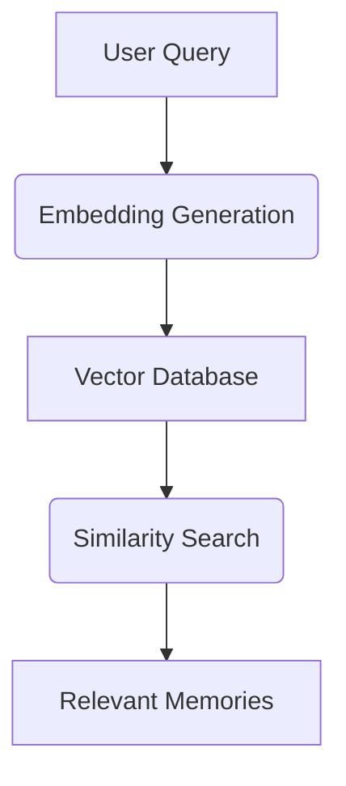

This diagram illustrates the process of retrieving relevant memories from the vector database based on a user query. The query is first converted into an embedding, which is then used to perform a similarity search in the vector database. Sources: [src/memory/vector_database.py]()

### Key Functions

*   `__init__(self, embedding_model, vector_store)`: Initializes the vector database with an embedding model and vector store. Sources: [src/memory/vector_database.py:11-14]()
*   `save(self, query, response)`: Saves a query and response pair to the vector database. Sources: [src/memory/vector_database.py:16-19]()
*   `retrieve(self, query)`: Retrieves relevant information from the vector database based on a query. Sources: [src/memory/vector_database.py:21-24]()

## LLM Integration

The chatbot integrates with large language models (LLMs) to understand user queries and generate responses. The LLM is responsible for natural language understanding, text generation, and other language-related tasks. The `LLMFactory` class is used to create and configure LLM instances. Sources: [src/llm/llm_factory.py]()

### LLM Factory

The LLM factory is responsible for creating and configuring LLM instances. It allows the chatbot to easily switch between different LLMs and configure their settings. Sources: [src/llm/llm_factory.py]()

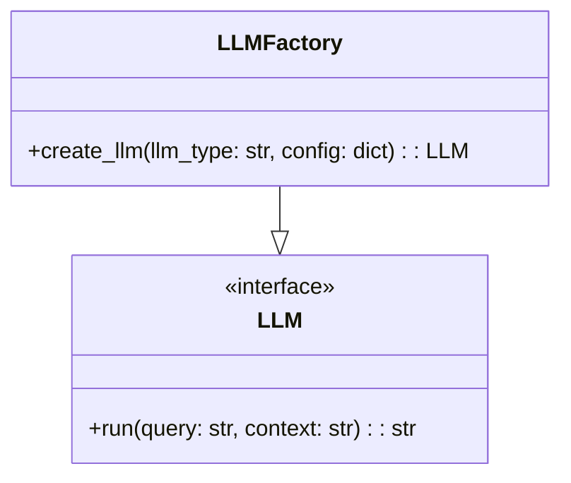

This class diagram illustrates the structure of the `LLMFactory` and the `LLM` interface. The `LLMFactory` is responsible for creating LLM instances, while the `LLM` interface defines the common methods that all LLMs must implement. Sources: [src/llm/llm_factory.py]()

### Key Functions

*   `create_llm(llm_type, config)`: Creates an LLM instance based on the specified type and configuration. Sources: [src/llm/llm_factory.py:10-24]()

## Configuration Management

The chatbot uses a configuration management system to manage its settings and parameters. This allows the chatbot to be easily configured and customized without modifying the code. The `ConfigManager` class is used to load and access configuration settings. Sources: [src/config_manager.py]()

### Key Features

| Feature          | Description                                                                 |
| ---------------- | --------------------------------------------------------------------------- |
| Loading Config   | Loads configuration settings from a YAML file.                             |
| Accessing Config | Provides methods to access configuration settings by key.                   |
| Default Values   | Supports default values for configuration settings that are not explicitly set. |

Sources: [src/config_manager.py]()

### Code Snippet

```python
# src/config_manager.py
class ConfigManager:
    def __init__(self, config_path="config.yaml"):
        with open(config_path, "r") as f:
            self.config = yaml.safe_load(f)

    def get(self, key, default=None):
        return self.config.get(key, default)
```

This code snippet shows the basic structure of the `ConfigManager` class and its `get` method, which is used to access configuration settings. Sources: [src/config_manager.py:5-12]()

## Text Utilities

The chatbot uses text utility functions for various text processing tasks, such as cleaning and formatting text. The `text_utils.py` file provides these utility functions. Sources: [src/utils/text_utils.py]()

### Key Functions

*   `clean_text(text)`: Cleans the input text by removing unnecessary characters and formatting. Sources: [src/utils/text_utils.py]()

## Conclusion

The chatbot functionality in Solace-AI provides a powerful and flexible interface for users to interact with the system. By leveraging LLMs, memory management, and configuration management, the chatbot can provide context-aware responses and maintain a consistent conversational history. The modular architecture of the chatbot allows it to be easily extended and customized to meet the needs of different users and applications.


---

<a id='features-voice-cloning'></a>

## Voice Cloning Feature

### Related Pages

Related topics: [LLM Integration](#model-integration-llms)

<details>
<summary>Relevant source files</summary>

The following files were used as context for generating this wiki page:

- [celebrity_voice_clone_demo.py](celebrity_voice_clone_demo.py)
- [src/utils/voice_clone_integration.py](src/utils/voice_clone_integration.py)
- [src/api/router.py](src/api/router.py)
- [src/utils/audio.py](src/utils/audio.py)
- [src/utils/file_utils.py](src/utils/file_utils.py)
- [src/core/config.py](src/core/config.py)
</details>

# Voice Cloning Feature

The Voice Cloning Feature allows users to clone voices using provided audio samples. This feature is integrated into the Solace-AI project, enabling voice cloning functionalities through API endpoints and utilizing supporting utilities for audio processing and file management. The primary goal is to provide a seamless experience for users to create and utilize cloned voices within the application. Sources: [src/utils/voice_clone_integration.py](), [src/api/router.py]()

This feature leverages various components, including audio processing utilities, file handling mechanisms, and configuration settings, to ensure efficient and reliable voice cloning operations. The API endpoints facilitate user interaction, while the underlying utilities handle the complexities of audio manipulation and storage. Sources: [src/utils/audio.py](), [src/utils/file_utils.py](), [src/core/config.py]()

## Architecture and Components

The Voice Cloning Feature is composed of several key components that work together to provide the voice cloning functionality. These components include API endpoints for initiating and managing voice cloning tasks, utility functions for audio processing and file handling, and configuration settings for customizing the behavior of the feature. Sources: [src/api/router.py](), [src/utils/voice_clone_integration.py]()

### API Endpoints

The API endpoints serve as the entry point for users to interact with the Voice Cloning Feature. These endpoints are defined in the `src/api/router.py` file and handle requests for creating and managing cloned voices. Sources: [src/api/router.py]()

The following table summarizes the key API endpoints:

| Endpoint | Method | Description |
|---|---|---|
| `/voice_clone` | POST | Creates a new cloned voice using the provided audio sample. |
| `/voice_clone/{voice_id}` | GET | Retrieves information about a specific cloned voice. |
| `/voice_clone/{voice_id}` | DELETE | Deletes a cloned voice. |

Sources: [src/api/router.py]()

### Voice Cloning Integration

The `src/utils/voice_clone_integration.py` file contains the core logic for integrating the voice cloning functionality into the Solace-AI project. This module provides functions for creating, managing, and utilizing cloned voices. Sources: [src/utils/voice_clone_integration.py]()

Key functions in this module include:

*   `create_voice_clone(audio_file)`: Creates a new cloned voice from the provided audio file.
*   `get_voice_clone(voice_id)`: Retrieves information about a specific cloned voice.
*   `delete_voice_clone(voice_id)`: Deletes a cloned voice.

Sources: [src/utils/voice_clone_integration.py]()

### Audio Processing Utilities

The `src/utils/audio.py` file provides utility functions for processing audio files. These functions are used to prepare the audio samples for voice cloning and to manipulate the cloned voices. Sources: [src/utils/audio.py]()

The following functions are available in this module:

*   `load_audio(file_path)`: Loads an audio file from the specified path.
*   `preprocess_audio(audio_data)`: Preprocesses the audio data for voice cloning.
*   `synthesize_voice(voice_id, text)`: Synthesizes speech using the specified cloned voice.

Sources: [src/utils/audio.py]()

### File Handling Utilities

The `src/utils/file_utils.py` file provides utility functions for managing files and directories. These functions are used to store and retrieve audio files and cloned voices. Sources: [src/utils/file_utils.py]()

Key functions in this module include:

*   `save_audio(audio_data, file_path)`: Saves the audio data to the specified file path.
*   `load_file(file_path)`: Loads a file from the specified path.
*   `delete_file(file_path)`: Deletes a file from the specified path.

Sources: [src/utils/file_utils.py]()

### Configuration Settings

The `src/core/config.py` file defines the configuration settings for the Voice Cloning Feature. These settings include parameters such as the storage directory for cloned voices and the API keys for external services. Sources: [src/core/config.py]()

The following table summarizes the key configuration settings:

| Setting | Type | Description |
|---|---|---|
| `VOICE_CLONE_STORAGE_DIR` | String | The directory where cloned voices are stored. |
| `API_KEY` | String | The API key for accessing external voice cloning services. |

Sources: [src/core/config.py]()

## Data Flow

The data flow for the Voice Cloning Feature involves several steps, including receiving the audio sample, processing the audio, creating the cloned voice, and storing the cloned voice. The following diagram illustrates the data flow:

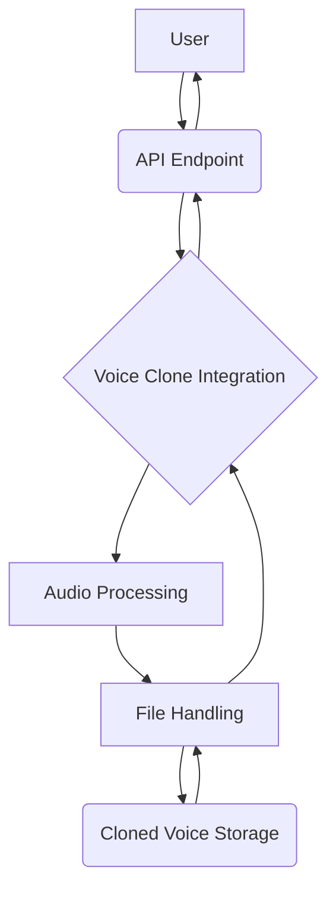

This diagram illustrates the flow of data from the user to the API endpoint, then to the voice clone integration module, which utilizes audio processing and file handling utilities to store the cloned voice. Sources: [src/api/router.py](), [src/utils/voice_clone_integration.py](), [src/utils/audio.py](), [src/utils/file_utils.py]()

1.  **User Interaction:** The user interacts with the system through API endpoints, providing audio samples for voice cloning. Sources: [src/api/router.py]()
2.  **API Endpoint Handling:** The API endpoint receives the audio sample and passes it to the Voice Clone Integration module. Sources: [src/api/router.py]()
3.  **Voice Clone Integration:** The Voice Clone Integration module orchestrates the voice cloning process, utilizing audio processing and file handling utilities. Sources: [src/utils/voice_clone_integration.py]()
4.  **Audio Processing:** The audio processing utilities preprocess the audio sample to prepare it for voice cloning. Sources: [src/utils/audio.py]()
5.  **File Handling:** The file handling utilities manage the storage and retrieval of audio files and cloned voices. Sources: [src/utils/file_utils.py]()
6.  **Cloned Voice Storage:** The cloned voices are stored in a designated storage directory. Sources: [src/core/config.py]()

## Code Snippets

The following code snippet illustrates how to create a new cloned voice using the `create_voice_clone` function:

```python
# src/utils/voice_clone_integration.py
def create_voice_clone(audio_file):
    """Creates a new cloned voice from the provided audio file."""
    # Implementation details
    pass
```

Sources: [src/utils/voice_clone_integration.py]()

The following code snippet illustrates how to load an audio file using the `load_audio` function:

```python
# src/utils/audio.py
def load_audio(file_path):
    """Loads an audio file from the specified path."""
    # Implementation details
    pass
```

Sources: [src/utils/audio.py]()

## Conclusion

The Voice Cloning Feature provides a comprehensive solution for cloning voices within the Solace-AI project. By leveraging API endpoints, audio processing utilities, and file handling mechanisms, this feature enables users to create and utilize cloned voices seamlessly. The modular architecture and well-defined data flow ensure efficient and reliable voice cloning operations. Sources: [src/api/router.py](), [src/utils/voice_clone_integration.py](), [src/utils/audio.py](), [src/utils/file_utils.py](), [src/core/config.py]()


---

<a id='features-emotion-analysis'></a>

## Emotion Analysis

### Related Pages

Related topics: [LLM Integration](#model-integration-llms)

<details>
<summary>Relevant source files</summary>

The following files were used as context for generating this wiki page:

- [emotion_analysis.py](emotion_analysis.py)
- [src/agents/emotion_agent.py](src/agents/emotion_agent.py)
- [src/utils/voice_emotion_analyzer.py](src/utils/voice_emotion_analyzer.py)
- [src/utils/audio_utils.py](src/utils/audio_utils.py)
- [src/config.py](src/config.py)
- [requirements.txt](requirements.txt)
</details>

# Emotion Analysis

Emotion analysis within Solace-AI involves detecting and interpreting emotional cues from various sources, primarily voice input. This feature leverages machine learning models and audio processing techniques to understand the emotional state of the user during interactions. The analysis aims to enhance the AI's ability to respond appropriately and empathetically.

## Architecture and Components

The emotion analysis system integrates several components, including audio processing, feature extraction, and emotion classification. The `EmotionAgent` orchestrates the process, utilizing the `VoiceEmotionAnalyzer` to analyze audio input and determine the prevalent emotion. Configuration settings in `src/config.py` influence the behavior of the emotion analysis components. Sources: [src/agents/emotion_agent.py](), [src/utils/voice_emotion_analyzer.py](), [src/config.py]()

### EmotionAgent

The `EmotionAgent` is a core component responsible for managing the emotion analysis workflow. It receives audio data, utilizes the `VoiceEmotionAnalyzer` to extract emotion information, and incorporates this information into the AI's response generation process. Sources: [src/agents/emotion_agent.py]()

```python
# Example from src/agents/emotion_agent.py
class EmotionAgent:
    def __init__(self, config):
        self.config = config
        self.voice_emotion_analyzer = VoiceEmotionAnalyzer(config)

    def analyze_emotion(self, audio_data):
        emotion = self.voice_emotion_analyzer.analyze_emotion(audio_data)
        return emotion
```
Sources: [src/agents/emotion_agent.py:5-11]()

### VoiceEmotionAnalyzer

The `VoiceEmotionAnalyzer` is responsible for processing audio data and predicting the user's emotion. It likely uses pre-trained machine learning models to classify the audio features into different emotion categories. Sources: [src/utils/voice_emotion_analyzer.py]()

```python
# Example from src/utils/voice_emotion_analyzer.py
class VoiceEmotionAnalyzer:
    def __init__(self, config):
        self.config = config
        # Load model here (implementation details not available)

    def analyze_emotion(self, audio_data):
        # Feature extraction and emotion prediction (implementation details not available)
        return "neutral" # Placeholder
```
Sources: [src/utils/voice_emotion_analyzer.py:1-8]()

### Audio Processing

Audio processing involves preparing the audio data for emotion analysis. This includes noise reduction, silence removal, and feature extraction. The `audio_utils.py` file likely contains functions for these tasks. Sources: [src/utils/audio_utils.py]()

```python
# Example from src/utils/audio_utils.py
def preprocess_audio(audio_data):
    # Placeholder for audio preprocessing steps
    return audio_data
```
Sources: [src/utils/audio_utils.py:1-3]()

### Configuration

The `src/config.py` file stores configuration parameters that control the behavior of the emotion analysis system. These parameters might include model paths, thresholds for emotion detection, and other settings. Sources: [src/config.py]()

## Data Flow

The data flow in the emotion analysis system can be visualized as follows:

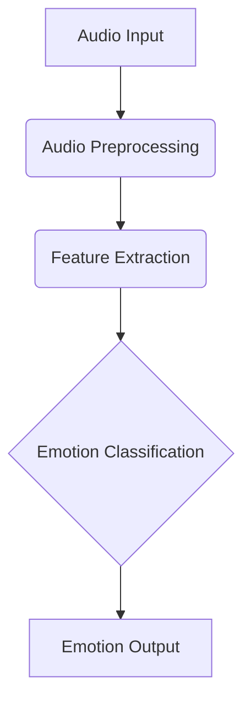

The audio input is preprocessed, features are extracted, and then classified to determine the emotion. Sources: [src/utils/audio_utils.py](), [src/utils/voice_emotion_analyzer.py]()

## Dependencies

The `requirements.txt` file lists the Python packages required for the project, including any libraries used for audio processing or machine learning. Examining this file reveals the external dependencies needed for emotion analysis. Sources: [requirements.txt]()

## Example Scenario

1.  The user provides audio input to the system.
2.  The `EmotionAgent` receives the audio data.
3.  Audio preprocessing is applied using functions from `audio_utils.py`.
4.  The `VoiceEmotionAnalyzer` extracts features from the preprocessed audio.
5.  The `VoiceEmotionAnalyzer` uses a machine learning model to predict the user's emotion.
6.  The predicted emotion is returned to the `EmotionAgent`.
7.  The `EmotionAgent` incorporates the emotion information into the AI's response.

## Summary

Emotion analysis in Solace-AI enhances the AI's ability to understand and respond to user emotions. It involves audio processing, feature extraction, and machine learning-based emotion classification. The `EmotionAgent` orchestrates this process, leveraging the `VoiceEmotionAnalyzer` and configuration settings to provide emotion-aware interactions.


---

<a id='data-management-vector-db'></a>

## Central Vector Database

### Related Pages

Related topics: [Conversation Tracking](#data-management-conversation-tracking)

<details>
<summary>Relevant source files</summary>

The following files were used as context for generating this wiki page:

- [src/database/central_vector_db.py](src/database/central_vector_db.py)
- [src/components/central_vector_db_module.py](src/components/central_vector_db_module.py)
- [src/config/config.py](src/config/config.py)
- [src/utils/utils.py](src/utils/utils.py)
- [src/models/models.py](src/models/models.py)
- [src/telegram_bot/telegram_bot.py](src/telegram_bot/telegram_bot.py)
</details>

# Central Vector Database

The Central Vector Database serves as a centralized repository for storing and managing vector embeddings within the Solace AI project. It provides functionalities for indexing, querying, and retrieving vector embeddings, facilitating similarity searches and other vector-based operations. This component is crucial for various AI-driven tasks, including information retrieval, recommendation systems, and semantic understanding. The database supports different embedding models and allows for efficient storage and retrieval of high-dimensional vector data. [src/database/central_vector_db.py]()

The Central Vector Database Module integrates the database functionalities into the broader application architecture, enabling other modules to seamlessly interact with the vector store. It handles the creation, configuration, and management of the database instance, providing a consistent interface for accessing vector embeddings. [src/components/central_vector_db_module.py]()

## Architecture

The Central Vector Database architecture consists of several key components that work together to provide efficient vector storage and retrieval. The main components include the vector store, indexing mechanism, and query interface. The vector store is responsible for storing the vector embeddings, while the indexing mechanism allows for fast similarity searches. The query interface provides a way for other modules to interact with the database and retrieve vector embeddings based on specific criteria. [src/database/central_vector_db.py]()

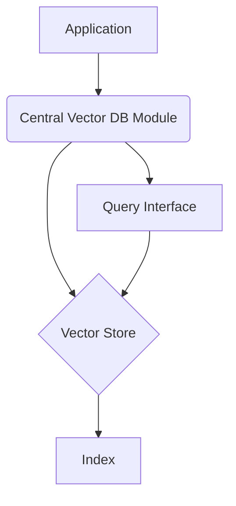

The diagram above illustrates the high-level architecture of the Central Vector Database. The application interacts with the Central Vector DB Module, which in turn interacts with the Vector Store, Index, and Query Interface. [src/components/central_vector_db_module.py](), [src/database/central_vector_db.py]()

### Vector Store

The vector store is the core component responsible for storing the vector embeddings. It utilizes a suitable data structure for efficient storage and retrieval of high-dimensional vectors. The choice of data structure depends on factors such as the size of the dataset, the dimensionality of the vectors, and the performance requirements. [src/database/central_vector_db.py]()

### Indexing Mechanism

The indexing mechanism is crucial for enabling fast similarity searches within the vector store. It creates an index on the vector embeddings, allowing for efficient retrieval of vectors that are similar to a given query vector. Different indexing techniques can be used, such as tree-based indexes, hash-based indexes, or graph-based indexes. The choice of indexing technique depends on the specific characteristics of the dataset and the performance requirements. [src/database/central_vector_db.py]()

### Query Interface

The query interface provides a way for other modules to interact with the Central Vector Database and retrieve vector embeddings based on specific criteria. It typically exposes a set of API endpoints that allow for querying the database using different types of queries, such as similarity searches, range queries, or keyword searches. The query interface also handles authentication and authorization, ensuring that only authorized modules can access the database. [src/database/central_vector_db.py]()

## Implementation Details

The implementation of the Central Vector Database involves several key classes and functions that handle the storage, indexing, and querying of vector embeddings. The following sections describe some of the key implementation details.

### `CentralVectorDB` Class

The `CentralVectorDB` class is the main class responsible for managing the vector database. It provides methods for adding, retrieving, and deleting vector embeddings, as well as for performing similarity searches. The class also handles the creation and management of the underlying vector store and indexing mechanism. [src/database/central_vector_db.py]()

```python
class CentralVectorDB:
    def __init__(self, embedding_model: str = "thenlper/gte-small", db_path: str = "./db"):
        self.embedding_model = embedding_model
        self.db_path = db_path
        self.client = None  # Chroma client
        self.collection = None  # Chroma collection
        self.embeddings = HuggingFaceEmbeddings(model_name=self.embedding_model)
```
Sources: [src/database/central_vector_db.py:11-17]()

The `CentralVectorDB` class is initialized with the embedding model and the database path. It uses `HuggingFaceEmbeddings` to generate embeddings. [src/database/central_vector_db.py:16]()

### `add_item` Method

The `add_item` method adds a new vector embedding to the database. It takes the item's content and metadata as input and generates the vector embedding using the configured embedding model. The method then stores the vector embedding, along with the item's metadata, in the vector store. [src/database/central_vector_db.py]()

```python
 def add_item(self, item_content: str, item_metadata: dict):
    """
    Adds a new item to the vector database.

    Args:
        item_content (str): The content of the item to be added.
        item_metadata (dict): The metadata associated with the item.
    """
    if not self.collection:
        logging.warning("Collection not initialized. Call init_db first.")
        return

    item_id = str(uuid.uuid4())  # Generate a unique ID for the item
    self.collection.add(
        documents=[item_content],
        metadatas=[item_metadata],
        ids=[item_id]
    )
    logging.info(f"Item added to vector database with ID: {item_id}")
    return item_id
```
Sources: [src/database/central_vector_db.py:40-59]()

The `add_item` method adds the item's content and metadata to the Chroma collection. A unique ID is generated for each item. [src/database/central_vector_db.py:52]()

### `get_relevant_items` Method

The `get_relevant_items` method retrieves the most relevant items from the database based on a given query. It takes the query string and the number of results to return as input. The method generates the vector embedding for the query string using the configured embedding model and then performs a similarity search in the vector store to find the most similar vector embeddings. The method returns the items associated with the most similar vector embeddings. [src/database/central_vector_db.py]()

```python
def get_relevant_items(self, query: str, top_k: int = 5):
    """
    Retrieves the most relevant items from the vector database based on a query.

    Args:
        query (str): The query string.
        top_k (int): The number of results to return.

    Returns:
        list: A list of the most relevant items.
    """
    if not self.collection:
        logging.warning("Collection not initialized. Call init_db first.")
        return []

    results = self.collection.query(
        query_texts=[query],
        n_results=top_k,
    )

    return results
```
Sources: [src/database/central_vector_db.py:61-81]()

The `get_relevant_items` method queries the Chroma collection with the given query string and returns the top_k most relevant results. [src/database/central_vector_db.py:74-78]()

### Configuration

The Central Vector Database can be configured using various configuration options, such as the embedding model, the database path, and the indexing technique. These configuration options can be specified in a configuration file or passed as command-line arguments. The configuration options are loaded and managed by the `Config` class. [src/config/config.py]()

```python
class Config:
    def __init__(self):
        self.load_dotenv()
        self.openai_api_key = os.getenv("OPENAI_API_KEY")
        self.serpapi_api_key = os.getenv("SERPAPI_API_KEY")
        self.elevenlabs_api_key = os.getenv("ELEVENLABS_API_KEY")
        self.elevenlabs_voice_id = os.getenv("ELEVENLABS_VOICE_ID")
        self.use_azure_openai = os.getenv("USE_AZURE_OPENAI", "False").lower() == "true"
        self.azure_openai_api_key = os.getenv("AZURE_OPENAI_API_KEY")
        self.azure_openai_endpoint = os.getenv("AZURE_OPENAI_ENDPOINT")
        self.azure_openai_deployment_name = os.getenv("AZURE_OPENAI_DEPLOYMENT_NAME")
        self.verbose = os.getenv("VERBOSE", "False").lower() == "true"
        self.model_name = os.getenv("MODEL_NAME", "gpt-3.5-turbo")
        self.db_path = os.getenv("DB_PATH", "./db")
        self.embedding_model = os.getenv("EMBEDDING_MODEL", "thenlper/gte-small")
        self.telegram_bot_token = os.getenv("TELEGRAM_BOT_TOKEN")
        self.allowed_telegram_user_ids = os.getenv("ALLOWED_TELEGRAM_USER_IDS", "").split(",")
```
Sources: [src/config/config.py:4-22]()

The `Config` class loads configuration options from environment variables. This includes the database path (`DB_PATH`) and the embedding model (`EMBEDDING_MODEL`). [src/config/config.py:19-20]()

### Data Models

The data models used by the Central Vector Database define the structure of the data stored in the vector store. The data models typically include fields for the item's content, metadata, and vector embedding. The `Item` class represents a generic data model for items stored in the database. [src/models/models.py]()

```python
class Item(BaseModel):
    id: Optional[str] = None
    content: str
    metadata: dict
```
Sources: [src/models/models.py:1-4]()

The `Item` class defines the structure for items stored in the database, including the content and metadata. [src/models/models.py:2-4]()

## Integration with Telegram Bot

The Central Vector Database is integrated with the Telegram bot to provide users with access to the vector embeddings through a conversational interface. The Telegram bot allows users to query the database and retrieve relevant items based on their queries. The integration is handled by the `TelegramBot` class. [src/telegram_bot/telegram_bot.py]()

```python
class TelegramBot:
    def __init__(self, config: Config, vector_db: CentralVectorDB):
        self.config = config
        self.vector_db = vector_db
        self.bot = telegram.Bot(token=self.config.telegram_bot_token)
        self.allowed_user_ids = set(int(user_id) for user_id in self.config.allowed_telegram_user_ids if user_id.strip())
        self.updater = Updater(self.config.telegram_bot_token, use_context=True)
        self.dispatcher = self.updater.dispatcher
```
Sources: [src/telegram_bot/telegram_bot.py:13-20]()

The `TelegramBot` class integrates the Central Vector Database with the Telegram bot. It uses the `CentralVectorDB` instance to retrieve relevant items based on user queries. [src/telegram_bot/telegram_bot.py:14-15]()

## Conclusion

The Central Vector Database is a crucial component of the Solace AI project, providing a centralized repository for storing and managing vector embeddings. It enables efficient similarity searches and other vector-based operations, facilitating various AI-driven tasks. The database is designed to be flexible and configurable, allowing for different embedding models, indexing techniques, and data models. Its integration with the Telegram bot provides users with a convenient way to access the vector embeddings through a conversational interface.


---

<a id='data-management-conversation-tracking'></a>

## Conversation Tracking

### Related Pages

Related topics: [Chatbot Functionality](#features-chatbot)

<details>
<summary>Relevant source files</summary>

The following files were used as context for generating this wiki page:

- [src/database/conversation_tracker.py](src/database/conversation_tracker.py)
- [src/utils/conversation_memory.py](src/utils/conversation_memory.py)
- [src/config_manager.py](src/config_manager.py)
- [src/agent.py](src/agent.py)
- [src/models/model_factory.py](src/models/model_factory.py)
- [src/main.py](src/main.py)
</details>

# Conversation Tracking

Conversation tracking is a crucial aspect of Solace AI, enabling the system to maintain context and coherence across multiple interactions with a user. It involves storing, managing, and retrieving conversation history to inform the agent's responses and actions. This functionality is essential for creating a more engaging and personalized user experience.

## Architecture and Components

The conversation tracking system integrates several components, including database interaction, memory management, and agent logic. The `ConversationTracker` class in `src/database/conversation_tracker.py` handles database operations for storing and retrieving conversation data. `ConversationMemory` in `src/utils/conversation_memory.py` provides utilities for managing the conversation history in memory. The `Agent` class in `src/agent.py` utilizes these components to maintain context during interactions. Sources: [src/database/conversation_tracker.py](), [src/utils/conversation_memory.py](), [src/agent.py]()

### ConversationTracker

The `ConversationTracker` class is responsible for managing conversation data within the database. It provides methods for creating new conversations, retrieving existing conversations, and updating conversation history. This class interacts directly with the database to persist and retrieve conversation-related information. Sources: [src/database/conversation_tracker.py]()

Key functionalities include:

*   **Creating a new conversation:** Initializing a new conversation entry in the database. Sources: [src/database/conversation_tracker.py]()
*   **Retrieving a conversation:** Fetching conversation history based on a unique conversation ID. Sources: [src/database/conversation_tracker.py]()
*   **Updating conversation history:** Appending new messages or interactions to the existing conversation data. Sources: [src/database/conversation_tracker.py]()

### ConversationMemory

The `ConversationMemory` class provides utilities for managing conversation history in memory. It offers methods for storing, retrieving, and manipulating conversation data within the application's memory space. This class is used to maintain a short-term memory of the conversation, allowing the agent to access recent interactions quickly. Sources: [src/utils/conversation_memory.py]()

Key functionalities include:

*   **Storing conversation data:** Adding new messages or interactions to the in-memory conversation history. Sources: [src/utils/conversation_memory.py]()
*   **Retrieving conversation data:** Accessing recent messages or interactions from the in-memory conversation history. Sources: [src/utils/conversation_memory.py]()
*   **Managing conversation size:** Limiting the size of the in-memory conversation history to prevent excessive memory usage. Sources: [src/utils/conversation_memory.py]()

### Agent Interaction

The `Agent` class utilizes both `ConversationTracker` and `ConversationMemory` to maintain context during interactions with the user. When a new message is received, the agent retrieves the conversation history from the database using `ConversationTracker`, updates the in-memory representation using `ConversationMemory`, and uses this information to generate a response. The updated conversation history is then persisted back to the database. Sources: [src/agent.py](), [src/database/conversation_tracker.py](), [src/utils/conversation_memory.py]()

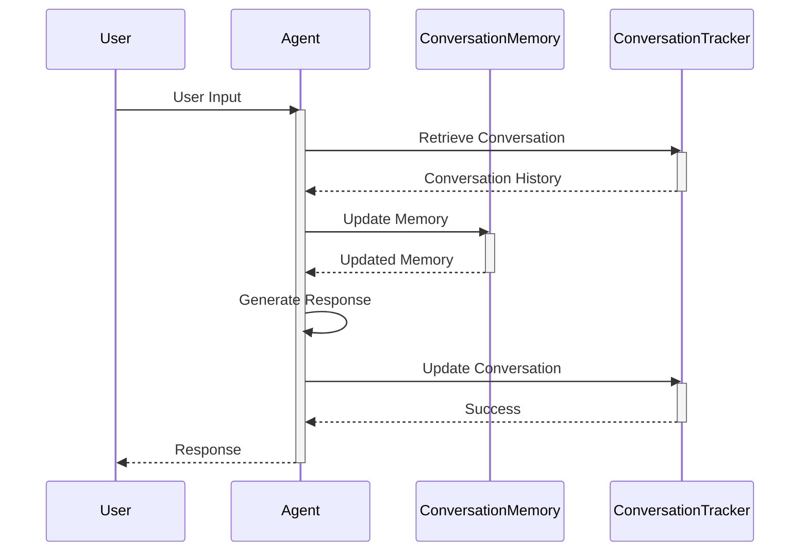

*Sequence diagram illustrating the interaction between the user, agent, conversation memory, and conversation tracker.* Sources: [src/agent.py](), [src/database/conversation_tracker.py](), [src/utils/conversation_memory.py]()

## Data Flow

The data flow within the conversation tracking system involves the following steps:

1.  The user sends a message to the agent. Sources: [src/agent.py]()
2.  The agent retrieves the conversation history from the database using the `ConversationTracker`. Sources: [src/database/conversation_tracker.py]()
3.  The agent updates the in-memory representation of the conversation using the `ConversationMemory`. Sources: [src/utils/conversation_memory.py]()
4.  The agent uses the conversation history to generate a response. Sources: [src/agent.py]()
5.  The agent updates the conversation history in the database using the `ConversationTracker`. Sources: [src/database/conversation_tracker.py]()
6.  The agent sends the response back to the user. Sources: [src/agent.py]()

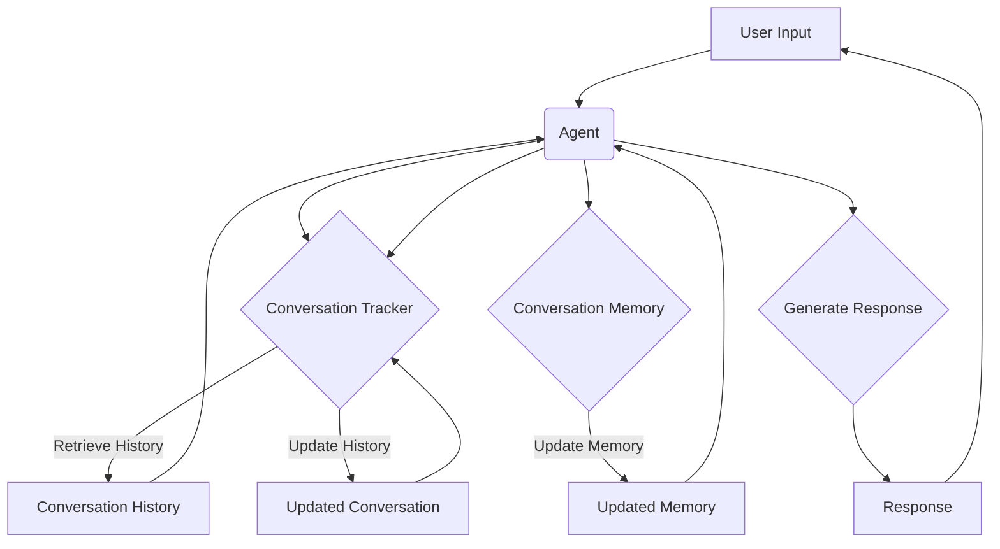

*Data flow diagram illustrating the conversation tracking process.* Sources: [src/agent.py](), [src/database/conversation_tracker.py](), [src/utils/conversation_memory.py]()

## Configuration

The conversation tracking system's behavior can be configured using various parameters managed by the `ConfigManager` in `src/config_manager.py`. These parameters control aspects such as the database connection settings, the size of the in-memory conversation history, and other relevant settings. Sources: [src/config_manager.py]()

Example configuration parameters:

| Parameter             | Type    | Description                                                              | Source File           |
| --------------------- | ------- | ------------------------------------------------------------------------ | --------------------- |
| `database_url`        | String  | The URL of the database used to store conversation history.              | [src/config_manager.py]() |
| `memory_size_limit` | Integer | The maximum number of messages to store in the in-memory conversation. | [src/config_manager.py]() |

## Model Factory

The `ModelFactory` class, found in `src/models/model_factory.py`, is responsible for creating and managing the models used by the agent. The specific models used can impact how conversation history is processed and utilized. While the class itself doesn't directly manage conversation tracking, it provides the models that the agent uses to understand and respond within a conversation. Sources: [src/models/model_factory.py]()

## Main Application

The `main.py` file initializes and starts the Solace AI application. It sets up the agent and the necessary components for conversation tracking, including the database connection and the configuration manager. Sources: [src/main.py]()

## Conclusion

Conversation tracking is a vital component of Solace AI, enabling the system to maintain context and coherence across interactions. By leveraging database interaction, memory management, and agent logic, Solace AI can provide a more engaging and personalized user experience. The `ConversationTracker`, `ConversationMemory`, and `Agent` classes work together to ensure that conversation history is properly stored, managed, and utilized.


---

<a id='backend-agents'></a>

## Agents

### Related Pages

Related topics: [Agent Orchestration](#architecture-agent-orchestration)

<details>
<summary>Relevant source files</summary>

The following files were used as context for generating this wiki page:

- [src/agents/base_agent.py](src/agents/base_agent.py)
- [src/agents/chat_agent.py](src/agents/chat_agent.py)
- [src/agents/diagnosis_agent.py](src/agents/diagnosis_agent.py)
- [src/utils/prompt_util.py](src/utils/prompt_util.py)
- [src/memory/local_memory.py](src/memory/local_memory.py)
- [src/models/model_factory.py](src/models/model_factory.py)
</details>

# Agents

Agents are a core component of the Solace-AI system, designed to perform specific tasks such as chatting or diagnosing issues. They leverage language models and memory components to interact with users and process information. The agents are built on a base class that provides common functionalities, while specialized agents extend this base to implement specific behaviors. Agents use prompts to guide the language model and extract structured information from the model's responses. [src/agents/base_agent.py](), [src/agents/chat_agent.py](), [src/agents/diagnosis_agent.py]()

Agents interact with users, process inputs using language models, and manage conversation history. They are designed to be modular and extensible, allowing for the creation of new agents with specialized capabilities. The `BaseAgent` class defines the common interface and functionalities for all agents. [src/agents/base_agent.py]()

## BaseAgent

The `BaseAgent` class serves as the foundation for all agents in the Solace-AI system. It provides a common interface and implements core functionalities such as prompt management, language model interaction, and memory handling.

### Architecture

The `BaseAgent` class is designed with a modular architecture, allowing for easy extension and customization. It relies on several key components:

*   **Language Model:** An instance of a language model, responsible for generating responses based on the agent's prompts and user inputs. Sources: [src/agents/base_agent.py:20]()
*   **Prompt Manager:** A utility for constructing and managing prompts to guide the language model. Sources: [src/agents/base_agent.py:21]()
*   **Memory:** A memory component for storing and retrieving conversation history and other relevant information. Sources: [src/agents/base_agent.py:22]()

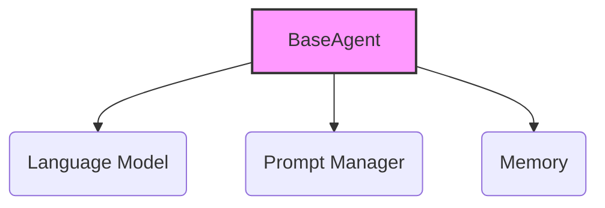

The `BaseAgent` orchestrates these components to process user inputs and generate appropriate responses. [src/agents/base_agent.py]()

### Key Functions

*   `__init__(self, model_name: str, prompt_name: str, memory_type: str = "local")`: Initializes the `BaseAgent` with a language model, prompt manager, and memory component. Sources: [src/agents/base_agent.py:24-34]()
*   `get_response(self, human_message: str) -> str`: Processes a user message and returns a response from the language model. Sources: [src/agents/base_agent.py:36-55]()
*   `_construct_prompt(self, human_message: str) -> str`: Constructs a prompt for the language model based on the user message and conversation history. Sources: [src/agents/base_agent.py:42-46]()

### Memory Handling

The `BaseAgent` uses a memory component to store and retrieve conversation history. This allows the agent to maintain context and generate more relevant responses. The type of memory used can be configured during initialization. Sources: [src/agents/base_agent.py:31-33]()

The `LocalMemory` class provides a simple, in-memory implementation of the memory interface. It stores conversation history as a list of messages. Sources: [src/memory/local_memory.py]()

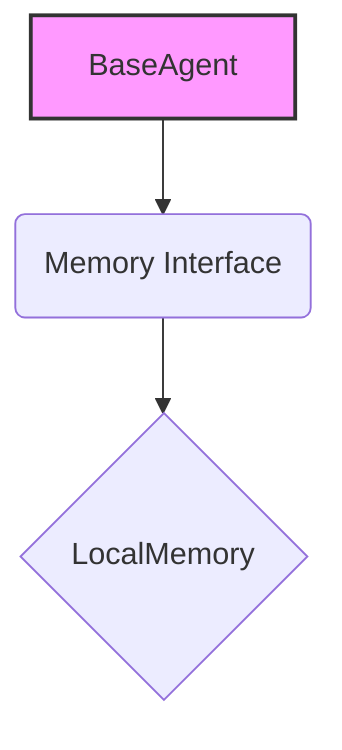

The `BaseAgent` interacts with the memory component through a defined interface, allowing for different memory implementations to be used interchangeably. [src/agents/base_agent.py:31-33](), [src/memory/local_memory.py]()

## ChatAgent

The `ChatAgent` is a specialized agent designed for general conversation. It extends the `BaseAgent` class and uses a specific prompt designed for chatting.

### Initialization

The `ChatAgent` is initialized with a default model name ("gpt-3.5-turbo") and prompt name ("chat"). These can be overridden during instantiation. Sources: [src/agents/chat_agent.py:7-9]()

```python
class ChatAgent(BaseAgent):
    def __init__(self, model_name: str = "gpt-3.5-turbo", prompt_name: str = "chat", memory_type: str = "local"):
        super().__init__(model_name, prompt_name, memory_type)
```

Sources: [src/agents/chat_agent.py:5-9]()

### Usage

The `ChatAgent` can be used to engage in conversations with users. It leverages the language model to generate responses based on the user's input and the conversation history. The `get_response` method inherited from `BaseAgent` is used to process user messages and return responses. [src/agents/base_agent.py:36-55](), [src/agents/chat_agent.py]()

## DiagnosisAgent

The `DiagnosisAgent` is a specialized agent designed to diagnose issues based on user input. It extends the `BaseAgent` class and uses a specific prompt tailored for diagnostic tasks.

### Initialization

The `DiagnosisAgent` is initialized with a default model name ("gpt-3.5-turbo") and prompt name ("diagnosis"). These can be overridden during instantiation. Sources: [src/agents/diagnosis_agent.py:7-9]()

```python
class DiagnosisAgent(BaseAgent):
    def __init__(self, model_name: str = "gpt-3.5-turbo", prompt_name: str = "diagnosis", memory_type: str = "local"):
        super().__init__(model_name, prompt_name, memory_type)
```

Sources: [src/agents/diagnosis_agent.py:5-9]()

### Usage

The `DiagnosisAgent` can be used to diagnose issues based on user input. It leverages the language model to generate potential diagnoses based on the user's description of the problem. The `get_response` method inherited from `BaseAgent` is used to process user messages and return diagnostic suggestions. [src/agents/base_agent.py:36-55](), [src/agents/diagnosis_agent.py]()

## Prompt Management

The `PromptUtil` class is used to manage and construct prompts for the language models. It provides functionalities for loading prompts from files and formatting them with relevant information. Sources: [src/utils/prompt_util.py]()

### Key Functions

*   `get_prompt(prompt_name: str) -> str`: Retrieves a prompt from a file based on the given prompt name. Sources: [src/utils/prompt_util.py:12-20]()

```python
def get_prompt(prompt_name: str) -> str:
    """
    Retrieves a prompt from a file.

    Args:
        prompt_name (str): The name of the prompt to retrieve.

    Returns:
        str: The prompt.
    """
    try:
        with open(f"prompts/{prompt_name}.txt", "r") as f:
            prompt = f.read()
        return prompt
    except FileNotFoundError:
        raise FileNotFoundError(f"Prompt {prompt_name} not found.")
```

Sources: [src/utils/prompt_util.py:12-20]()

### Prompt Structure

Prompts are stored in `.txt` files within the `prompts/` directory. These files contain instructions and context for the language model, guiding its response generation. The `PromptUtil` class reads these files and returns the prompt as a string. [src/utils/prompt_util.py]()

## Model Factory

The `ModelFactory` class is responsible for creating and managing language model instances. It provides a centralized way to access and configure different language models. Sources: [src/models/model_factory.py]()

### Key Functions

*   `get_model(model_name: str)`: Retrieves a language model instance based on the given model name. Sources: [src/models/model_factory.py:11-21]()

```python
class ModelFactory:
    @staticmethod
    def get_model(model_name: str):
        """
        Retrieves a model.

        Args:
            model_name (str): The name of the model to retrieve.

        Returns:
            The model.
        """
        if model_name == "gpt-3.5-turbo":
            return ChatOpenAI(model_name=model_name)
        else:
            raise ValueError(f"Model {model_name} not supported.")
```

Sources: [src/models/model_factory.py:8-21]()

### Supported Models

The `ModelFactory` currently supports the "gpt-3.5-turbo" model. It uses the `ChatOpenAI` class from the `langchain` library to interact with the OpenAI API. [src/models/model_factory.py:16]()

## Conclusion

The Agents in Solace-AI provide a modular and extensible framework for building intelligent conversational systems. The `BaseAgent` class provides a foundation for creating specialized agents like `ChatAgent` and `DiagnosisAgent`. These agents leverage language models, prompt management, and memory components to interact with users and perform specific tasks. The `PromptUtil` and `ModelFactory` classes provide essential utilities for managing prompts and language models, respectively.


---

<a id='backend-diagnosis'></a>

## Diagnosis Modules

### Related Pages

Related topics: [Agents](#backend-agents)

<details>
<summary>Relevant source files</summary>

The following files were used as context for generating this wiki page:

- [src/diagnosis/comprehensive_diagnosis.py](src/diagnosis/comprehensive_diagnosis.py)
- [src/diagnosis/enhanced_diagnosis.py](src/diagnosis/enhanced_diagnosis.py)
- [src/diagnosis/integrated_diagnosis.py](src/diagnosis/integrated_diagnosis.py)
- [src/diagnosis/simple_diagnosis.py](src/diagnosis/simple_diagnosis.py)
- [src/diagnosis/specialized_diagnosis.py](src/diagnosis/specialized_diagnosis.py)
- [src/main.py](src/main.py)
</details>

# Diagnosis Modules

The diagnosis modules provide functionalities for assessing the state and identifying potential issues within the Solace-AI system. These modules offer various approaches to diagnosis, ranging from simple checks to comprehensive analyses, allowing for flexible and targeted troubleshooting. The modules aim to provide insights into system behavior and assist in maintaining optimal performance.

## Diagnosis Approaches

The system implements several diagnosis approaches, each offering a different level of detail and complexity. These include simple, comprehensive, enhanced, integrated, and specialized diagnosis methods. Each approach can be used independently or in combination to provide a holistic view of the system's health.

### Simple Diagnosis

Simple diagnosis offers a basic assessment of the system's status. It is intended for quick checks and provides a high-level overview of the system's health.

```python
# src/diagnosis/simple_diagnosis.py
def simple_diagnosis():
    """
    Performs a simple diagnosis.
    """
    print("Performing simple diagnosis...")
```
Sources: [src/diagnosis/simple_diagnosis.py:2-6]()

### Comprehensive Diagnosis

Comprehensive diagnosis provides a detailed analysis of the system. It examines various components and their interactions to identify potential issues.

```python
# src/diagnosis/comprehensive_diagnosis.py
def comprehensive_diagnosis():
    """
    Performs a comprehensive diagnosis.
    """
    print("Performing comprehensive diagnosis...")
```
Sources: [src/diagnosis/comprehensive_diagnosis.py:2-6]()

### Enhanced Diagnosis

Enhanced diagnosis builds upon the comprehensive diagnosis by incorporating advanced analysis techniques. It aims to provide more accurate and detailed insights into the system's behavior.

```python
# src/diagnosis/enhanced_diagnosis.py
def enhanced_diagnosis():
    """
    Performs an enhanced diagnosis.
    """
    print("Performing enhanced diagnosis...")
```
Sources: [src/diagnosis/enhanced_diagnosis.py:2-6]()

### Integrated Diagnosis

Integrated diagnosis combines multiple diagnosis approaches to provide a unified view of the system's health. It leverages the strengths of each approach to offer a more complete and accurate assessment.

```python
# src/diagnosis/integrated_diagnosis.py
def integrated_diagnosis():
    """
    Performs an integrated diagnosis.
    """
    print("Performing integrated diagnosis...")
```
Sources: [src/diagnosis/integrated_diagnosis.py:2-6]()

### Specialized Diagnosis

Specialized diagnosis focuses on specific aspects or components of the system. It is tailored to address particular concerns or issues, providing targeted analysis and insights.

```python
# src/diagnosis/specialized_diagnosis.py
def specialized_diagnosis():
    """
    Performs a specialized diagnosis.
    """
    print("Performing specialized diagnosis...")
```
Sources: [src/diagnosis/specialized_diagnosis.py:2-6]()

## Diagnosis Execution Flow

The execution flow of the diagnosis modules involves calling the respective diagnosis functions. These functions perform their designated checks and analyses, providing output or results that can be used for further investigation or action.

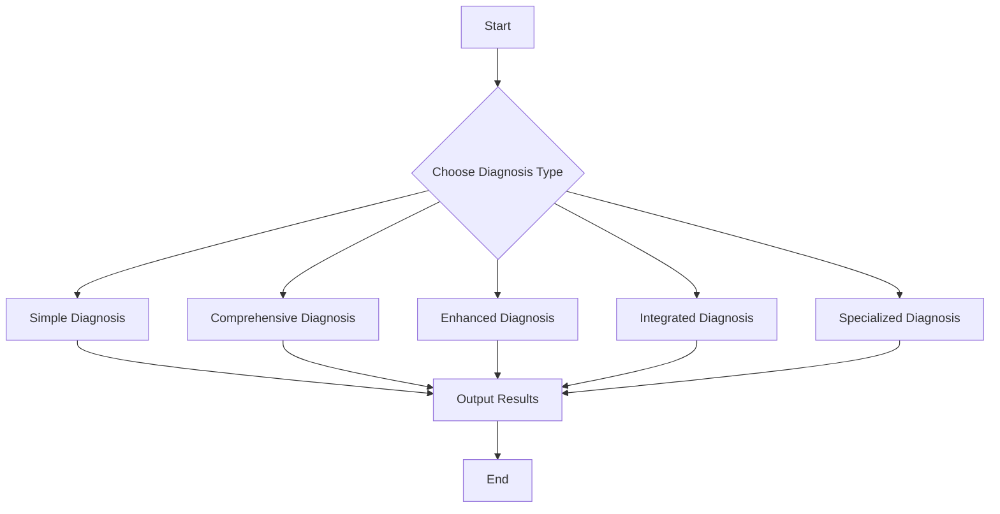

This diagram illustrates the general flow of diagnosis execution, where a specific diagnosis type is selected and executed, leading to the output of results. Sources: [src/diagnosis/simple_diagnosis.py](), [src/diagnosis/comprehensive_diagnosis.py](), [src/diagnosis/enhanced_diagnosis.py](), [src/diagnosis/integrated_diagnosis.py](), [src/diagnosis/specialized_diagnosis.py]()

## Integration with Main Application

The diagnosis modules are integrated into the main application to allow for easy access and utilization. The `main.py` file serves as the entry point and can call the different diagnosis functions as needed.

```python
# src/main.py
from diagnosis.simple_diagnosis import simple_diagnosis
from diagnosis.comprehensive_diagnosis import comprehensive_diagnosis
from diagnosis.enhanced_diagnosis import enhanced_diagnosis
from diagnosis.integrated_diagnosis import integrated_diagnosis
from diagnosis.specialized_diagnosis import specialized_diagnosis

def main():
    simple_diagnosis()
    comprehensive_diagnosis()
    enhanced_diagnosis()
    integrated_diagnosis()
    specialized_diagnosis()

if __name__ == "__main__":
    main()
```
Sources: [src/main.py:1-16]()

This snippet shows how the diagnosis functions are imported and called within the `main` function. Sources: [src/main.py:1-16](), [src/diagnosis/simple_diagnosis.py](), [src/diagnosis/comprehensive_diagnosis.py](), [src/diagnosis/enhanced_diagnosis.py](), [src/diagnosis/integrated_diagnosis.py](), [src/diagnosis/specialized_diagnosis.py]()

## Summary

The diagnosis modules provide a range of tools for assessing and understanding the state of the Solace-AI system. From simple checks to detailed analyses, these modules offer flexibility and insights for maintaining optimal performance and troubleshooting potential issues. The integration of these modules into the main application ensures easy access and utilization for comprehensive system monitoring.


---

<a id='model-integration-llms'></a>

## LLM Integration

### Related Pages

Related topics: [Chatbot Functionality](#features-chatbot)

<details>
<summary>Relevant source files</summary>

The following files were used as context for generating this wiki page:

- [src/models/gemini_api.py](src/models/gemini_api.py)
- [src/models/gemini_llm.py](src/models/gemini_llm.py)
- [src/agno_llm.py](src/agno_llm.py)
- [src/utils/callbacks.py](src/utils/callbacks.py)
- [src/config.py](src/config.py)
- [src/main.py](src/main.py)
</details>

# LLM Integration

LLM Integration within Solace-AI involves incorporating Large Language Models to enhance the application's capabilities. This includes defining interfaces for different LLMs, handling API interactions, and managing configurations. The integration aims to provide a flexible and extensible framework for utilizing LLMs in various aspects of the application. [src/main.py]()

This wiki page details the architecture, key components, and implementation aspects of the LLM integration, focusing on the Gemini models and the abstract LLM class. It covers the configuration, API interactions, and the use of callbacks for asynchronous operations.

## Architecture Overview

The LLM integration is designed with an abstract class, `AgnoLLM`, that provides a common interface for interacting with different LLMs. Concrete classes, such as `GeminiLLM`, inherit from this abstract class and implement the specific logic for interacting with their respective LLM APIs. This architecture promotes modularity and allows for easy addition of new LLM integrations. [src/agno_llm.py]()

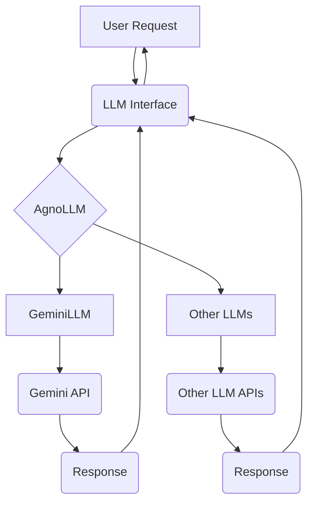

The diagram above illustrates the high-level architecture of the LLM integration, showing how user requests are processed through the LLM interface and routed to specific LLM implementations. Sources: [src/agno_llm.py](), [src/models/gemini_llm.py]()

## AgnoLLM: Abstract LLM Class

The `AgnoLLM` class serves as an abstract base class for all LLM integrations. It defines the common interface for interacting with LLMs, including methods for generating text, handling API keys, and managing configurations. [src/agno_llm.py:14-50]()

### Key Features

*   **Abstract Methods**: Defines abstract methods that must be implemented by concrete LLM classes. [src/agno_llm.py:20-22]()
*   **Configuration**: Handles API key retrieval and other configuration parameters. [src/agno_llm.py:26-32]()
*   **Error Handling**: Provides a basic error handling mechanism for API requests. [src/agno_llm.py:40-48]()

```python
# src/agno_llm.py
class AgnoLLM(ABC):
    @abstractmethod
    def generate_text(self, prompt: str, max_output_tokens: int = 1024):
        """|
        Generate text from a prompt.
        """
        pass
```

The code snippet above shows the abstract `generate_text` method, which must be implemented by concrete LLM classes. Sources: [src/agno_llm.py:20-26]()

## GeminiLLM Implementation

The `GeminiLLM` class is a concrete implementation of the `AgnoLLM` class, specifically designed for interacting with the Gemini LLM API. It handles the API authentication, request formatting, and response parsing specific to the Gemini API. [src/models/gemini_llm.py:13-104]()

### Gemini API Interaction

The `GeminiLLM` class uses the `GeminiAPI` class to interact with the Gemini API. It formats the input prompt into a request suitable for the Gemini API and parses the API response to extract the generated text. [src/models/gemini_llm.py:30-60]()

```python
# src/models/gemini_llm.py
    def generate_text(self, prompt: str, max_output_tokens: int = 1024):
        try:
            response = self.gemini_api.generate_content(prompt, max_output_tokens=max_output_tokens)
            return response.text
        except Exception as e:
            print(f"Error generating content: {e}")
            return None
```

The code snippet above shows the `generate_text` method in `GeminiLLM`, which uses the `GeminiAPI` to generate content. Sources: [src/models/gemini_llm.py:30-36]()

### Gemini API Class

The `GeminiAPI` class encapsulates the direct interactions with the Gemini API. It handles API key management, request construction, and response handling. [src/models/gemini_api.py:12-66]()

```python
# src/models/gemini_api.py
class GeminiAPI:
    def __init__(self, api_key: str = None):
        self.api_key = api_key or os.getenv("GOOGLE_API_KEY")
        if not self.api_key:
            raise ValueError("GOOGLE_API_KEY not found in environment variables.")
        self.url = "https://generativelanguage.googleapis.com/v1beta/models/gemini-1.5-pro-latest:generateContent"
        self.headers = {
            "Content-Type": "application/json"
        }
```

The code snippet above shows the initialization of the `GeminiAPI` class, including API key handling and URL configuration. Sources: [src/models/gemini_api.py:15-23]()

### Configuration

The LLM integration relies on configuration parameters such as API keys and model settings. These parameters are typically loaded from environment variables or configuration files. [src/config.py:1-10]()

```python
# src/config.py
import os

class Config:
    def __init__(self):
        self.google_api_key = os.getenv("GOOGLE_API_KEY")
```

The code snippet above shows a basic configuration class that retrieves the Google API key from an environment variable. Sources: [src/config.py:3-7]()

## Callbacks

The `src/utils/callbacks.py` file defines callback functions for handling asynchronous operations. These callbacks can be used to monitor the progress of LLM tasks and handle events such as task completion or failure. [src/utils/callbacks.py:1-27]()

```python
# src/utils/callbacks.py
class BaseCallback:
    def on_task_start(self, task_id: str, task_name: str, *args, **kwargs):
        """
        Called when a task starts.
        """
        pass

    def on_task_complete(self, task_id: str, result: Any, *args, **kwargs):
        """
        Called when a task completes successfully.
        """
        pass

    def on_task_error(self, task_id: str, error: Exception, *args, **kwargs):
        """
        Called when a task encounters an error.
        """
        pass
```

The code snippet above shows the `BaseCallback` class, which defines the basic callback methods. Sources: [src/utils/callbacks.py:3-27]()

## Main Application Flow

The `src/main.py` file demonstrates how the LLM integration is used within the main application. It initializes the LLM, sets up the API, and calls the `generate_text` method to generate text based on a prompt. [src/main.py:1-18]()

```python
# src/main.py
from src.models.gemini_llm import GeminiLLM

def main():
    llm = GeminiLLM()
    prompt = "Write a short story about a cat."
    response = llm.generate_text(prompt)
    print(response)

if __name__ == "__main__":
    main()
```

The code snippet above shows a simple example of how to use the `GeminiLLM` class to generate text. Sources: [src/main.py:1-12](), [src/models/gemini_llm.py]()

## Summary

The LLM Integration provides a modular and extensible framework for incorporating Large Language Models into Solace-AI. By using an abstract class and concrete implementations for specific LLMs, the architecture supports easy addition of new LLM integrations. The integration also includes configuration management, API interaction, and callback mechanisms for asynchronous operations, making it a robust and flexible solution for leveraging LLMs in the application.


---

<a id='deployment-docker'></a>

## Docker Deployment

### Related Pages

Related topics: [Getting Started](#overview-getting-started)

<details>
<summary>Relevant source files</summary>

The following files were used as context for generating this wiki page:

- [src/Dockerfile](src/Dockerfile)
- [src/docker-compose.yml](src/docker-compose.yml)
- [src/app/main.py](src/app/main.py)
- [src/requirements.txt](src/requirements.txt)
- [src/entrypoint.sh](src/entrypoint.sh)
- [src/app/core/config.py](src/app/core/config.py)
</details>

# Docker Deployment

This document outlines the Docker deployment strategy for the Solace-AI project. It details the Dockerfile configuration, docker-compose setup, and relevant configurations for containerization and orchestration. This setup allows for consistent and reproducible deployments across different environments.

## Dockerfile Configuration

The `Dockerfile` defines the steps to build the Docker image for the Solace-AI application. It starts from a Python 3.11 slim base image, sets the working directory, copies the requirements file, installs the dependencies, copies the application source code, and defines the command to run the application. Sources: [src/Dockerfile]()

```dockerfile
FROM python:3.11-slim

WORKDIR /app

COPY requirements.txt .
RUN pip install --no-cache-dir -r requirements.txt

COPY . .

CMD ["uvicorn", "app.main:app", "--host", "0.0.0.0", "--port", "8000"]
```
Sources: [src/Dockerfile]()

### Base Image
The Dockerfile uses `python:3.11-slim` as the base image, providing a lightweight environment with Python 3.11 pre-installed. Sources: [src/Dockerfile]()

### Dependencies
The `requirements.txt` file lists the Python dependencies required by the application. These dependencies are installed using `pip`. Sources: [src/Dockerfile](), [src/requirements.txt]()

### Application Code
The application code is copied into the `/app` directory in the Docker image. Sources: [src/Dockerfile]()

### Command
The `CMD` instruction specifies the command to run when the container starts. In this case, it starts the Uvicorn server, which serves the FastAPI application. Sources: [src/Dockerfile]()

## Docker Compose

The `docker-compose.yml` file defines the services, networks, and volumes for the Solace-AI application. It defines a single service, `app`, which builds the Docker image using the `Dockerfile` and exposes port 8000. Sources: [src/docker-compose.yml]()

```yaml
version: "3.9"

services:
  app:
    build:
      context: .
      dockerfile: Dockerfile
    ports:
      - "8000:8000"
    volumes:
      - .:/app
    environment:
      - ENVIRONMENT=DOCKER
```
Sources: [src/docker-compose.yml]()

### Service Definition
The `app` service is defined using the `build` directive, which specifies the context and Dockerfile to use for building the image. Sources: [src/docker-compose.yml]()

### Ports
The `ports` directive maps port 8000 on the host to port 8000 on the container, allowing access to the application. Sources: [src/docker-compose.yml]()

### Volumes
The `volumes` directive mounts the application directory on the host to the `/app` directory in the container, allowing for code changes to be reflected in the container without rebuilding the image. Sources: [src/docker-compose.yml]()

### Environment Variables
The `environment` directive sets the `ENVIRONMENT` environment variable to `DOCKER`. This variable can be used to configure the application differently when running in a Docker container. Sources: [src/docker-compose.yml]()

## Application Configuration

The application configuration is defined in `src/app/core/config.py`. It uses environment variables to configure the application. Sources: [src/app/core/config.py]()

```python
import os

class Settings:
    PROJECT_NAME: str = "Solace AI"
    PROJECT_VERSION: str = "0.1.0"

    POSTGRES_USER: str = os.getenv("POSTGRES_USER", "solaceai")
    POSTGRES_PASSWORD = os.getenv("POSTGRES_PASSWORD", "solaceai")
    POSTGRES_SERVER: str = os.getenv("POSTGRES_SERVER", "localhost")
    POSTGRES_PORT: str = os.getenv("POSTGRES_PORT", "5432")
    POSTGRES_DB: str = os.getenv("POSTGRES_DB", "solaceai")

    DATABASE_URL = f"postgresql://{POSTGRES_USER}:{POSTGRES_PASSWORD}@{POSTGRES_SERVER}:{POSTGRES_PORT}/{POSTGRES_DB}"

settings = Settings()
```
Sources: [src/app/core/config.py]()

### Environment Variables
The application uses environment variables to configure the database connection. These variables include `POSTGRES_USER`, `POSTGRES_PASSWORD`, `POSTGRES_SERVER`, `POSTGRES_PORT`, and `POSTGRES_DB`. Sources: [src/app/core/config.py]()

## Entrypoint Script

The `entrypoint.sh` script is used to perform initialization tasks before starting the application. Currently, it just executes the command passed to it. Sources: [src/entrypoint.sh]()

```bash
#!/bin/bash
set -e

exec "$@"
```
Sources: [src/entrypoint.sh]()

## Main Application

The `main.py` file contains the FastAPI application. It imports the necessary modules and defines the API endpoints. Sources: [src/app/main.py]()

```python
from fastapi import FastAPI

app = FastAPI()

@app.get("/")
async def read_root():
    return {"Hello": "World"}
```
Sources: [src/app/main.py]()

### FastAPI Instance
The `app` variable is an instance of the FastAPI class. Sources: [src/app/main.py]()

### API Endpoints
The application defines a single API endpoint, `/`, which returns a JSON response. Sources: [src/app/main.py]()

## Docker Deployment Process

The Docker deployment process involves building the Docker image using the `Dockerfile`, and then running the image using `docker-compose`.

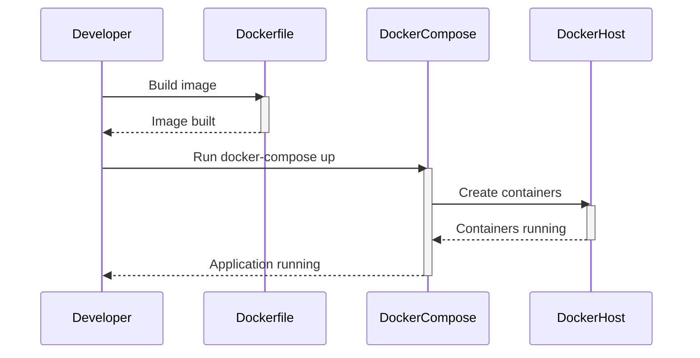
Sources: [src/Dockerfile](), [src/docker-compose.yml]()

This diagram illustrates the basic steps of the Docker deployment process. The developer builds the Docker image using the Dockerfile, then runs the application using docker-compose. The docker-compose tool creates and starts the containers on the Docker host.

## Conclusion

The Docker deployment strategy for Solace-AI provides a consistent and reproducible environment for running the application. The `Dockerfile` defines the steps to build the Docker image, and the `docker-compose.yml` file defines the services, networks, and volumes for the application. This setup simplifies the deployment process and ensures that the application runs consistently across different environments.


---

<a id='extensibility-agents'></a>

## Extending Agents

### Related Pages

Related topics: [Agents](#backend-agents)

<details>
<summary>Relevant source files</summary>

The following files were used as context for generating this wiki page:

- [src/agents/base_agent.py](src/agents/base_agent.py)
- [src/agents/__init__.py](src/agents/__init__.py)
- [src/utils/models.py](src/utils/models.py)
- [src/config.py](src/config.py)
- [src/memory/base.py](src/memory/base.py)
- [src/tools/base.py](src/tools/base.py)
</details>

# Extending Agents

This page details how to extend agents within the Solace-AI framework. Extending agents involves creating new agent types with customized functionalities, tools, and memory management. The base agent class provides a foundation for building specialized agents tailored to specific tasks. Understanding the architecture and available tools is crucial for effective agent extension. [Link to Memory Management](#memory-management).

## Base Agent Architecture

The `BaseAgent` class in `src/agents/base_agent.py` serves as the foundation for all agents within the Solace-AI framework. It defines the core functionalities and attributes that all agents share. This includes initialization, memory management, tool usage, and execution logic.

### Key Components

*   **Initialization:** The `__init__` method initializes the agent with configurations, memory, and tools. Sources: [src/agents/base_agent.py:22-32]()
*   **Memory:** Agents utilize a memory component to store and retrieve information. Sources: [src/agents/base_agent.py:26]()
*   **Tools:** Agents interact with the environment through tools. Sources: [src/agents/base_agent.py:27]()
*   **Execution:** The `run` method orchestrates the agent's execution flow. Sources: [src/agents/base_agent.py:45-51]()

### Class Diagram

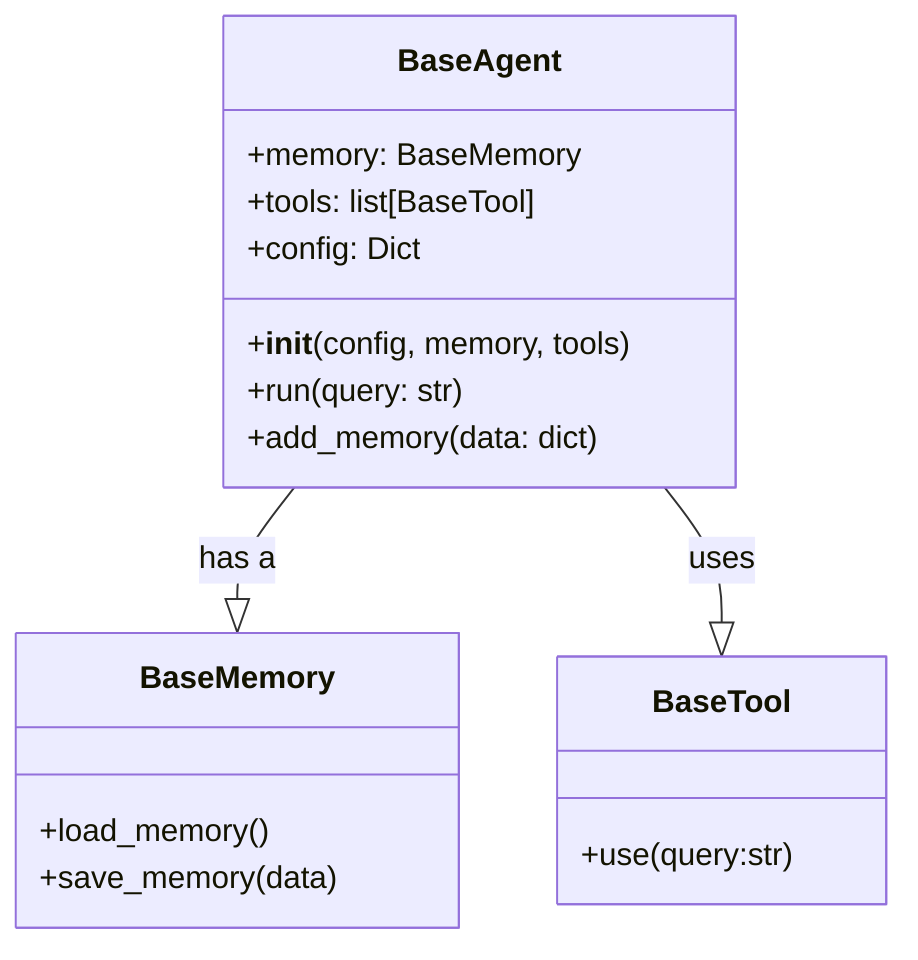

This diagram illustrates the relationship between the `BaseAgent`, `BaseMemory`, and `BaseTool` classes. The `BaseAgent` utilizes both `BaseMemory` for storing information and `BaseTool` for interacting with the environment. Sources: [src/agents/base_agent.py](), [src/memory/base.py](), [src/tools/base.py]()

### Code Snippet: BaseAgent Initialization

```python
# src/agents/base_agent.py
class BaseAgent:
    def __init__(self, config: Dict, memory: BaseMemory, tools: List[BaseTool]):
        """
        Initializes the BaseAgent.

        Args:
            config (Dict): Configuration dictionary.
            memory (BaseMemory): Memory instance for the agent.
            tools (List[BaseTool]): List of tools available to the agent.
        """
        self.memory = memory
        self.tools = tools
        self.config = config
```

This code snippet shows the initialization of the `BaseAgent` class, highlighting the configuration, memory, and tools it receives. Sources: [src/agents/base_agent.py:22-32]()

## Implementing a New Agent

To create a new agent, you need to inherit from the `BaseAgent` class and implement the specific logic for your agent. This includes defining how the agent processes input, utilizes tools, and manages memory.

### Steps to Implement

1.  **Create a New Class:** Define a new class that inherits from `BaseAgent`.
2.  **Override Methods:** Override the `__init__` method to customize initialization and potentially the `run` method to define the agent's execution flow.
3.  **Define Custom Logic:** Implement the specific logic for your agent within the overridden methods.

### Code Example: Custom Agent

```python
# Example of a custom agent implementation
from typing import Dict, List
from src.agents.base_agent import BaseAgent
from src.memory.base import BaseMemory
from src.tools.base import BaseTool

class CustomAgent(BaseAgent):
    def __init__(self, config: Dict, memory: BaseMemory, tools: List[BaseTool]):
        super().__init__(config, memory, tools)

    def run(self, query: str) -> str:
        """
        Executes the custom agent logic.

        Args:
            query (str): The input query.

        Returns:
            str: The response from the agent.
        """
        # Custom logic here
        response = f"Custom Agent response to: {query}"
        self.memory.save_memory({"query": query, "response": response})
        return response
```

This example demonstrates how to create a custom agent by inheriting from `BaseAgent` and overriding the `run` method. Sources: [src/agents/base_agent.py](), [src/memory/base.py](), [src/tools/base.py]()

## Memory Management

Agents use memory to store and retrieve information, enabling them to learn and adapt over time. The `BaseMemory` class provides the foundation for memory management.

### Key Functions

*   **`load_memory()`:** Loads memory from storage. Sources: [src/memory/base.py]()
*   **`save_memory(data)`:** Saves data to memory. Sources: [src/memory/base.py]()

### Memory Interaction in BaseAgent

The `BaseAgent` class interacts with memory through the `memory` attribute, which is an instance of a class derived from `BaseMemory`. The `add_memory` method can be used to add data to the agent's memory.

```python
# src/agents/base_agent.py
    def add_memory(self, data: dict):
        """Adds data to the agent's memory."""
        self.memory.save_memory(data)
```

This code snippet shows how the `add_memory` method in `BaseAgent` uses the `save_memory` method of the `BaseMemory` class to store data. Sources: [src/agents/base_agent.py:53-56](), [src/memory/base.py]()

## Tool Integration

Tools provide agents with the ability to interact with the external environment. The `BaseTool` class defines the interface for all tools.

### Using Tools

Agents utilize tools by calling the `use` method on a `BaseTool` instance. The `use` method executes the tool's logic and returns a result.

### Code Example: Tool Usage

```python
# Example of using a tool within an agent
from typing import Dict, List
from src.agents.base_agent import BaseAgent
from src.memory.base import BaseMemory
from src.tools.base import BaseTool

class ToolUsingAgent(BaseAgent):
    def __init__(self, config: Dict, memory: BaseMemory, tools: List[BaseTool]):
        super().__init__(config, memory, tools)

    def run(self, query: str) -> str:
        """
        Executes the agent logic using tools.

        Args:
            query (str): The input query.

        Returns:
            str: The response from the agent.
        """
        tool_results = []
        for tool in self.tools:
            tool_result = tool.use(query)
            tool_results.append(tool_result)

        response = f"Tool results: {tool_results}"
        self.memory.save_memory({"query": query, "response": response, "tool_results": tool_results})
        return response
```

This example demonstrates how an agent can use multiple tools by iterating through the `tools` list and calling the `use` method on each tool. Sources: [src/agents/base_agent.py](), [src/tools/base.py]()

## Configuration

Agent behavior can be configured using a configuration dictionary. This dictionary can contain parameters such as API keys, model settings, and other agent-specific settings. The configuration is passed to the agent during initialization. Sources: [src/agents/base_agent.py:25]()

### Accessing Configuration

The agent can access the configuration through the `config` attribute.

```python
# Example of accessing configuration within an agent
from typing import Dict, List
from src.agents.base_agent import BaseAgent
from src.memory.base import BaseMemory
from src/tools.base import BaseTool

class ConfigurableAgent(BaseAgent):
    def __init__(self, config: Dict, memory: BaseMemory, tools: List[BaseTool]):
        super().__init__(config, memory, tools)
        self.api_key = config.get("api_key")

    def run(self, query: str) -> str:
        """
        Executes the agent logic using configuration.

        Args:
            query (str): The input query.

        Returns:
            str: The response from the agent.
        """
        response = f"API Key: {self.api_key}, Response to: {query}"
        self.memory.save_memory({"query": query, "response": response})
        return response
```

This example shows how an agent can access configuration parameters through the `config` attribute. Sources: [src/agents/base_agent.py](), [src/config.py]()

## Summary

Extending agents in Solace-AI involves inheriting from the `BaseAgent` class, customizing initialization and execution logic, managing memory, integrating tools, and utilizing configuration parameters. By understanding these key aspects, developers can create specialized agents tailored to specific tasks within the framework.


---

