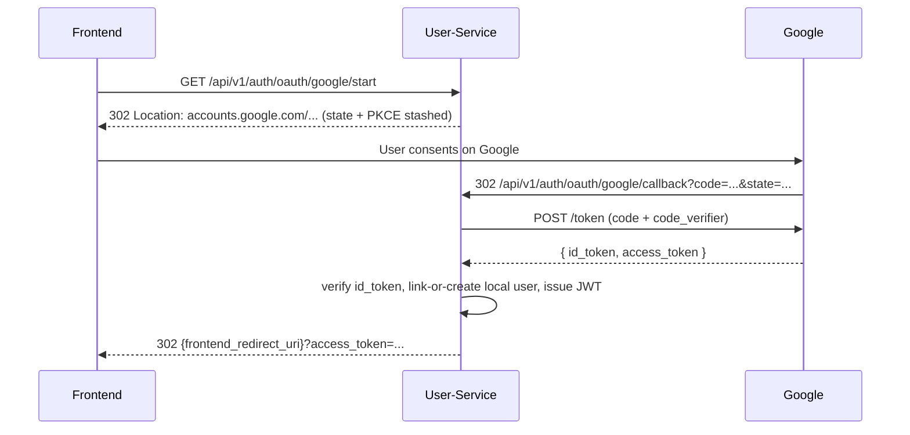

# Solace-AI API Handoff (for frontend team)

> ⚠️ **STALE / CONTRACT MISMATCH (flagged 2026-07-21).** The 2026-07-21 review found this doc's contract does **not** match the running code: real chat route is `/api/v1/orchestrator/chat` (not `/api/v1/chat/message`), WS is `/ws/{session_id}?token=` with a **query-param** JWT (not a Bearer header), the `{status,data,meta}` response envelope is not applied, OAuth endpoints don't exist, WS replay is unimplemented, and rate limiting is absent. Do **not** integrate against this doc until it is reconciled — see `REV-21/22/23/24` in [BUG-BACKLOG.md](BUG-BACKLOG.md) and [ENTERPRISE-READINESS-REMEDIATION-PLAN.md §WS-7](ENTERPRISE-READINESS-REMEDIATION-PLAN.md).

> **Audience**: The web + mobile frontend repo (separate codebase).
> **Purpose**: Everything the frontend needs to integrate with the
> Solace-AI backend: base URLs, auth flows, endpoint list, WebSocket
> protocol, OAuth redirect contract, and demo credentials.

---

## 1. Base URLs

| Environment | Base URL |
|------------|----------|
| Local dev (docker-compose) | `http://localhost:8000` (orchestrator) |
| Auth endpoints (local) | `http://localhost:8001` (user-service) |
| Production (VPS) | `https://api.{your-domain}` (Caddy-routed) |
| Auth (production) | `https://auth.{your-domain}` |

Caddy terminates TLS; every internal service is reached via the
domain-based routing in [`Caddyfile`](../Caddyfile).

---

## 2. Authentication flows

### 2.1 Email + password (default)

```
POST /api/v1/auth/register          -> 201 { user_id, email }
POST /api/v1/auth/login              -> 200 { access_token, refresh_token }
POST /api/v1/auth/refresh            -> 200 { access_token, refresh_token }
POST /api/v1/auth/logout             -> 204
```

All subsequent calls authenticate via `Authorization: Bearer <access_token>`.

### 2.2 Google OAuth2 (Sprint 8 addition)

Three-leg OAuth with PKCE (RFC 7636). The frontend redirects the browser
to the `/start` endpoint, which 302s to the Google consent screen.



- **Redirect URI** (register with Google Cloud Console):
  `https://auth.{domain}/api/v1/auth/oauth/google/callback`
- **State nonce** + **PKCE code_verifier** are retained in a signed
  short-lived cookie on the user-service; the frontend does not need
  to manage them.
- **Apple Sign In**: deferred post-MVP (per product decision to avoid
  the $99/yr Apple Developer enrollment for the demo).

---

## 3. Core endpoints

> Every service exposes Swagger/OpenAPI at `{service_base}/docs`. Use
> those as the authoritative reference. The table below is a survey.

| Service | Endpoint | Method | Purpose |
|---------|----------|--------|---------|
| Orchestrator | `/api/v1/chat/message` | POST | Main chat message send |
| Orchestrator | `/api/v1/ws/chat` | WS | Streaming chat |
| User | `/api/v1/users/me` | GET | Current user profile |
| User | `/api/v1/users/{id}` | GET/PUT | User CRUD |
| User | `/api/v1/consents` | GET/POST | Consent records |
| Safety | `/api/v1/safety/check` | POST | Run safety check (`check_type=full_assessment`) |
| Safety | `/api/v1/safety/resources` | GET | Crisis resources per level |
| Diagnosis | `/api/v1/diagnosis/assess` | POST | 4-step assessment |
| Diagnosis | `/api/v1/diagnosis/sessions/{id}` | GET | Session state |
| Therapy | `/api/v1/therapy/sessions` | POST | Start session |
| Therapy | `/api/v1/therapy/sessions/{id}/message` | POST | Send message in session |
| Memory | `/api/v1/memory/context` | POST | Retrieve context for user |
| Personality | `/api/v1/personality/detect` | POST | OCEAN trait detection |
| Personality | `/api/v1/personality/style` | POST | Style adaptation |
| Health | `/health`, `/ready`, `/live` | GET | Standard health probes |

---

## 4. WebSocket protocol

Endpoint: `wss://api.{domain}/api/v1/ws/chat`

Authenticated via `Authorization: Bearer <access_token>` in the
WebSocket handshake.

### Message schema (client → server)

```json
{
  "type": "chat.message",
  "session_id": "uuid",
  "content": "string",
  "metadata": { "client_ts": "ISO-8601" }
}
```

### Message schema (server → client)

```json
{
  "type": "chat.response.delta" | "chat.response.final" |
          "safety.alert" | "session.phase_changed" | "error",
  "session_id": "uuid",
  "content": "string",              // for delta / final
  "crisis_level": "HIGH",          // for safety.alert
  "resources": [{ "name": "988 Lifeline", ... }],  // for safety.alert
  "phase": "WORKING",              // for session.phase_changed
  "code": "auth_required",         // for error
  "message": "Please re-authenticate"
}
```

### Reconnection

- On unexpected close, reconnect with exponential backoff (1s, 2s, 4s,
  8s, cap at 30s).
- Re-auth with a fresh access token if the refresh token has expired.
- Server replays the tail of the current session on reconnect so no
  user message is lost.

---

## 5. Response envelope

Every JSON response follows:

```json
{
  "status": "success" | "error",
  "data": { ... },
  "meta": {
    "trace_id": "uuid",
    "response_time_ms": 234
  }
}
```

Errors include:

```json
{
  "status": "error",
  "error": {
    "code": "VALIDATION_ERROR",
    "message": "field 'content' must not be empty",
    "correlation_id": "uuid"
  }
}
```

Error codes: `VALIDATION_ERROR`, `AUTHENTICATION_ERROR`,
`AUTHORIZATION_ERROR`, `RATE_LIMIT_EXCEEDED`, `SAFETY_ERROR`,
`INFRASTRUCTURE_ERROR`, `LLM_SERVICE_ERROR`. See
[`src/solace_common/exceptions.py`](../src/solace_common/exceptions.py).

---

## 6. Rate limits

| Scope | Limit |
|------|-------|
| Per-user chat messages | 100/min |
| Per-session messages | 10/min |
| Per-IP requests (Caddy-enforced) | 1000/min |

429 responses include `Retry-After` header.

---

## 7. CORS

Production allows only `https://{your-frontend-domain}`. For local
dev set `CORS_ALLOWED_ORIGINS=http://localhost:3000` in `.env`.

---

## 8. Required frontend env vars

```
NEXT_PUBLIC_API_BASE_URL=https://api.{domain}
NEXT_PUBLIC_AUTH_BASE_URL=https://auth.{domain}
NEXT_PUBLIC_WS_URL=wss://api.{domain}/api/v1/ws/chat
NEXT_PUBLIC_GOOGLE_OAUTH_START=/api/v1/auth/oauth/google/start
```

---

## 9. OpenAPI specs

Each service exports an OpenAPI 3.x spec at `/openapi.json`. Download
them via:

```bash
for svc in 8000 8001 8002 8003 8004 8005 8006 8007 8008 8009; do
    curl -fsS https://api.{domain}/openapi-${svc}.json > docs/api-specs/${svc}.json
done
```

Or in local dev: `curl -fsS http://localhost:${port}/openapi.json`.

---

## 10. Reviewer / demo account

Seed script [`scripts/seed_demo_data.py`](../scripts/seed_demo_data.py)
(to be added as part of final deployment) creates:

- 1 clinician-reviewer account with an elevated role
- 3 synthetic personas (Sarah high-N, Marcus high-C, Elena high-O)
- 4 DSM-5-TR training-vignette personas
- 3 Kaplan & Sadock composite personas

Credentials are logged to `docs/DEMO-DATA.md` when the script runs.
