# Solace-AI: System-Wide Integration Architecture
## Complete Platform Architecture & Design

> **Version**: 2.0  
> **Date**: December 30, 2025  
> **Author**: System Architecture Team  
> **Status**: Master Technical Blueprint  
> **Scope**: Full Platform Integration

---

## Executive Summary

This document presents the complete system-wide architecture for Solace-AI, integrating all modules into a cohesive mental health AI platform. It synthesizes the Diagnosis Module, Therapy Module, Personality Detection Module, and Memory & Context Management Module into a unified, production-ready system with multi-agent orchestration, safety-first design, and HIPAA compliance.

### Platform Overview

```
┌─────────────────────────────────────────────────────────────────────────────┐
│                         SOLACE-AI PLATFORM                                   │
│                  AI-Powered Mental Health Companion                          │
├─────────────────────────────────────────────────────────────────────────────┤
│                                                                              │
│   🔍 DIAGNOSIS    💆 THERAPY     🎭 PERSONALITY    🧠 MEMORY               │
│   Assessment &    Evidence-based  Big Five OCEAN    Context &               │
│   screening       interventions   trait detection   continuity              │
│                                                                              │
│   🛡️ SAFETY      🎼 ORCHESTRATOR  💬 RESPONSE      📊 ANALYTICS           │
│   Crisis          Multi-agent      Personalized     Outcomes &              │
│   detection       coordination     generation       insights                │
│                                                                              │
├─────────────────────────────────────────────────────────────────────────────┤
│   INFRASTRUCTURE: LangGraph | Weaviate | PostgreSQL | Redis | Kafka         │
│   COMPLIANCE: HIPAA | SOC2 | Zero Trust Architecture                        │
└─────────────────────────────────────────────────────────────────────────────┘
```

---

## Table of Contents

1. [System Architecture Overview](#1-system-architecture-overview)
2. [Multi-Agent Orchestration](#2-multi-agent-orchestration)
3. [Module Integration Architecture](#3-module-integration-architecture)
4. [Data Flow Architecture](#4-data-flow-architecture)
5. [Safety Architecture](#5-safety-architecture)
6. [Event-Driven Architecture](#6-event-driven-architecture)
7. [API Gateway & Service Mesh](#7-api-gateway--service-mesh)
8. [Security & Compliance Architecture](#8-security--compliance-architecture)
9. [Deployment Architecture](#9-deployment-architecture)
10. [Complete System Diagrams](#10-complete-system-diagrams)

---

## 1. System Architecture Overview

### 1.1 Complete Platform Architecture


### 1.2 System Context Diagram

```mermaid
flowchart TB
    subgraph EXTERNAL_ACTORS["External Actors"]
        USER["👤 User"]
        CLINICIAN["👨‍⚕️ Clinician"]
        ADMIN["🔧 Admin"]
        CRISIS_SVC["🚨 Crisis Services<br/>(988, Emergency)"]
    end

    subgraph SOLACE_PLATFORM["Solace-AI Platform"]
        CORE["Core Platform"]
    end

    subgraph EXTERNAL_SYSTEMS["External Systems"]
        LLM_PROVIDER["LLM Provider<br/>(Anthropic/OpenAI)"]
        VOICE_PROVIDER["Voice Services<br/>(Whisper, TTS)"]
        EHR["EHR Systems<br/>(FHIR)"]
        ANALYTICS["Analytics Platform"]
        NOTIFICATION["Notification Services"]
    end

    USER <-->|"Conversation"| CORE
    CLINICIAN <-->|"Oversight"| CORE
    ADMIN <-->|"Management"| CORE
    
    CORE -->|"Crisis Escalation"| CRISIS_SVC
    CORE <-->|"AI Inference"| LLM_PROVIDER
    CORE <-->|"Voice Processing"| VOICE_PROVIDER
    CORE <-->|"Patient Records"| EHR
    CORE -->|"Metrics/Events"| ANALYTICS
    CORE -->|"Alerts"| NOTIFICATION

    style CORE fill:#e8f5e9,stroke:#2e7d32
```



### 1.3 Module Relationship Map


---

## 2. Multi-Agent Orchestration

### 2.1 LangGraph Orchestration Architecture


### 2.2 Agent Hierarchy & Priorities

```mermaid
flowchart TB
    subgraph HIERARCHY["Agent Hierarchy"]
        direction TB
        
        subgraph PRIORITY_0["🚨 Priority 0: SAFETY (Override All)"]
            SAFETY_AGENT["Safety Agent<br/>• Always monitors<br/>• Can interrupt any agent<br/>• Crisis detection<br/>• Escalation authority"]
        end
        
        subgraph PRIORITY_1["🎼 Priority 1: SUPERVISOR"]
            SUPER_AGENT["Supervisor Agent<br/>• Routes requests<br/>• Coordinates agents<br/>• Manages state<br/>• Quality control"]
        end
        
        subgraph PRIORITY_2["⚕️ Priority 2: CLINICAL"]
            DIAG_A["Diagnosis Agent"]
            THERAPY_A["Therapy Agent"]
            ASSESS_A["Assessment Agent"]
        end
        
        subgraph PRIORITY_3["🎭 Priority 3: SUPPORT"]
            PERSONALITY_A["Personality Agent"]
            EMOTION_A["Emotion Agent"]
            CHAT_A["Chat Agent"]
        end
    end

    PRIORITY_0 -->|"Oversees"| PRIORITY_1
    PRIORITY_1 -->|"Coordinates"| PRIORITY_2
    PRIORITY_1 -->|"Coordinates"| PRIORITY_3
    PRIORITY_2 <-->|"Collaborates"| PRIORITY_3

    style PRIORITY_0 fill:#ffcdd2,stroke:#c62828
    style PRIORITY_1 fill:#e3f2fd,stroke:#1565c0
    style PRIORITY_2 fill:#e8f5e9,stroke:#2e7d32
```



### 2.3 Agent Communication Patterns

```mermaid
flowchart TB
    subgraph COMMUNICATION["Agent Communication Patterns"]
        direction TB
        
        subgraph SYNC["Synchronous (Real-time)"]
            S1["Agent → Supervisor: Request routing"]
            S2["Agent → Memory: Context retrieval"]
            S3["Agent → LLM: Inference request"]
        end
        
        subgraph ASYNC["Asynchronous (Event-driven)"]
            A1["Agent → Event Bus: State changes"]
            A2["Agent → Agent: Collaboration signals"]
            A3["Safety → All: Alert broadcasts"]
        end
        
        subgraph BLACKBOARD["Shared Blackboard"]
            B1["current_state"]
            B2["responsible_agent"]
            B3["safety_flags"]
            B4["conversation_context"]
            B5["user_profile"]
        end
    end

    SYNC --> BLACKBOARD
    ASYNC --> BLACKBOARD
```



### 2.4 Agent State Machine


---

## 3. Module Integration Architecture

### 3.1 Complete Module Data Flow


### 3.2 Module Interface Contracts

```mermaid
flowchart TB
    subgraph CONTRACTS["Module Interface Contracts"]
        direction TB
        
        subgraph DIAGNOSIS_CONTRACT["Diagnosis Module Contract"]
            DC_IN["IN: UserMessage, History, Context"]
            DC_OUT["OUT: DiagnosisOutput<br/>• conditions[]<br/>• severity<br/>• confidence<br/>• risk_level"]
        end
        
        subgraph THERAPY_CONTRACT["Therapy Module Contract"]
            TC_IN["IN: DiagnosisOutput, TreatmentPlan, Session"]
            TC_OUT["OUT: TherapyResponse<br/>• technique<br/>• content<br/>• homework<br/>• progress"]
        end
        
        subgraph PERSONALITY_CONTRACT["Personality Module Contract"]
            PC_IN["IN: UserMessage, Profile"]
            PC_OUT["OUT: StyleParams<br/>• warmth, structure<br/>• complexity, directness<br/>• empathy_components"]
        end
        
        subgraph MEMORY_CONTRACT["Memory Module Contract"]
            MC_IN["IN: Query, UserId, TokenBudget"]
            MC_OUT["OUT: AssembledContext<br/>• user_profile<br/>• conversation<br/>• treatment_context<br/>• safety_info"]
        end
    end

    DC_OUT -->|"Informs"| TC_IN
    PC_OUT -->|"Styles"| TC_OUT
    MC_OUT -->|"Provides Context"| DC_IN & TC_IN & PC_IN
```



### 3.3 Cross-Module Event Flow


---

## 4. Data Flow Architecture

### 4.1 Complete System Data Flow


### 4.2 Data Store Integration

```mermaid
flowchart TB
    subgraph MODULES["Processing Modules"]
        DIAG["Diagnosis"]
        THERAPY["Therapy"]
        PERSONALITY["Personality"]
        SAFETY["Safety"]
    end

    subgraph MEMORY_MODULE["Memory Module (Mediator)"]
        MEMORY_API["Memory API"]
    end

    subgraph DATA_STORES["Data Stores"]
        subgraph HOT["Hot Storage (Real-time)"]
            REDIS[("Redis<br/>• Session state<br/>• Working memory<br/>• Cache")]
        end
        
        subgraph WARM["Warm Storage (Queryable)"]
            POSTGRES[("PostgreSQL<br/>• User profiles<br/>• Treatment plans<br/>• Assessments")]
            WEAVIATE[("Weaviate<br/>• Embeddings<br/>• Semantic search<br/>• Knowledge graph")]
        end
        
        subgraph COLD["Cold Storage (Archive)"]
            S3[("S3/Glacier<br/>• Session archives<br/>• Audit logs<br/>• Backups")]
        end
    end

    DIAG & THERAPY & PERSONALITY & SAFETY --> MEMORY_API
    MEMORY_API --> REDIS
    MEMORY_API --> POSTGRES
    MEMORY_API --> WEAVIATE
    MEMORY_API --> S3

    style MEMORY_MODULE fill:#e3f2fd
```



### 4.3 Event Stream Architecture


---

## 5. Safety Architecture

### 5.1 Multi-Layer Safety System


### 5.2 Crisis Escalation Flow


### 5.3 Safety Agent Integration


---

## 6. Event-Driven Architecture

### 6.1 Complete Event Taxonomy


### 6.2 Event Processing Pipeline


### 6.3 Event-Driven Workflows


---

## 7. API Gateway & Service Mesh

### 7.1 API Gateway Architecture


### 7.2 Service Mesh (Istio)

```mermaid
flowchart TB
    subgraph MESH["Istio Service Mesh"]
        direction TB
        
        subgraph CONTROL_PLANE["Control Plane"]
            ISTIOD["Istiod"]
            PILOT["Pilot (Config)"]
            CITADEL["Citadel (Security)"]
            GALLEY["Galley (Validation)"]
        end
        
        subgraph DATA_PLANE["Data Plane"]
            direction LR
            
            subgraph POD1["Orchestrator Pod"]
                ORCH["Orchestrator"]
                ENVOY1["Envoy Sidecar"]
            end
            
            subgraph POD2["Diagnosis Pod"]
                DIAG["Diagnosis Service"]
                ENVOY2["Envoy Sidecar"]
            end
            
            subgraph POD3["Therapy Pod"]
                THERAPY["Therapy Service"]
                ENVOY3["Envoy Sidecar"]
            end
        end
    end

    subgraph FEATURES["Mesh Features"]
        F1["mTLS (automatic)"]
        F2["Traffic Management"]
        F3["Observability"]
        F4["Circuit Breaking"]
    end

    CONTROL_PLANE --> DATA_PLANE
    ENVOY1 <-->|"mTLS"| ENVOY2
    ENVOY2 <-->|"mTLS"| ENVOY3

    style CONTROL_PLANE fill:#fff3e0
    style DATA_PLANE fill:#e8f5e9
```

### 7.3 API Endpoints Structure

```mermaid
flowchart TB
    subgraph API_STRUCTURE["API Endpoint Structure"]
        direction TB
        
        subgraph V1["API v1"]
            direction LR
            
            subgraph CHAT["/api/v1/chat"]
                CHAT1["POST /message"]
                CHAT2["GET /history"]
                CHAT3["POST /voice"]
            end
            
            subgraph SESSION["/api/v1/sessions"]
                SESS1["POST / (create)"]
                SESS2["GET /{id}"]
                SESS3["PUT /{id}/end"]
            end
            
            subgraph USER["/api/v1/users"]
                USER1["GET /profile"]
                USER2["PUT /preferences"]
                USER3["GET /progress"]
            end
            
            subgraph ASSESSMENT["/api/v1/assessments"]
                ASS1["POST /phq9"]
                ASS2["POST /gad7"]
                ASS3["GET /history"]
            end
        end
        
        subgraph ADMIN["/api/v1/admin"]
            ADMIN1["GET /users"]
            ADMIN2["GET /analytics"]
            ADMIN3["POST /alerts"]
        end
    end
```

---

## 8. Security & Compliance Architecture

### 8.1 HIPAA Compliance Architecture

```mermaid
flowchart TB
    subgraph HIPAA["HIPAA Compliance Architecture"]
        direction TB
        
        subgraph ADMIN_SAFEGUARDS["Administrative Safeguards"]
            AS1["Security Officer assigned"]
            AS2["Risk assessments"]
            AS3["Workforce training"]
            AS4["Incident response plan"]
        end
        
        subgraph PHYSICAL_SAFEGUARDS["Physical Safeguards"]
            PS1["Data center security (AWS/GCP)"]
            PS2["Workstation security"]
            PS3["Device controls"]
        end
        
        subgraph TECHNICAL_SAFEGUARDS["Technical Safeguards"]
            TS1["Access Controls (RBAC/ABAC)"]
            TS2["Audit Logs (immutable)"]
            TS3["Encryption (AES-256, TLS 1.3)"]
            TS4["Integrity Controls"]
            TS5["Transmission Security"]
        end
    end

    subgraph IMPLEMENTATION["Implementation"]
        I1["Zero Trust Architecture"]
        I2["PHI encryption at rest"]
        I3["PHI encryption in transit"]
        I4["6-year audit retention"]
        I5["BAA with all vendors"]
    end

    ADMIN_SAFEGUARDS --> IMPLEMENTATION
    PHYSICAL_SAFEGUARDS --> IMPLEMENTATION
    TECHNICAL_SAFEGUARDS --> IMPLEMENTATION

    style TECHNICAL_SAFEGUARDS fill:#e3f2fd
```

### 8.2 Zero Trust Security Model

```mermaid
flowchart TB
    subgraph ZERO_TRUST["Zero Trust Architecture"]
        direction TB
        
        subgraph PRINCIPLES["Core Principles"]
            P1["Never trust, always verify"]
            P2["Least privilege access"]
            P3["Assume breach"]
            P4["Microsegmentation"]
        end
        
        subgraph IMPLEMENTATION["Implementation"]
            direction LR
            
            subgraph IDENTITY["Identity"]
                ID1["MFA required"]
                ID2["Continuous authentication"]
                ID3["Device verification"]
            end
            
            subgraph NETWORK["Network"]
                NET1["Microsegmentation"]
                NET2["mTLS everywhere"]
                NET3["Network policies"]
            end
            
            subgraph DATA["Data"]
                DATA1["Classification"]
                DATA2["Encryption"]
                DATA3["DLP policies"]
            end
            
            subgraph WORKLOAD["Workload"]
                WL1["Runtime verification"]
                WL2["Image signing"]
                WL3["Secrets management"]
            end
        end
    end

    PRINCIPLES --> IMPLEMENTATION
```

### 8.3 Audit Trail Architecture

```mermaid
flowchart TB
    subgraph AUDIT_SYSTEM["Audit Trail System"]
        direction TB
        
        subgraph CAPTURE["Event Capture"]
            CAP1["All API requests"]
            CAP2["PHI access events"]
            CAP3["Authentication events"]
            CAP4["Configuration changes"]
            CAP5["Agent actions"]
        end
        
        subgraph ENRICH["Enrichment"]
            ENR1["Timestamp (NTP sync)"]
            ENR2["User identity"]
            ENR3["Resource accessed"]
            ENR4["Action performed"]
            ENR5["Result (success/fail)"]
        end
        
        subgraph STORE["Storage"]
            ST1["Write-Once Storage"]
            ST2["Cryptographic signing"]
            ST3["Tamper detection"]
        end
        
        subgraph RETAIN["Retention"]
            RET1["Hot: 90 days (ElasticSearch)"]
            RET2["Warm: 2 years (S3 Standard)"]
            RET3["Cold: 6+ years (Glacier)"]
        end
    end

    CAPTURE --> ENRICH --> STORE --> RETAIN

    style STORE fill:#fff3e0
```

---

## 9. Deployment Architecture

### 9.1 Kubernetes Deployment

```mermaid
flowchart TB
    subgraph K8S["Kubernetes Cluster"]
        direction TB
        
        subgraph INGRESS["Ingress Layer"]
            ING["Ingress Controller"]
            CERT["Cert Manager"]
        end
        
        subgraph NAMESPACE_PROD["Namespace: solace-prod"]
            direction TB
            
            subgraph CORE_SERVICES["Core Services"]
                ORCH_DEP["Orchestrator<br/>Deployment (3 replicas)"]
                DIAG_DEP["Diagnosis<br/>Deployment (2 replicas)"]
                THERAPY_DEP["Therapy<br/>Deployment (2 replicas)"]
                PERSONALITY_DEP["Personality<br/>Deployment (2 replicas)"]
            end
            
            subgraph SUPPORT_SERVICES["Support Services"]
                MEMORY_DEP["Memory Service"]
                SAFETY_DEP["Safety Service"]
                USER_DEP["User Service"]
            end
            
            subgraph WORKERS["Background Workers"]
                CONSOLIDATION["Consolidation Worker"]
                ANALYTICS["Analytics Worker"]
                NOTIFICATION["Notification Worker"]
            end
        end
        
        subgraph DATA_NAMESPACE["Namespace: solace-data"]
            POSTGRES_SS["PostgreSQL StatefulSet"]
            REDIS_SS["Redis Cluster"]
            KAFKA_SS["Kafka StatefulSet"]
        end
    end

    subgraph EXTERNAL["External Services"]
        LLM["LLM API"]
        WEAVIATE_CLOUD["Weaviate Cloud"]
        S3["AWS S3"]
    end

    ING --> CORE_SERVICES
    CORE_SERVICES --> SUPPORT_SERVICES
    SUPPORT_SERVICES --> DATA_NAMESPACE
    SUPPORT_SERVICES --> EXTERNAL
```

### 9.2 High Availability Architecture

```mermaid
flowchart TB
    subgraph HA["High Availability Architecture"]
        direction TB
        
        subgraph MULTI_AZ["Multi-AZ Deployment"]
            direction LR
            
            subgraph AZ1["Availability Zone 1"]
                AZ1_ORCH["Orchestrator"]
                AZ1_DIAG["Diagnosis"]
                AZ1_DB["PostgreSQL Primary"]
            end
            
            subgraph AZ2["Availability Zone 2"]
                AZ2_ORCH["Orchestrator"]
                AZ2_THERAPY["Therapy"]
                AZ2_DB["PostgreSQL Replica"]
            end
            
            subgraph AZ3["Availability Zone 3"]
                AZ3_ORCH["Orchestrator"]
                AZ3_PERS["Personality"]
                AZ3_DB["PostgreSQL Replica"]
            end
        end
        
        subgraph LB["Load Balancing"]
            GLB["Global Load Balancer"]
            ALB1["ALB Zone 1"]
            ALB2["ALB Zone 2"]
            ALB3["ALB Zone 3"]
        end
    end

    GLB --> ALB1 & ALB2 & ALB3
    ALB1 --> AZ1
    ALB2 --> AZ2
    ALB3 --> AZ3
    
    AZ1_DB <-->|"Replication"| AZ2_DB
    AZ1_DB <-->|"Replication"| AZ3_DB
```

### 9.3 CI/CD Pipeline

```mermaid
flowchart LR
    subgraph PIPELINE["CI/CD Pipeline"]
        direction TB
        
        subgraph BUILD["Build Stage"]
            CODE["Code Commit"]
            TEST["Unit Tests"]
            LINT["Linting"]
            SECURITY["Security Scan"]
            BUILD_IMG["Build Image"]
        end
        
        subgraph DEPLOY["Deploy Stage"]
            PUSH["Push to Registry"]
            STAGING["Deploy Staging"]
            INT_TEST["Integration Tests"]
            CANARY["Canary Deploy"]
            PROD["Production Deploy"]
        end
        
        subgraph MONITOR["Monitor Stage"]
            HEALTH["Health Checks"]
            METRICS["Metrics Collection"]
            ALERTS["Alert Setup"]
            ROLLBACK["Auto-Rollback"]
        end
    end

    CODE --> TEST --> LINT --> SECURITY --> BUILD_IMG
    BUILD_IMG --> PUSH --> STAGING --> INT_TEST --> CANARY --> PROD
    PROD --> HEALTH --> METRICS --> ALERTS
    ALERTS -->|"Failure"| ROLLBACK
```

---

## 10. Complete System Diagrams

### 10.1 Master System Architecture

```mermaid
flowchart TB
    subgraph COMPLETE_SYSTEM["SOLACE-AI COMPLETE SYSTEM ARCHITECTURE"]
        direction TB
        
        subgraph PRESENTATION["Presentation Tier"]
            WEB["Web App"]
            MOBILE["Mobile"]
            VOICE["Voice"]
        end
        
        subgraph EDGE["Edge Tier"]
            CDN["CDN"]
            WAF["WAF"]
            GATEWAY["API Gateway"]
        end
        
        subgraph ORCHESTRATION["Orchestration Tier"]
            SUPERVISOR["Supervisor"]
            SAFETY["Safety Agent"]
            ROUTER["Agent Router"]
        end
        
        subgraph PROCESSING["Processing Tier"]
            direction LR
            DIAGNOSIS["🔍 Diagnosis"]
            THERAPY["💆 Therapy"]
            PERSONALITY["🎭 Personality"]
            EMOTION["💜 Emotion"]
        end
        
        subgraph MEMORY["Memory Tier"]
            MEMORY_SVC["Memory Service"]
            CONTEXT["Context Manager"]
        end
        
        subgraph DATA["Data Tier"]
            direction LR
            CACHE["Redis"]
            VECTOR["Weaviate"]
            RELATIONAL["PostgreSQL"]
            STREAM["Kafka"]
        end
        
        subgraph EXTERNAL["External Services"]
            LLM["LLM Provider"]
            CRISIS["Crisis Services"]
        end
    end

    PRESENTATION --> EDGE --> ORCHESTRATION
    ORCHESTRATION --> PROCESSING
    PROCESSING --> MEMORY
    MEMORY --> DATA
    ORCHESTRATION --> EXTERNAL
    SAFETY -.->|"Monitors"| PROCESSING

    style SAFETY fill:#ffcdd2
    style ORCHESTRATION fill:#e3f2fd
    style PROCESSING fill:#e8f5e9
```

### 10.2 Complete Data Flow

```mermaid
flowchart TB
    subgraph COMPLETE_FLOW["Complete System Data Flow"]
        direction TB
        
        USER["👤 User"] -->|"1. Message"| GATEWAY["Gateway"]
        
        GATEWAY -->|"2. Auth + Route"| ORCH["Orchestrator"]
        
        ORCH -->|"3. Safety Check"| SAFETY["Safety"]
        SAFETY -->|"3a. OK/Crisis"| ORCH
        
        ORCH -->|"4. Get Context"| MEMORY["Memory"]
        MEMORY -->|"4a. Context"| ORCH
        
        ORCH -->|"5. Parallel Process"| AGENTS["Agents"]
        
        subgraph AGENTS["Agent Processing"]
            DIAG["Diagnosis"]
            THERAPY["Therapy"]
            PERSONALITY["Personality"]
        end
        
        DIAG & THERAPY & PERSONALITY -->|"6. Results"| AGGREGATE["Aggregator"]
        
        AGGREGATE -->|"7. Style Apply"| STYLER["Personality Styler"]
        
        STYLER -->|"8. Safety Filter"| FILTER["Safety Filter"]
        
        FILTER -->|"9. Store"| MEMORY
        
        FILTER -->|"10. Response"| USER
    end

    style SAFETY fill:#ffcdd2
    style MEMORY fill:#e3f2fd
```

### 10.3 Module Integration Summary

```mermaid
flowchart TB
    subgraph INTEGRATION_SUMMARY["Module Integration Summary"]
        direction TB
        
        subgraph DIAGNOSIS_MOD["🔍 DIAGNOSIS MODULE"]
            D1["Symptom detection"]
            D2["Severity assessment"]
            D3["Differential diagnosis"]
            D4["Risk evaluation"]
        end
        
        subgraph THERAPY_MOD["💆 THERAPY MODULE"]
            T1["Technique selection"]
            T2["Session management"]
            T3["Intervention delivery"]
            T4["Progress tracking"]
        end
        
        subgraph PERSONALITY_MOD["🎭 PERSONALITY MODULE"]
            P1["Big Five detection"]
            P2["Style mapping"]
            P3["Empathy generation"]
            P4["Cultural adaptation"]
        end
        
        subgraph MEMORY_MOD["🧠 MEMORY MODULE"]
            M1["Context assembly"]
            M2["Profile management"]
            M3["History retrieval"]
            M4["State persistence"]
        end
        
        subgraph SAFETY_MOD["🛡️ SAFETY MODULE"]
            S1["Crisis detection"]
            S2["Escalation handling"]
            S3["Continuous monitoring"]
            S4["Override authority"]
        end
    end

    DIAGNOSIS_MOD -->|"Assessment"| THERAPY_MOD
    PERSONALITY_MOD -->|"Style"| THERAPY_MOD
    MEMORY_MOD -->|"Context"| DIAGNOSIS_MOD & THERAPY_MOD & PERSONALITY_MOD
    SAFETY_MOD -.->|"Monitors"| DIAGNOSIS_MOD & THERAPY_MOD & PERSONALITY_MOD

    style DIAGNOSIS_MOD fill:#e3f2fd
    style THERAPY_MOD fill:#e8f5e9
    style PERSONALITY_MOD fill:#f3e5f5
    style MEMORY_MOD fill:#fff3e0
    style SAFETY_MOD fill:#ffcdd2
```

---

## Appendix A: Technology Stack Summary

| Layer | Technology | Purpose |
|-------|------------|---------|
| **Frontend** | React, React Native | Web & Mobile apps |
| **API Gateway** | Kong/Istio | Routing, auth, rate limiting |
| **Orchestration** | LangGraph | Multi-agent coordination |
| **Services** | Python/FastAPI | Backend services |
| **Cache** | Redis Cluster | Session state, working memory |
| **Vector DB** | Weaviate | Semantic search, embeddings |
| **Relational DB** | PostgreSQL | Structured data, profiles |
| **Streaming** | Kafka | Event bus, audit trail |
| **Object Storage** | S3/MinIO | Archives, backups |
| **LLM** | Anthropic/OpenAI | AI inference |
| **Container** | Kubernetes | Orchestration |
| **Service Mesh** | Istio | mTLS, traffic management |
| **Monitoring** | Prometheus/Grafana | Metrics, alerting |

## Appendix B: Module Dependency Matrix

| Module | Depends On | Provides To |
|--------|------------|-------------|
| **Orchestrator** | All modules | All modules |
| **Diagnosis** | Memory, Safety | Therapy, Orchestrator |
| **Therapy** | Memory, Diagnosis, Personality, Safety | Orchestrator |
| **Personality** | Memory | Therapy, Response |
| **Memory** | Data stores | All modules |
| **Safety** | Memory | All modules (override) |
| **Response** | Personality, Memory | Orchestrator |

## Appendix C: Event Reference

| Event | Publisher | Subscribers |
|-------|-----------|-------------|
| SessionStarted | Orchestrator | Memory, Analytics |
| MessageReceived | Orchestrator | Safety, Memory |
| AssessmentComplete | Diagnosis | Therapy, Memory, Analytics |
| InterventionDelivered | Therapy | Memory, Analytics |
| CrisisDetected | Safety | All, Alerts, Audit |
| ProfileUpdated | Personality | Therapy, Memory |
| MemoryConsolidated | Memory | Analytics |

---

*Document Version: 2.0*  
*Last Updated: December 30, 2025*  
*Status: Master Technical Blueprint*  
*Scope: Complete Platform Integration*
