# Solace-AI: Complete Master Architecture Diagrams
## Visual Reference for All Platform Modules

> **Version**: 2.0  
> **Date**: December 30, 2025  
> **Scope**: Diagnosis | Therapy | Personality | Memory | System Integration

---

## 1. COMPLETE PLATFORM OVERVIEW

### 1.1 Master System Architecture

```mermaid
flowchart TB
    subgraph SOLACE_PLATFORM["🌟 SOLACE-AI PLATFORM"]
        direction TB
        
        subgraph CLIENTS["Client Layer"]
            direction LR
            WEB["🌐 Web"]
            MOBILE["📱 Mobile"]
            VOICE["🎤 Voice"]
        end
        
        subgraph GATEWAY["Gateway Layer"]
            API_GW["API Gateway<br/>(Auth, Rate Limit, TLS)"]
        end
        
        subgraph ORCHESTRATION["Orchestration Layer"]
            direction LR
            SUPERVISOR["🎼 Supervisor"]
            SAFETY_AGENT["🛡️ Safety Agent"]
            ROUTER["📍 Router"]
        end
        
        subgraph MODULES["Module Layer"]
            direction LR
            DIAG["🔍 Diagnosis"]
            THERAPY["💆 Therapy"]
            PERSONALITY["🎭 Personality"]
            EMOTION["💜 Emotion"]
        end
        
        subgraph MEMORY_LAYER["Memory Layer"]
            MEMORY["🧠 Memory Module"]
        end
        
        subgraph DATA["Data Layer"]
            direction LR
            REDIS[("⚡ Redis")]
            WEAVIATE[("🔮 Weaviate")]
            POSTGRES[("💾 PostgreSQL")]
            KAFKA["📨 Kafka"]
        end
        
        subgraph EXTERNAL["External Services"]
            direction LR
            LLM["☁️ LLM API"]
            CRISIS["🚨 Crisis Services"]
        end
    end

    CLIENTS --> GATEWAY --> ORCHESTRATION
    ORCHESTRATION --> MODULES
    MODULES --> MEMORY_LAYER --> DATA
    ORCHESTRATION <--> EXTERNAL
    SAFETY_AGENT -.->|"Monitors All"| MODULES

    style SAFETY_AGENT fill:#ffcdd2,stroke:#c62828
    style MEMORY_LAYER fill:#e8f5e9,stroke:#2e7d32
    style ORCHESTRATION fill:#e3f2fd,stroke:#1565c0
```

### 1.2 Complete Module Integration Flow


---

## 2. DIAGNOSIS MODULE

### 2.1 Diagnosis Pipeline


### 2.2 Risk Assessment Flow


---

## 3. THERAPY MODULE

### 3.1 Technique Selection Engine

```mermaid
flowchart TB
    INPUT["Inputs: Diagnosis, Severity, Profile"] --> STAGE1
    
    subgraph STAGE1["Stage 1: Clinical Filtering"]
        S1["Match diagnosis → Filter severity → Check contraindications"]
    end
    
    subgraph STAGE2["Stage 2: Personalization"]
        S2["Personality matching → Historical effectiveness → Preferences"]
    end
    
    subgraph STAGE3["Stage 3: Context Ranking"]
        S3["Session phase fit → Treatment alignment → Recency penalty"]
    end
    
    subgraph STAGE4["Stage 4: Selection"]
        S4["Composite score → Top-K selection → Safety check"]
    end
    
    STAGE1 --> STAGE2 --> STAGE3 --> STAGE4
    STAGE4 --> OUTPUT["Selected Technique + Alternatives"]

    style STAGE1 fill:#ffcdd2
    style STAGE2 fill:#e3f2fd
    style STAGE3 fill:#e8f5e9
    style STAGE4 fill:#fff3e0
```

### 3.2 Session State Machine

```mermaid
stateDiagram-v2
    [*] --> PreSession: Session Initiated
    PreSession --> Opening: Ready
    Opening --> Working: Agenda Set
    Working --> Closing: Intervention Done
    Closing --> PostSession: Summary Done
    PostSession --> [*]: Complete
    
    Opening --> Crisis: 🚨 Detected
    Working --> Crisis: 🚨 Detected
    Crisis --> [*]: Escalated
```

### 3.3 Treatment Phase Protocol


### 3.4 Therapeutic Modalities

```mermaid
flowchart TB
    subgraph MODALITIES["Therapeutic Technique Library"]
        direction LR
        
        CBT["🧠 CBT<br/>Cognitive restructuring<br/>Behavioral activation<br/>Thought records<br/>Exposure"]
        
        DBT["💜 DBT<br/>Mindfulness<br/>Distress tolerance<br/>Emotion regulation<br/>Interpersonal skills"]
        
        ACT["🌿 ACT<br/>Defusion<br/>Acceptance<br/>Values clarification<br/>Committed action"]
        
        OTHER["📚 Other<br/>MI (OARS)<br/>Solution-focused<br/>Mindfulness"]
    end

    style CBT fill:#e3f2fd
    style DBT fill:#f3e5f5
    style ACT fill:#e8f5e9
    style OTHER fill:#fff3e0
```

---

## 4. PERSONALITY MODULE

### 4.1 Big Five (OCEAN) Detection


### 4.2 Style Adaptation Matrix

```mermaid
flowchart TB
    subgraph MAPPING["Trait → Style Mapping"]
        direction TB
        
        subgraph HIGH_N["High Neuroticism"]
            HN["✓ Extra validation<br/>✓ Reassurance<br/>✓ Safety emphasis<br/>✓ Gentle pacing"]
        end
        
        subgraph LOW_E["Low Extraversion"]
            LE["✓ Concise responses<br/>✓ Processing space<br/>✓ One question at time<br/>✗ Avoid overwhelming"]
        end
        
        subgraph HIGH_O["High Openness"]
            HO["✓ Metaphors, analogies<br/>✓ Novel perspectives<br/>✓ Creative exercises"]
        end
        
        subgraph HIGH_C["High Conscientiousness"]
            HC["✓ Clear structure<br/>✓ Specific timelines<br/>✓ Detailed plans"]
        end
    end
```

### 4.3 Empathy Generation (MoEL)

```mermaid
flowchart TB
    INPUT["User Message"] --> ENCODER["Transformer Encoder"]
    ENCODER --> TRACKER["Emotion Tracker"]
    TRACKER --> DIST["Emotion Distribution (32 classes)"]
    
    subgraph LISTENERS["Specialized Listeners"]
        L1["😢 Sadness"]
        L2["😰 Anxiety"]
        L3["😠 Anger"]
        L4["😊 Joy"]
        L5["... (28 more)"]
    end
    
    DIST --> LISTENERS
    LISTENERS --> META["Meta-Listener (Soft Combination)"]
    META --> OUTPUT["Empathic Response"]

    style LISTENERS fill:#f3e5f5
```

---

## 5. MEMORY MODULE

### 5.1 Five-Tier Memory Hierarchy

```mermaid
flowchart TB
    subgraph HIERARCHY["Memory Hierarchy"]
        direction TB
        
        T1["⚡ TIER 1: Input Buffer<br/>Current message | In-memory | <1ms"]
        T2["🔥 TIER 2: Working Memory<br/>Context window | Redis | <10ms"]
        T3["📋 TIER 3: Session Memory<br/>Full session | Redis+PG | <50ms"]
        T4["📚 TIER 4: Episodic Memory<br/>Past sessions | PG+Weaviate | <200ms"]
        T5["🧠 TIER 5: Semantic Memory<br/>Facts & knowledge | Permanent"]
    end

    T1 --> T2 --> T3
    T3 -->|"Consolidation"| T4
    T3 -->|"Extraction"| T5

    style T1 fill:#ffcdd2
    style T2 fill:#fff3e0
    style T3 fill:#fff9c4
    style T4 fill:#c8e6c9
    style T5 fill:#bbdefb
```

### 5.2 Memory Consolidation Pipeline


### 5.3 Retrieval Architecture (Agentic RAG)


### 5.4 Retention Categories

```mermaid
flowchart TB
    subgraph RETENTION["Memory Retention Rules"]
        PERM["🔒 PERMANENT (Never Decay)<br/>Safety plans, crisis history<br/>Emergency contacts, diagnoses"]
        
        LONG["📚 LONG-TERM (Slow Decay)<br/>Treatment plans, milestones<br/>Effective techniques, key relationships"]
        
        MED["📋 MEDIUM-TERM (Standard)<br/>Session summaries<br/>Homework history, patterns"]
        
        SHORT["📝 SHORT-TERM (Fast Decay)<br/>Casual conversation details<br/>Minor preferences"]
    end

    style PERM fill:#ffcdd2,stroke:#c62828
    style LONG fill:#c8e6c9,stroke:#2e7d32
    style MED fill:#fff9c4,stroke:#f9a825
    style SHORT fill:#e3f2fd,stroke:#1565c0
```

---

## 6. SAFETY MODULE

### 6.1 Multi-Layer Safety Architecture

```mermaid
flowchart TB
    INPUT["User Input"] --> L1
    
    subgraph L1["Layer 1: INPUT GATE"]
        L1A["Crisis keywords"]
        L1B["Sentiment analysis"]
        L1C["Pattern recognition"]
    end
    
    L1 -->|"Pass"| L2
    L1 -->|"Crisis"| ESCALATE["🚨 ESCALATION"]
    
    subgraph L2["Layer 2: PROCESSING GUARD"]
        L2A["Contraindication check"]
        L2B["Severity validation"]
    end
    
    L2 --> PROCESS["Module Processing"]
    PROCESS --> L3
    
    subgraph L3["Layer 3: OUTPUT FILTER"]
        L3A["Response safety"]
        L3B["Resource inclusion"]
    end
    
    L3 --> OUTPUT["Safe Output"]
    
    L4["Layer 4: CONTINUOUS MONITOR"] -.->|"Always watching"| L1 & L2 & L3

    style L1 fill:#ffcdd2
    style ESCALATE fill:#ff6b6b,color:#fff
```

### 6.2 Crisis Escalation Protocol


---

## 7. ORCHESTRATION

### 7.1 LangGraph Multi-Agent Flow

```mermaid
flowchart TB
    INPUT["User Message"] --> SAFETY_PRE["🛡️ Safety Pre-Check"]
    
    SAFETY_PRE --> ROUTE{Safe?}
    ROUTE -->|"Crisis"| CRISIS["Crisis Handler"]
    ROUTE -->|"Safe"| SUPERVISOR["Supervisor"]
    
    SUPERVISOR --> SELECT["Agent Selection"]
    
    subgraph AGENTS["Agent Nodes"]
        direction LR
        A1["🔍 Diagnosis"]
        A2["💆 Therapy"]
        A3["🎭 Personality"]
        A4["💬 Chat"]
    end
    
    SELECT --> AGENTS
    AGENTS --> AGGREGATE["Aggregator"]
    AGGREGATE --> SAFETY_POST["🛡️ Safety Post-Check"]
    
    SAFETY_POST --> OUTPUT["Response"]
    CRISIS --> ESCALATE["Resources + Escalation"]

    style SAFETY_PRE fill:#ffcdd2
    style SAFETY_POST fill:#ffcdd2
    style CRISIS fill:#ff6b6b,color:#fff
```

### 7.2 Agent Priority Hierarchy

```mermaid
flowchart TB
    subgraph HIERARCHY["Agent Priority"]
        P0["🚨 PRIORITY 0: SAFETY AGENT<br/>• Always monitors<br/>• Override authority<br/>• Crisis handling"]
        
        P1["🎼 PRIORITY 1: SUPERVISOR<br/>• Routes requests<br/>• Coordinates agents<br/>• Quality control"]
        
        P2["⚕️ PRIORITY 2: CLINICAL<br/>• Diagnosis Agent<br/>• Therapy Agent<br/>• Assessment Agent"]
        
        P3["🎭 PRIORITY 3: SUPPORT<br/>• Personality Agent<br/>• Emotion Agent<br/>• Chat Agent"]
    end

    P0 -->|"Oversees"| P1
    P1 -->|"Coordinates"| P2 & P3

    style P0 fill:#ffcdd2,stroke:#c62828
    style P1 fill:#e3f2fd,stroke:#1565c0
    style P2 fill:#e8f5e9,stroke:#2e7d32
```

---

## 8. DATA ARCHITECTURE

### 8.1 Storage Architecture

```mermaid
flowchart TB
    subgraph STORAGE["Data Storage Architecture"]
        direction TB
        
        subgraph HOT["⚡ Hot Storage"]
            REDIS["Redis Cluster<br/>• Session state<br/>• Working memory<br/>• Cache<br/>Access: <10ms"]
        end
        
        subgraph WARM["📊 Warm Storage"]
            POSTGRES["PostgreSQL<br/>• User profiles<br/>• Treatment plans<br/>• Structured data<br/>Access: <50ms"]
            
            WEAVIATE["Weaviate<br/>• Embeddings<br/>• Semantic search<br/>• Knowledge graph<br/>Access: <100ms"]
        end
        
        subgraph COLD["🧊 Cold Storage"]
            S3["S3/Glacier<br/>• Session archives<br/>• Audit logs<br/>• Backups<br/>6+ year retention"]
        end
    end

    HOT --> WARM --> COLD
```

### 8.2 Event Stream Architecture

```mermaid
flowchart LR
    subgraph PRODUCERS["Producers"]
        P1["Orchestrator"]
        P2["Diagnosis"]
        P3["Therapy"]
        P4["Memory"]
        P5["Safety"]
    end

    subgraph KAFKA["Kafka Event Bus"]
        T1["sessions"]
        T2["assessments"]
        T3["therapy"]
        T4["safety"]
        T5["memory"]
    end

    subgraph CONSUMERS["Consumers"]
        C1["Analytics"]
        C2["Audit Log"]
        C3["Alerts"]
        C4["Dashboard"]
    end

    PRODUCERS --> KAFKA --> CONSUMERS
```

---

## 9. DEPLOYMENT & SECURITY

### 9.1 Kubernetes Deployment

```mermaid
flowchart TB
    subgraph K8S["Kubernetes Cluster"]
        subgraph INGRESS["Ingress Layer"]
            LB["Load Balancer"]
            CERT["TLS Termination"]
        end
        
        subgraph SERVICES["Service Pods"]
            ORCH["Orchestrator (3)"]
            DIAG["Diagnosis (2)"]
            THERAPY["Therapy (2)"]
            PERSONALITY["Personality (2)"]
            MEMORY["Memory (2)"]
        end
        
        subgraph DATA["Data Layer"]
            REDIS_C["Redis Cluster"]
            PG_C["PostgreSQL"]
        end
    end

    subgraph EXTERNAL["External"]
        LLM["LLM API"]
        WEAVIATE_C["Weaviate Cloud"]
        S3_C["S3"]
    end

    INGRESS --> SERVICES --> DATA
    SERVICES --> EXTERNAL
```

### 9.2 Security Layers

```mermaid
flowchart TB
    subgraph SECURITY["Security Architecture"]
        subgraph PERIMETER["Perimeter"]
            WAF["WAF"]
            DDoS["DDoS Protection"]
        end
        
        subgraph ACCESS["Access Control"]
            JWT["JWT Authentication"]
            RBAC["RBAC/ABAC"]
            MFA["MFA Required"]
        end
        
        subgraph DATA_SEC["Data Security"]
            TLS["TLS 1.3 (Transit)"]
            AES["AES-256 (Rest)"]
            mTLS["mTLS (Service-to-Service)"]
        end
        
        subgraph AUDIT["Audit & Compliance"]
            LOGS["Immutable Audit Logs"]
            HIPAA["HIPAA Compliance"]
            RETAIN["6-Year Retention"]
        end
    end

    PERIMETER --> ACCESS --> DATA_SEC --> AUDIT
```

---

## 10. QUICK REFERENCE

### Module Integration Matrix

| Module | Provides | Consumes |
|--------|----------|----------|
| **Diagnosis** | Assessment, Risk Level | Memory Context |
| **Therapy** | Interventions, Progress | Diagnosis, Personality Style, Memory |
| **Personality** | OCEAN Scores, Style Params | Memory Profile |
| **Memory** | Context, History, Profile | All Module Outputs |
| **Safety** | Override Authority, Alerts | All Inputs/Outputs |

### Technology Stack

| Layer | Technology |
|-------|------------|
| Frontend | React, React Native, WebRTC |
| Gateway | Kong, Istio |
| Orchestration | LangGraph, FastAPI |
| Cache | Redis Cluster |
| Vector DB | Weaviate |
| Relational | PostgreSQL |
| Streaming | Kafka |
| LLM | Anthropic Claude / OpenAI |
| Container | Kubernetes |
| Compliance | HIPAA, SOC2, Zero Trust |

### Critical Thresholds

| Metric | Warning | Critical |
|--------|---------|----------|
| PHQ-9 Increase | ≥5 from baseline | ≥10 or Q9≥1 |
| GAD-7 Increase | ≥4 from baseline | ≥8 |
| ORS Score | <25 | <20 |
| SRS Score | <36 | <30 |
| Session Non-Response | 4 weeks | 6 weeks |

---

*Complete Master Diagrams - Version 2.0*  
*Last Updated: December 30, 2025*
