# Solace-AI: Diagnosis & Insight Module
## State-of-the-Art System Architecture

> **Version**: 2.0  
> **Date**: December 29, 2025  
> **Author**: System Architecture Team  
> **Status**: Technical Blueprint

---

## Executive Summary

This document presents a complete redesign of the Diagnosis & Insight Module for Solace-AI, incorporating state-of-the-art patterns from Google DeepMind's AMIE architecture and contemporary mental health AI research. The architecture emphasizes:

- **Dynamic Diagnosis**: No hardcoded conditions—discovers any mental health issue detectable through conversation
- **Anti-Sycophancy**: Explicit mechanisms to prevent "yes man" behavior and ensure accurate assessments
- **Clinical Accuracy**: Chain-of-reasoning strategies with confidence calibration
- **Longitudinal Context**: Multi-session symptom tracking with pattern recognition
- **Safety-First**: Multi-layer crisis detection with calibrated escalation

---

## Table of Contents

1. [Architecture Philosophy](#1-architecture-philosophy)
2. [High-Level System Architecture](#2-high-level-system-architecture)
3. [Diagnosis Module Component Architecture](#3-diagnosis-module-component-architecture)
4. [Multi-Agent Diagnostic System](#4-multi-agent-diagnostic-system)
5. [Dialogue Phase State Machine](#5-dialogue-phase-state-machine)
6. [Chain-of-Reasoning Pipeline](#6-chain-of-reasoning-pipeline)
7. [Clinical Framework Integration](#7-clinical-framework-integration)
8. [Memory & Context Architecture](#8-memory--context-architecture)
9. [Data Flow Architecture](#9-data-flow-architecture)
10. [Safety & Crisis Detection System](#10-safety--crisis-detection-system)
11. [Anti-Sycophancy Framework](#11-anti-sycophancy-framework)
12. [Confidence & Calibration System](#12-confidence--calibration-system)
13. [API & Interface Contracts](#13-api--interface-contracts)
14. [Event-Driven Architecture](#14-event-driven-architecture)
15. [Module Integration Architecture](#15-module-integration-architecture)
16. [Deployment Architecture](#16-deployment-architecture)

---

## 1. Architecture Philosophy

### 1.1 Core Design Principles

```
┌─────────────────────────────────────────────────────────────────────────┐
│                    ARCHITECTURE PRINCIPLES                               │
├─────────────────────────────────────────────────────────────────────────┤
│                                                                          │
│  ┌──────────────┐  ┌──────────────┐  ┌──────────────┐  ┌──────────────┐ │
│  │   ACCURACY   │  │    SAFETY    │  │  MODULARITY  │  │  HONESTY     │ │
│  │    FIRST     │  │    FIRST     │  │    FIRST     │  │    FIRST     │ │
│  └──────┬───────┘  └──────┬───────┘  └──────┬───────┘  └──────┬───────┘ │
│         │                 │                 │                 │          │
│         ▼                 ▼                 ▼                 ▼          │
│  ┌──────────────┐  ┌──────────────┐  ┌──────────────┐  ┌──────────────┐ │
│  │ No "Yes Man" │  │ Multi-Layer  │  │ Clean        │  │ Calibrated   │ │
│  │ Behavior     │  │ Crisis       │  │ Boundaries   │  │ Confidence   │ │
│  │              │  │ Detection    │  │ & Interfaces │  │ Reporting    │ │
│  └──────────────┘  └──────────────┘  └──────────────┘  └──────────────┘ │
│                                                                          │
│  INSPIRED BY: Google DeepMind AMIE + Commercial Mental Health AI        │
│  (Woebot, Wysa) + Academic Research (HiTOP, DSM-5-TR)                  │
└─────────────────────────────────────────────────────────────────────────┘
```

### 1.2 Key Architectural Patterns Adopted

| Pattern | Source | Adaptation for Mental Health |
|---------|--------|------------------------------|
| Self-Play Training Loop | AMIE | Simulated patient scenarios for symptom exploration |
| Chain-of-Reasoning | AMIE | 4-step mental health reasoning pipeline |
| State-Aware Dialogue Phases | AMIE Multimodal | 5-phase mental health interview structure |
| Two-Agent Architecture | AMIE Longitudinal | Dialogue Agent + Insight Agent separation |
| Hybrid AI (LLM + Rules) | Woebot/Wysa | LLM for understanding, validated content for responses |
| Devil's Advocate Pattern | Anti-Sycophancy Research | Adversarial agent for diagnostic challenge |
| Dimensional Assessment | HiTOP/RDoC | Continuous symptom dimensions vs. categorical only |

---

## 2. High-Level System Architecture

### 2.1 Complete Diagnosis Module Architecture


### 2.2 System Context Diagram


---

## 3. Diagnosis Module Component Architecture

### 3.1 Clean Architecture Layers


### 3.2 Module Boundaries & Interfaces


---

## 4. Multi-Agent Diagnostic System

### 4.1 Agent Architecture (Inspired by AMIE)

```mermaid
flowchart TB
    subgraph ORCHESTRATOR["🎭 Agent Orchestrator"]
        direction TB
        COORD[Coordinator]
        ROUTER[Task Router]
        AGGREGATOR[Result Aggregator]
    end

    subgraph DIALOGUE_AGENT["💬 Dialogue Agent"]
        direction TB
        DA_DESC["Primary user-facing agent<br/>Manages conversation flow<br/>Real-time responses"]
        DA_TASKS[Tasks:<br/>• History taking<br/>• Question generation<br/>• Clarification requests<br/>• Empathetic responses]
    end

    subgraph INSIGHT_AGENT["🔍 Insight Agent"]
        direction TB
        IA_DESC["Background analysis agent<br/>Continuous pattern detection<br/>Structured assessments"]
        IA_TASKS[Tasks:<br/>• Symptom mapping<br/>• Differential generation<br/>• Severity assessment<br/>• Trend analysis]
    end

    subgraph ADVOCATE_AGENT["⚖️ Advocate Agent (Devil's Advocate)"]
        direction TB
        AA_DESC["Adversarial challenge agent<br/>Prevents confirmation bias<br/>Forces alternative consideration"]
        AA_TASKS[Tasks:<br/>• Challenge diagnoses<br/>• Propose alternatives<br/>• Question assumptions<br/>• Counter-evidence search]
    end

    subgraph REVIEWER_AGENT["✅ Reviewer Agent"]
        direction TB
        RA_DESC["Quality assurance agent<br/>Final synthesis<br/>Confidence calibration"]
        RA_TASKS[Tasks:<br/>• Synthesize perspectives<br/>• Calibrate confidence<br/>• Validate safety<br/>• Generate final output]
    end

    subgraph SAFETY_AGENT["🚨 Safety Agent"]
        direction TB
        SA_DESC["Always-on monitor<br/>Crisis detection<br/>Immediate escalation"]
        SA_TASKS[Tasks:<br/>• Continuous monitoring<br/>• Risk assessment<br/>• Escalation triggers<br/>• Resource provision]
    end

    COORD --> ROUTER
    ROUTER --> DIALOGUE_AGENT
    ROUTER --> INSIGHT_AGENT
    ROUTER --> ADVOCATE_AGENT
    ROUTER --> REVIEWER_AGENT
    ROUTER -.-> SAFETY_AGENT
    
    DIALOGUE_AGENT --> AGGREGATOR
    INSIGHT_AGENT --> AGGREGATOR
    ADVOCATE_AGENT --> AGGREGATOR
    REVIEWER_AGENT --> AGGREGATOR
    SAFETY_AGENT -.->|Priority Override| AGGREGATOR
    
    AGGREGATOR --> OUTPUT[Final Response/Insight]

    style SAFETY_AGENT fill:#ff6b6b,color:#fff
    style ADVOCATE_AGENT fill:#ffd93d,color:#000
    style INSIGHT_AGENT fill:#4ecdc4,color:#fff
```



### 4.2 Agent Communication Protocol


### 4.3 Agent State Sharing

```mermaid
flowchart TB
    subgraph SHARED_STATE["📋 Shared State (Read/Write)"]
        direction TB
        
        subgraph PATIENT_PROFILE["Patient Profile"]
            PP1[Demographics]
            PP2[Chief Complaint]
            PP3[Symptom List +/-]
            PP4[History: Medical/Family/Social]
            PP5[Current Medications]
            PP6[Risk Factors]
        end
        
        subgraph DIAGNOSTIC_STATE["Diagnostic State"]
            DS1[Differential Diagnosis List]
            DS2[Confidence Scores per Dx]
            DS3[Missing Information List]
            DS4[Current Phase]
            DS5[Session Goals]
        end
        
        subgraph CONVERSATION_STATE["Conversation State"]
            CS1[Dialogue History]
            CS2[Emotional Trajectory]
            CS3[Engagement Level]
            CS4[Topics Covered]
            CS5[Questions Asked]
        end
    end

    DA[Dialogue Agent] -->|Updates| CS1
    DA -->|Updates| CS5
    
    IA[Insight Agent] -->|Updates| PP3
    IA -->|Updates| DS1
    IA -->|Updates| DS2
    
    AA[Advocate Agent] -->|Reads| DS1
    AA -->|Adds| DS3
    
    RA[Reviewer Agent] -->|Updates| DS2
    RA -->|Updates| DS4
    
    SA[Safety Agent] -->|Updates| PP6
    SA -->|Reads All| SHARED_STATE
```



---

## 5. Dialogue Phase State Machine

### 5.1 Mental Health Interview Phases (Adapted from AMIE)

```mermaid
stateDiagram-v2
    [*] --> Rapport: Session Start
    
    state Rapport {
        [*] --> Greeting
        Greeting --> SafetyScreen: Initial Check
        SafetyScreen --> BuildTrust: Safe
        SafetyScreen --> CrisisProtocol: Crisis Detected
        BuildTrust --> [*]: Trust Established
    }
    
    state HistoryTaking {
        [*] --> ChiefComplaint
        ChiefComplaint --> PresentIllness
        PresentIllness --> PastHistory
        PastHistory --> FamilyHistory
        FamilyHistory --> SocialHistory
        SocialHistory --> [*]: History Complete
    }
    
    state Assessment {
        [*] --> SymptomExploration
        SymptomExploration --> SeverityAssessment
        SeverityAssessment --> FunctionalImpact
        FunctionalImpact --> RiskAssessment
        RiskAssessment --> [*]: Assessment Complete
    }
    
    state Diagnosis {
        [*] --> DifferentialGeneration
        DifferentialGeneration --> HypothesisTesting
        HypothesisTesting --> ConfidenceCalibration
        ConfidenceCalibration --> InsightFormulation
        InsightFormulation --> [*]: Diagnosis Ready
    }
    
    state Closure {
        [*] --> InsightSharing
        InsightSharing --> RecommendationDiscussion
        RecommendationDiscussion --> NextSteps
        NextSteps --> Summarization
        Summarization --> [*]: Session End
    }

    Rapport --> HistoryTaking: Rapport Built
    HistoryTaking --> Assessment: History Complete
    Assessment --> Diagnosis: Assessment Complete
    Diagnosis --> Closure: Ready to Close
    
    Rapport --> CrisisProtocol: Crisis
    HistoryTaking --> CrisisProtocol: Crisis
    Assessment --> CrisisProtocol: Crisis
    Diagnosis --> CrisisProtocol: Crisis
    
    CrisisProtocol --> [*]: Escalated

    note right of Rapport: Phase 1: Build therapeutic alliance
    note right of HistoryTaking: Phase 2: Gather comprehensive history
    note right of Assessment: Phase 3: Evaluate current state
    note right of Diagnosis: Phase 4: Formulate insights
    note right of Closure: Phase 5: Conclude session
```

### 5.2 Phase Transition Logic

```mermaid
flowchart TB
    subgraph PHASE_CONTROLLER["Phase Controller"]
        direction TB
        
        CURRENT[Current Phase State]
        CRITERIA[Transition Criteria Evaluator]
        MISSING[Missing Information Tracker]
        GOALS[Phase Goals Checker]
        
        CURRENT --> CRITERIA
        MISSING --> CRITERIA
        GOALS --> CRITERIA
    end

    subgraph TRANSITION_RULES["Transition Rules"]
        direction TB
        
        R1["Rapport → History Taking:<br/>• Trust indicators positive<br/>• Safety screen passed<br/>• User engaged"]
        
        R2["History Taking → Assessment:<br/>• Chief complaint captured<br/>• Major history areas covered<br/>• OR user redirects topic"]
        
        R3["Assessment → Diagnosis:<br/>• Key symptoms identified<br/>• Severity estimated<br/>• Risk level determined"]
        
        R4["Diagnosis → Closure:<br/>• Differential confidence ≥ 70%<br/>• OR session time limit<br/>• OR user requests"]
    end

    subgraph FLEXIBILITY["Flexibility Rules"]
        direction TB
        F1[User can skip phases]
        F2[Return to earlier phases allowed]
        F3[Crisis overrides all phases]
        F4[Natural conversation flow preserved]
    end

    CRITERIA --> TRANSITION_RULES
    TRANSITION_RULES --> NEXT[Next Phase Decision]
    FLEXIBILITY -.-> NEXT
```



### 5.3 Phase-Specific Agent Behavior


---

## 6. Chain-of-Reasoning Pipeline

### 6.1 Four-Step Reasoning Process (Adapted from AMIE)


### 6.2 Reasoning Chain Data Flow


### 6.3 Reasoning Prompt Structure

```
┌─────────────────────────────────────────────────────────────────────────┐
│                    CHAIN-OF-REASONING PROMPT TEMPLATE                    │
├─────────────────────────────────────────────────────────────────────────┤
│                                                                          │
│  SYSTEM CONTEXT:                                                         │
│  You are a mental health assessment assistant. Your role is to          │
│  gather information to understand the patient's mental health status.   │
│  You must be accurate, not agreeable. Challenge assumptions.            │
│                                                                          │
│  ───────────────────────────────────────────────────────────────────    │
│                                                                          │
│  STEP 1 - ANALYZE:                                                       │
│  Given the conversation so far, extract:                                │
│  1. Positive symptoms (patient reports having)                          │
│  2. Negative symptoms (patient denies or rules out)                     │
│  3. Timeline information (onset, duration, patterns)                    │
│  4. Contextual factors (triggers, coping, support)                      │
│  5. Risk indicators (if any)                                            │
│                                                                          │
│  ───────────────────────────────────────────────────────────────────    │
│                                                                          │
│  STEP 2 - HYPOTHESIZE:                                                   │
│  Based on the extracted information:                                    │
│  1. List possible diagnoses with confidence (0-1)                       │
│  2. For each, note which criteria are met vs. missing                   │
│  3. Identify what information would change your assessment              │
│  4. Map to dimensional severity (mild/moderate/severe)                  │
│                                                                          │
│  ───────────────────────────────────────────────────────────────────    │
│                                                                          │
│  STEP 3 - CHALLENGE:                                                     │
│  As a devil's advocate:                                                 │
│  1. What alternative explanations exist?                                │
│  2. What evidence contradicts the top hypothesis?                       │
│  3. What biases might be affecting the assessment?                      │
│  4. What questions would disprove the current hypothesis?               │
│                                                                          │
│  ───────────────────────────────────────────────────────────────────    │
│                                                                          │
│  STEP 4 - SYNTHESIZE:                                                    │
│  Integrate all perspectives to:                                         │
│  1. Produce calibrated confidence scores                                │
│  2. Determine the most valuable next question                           │
│  3. Generate an empathetic, helpful response                            │
│  4. Flag any safety concerns                                            │
│                                                                          │
└─────────────────────────────────────────────────────────────────────────┘
```

---

## 7. Clinical Framework Integration

### 7.1 Dynamic Diagnosis Architecture (No Hardcoded Conditions)

```mermaid
flowchart TB
    subgraph KNOWLEDGE_BASE["Clinical Knowledge Base"]
        direction TB
        
        subgraph DSM5["DSM-5-TR Integration"]
            DSM_CRITERIA[Diagnostic Criteria]
            DSM_SPECIFIERS[Specifiers & Modifiers]
            DSM_SEVERITY[Severity Levels]
            DSM_COMORBID[Comorbidity Rules]
        end
        
        subgraph HITOP["HiTOP Dimensional Model"]
            HITOP_SPECTRA[6 Spectra:<br/>Internalizing, Thought Disorder,<br/>Disinhibited Externalizing,<br/>Antagonistic Externalizing,<br/>Detachment, Somatoform]
            HITOP_SUBFACT[Subfactors]
            HITOP_SYMPTOMS[Symptom Dimensions]
        end
        
        subgraph SCREENS["Validated Instruments"]
            PHQ9[PHQ-9: Depression]
            GAD7[GAD-7: Anxiety]
            PCL5[PCL-5: PTSD]
            AUDIT[AUDIT: Alcohol]
            CSSRS[C-SSRS: Suicide Risk]
            MDQ[MDQ: Bipolar Screen]
            ASRS[ASRS: ADHD]
            DYNAMIC[Dynamic Instrument Selection]
        end
    end

    subgraph MAPPING_ENGINE["Symptom-to-Diagnosis Mapping Engine"]
        direction TB
        SYM_EXTRACT[Symptom Extraction]
        CRITERIA_MATCH[Criteria Matching]
        DIMENSIONAL_MAP[Dimensional Mapping]
        CONFIDENCE_CALC[Confidence Calculation]
    end

    subgraph OUTPUT_TYPES["Diagnostic Output Types"]
        CATEGORICAL[Categorical Diagnosis<br/>(DSM-5-TR codes)]
        DIMENSIONAL[Dimensional Profile<br/>(HiTOP spectrum scores)]
        SEVERITY_OUT[Severity Rating<br/>(Mild/Moderate/Severe)]
        SCREEN_SCORES[Screening Scores<br/>(PHQ-9, GAD-7, etc.)]
    end

    DSM5 --> MAPPING_ENGINE
    HITOP --> MAPPING_ENGINE
    SCREENS --> MAPPING_ENGINE
    MAPPING_ENGINE --> OUTPUT_TYPES
```

### 7.2 Symptom Ontology Structure


### 7.3 Diagnostic Reasoning Flow

```mermaid
flowchart TB
    SYMPTOMS[Collected Symptoms] --> PATTERN_MATCH

    subgraph PATTERN_MATCH["Pattern Matching Engine"]
        direction TB
        PM1[Match against all DSM-5-TR criteria]
        PM2[Calculate criteria fulfillment %]
        PM3[Check duration requirements]
        PM4[Verify exclusion criteria]
        PM5[Apply specifiers]
    end

    PATTERN_MATCH --> DIFFERENTIAL

    subgraph DIFFERENTIAL["Differential Diagnosis Generation"]
        direction TB
        DDX1[Generate candidate list]
        DDX2[Rank by criteria match %]
        DDX3[Apply Bayesian priors<br/>(population prevalence)]
        DDX4[Adjust for demographics]
        DDX5[Consider comorbidity patterns]
    end

    DIFFERENTIAL --> DIMENSIONAL

    subgraph DIMENSIONAL["Dimensional Profiling"]
        direction TB
        DIM1[Map symptoms to HiTOP dimensions]
        DIM2[Calculate spectrum scores]
        DIM3[Identify transdiagnostic patterns]
        DIM4[Generate dimensional profile]
    end

    DIMENSIONAL --> OUTPUT_DX

    subgraph OUTPUT_DX["Integrated Diagnostic Output"]
        direction TB
        OUT1["Primary Diagnosis:<br/>{ICD-11 code, confidence, severity}"]
        OUT2["Differential List:<br/>[{diagnosis, probability}]"]
        OUT3["Dimensional Profile:<br/>{spectrum: score}"]
        OUT4["Screening Results:<br/>{instrument: score, interpretation}"]
        OUT5["Missing Information"]
    end
```

---

## 8. Memory & Context Architecture

### 8.1 Multi-Tier Memory System


### 8.2 Clinical Context Retrieval


### 8.3 Longitudinal Symptom Tracking


---

## 9. Data Flow Architecture

### 9.1 Complete Data Flow Diagram


### 9.2 Data Entity Relationships


### 9.3 Message Processing Sequence

```mermaid
sequenceDiagram
    participant Client
    participant API
    participant SafetyGate
    participant Orchestrator
    participant DialogueAgent
    participant InsightAgent
    participant AdvocateAgent
    participant ReviewerAgent
    participant Memory
    participant LLM
    participant EventBus

    Client->>API: Send Message
    API->>API: Validate & Sanitize
    API->>SafetyGate: Check Safety
    
    alt Crisis Detected
        SafetyGate->>EventBus: Publish CrisisDetected
        SafetyGate->>API: Crisis Response
        API->>Client: Crisis Resources
    else Safe
        SafetyGate->>Orchestrator: Process Message
        
        Orchestrator->>Memory: Load Context
        Memory-->>Orchestrator: Patient Profile + History
        
        par Parallel Agent Processing
            Orchestrator->>DialogueAgent: Generate Response
            DialogueAgent->>LLM: Chain-of-Reasoning Step 1-2
            LLM-->>DialogueAgent: Analysis + Hypotheses
            
            Orchestrator->>InsightAgent: Update Assessment
            InsightAgent->>LLM: Symptom Mapping
            LLM-->>InsightAgent: Updated Differential
        end
        
        DialogueAgent-->>Orchestrator: Proposed Response
        InsightAgent-->>Orchestrator: Assessment Update
        
        Orchestrator->>AdvocateAgent: Challenge Assessment
        AdvocateAgent->>LLM: Devil's Advocate Prompt
        LLM-->>AdvocateAgent: Challenges + Alternatives
        AdvocateAgent-->>Orchestrator: Challenge Report
        
        Orchestrator->>ReviewerAgent: Synthesize
        ReviewerAgent->>LLM: Calibration + Final Synthesis
        LLM-->>ReviewerAgent: Calibrated Output
        ReviewerAgent-->>Orchestrator: Final Response
        
        Orchestrator->>Memory: Update State
        Orchestrator->>EventBus: Publish Events
        Orchestrator->>API: Return Response
        API->>Client: Response + Insights
    end
```

---

## 10. Safety & Crisis Detection System

### 10.1 Three-Layer Crisis Detection Architecture

```mermaid
flowchart TB
    INPUT[User Message] --> LAYER1

    subgraph LAYER1["🔴 Layer 1: Keyword Detection (< 10ms)"]
        direction TB
        L1A[Regex Pattern Matching]
        L1B[Crisis Term Dictionary]
        L1C[Immediate Risk Phrases]
        L1D["Examples:<br/>• 'kill myself'<br/>• 'end it all'<br/>• 'no reason to live'"]
        
        L1A --> L1_SCORE[Layer 1 Risk Score]
        L1B --> L1_SCORE
        L1C --> L1_SCORE
    end

    LAYER1 --> LAYER2

    subgraph LAYER2["🟠 Layer 2: Semantic Analysis (< 100ms)"]
        direction TB
        L2A[Embedding Similarity to Crisis Vectors]
        L2B[Sentiment Intensity Analysis]
        L2C[Hopelessness Detection]
        L2D["Examples:<br/>• 'everything would be better without me'<br/>• 'can't take this anymore'<br/>• 'what's the point'"]
        
        L2A --> L2_SCORE[Layer 2 Risk Score]
        L2B --> L2_SCORE
        L2C --> L2_SCORE
    end

    LAYER2 --> LAYER3

    subgraph LAYER3["🟡 Layer 3: Pattern Recognition (< 500ms)"]
        direction TB
        L3A[Multi-Turn Context Analysis]
        L3B[Escalation Pattern Detection]
        L3C[Behavioral Change Indicators]
        L3D["Examples:<br/>• Increasing hopelessness over turns<br/>• Withdrawal from plans<br/>• Giving away possessions talk"]
        
        L3A --> L3_SCORE[Layer 3 Risk Score]
        L3B --> L3_SCORE
        L3C --> L3_SCORE
    end

    LAYER3 --> AGGREGATION

    subgraph AGGREGATION["Risk Aggregation"]
        direction TB
        AGG[Weighted Risk Score]
        CSSRS_MAP[Map to C-SSRS Level]
        THRESHOLD[Threshold Evaluation]
    end

    AGGREGATION --> RESPONSE

    subgraph RESPONSE["Response Routing"]
        direction TB
        R1["Level 0: Continue Normal<br/>(Risk < 0.2)"]
        R2["Level 1: Gentle Check-In<br/>(Risk 0.2-0.4)"]
        R3["Level 2: Direct Inquiry<br/>(Risk 0.4-0.6)"]
        R4["Level 3: Safety Planning<br/>(Risk 0.6-0.8)"]
        R5["Level 4: Crisis Protocol<br/>(Risk > 0.8)"]
    end

    style LAYER1 fill:#ffcdd2
    style LAYER2 fill:#ffe0b2
    style LAYER3 fill:#fff9c4
    style R5 fill:#ff6b6b,color:#fff
```

### 10.2 C-SSRS Integration & Escalation Matrix

```mermaid
flowchart TB
    subgraph CSSRS_LEVELS["Columbia Suicide Severity Rating Scale Mapping"]
        direction TB
        
        C0["Level 0: No Ideation<br/>Normal conversation continues"]
        C1["Level 1: Wish to be Dead<br/>'I wish I wasn't here'"]
        C2["Level 2: Non-Specific Active Ideation<br/>'I want to end my life' (no plan)"]
        C3["Level 3: Active Ideation with Method<br/>'I've thought about how'"]
        C4["Level 4: Active Ideation with Intent<br/>'I'm going to do it'"]
        C5["Level 5: Active Ideation with Plan & Intent<br/>Specific plan, timeline, means"]
    end

    subgraph RESPONSES["System Responses"]
        direction TB
        
        R0[Continue Assessment]
        R1[Empathetic Acknowledgment + Check-in]
        R2[Direct Safety Assessment + Resources]
        R3[Safety Planning + Crisis Line]
        R4[Immediate Crisis Protocol + Stay Engaged]
        R5[Emergency Protocol + Maintain Contact]
    end

    subgraph RESOURCES["Crisis Resources"]
        direction TB
        RES1["988 Suicide & Crisis Lifeline"]
        RES2["Crisis Text Line: Text HOME to 741741"]
        RES3["International Association for Suicide Prevention"]
        RES4["Local Emergency Services"]
        RES5["Warm Handoff to Human (if available)"]
    end

    C0 --> R0
    C1 --> R1
    C2 --> R2
    C3 --> R3
    C4 --> R4
    C5 --> R5

    R2 --> RES1
    R3 --> RES1
    R3 --> RES2
    R4 --> RES1
    R4 --> RES4
    R5 --> RES4
    R5 --> RES5

    style C4 fill:#ff9800,color:#fff
    style C5 fill:#f44336,color:#fff
    style R4 fill:#ff9800,color:#fff
    style R5 fill:#f44336,color:#fff
```

### 10.3 Safety Agent Architecture

```mermaid
flowchart TB
    subgraph SAFETY_AGENT["Safety Agent (Always Active)"]
        direction TB
        
        subgraph MONITORS["Continuous Monitors"]
            MON1[Message Content Monitor]
            MON2[Emotional State Monitor]
            MON3[Behavioral Pattern Monitor]
            MON4[Session Context Monitor]
        end
        
        subgraph DETECTORS["Detection Engines"]
            DET1[Suicidal Ideation Detector]
            DET2[Self-Harm Indicator Detector]
            DET3[Violence Risk Detector]
            DET4[Psychosis Indicator Detector]
            DET5[Substance Crisis Detector]
        end
        
        subgraph RESPONDERS["Response Generators"]
            RESP1[Safety Question Generator]
            RESP2[Resource Recommender]
            RESP3[De-escalation Response Generator]
            RESP4[Handoff Coordinator]
        end
    end

    subgraph PRIORITY_OVERRIDE["Priority Override Mechanism"]
        direction TB
        PO1[Safety Agent can interrupt any agent]
        PO2[Immediate response generation]
        PO3[State preservation for continuity]
    end

    MONITORS --> DETECTORS
    DETECTORS --> RISK_EVAL[Risk Evaluation]
    RISK_EVAL --> RESPONDERS
    
    RESPONDERS --> PRIORITY_OVERRIDE
    PRIORITY_OVERRIDE --> OUTPUT[Crisis Response Output]

    style SAFETY_AGENT fill:#ffebee
    style PRIORITY_OVERRIDE fill:#ff6b6b,color:#fff
```

---

## 11. Anti-Sycophancy Framework

### 11.1 Devil's Advocate Architecture

```mermaid
flowchart TB
    subgraph ANTI_SYCOPHANCY["Anti-Sycophancy System"]
        direction TB
        
        subgraph DETECTION["Sycophancy Detection"]
            DET1[Agreement Ratio Monitor]
            DET2[Confirmation Bias Detector]
            DET3[Echo Chamber Detector]
            DET4[Over-Validation Detector]
        end
        
        subgraph COUNTERMEASURES["Active Countermeasures"]
            CM1["Explicit Rejection Permission<br/>(System prompt allows disagreement)"]
            CM2["Devil's Advocate Agent<br/>(Challenges every assessment)"]
            CM3["Factual Recall Cues<br/>(Ground in clinical criteria)"]
            CM4["Alternative Hypothesis Requirement<br/>(Must consider at least 2 alternatives)"]
        end
        
        subgraph CALIBRATION["Confidence Calibration"]
            CAL1[Sample Consistency Check]
            CAL2[Multi-Response Comparison]
            CAL3[Disagreement Quantification]
            CAL4[Uncertainty Acknowledgment]
        end
    end

    DETECTION --> COUNTERMEASURES
    COUNTERMEASURES --> CALIBRATION
    CALIBRATION --> OUTPUT[Honest, Calibrated Response]
```

### 11.2 Advocate Agent Workflow

```mermaid
sequenceDiagram
    participant IA as Insight Agent
    participant AA as Advocate Agent
    participant RA as Reviewer Agent
    participant O as Orchestrator

    IA->>O: Assessment: "Likely Major Depression (85% confidence)"
    O->>AA: Challenge this assessment
    
    Note over AA: Devil's Advocate Analysis
    
    AA->>AA: 1. What evidence contradicts MDD?
    AA->>AA: 2. What else could explain symptoms?
    AA->>AA: 3. What assumptions are being made?
    AA->>AA: 4. What information is missing?
    
    AA->>O: Challenge Report
    Note right of AA: Challenges:<br/>- Sleep issues could be adjustment disorder<br/>- No anhedonia reported yet<br/>- Duration not confirmed (< 2 weeks?)<br/>- Consider: Grief, Adjustment, Anxiety
    
    O->>RA: Synthesize both perspectives
    
    RA->>RA: Integrate Insight + Challenges
    RA->>RA: Recalibrate confidence
    
    RA->>O: Revised Assessment
    Note right of RA: Revised:<br/>- Major Depression: 60% (was 85%)<br/>- Adjustment Disorder: 25%<br/>- Anxiety Disorder: 15%<br/>- Missing: Duration, anhedonia check
```

### 11.3 Honest Assessment Principles

```
┌─────────────────────────────────────────────────────────────────────────┐
│                    ANTI-SYCOPHANCY PRINCIPLES                            │
├─────────────────────────────────────────────────────────────────────────┤
│                                                                          │
│  1. ACCURACY OVER AGREEABLENESS                                         │
│     • Never agree with a user's self-diagnosis without evidence         │
│     • Challenge assumptions even when user seems certain                │
│     • Prefer "I need more information" over premature agreement         │
│                                                                          │
│  2. EXPLICIT UNCERTAINTY                                                 │
│     • Always report confidence levels                                   │
│     • Acknowledge when information is insufficient                      │
│     • Distinguish between what is known vs. hypothesized                │
│                                                                          │
│  3. ALTERNATIVE CONSIDERATION                                            │
│     • Every assessment must include at least 2 alternative explanations │
│     • Actively seek disconfirming evidence                              │
│     • Present differential, not single diagnosis                        │
│                                                                          │
│  4. GROUNDING IN CRITERIA                                                │
│     • Reference specific DSM-5-TR criteria when making assessments      │
│     • Note which criteria are met vs. not yet established               │
│     • Use validated instruments for severity                            │
│                                                                          │
│  5. REJECTION PERMISSION                                                 │
│     • System is explicitly allowed to say "I disagree"                  │
│     • Can push back on user's minimization of symptoms                  │
│     • Can escalate concern even when user resists                       │
│                                                                          │
└─────────────────────────────────────────────────────────────────────────┘
```

---

## 12. Confidence & Calibration System

### 12.1 Sample Consistency Confidence Method

```mermaid
flowchart TB
    INPUT[Assessment Query] --> SAMPLING

    subgraph SAMPLING["Multi-Sample Generation"]
        direction TB
        S1[Sample 1: Temperature 0.7]
        S2[Sample 2: Temperature 0.7]
        S3[Sample 3: Temperature 0.7]
        S4[Sample 4: Temperature 0.7]
        S5[Sample 5: Temperature 0.7]
        
        S1 --> RESPONSES[5 Independent Responses]
        S2 --> RESPONSES
        S3 --> RESPONSES
        S4 --> RESPONSES
        S5 --> RESPONSES
    end

    SAMPLING --> COMPARISON

    subgraph COMPARISON["Response Comparison"]
        direction TB
        C1[Extract Diagnostic Claims]
        C2[Compute Semantic Similarity]
        C3[Measure Agreement Level]
        C4[Identify Disagreements]
    end

    COMPARISON --> CALIBRATION

    subgraph CALIBRATION["Confidence Calibration"]
        direction TB
        CAL1["High Agreement (>80%)<br/>→ Higher Confidence"]
        CAL2["Moderate Agreement (50-80%)<br/>→ Moderate Confidence"]
        CAL3["Low Agreement (<50%)<br/>→ Low Confidence, Flag for Human"]
    end

    CALIBRATION --> OUTPUT[Calibrated Confidence Score]

    subgraph THRESHOLDS["Action Thresholds"]
        T1["Confidence ≥ 70%: Proceed with insight"]
        T2["Confidence 50-70%: Note uncertainty"]
        T3["Confidence < 50%: Request more info or escalate"]
    end

    OUTPUT --> THRESHOLDS
```

### 12.2 Confidence Score Components

```mermaid
flowchart LR
    subgraph COMPONENTS["Confidence Score Components"]
        direction TB
        
        C1["Criteria Coverage<br/>(% of DSM criteria confirmed)"]
        C2["Sample Consistency<br/>(Agreement across samples)"]
        C3["Information Completeness<br/>(% of key areas explored)"]
        C4["Temporal Stability<br/>(Consistency across session)"]
        C5["Instrument Alignment<br/>(Match with PHQ-9/GAD-7 scores)"]
    end

    subgraph WEIGHTS["Component Weights"]
        direction TB
        W1[Criteria Coverage: 30%]
        W2[Sample Consistency: 25%]
        W3[Information Completeness: 20%]
        W4[Temporal Stability: 15%]
        W5[Instrument Alignment: 10%]
    end

    subgraph CALCULATION["Weighted Average"]
        FINAL[Final Confidence Score]
    end

    COMPONENTS --> WEIGHTS --> CALCULATION
```

### 12.3 Calibration Validation Process

```mermaid
flowchart TB
    subgraph VALIDATION["Ongoing Calibration Validation"]
        direction TB
        
        V1[Collect AI Predictions + Confidence]
        V2[Compare to Ground Truth (where available)]
        V3[Calculate Calibration Error]
        V4[Adjust Calibration Curve]
        
        V1 --> V2 --> V3 --> V4
    end

    subgraph METRICS["Calibration Metrics"]
        direction TB
        M1["Expected Calibration Error (ECE)"]
        M2["Maximum Calibration Error (MCE)"]
        M3["Brier Score"]
        M4["Reliability Diagram"]
    end

    subgraph TARGETS["Target Performance"]
        direction TB
        T1["ECE < 0.05"]
        T2["When AI says 80% confident,<br/>it should be correct 80% of time"]
    end

    VALIDATION --> METRICS
    METRICS --> TARGETS
```

---

## 13. API & Interface Contracts

### 13.1 Diagnosis Module Public API

```mermaid
classDiagram
    class IDiagnosisService {
        <<interface>>
        +startSession(userId: UUID, context: SessionContext) SessionResponse
        +processMessage(sessionId: UUID, message: MessageInput) DiagnosisResponse
        +getAssessment(sessionId: UUID) AssessmentResult
        +endSession(sessionId: UUID) SessionSummary
    }

    class IAssessmentManager {
        <<interface>>
        +getCurrentDifferential(sessionId: UUID) DifferentialList
        +getSymptomProfile(sessionId: UUID) SymptomProfile
        +getDimensionalScores(sessionId: UUID) DimensionalProfile
        +getScreeningResults(sessionId: UUID) ScreeningResults
    }

    class IInsightGenerator {
        <<interface>>
        +generateInsight(sessionId: UUID) InsightReport
        +generateProgressReport(userId: UUID, dateRange: DateRange) ProgressReport
        +generateClinicalSummary(sessionId: UUID) ClinicalSummary
    }

    class ISafetyGate {
        <<interface>>
        +checkSafety(message: string, context: SafetyContext) SafetyResult
        +getRiskLevel(sessionId: UUID) RiskAssessment
        +triggerCrisisProtocol(sessionId: UUID, level: CrisisLevel) CrisisResponse
    }

    class MessageInput {
        +content: string
        +timestamp: datetime
        +metadata: MessageMetadata
    }

    class DiagnosisResponse {
        +responseText: string
        +currentPhase: Phase
        +differentialUpdate: DifferentialList
        +confidenceScores: ConfidenceMap
        +suggestedQuestions: string[]
        +safetyFlags: SafetyFlag[]
        +insights: Insight[]
    }

    class DifferentialList {
        +candidates: DiagnosisCandidate[]
        +primaryDiagnosis: DiagnosisCandidate
        +missingInformation: string[]
        +overallConfidence: float
    }

    class DiagnosisCandidate {
        +icd11Code: string
        +dsm5Code: string
        +name: string
        +confidence: float
        +severity: SeverityLevel
        +criteriaMet: string[]
        +criteriaMissing: string[]
        +supportingEvidence: Evidence[]
    }

    IDiagnosisService --> MessageInput
    IDiagnosisService --> DiagnosisResponse
    IAssessmentManager --> DifferentialList
    DifferentialList --> DiagnosisCandidate
```

### 13.2 Event Contracts

```mermaid
classDiagram
    class DomainEvent {
        <<abstract>>
        +eventId: UUID
        +timestamp: datetime
        +aggregateId: UUID
        +version: int
    }

    class SessionStartedEvent {
        +userId: UUID
        +sessionId: UUID
        +initialContext: SessionContext
    }

    class MessageProcessedEvent {
        +sessionId: UUID
        +messageId: UUID
        +phase: Phase
        +processingTime: duration
    }

    class SymptomDetectedEvent {
        +sessionId: UUID
        +symptom: Symptom
        +confidence: float
        +source: string
    }

    class DiagnosisUpdatedEvent {
        +sessionId: UUID
        +previousDifferential: DifferentialList
        +newDifferential: DifferentialList
        +changeReason: string
    }

    class InsightGeneratedEvent {
        +sessionId: UUID
        +insightType: InsightType
        +content: Insight
        +confidence: float
    }

    class CrisisDetectedEvent {
        +sessionId: UUID
        +riskLevel: CrisisLevel
        +indicators: string[]
        +recommendedAction: CrisisAction
    }

    class SessionEndedEvent {
        +sessionId: UUID
        +duration: duration
        +finalAssessment: AssessmentResult
        +summary: SessionSummary
    }

    DomainEvent <|-- SessionStartedEvent
    DomainEvent <|-- MessageProcessedEvent
    DomainEvent <|-- SymptomDetectedEvent
    DomainEvent <|-- DiagnosisUpdatedEvent
    DomainEvent <|-- InsightGeneratedEvent
    DomainEvent <|-- CrisisDetectedEvent
    DomainEvent <|-- SessionEndedEvent
```

### 13.3 FHIR-Compatible Output Structures

```mermaid
flowchart TB
    subgraph FHIR_MAPPING["FHIR R4 Resource Mapping"]
        direction TB
        
        subgraph PATIENT_RES["Patient Resource"]
            PR1[Demographics]
            PR2[Identifiers]
        end
        
        subgraph OBSERVATION["Observation Resources"]
            OBS1[Symptom Observations]
            OBS2[PHQ-9 Score]
            OBS3[GAD-7 Score]
            OBS4[Risk Assessment]
        end
        
        subgraph CONDITION["Condition Resources"]
            COND1[Diagnosis Candidates]
            COND2[Severity]
            COND3[Clinical Status]
        end
        
        subgraph CLINICAL_IMP["ClinicalImpression"]
            CI1[Summary]
            CI2[Findings]
            CI3[Prognosis]
        end
        
        subgraph DIAGNOSTIC_REP["DiagnosticReport"]
            DR1[Full Assessment Report]
            DR2[Conclusions]
            DR3[Recommendations]
        end
    end

    PATIENT_RES --> OBSERVATION
    OBSERVATION --> CONDITION
    CONDITION --> CLINICAL_IMP
    CLINICAL_IMP --> DIAGNOSTIC_REP
```

---

## 14. Event-Driven Architecture

### 14.1 Event Bus Architecture

```mermaid
flowchart TB
    subgraph PUBLISHERS["Event Publishers"]
        direction TB
        P1[Diagnosis Service]
        P2[Safety Service]
        P3[Session Manager]
        P4[Insight Generator]
    end

    subgraph EVENT_BUS["Event Bus (In-Memory / Redis Streams)"]
        direction TB
        
        subgraph TOPICS["Event Topics"]
            T1[diagnosis.sessions]
            T2[diagnosis.symptoms]
            T3[diagnosis.insights]
            T4[safety.alerts]
            T5[safety.crisis]
        end
    end

    subgraph SUBSCRIBERS["Event Subscribers"]
        direction TB
        S1[Memory Persistence Handler]
        S2[Analytics Handler]
        S3[Notification Handler]
        S4[Audit Log Handler]
        S5[Therapy Module Handler]
        S6[Alert Handler]
    end

    P1 --> T1
    P1 --> T2
    P4 --> T3
    P2 --> T4
    P2 --> T5

    T1 --> S1
    T1 --> S2
    T1 --> S4
    T2 --> S1
    T2 --> S5
    T3 --> S1
    T3 --> S2
    T4 --> S6
    T5 --> S6
```

### 14.2 Event Sourcing for Clinical Audit

```mermaid
flowchart TB
    subgraph COMMAND_SIDE["Command Side"]
        direction TB
        CMD1[ProcessMessage Command]
        CMD2[UpdateAssessment Command]
        CMD3[TriggerCrisis Command]
        
        CMD1 --> HANDLER[Command Handler]
        CMD2 --> HANDLER
        CMD3 --> HANDLER
        
        HANDLER --> EVENT_STORE[(Event Store)]
    end

    subgraph EVENT_STORE_DETAIL["Event Store (Append-Only)"]
        direction TB
        ES1[SessionStartedEvent]
        ES2[MessageProcessedEvent]
        ES3[SymptomDetectedEvent]
        ES4[DiagnosisUpdatedEvent]
        ES5[InsightGeneratedEvent]
        ES6[SessionEndedEvent]
    end

    subgraph QUERY_SIDE["Query Side (Projections)"]
        direction TB
        PROJ1[Current Session State]
        PROJ2[Patient History View]
        PROJ3[Audit Trail View]
        PROJ4[Analytics View]
    end

    EVENT_STORE --> PROJ1
    EVENT_STORE --> PROJ2
    EVENT_STORE --> PROJ3
    EVENT_STORE --> PROJ4

    subgraph BENEFITS["Event Sourcing Benefits"]
        B1[Complete Clinical Audit Trail]
        B2[Replay for Training/Debugging]
        B3[Temporal Queries]
        B4[Regulatory Compliance]
    end
```

---

## 15. Module Integration Architecture

### 15.1 Diagnosis Module in System Context

```mermaid
flowchart TB
    subgraph SOLACE_SYSTEM["Solace-AI System"]
        direction TB
        
        subgraph CORE_MODULES["Core Modules"]
            DIAG[🔍 Diagnosis Module]
            THERAPY[💆 Therapy Module]
            PERSONALITY[🎭 Personality Module]
            RESPONSE[💬 Response Module]
            MEMORY[🧠 Memory Module]
        end
        
        subgraph SUPPORT_MODULES["Support Modules"]
            SAFETY[🛡️ Safety Module]
            ANALYTICS[📊 Analytics Module]
            NOTIFICATION[🔔 Notification Module]
        end
        
        subgraph INFRASTRUCTURE["Infrastructure"]
            API_GW[API Gateway]
            EVENT_BUS_INT[Event Bus]
            CACHE_INT[Cache]
            DB_INT[Database]
            VECTOR_INT[Vector Store]
        end
    end

    subgraph EXTERNAL["External Systems"]
        LLM_EXT[LLM Providers]
        CRISIS_EXT[Crisis Services]
    end

    API_GW --> DIAG
    DIAG <--> MEMORY
    DIAG --> THERAPY
    DIAG --> RESPONSE
    PERSONALITY --> DIAG
    SAFETY <--> DIAG
    
    DIAG --> EVENT_BUS_INT
    EVENT_BUS_INT --> ANALYTICS
    EVENT_BUS_INT --> NOTIFICATION
    
    DIAG --> LLM_EXT
    SAFETY --> CRISIS_EXT
```

### 15.2 Inter-Module Communication Contracts

```mermaid
flowchart LR
    subgraph DIAGNOSIS["Diagnosis Module"]
        D_OUT[Provides:<br/>• Assessment Results<br/>• Confidence Scores<br/>• Crisis Alerts<br/>• Symptom Data]
        D_IN[Requires:<br/>• Personality Profile<br/>• Memory Context<br/>• Session State]
    end

    subgraph THERAPY["Therapy Module"]
        T_OUT[Provides:<br/>• Treatment Recommendations<br/>• Technique Selection]
        T_IN[Requires:<br/>• Current Diagnosis<br/>• Severity Level<br/>• User Preferences]
    end

    subgraph PERSONALITY["Personality Module"]
        P_OUT[Provides:<br/>• Communication Style<br/>• Trait Profile<br/>• Adaptation Rules]
        P_IN[Requires:<br/>• User Responses<br/>• Behavioral Data]
    end

    subgraph MEMORY["Memory Module"]
        M_OUT[Provides:<br/>• Historical Context<br/>• Past Sessions<br/>• Known Patterns]
        M_IN[Requires:<br/>• New Observations<br/>• Session Data<br/>• Insights]
    end

    subgraph RESPONSE["Response Module"]
        R_OUT[Provides:<br/>• Generated Response<br/>• Tone Adjustment]
        R_IN[Requires:<br/>• Clinical Content<br/>• Personality Style<br/>• Emotional State]
    end

    P_OUT --> D_IN
    M_OUT --> D_IN
    D_OUT --> T_IN
    D_OUT --> R_IN
    D_OUT --> M_IN
    T_OUT --> R_IN
    P_OUT --> R_IN
```

### 15.3 Complete System Flow

```mermaid
flowchart TB
    USER[👤 User] --> INPUT[User Input]
    
    INPUT --> API[API Gateway]
    
    API --> SAFETY_CHECK{Safety<br/>Check}
    
    SAFETY_CHECK -->|Crisis| CRISIS_FLOW[Crisis Protocol]
    CRISIS_FLOW --> CRISIS_RESPONSE[Crisis Response + Resources]
    CRISIS_RESPONSE --> USER
    
    SAFETY_CHECK -->|Safe| CONTEXT_LOAD[Load Context]
    
    CONTEXT_LOAD --> MEMORY_LOAD[Memory Module]
    CONTEXT_LOAD --> PERSONALITY_LOAD[Personality Module]
    
    MEMORY_LOAD --> ENRICHED[Enriched Context]
    PERSONALITY_LOAD --> ENRICHED
    
    ENRICHED --> DIAGNOSIS_PROCESS[Diagnosis Module Processing]
    
    subgraph DIAGNOSIS_PROCESS["Diagnosis Module"]
        AGENTS[Multi-Agent Orchestration]
        REASONING[Chain-of-Reasoning]
        CALIBRATION[Confidence Calibration]
        
        AGENTS --> REASONING --> CALIBRATION
    end
    
    DIAGNOSIS_PROCESS --> ASSESSMENT[Assessment Output]
    
    ASSESSMENT --> THERAPY_SELECT[Therapy Module]
    THERAPY_SELECT --> TECHNIQUE[Select Techniques]
    
    ASSESSMENT --> RESPONSE_GEN[Response Module]
    TECHNIQUE --> RESPONSE_GEN
    
    RESPONSE_GEN --> PERSONALIZE[Apply Personality Style]
    PERSONALIZE --> FINAL_RESPONSE[Final Response]
    
    FINAL_RESPONSE --> PERSIST[Persist to Memory]
    FINAL_RESPONSE --> EVENTS[Publish Events]
    FINAL_RESPONSE --> USER

    style CRISIS_FLOW fill:#ff6b6b,color:#fff
    style DIAGNOSIS_PROCESS fill:#4ecdc4,color:#fff
```

---

## 16. Deployment Architecture

### 16.1 Container Architecture

```mermaid
flowchart TB
    subgraph KUBERNETES["Kubernetes Cluster"]
        direction TB
        
        subgraph INGRESS["Ingress Layer"]
            IG[Nginx Ingress]
            SSL[SSL Termination]
        end
        
        subgraph SERVICES["Service Pods"]
            subgraph DIAGNOSIS_SVC["Diagnosis Service"]
                D_POD1[Pod 1]
                D_POD2[Pod 2]
                D_POD3[Pod 3]
            end
            
            subgraph SAFETY_SVC["Safety Service"]
                S_POD1[Pod 1]
                S_POD2[Pod 2]
            end
            
            subgraph MEMORY_SVC["Memory Service"]
                M_POD1[Pod 1]
                M_POD2[Pod 2]
            end
        end
        
        subgraph DATA["Data Layer"]
            REDIS[(Redis Cluster)]
            POSTGRES[(PostgreSQL)]
            CHROMA[(ChromaDB)]
        end
        
        subgraph MONITORING["Monitoring"]
            PROM[Prometheus]
            GRAF[Grafana]
            ALERT[AlertManager]
        end
    end

    subgraph EXTERNAL_DEPS["External Dependencies"]
        LLM_API[LLM API<br/>(Gemini/Claude/GPT)]
        EMBED_API[Embedding API]
    end

    INGRESS --> SERVICES
    SERVICES --> DATA
    SERVICES --> EXTERNAL_DEPS
    SERVICES --> MONITORING
```

### 16.2 Scalability Considerations

```mermaid
flowchart TB
    subgraph SCALE_PATTERNS["Scalability Patterns"]
        direction TB
        
        subgraph HORIZONTAL["Horizontal Scaling"]
            H1[Stateless Diagnosis Pods]
            H2[Load Balancer Distribution]
            H3[Auto-scaling on CPU/Memory]
        end
        
        subgraph CACHING["Caching Strategy"]
            C1[Session State in Redis]
            C2[LLM Response Caching]
            C3[Knowledge Base Caching]
        end
        
        subgraph ASYNC["Async Processing"]
            A1[Message Queue for Heavy Tasks]
            A2[Background Insight Generation]
            A3[Batch Memory Consolidation]
        end
    end

    subgraph BOTTLENECKS["Potential Bottlenecks"]
        B1[LLM API Latency]
        B2[Vector Search Performance]
        B3[Event Bus Throughput]
    end

    subgraph MITIGATIONS["Mitigations"]
        M1[LLM Response Streaming]
        M2[Vector Index Optimization]
        M3[Event Bus Partitioning]
    end

    BOTTLENECKS --> MITIGATIONS
```

---

## Appendix A: Glossary

| Term | Definition |
|------|------------|
| **Chain-of-Reasoning** | Multi-step LLM prompting strategy where each step builds on previous outputs |
| **Differential Diagnosis (DDx)** | List of possible diagnoses ranked by likelihood |
| **HiTOP** | Hierarchical Taxonomy of Psychopathology - dimensional classification system |
| **C-SSRS** | Columbia Suicide Severity Rating Scale - suicide risk assessment |
| **Sycophancy** | LLM tendency to agree with users rather than provide accurate information |
| **Sample Consistency** | Confidence estimation method based on agreement across multiple LLM samples |
| **FHIR** | Fast Healthcare Interoperability Resources - healthcare data standard |
| **CQRS** | Command Query Responsibility Segregation - architectural pattern |

## Appendix B: References

1. Google DeepMind AMIE Architecture (2024-2025)
2. Woebot Health AI Core Principles
3. Wysa Clinical AI Framework
4. HiTOP Consortium Publications
5. DSM-5-TR Diagnostic Criteria
6. C-SSRS Assessment Protocol
7. Nature Digital Medicine - LLM Sycophancy in Healthcare (2025)
8. MDAgents: Adaptive Collaboration of LLMs for Medical Decision-Making

---

*Document Version: 2.0*  
*Last Updated: December 29, 2025*  
*Status: Technical Blueprint for Implementation*
