# Solace-AI Diagnosis Module - Master Architecture Diagrams

> **Version**: 2.0  
> **Date**: December 30, 2025  
> **Purpose**: Visual Reference for Diagnosis Module Architecture

---

## Quick Reference

| Diagram | Description |
|---------|-------------|
| [1. System Architecture](#1-complete-system-architecture-overview) | High-level system overview |
| [2. Multi-Agent Flow](#2-multi-agent-orchestration-flow) | Agent orchestration patterns |
| [3. Chain-of-Reasoning](#3-chain-of-reasoning-pipeline) | 4-step reasoning process |
| [4. Phase State Machine](#4-dialogue-phase-state-machine) | Interview phase transitions |
| [5. Clinical Knowledge](#5-clinical-knowledge-integration) | DSM-5/HiTOP integration |
| [6. Memory Architecture](#6-memory-architecture) | 4-tier memory system |
| [7. Safety Detection](#7-safety--crisis-detection) | 3-layer crisis detection |
| [8. Anti-Sycophancy](#8-anti-sycophancy-framework) | Bias prevention |
| [9. Confidence Calibration](#9-confidence-calibration) | Scoring methodology |
| [10. Data Flow](#10-data-flow-overview) | End-to-end processing |
| [11. Module Integration](#11-module-integration) | Cross-module communication |
| [12. Event Architecture](#12-event-driven-communication) | Event-driven patterns |
| [13. Deployment](#13-deployment-architecture) | Container architecture |
| [14. System Context](#14-system-context) | External integrations |

---

## 1. Complete System Architecture Overview

```mermaid
flowchart TB
    subgraph CLIENT["👤 Client Layer"]
        WEB[Web App]
        MOBILE[Mobile App]
        VOICE[Voice Interface]
    end

    subgraph GATEWAY["🚪 API Gateway"]
        AUTH[Authentication]
        RATE[Rate Limiting]
        VALID[Validation]
    end

    subgraph SAFETY_LAYER["🛡️ Safety Layer (Always First)"]
        direction LR
        L1["Layer 1<br/>Keyword Detection<br/><10ms"]
        L2["Layer 2<br/>Semantic Analysis<br/><100ms"]
        L3["Layer 3<br/>Pattern Recognition<br/><500ms"]
        L1 --> L2 --> L3
    end

    subgraph DIAGNOSIS_ENGINE["💡 Diagnosis Engine (Core)"]
        direction TB
        
        subgraph AGENTS["Multi-Agent System"]
            direction LR
            DA["💬 Dialogue<br/>Agent"]
            IA["🔍 Insight<br/>Agent"]
            AA["⚖️ Advocate<br/>Agent"]
            RA["✅ Reviewer<br/>Agent"]
        end
        
        subgraph REASONING["Chain-of-Reasoning Pipeline"]
            direction LR
            R1["1. Analyze"]
            R2["2. Hypothesize"]
            R3["3. Challenge"]
            R4["4. Synthesize"]
            R1 --> R2 --> R3 --> R4
        end
        
        subgraph STATE["State Machine"]
            direction LR
            P1["Rapport"]
            P2["History"]
            P3["Assessment"]
            P4["Diagnosis"]
            P5["Closure"]
            P1 --> P2 --> P3 --> P4 --> P5
        end
    end

    subgraph KNOWLEDGE["📚 Knowledge Layer"]
        DSM5[(DSM-5-TR<br/>Criteria)]
        HITOP[(HiTOP<br/>Dimensions)]
        SCREENS[(Validated<br/>Instruments)]
    end

    subgraph MEMORY["💾 Memory Layer"]
        direction LR
        WORKING["Working<br/>Memory"]
        SESSION["Session<br/>Memory"]
        EPISODIC["Episodic<br/>Memory"]
        SEMANTIC["Semantic<br/>Memory"]
    end

    subgraph OUTPUT["📤 Output Layer"]
        RESPONSE[Response Generation]
        INSIGHTS[Insight Reports]
        ALERTS[Clinical Alerts]
    end

    CLIENT --> GATEWAY
    GATEWAY --> SAFETY_LAYER
    SAFETY_LAYER -->|Safe| DIAGNOSIS_ENGINE
    SAFETY_LAYER -->|Crisis| CRISIS[🚨 Crisis Protocol]
    KNOWLEDGE --> DIAGNOSIS_ENGINE
    MEMORY <--> DIAGNOSIS_ENGINE
    DIAGNOSIS_ENGINE --> OUTPUT
    OUTPUT --> CLIENT

    style SAFETY_LAYER fill:#ffcdd2,stroke:#c62828
    style DIAGNOSIS_ENGINE fill:#e3f2fd,stroke:#1565c0
    style MEMORY fill:#e8f5e9,stroke:#2e7d32
    style CRISIS fill:#ff6b6b,color:#fff
```

## 2. Multi-Agent Orchestration Flow

```mermaid
flowchart TB
    INPUT[/"User Message"/] --> ORCH

    subgraph ORCH["🎭 Agent Orchestrator"]
        COORD[Coordinator]
        ROUTER[Task Router]
    end

    COORD --> ROUTER

    ROUTER --> DA
    ROUTER --> IA
    
    subgraph DA["💬 Dialogue Agent"]
        DA_T["• History taking<br/>• Question generation<br/>• Empathetic responses"]
    end

    subgraph IA["🔍 Insight Agent"]
        IA_T["• Symptom mapping<br/>• Differential generation<br/>• Severity assessment"]
    end

    DA --> AGG
    IA --> AGG

    AGG[Aggregator] --> AA

    subgraph AA["⚖️ Advocate Agent (Anti-Sycophancy)"]
        AA_T["• Challenge diagnoses<br/>• Propose alternatives<br/>• Identify biases"]
    end

    AA --> RA

    subgraph RA["✅ Reviewer Agent"]
        RA_T["• Synthesize perspectives<br/>• Calibrate confidence<br/>• Validate safety"]
    end

    RA --> OUTPUT[/"Final Response + Insights"/]

    SA["🚨 Safety Agent<br/>(Always Monitoring)"] -.->|Priority Override| OUTPUT

    style AA fill:#fff3e0,stroke:#ef6c00
    style SA fill:#ffcdd2,stroke:#c62828
```

## 3. Chain-of-Reasoning Pipeline

## 4. Dialogue Phase State Machine

```mermaid
stateDiagram-v2
    [*] --> Rapport: Session Start
    
    Rapport --> HistoryTaking: Trust Established
    HistoryTaking --> Assessment: History Complete
    Assessment --> Diagnosis: Assessment Complete
    Diagnosis --> Closure: Insights Ready
    Closure --> [*]: Session End
    
    Rapport --> Crisis: 🚨
    HistoryTaking --> Crisis: 🚨
    Assessment --> Crisis: 🚨
    Diagnosis --> Crisis: 🚨
    
    Crisis --> [*]: Escalated

    note right of Rapport
        Build therapeutic alliance
        Initial safety screen
    end note
    
    note right of HistoryTaking
        Chief complaint
        Present illness
        Past/Family/Social history
    end note
    
    note right of Assessment
        Symptom exploration
        Severity assessment
        Functional impact
    end note
    
    note right of Diagnosis
        Differential generation
        Confidence calibration
        Insight formulation
    end note
```

## 5. Clinical Knowledge Integration

## 6. Memory Architecture

## 7. Safety & Crisis Detection

```mermaid
flowchart TB
    MSG[/"User Message"/] --> L1

    subgraph DETECTION["Three-Layer Detection"]
        L1["🔴 Layer 1: Keywords<br/><10ms latency"]
        L2["🟠 Layer 2: Semantics<br/><100ms latency"]
        L3["🟡 Layer 3: Patterns<br/><500ms latency"]
        
        L1 --> L2 --> L3
    end

    L3 --> SCORE["Risk Score<br/>Aggregation"]

    SCORE --> ROUTE{Risk Level?}

    ROUTE -->|"< 0.2"| NORMAL["Continue Normal"]
    ROUTE -->|"0.2-0.4"| CHECK["Gentle Check-in"]
    ROUTE -->|"0.4-0.6"| INQUIRY["Direct Safety Inquiry"]
    ROUTE -->|"0.6-0.8"| PLAN["Safety Planning"]
    ROUTE -->|"> 0.8"| CRISIS["🚨 Crisis Protocol"]

    CRISIS --> RESOURCES["Crisis Resources<br/>988 Lifeline<br/>Crisis Text Line"]
    CRISIS --> HANDOFF["Human Handoff<br/>(if available)"]

    style L1 fill:#ffcdd2
    style L2 fill:#ffe0b2
    style L3 fill:#fff9c4
    style CRISIS fill:#ff6b6b,color:#fff
```

## 8. Anti-Sycophancy Framework

```mermaid
flowchart TB
    subgraph PROBLEM["❌ Sycophancy Problem"]
        P1["LLM agrees with user"]
        P2["Confirms self-diagnosis"]
        P3["Avoids disagreement"]
        P4["Up to 100% compliance with<br/>incorrect medical claims"]
    end

    subgraph SOLUTION["✅ Anti-Sycophancy Solution"]
        S1["Explicit rejection<br/>permission in prompts"]
        S2["Devil's Advocate Agent<br/>challenges every assessment"]
        S3["Alternative hypothesis<br/>requirement (≥2)"]
        S4["Sample consistency<br/>confidence scoring"]
    end

    subgraph OUTCOME["Honest Assessment"]
        O1["Accurate diagnoses"]
        O2["Calibrated confidence"]
        O3["Acknowledged uncertainty"]
        O4["Multiple perspectives"]
    end

    PROBLEM --> SOLUTION --> OUTCOME

    style PROBLEM fill:#ffcdd2
    style SOLUTION fill:#e8f5e9
    style OUTCOME fill:#e3f2fd
```

## 9. Confidence Calibration

## 10. Data Flow Overview

## 11. Module Integration

## 12. Event-Driven Communication

---

## Key Architecture Decisions Summary

| Decision | Pattern Chosen | Rationale |
|----------|---------------|-----------|
| **Agent Architecture** | Multi-Agent with Orchestrator | Inspired by AMIE; enables specialized processing |
| **Reasoning Strategy** | 4-Step Chain-of-Reasoning | Ensures thorough analysis with challenge step |
| **Anti-Sycophancy** | Devil's Advocate Agent | Prevents confirmation bias in assessments |
| **Safety Detection** | 3-Layer Progressive | Balances speed with accuracy |
| **Confidence Scoring** | Sample Consistency | More reliable than verbalized confidence |
| **Clinical Framework** | DSM-5-TR + HiTOP Hybrid | Combines categorical with dimensional |
| **Memory System** | 4-Tier Hierarchy | Optimizes for both speed and persistence |
| **Communication** | Event-Driven + Sync API | Decouples modules while ensuring responsiveness |
| **State Management** | Phase-Based State Machine | Structures clinical interview naturally |

---

## 13. Deployment Architecture

---

## 14. System Context

---

## Cross-Reference

For detailed explanations of each component, refer to:
- **[ARCHITECTURE.md](ARCHITECTURE.md)** - Complete technical blueprint

---

*Generated for Solace-AI Diagnosis Module v2.0*  
*Last Updated: December 30, 2025*
