# Solace-AI: Therapy Module
## Complete System Architecture & Design

> **Dependency**: Diagnosis Module v2.0

---

## Executive Summary

This document presents the complete architecture for the Therapy Module of Solace-AI, designed to deliver evidence-based therapeutic interventions through conversational AI. The architecture synthesizes research from 83 sources including production systems (Woebot, Wysa), peer-reviewed RCTs, and clinical guidelines (APA, NICE, FDA).

### Key Architecture Decisions

| Decision | Pattern | Rationale |
|----------|---------|-----------|
| **Content Generation** | Hybrid (Rules + LLM) | Clinical fidelity with conversational warmth |
| **Technique Selection** | Multi-Stage Algorithm | Evidence-based matching with personalization |
| **Session Structure** | State Machine | Structured flow with natural flexibility |
| **Treatment Planning** | Stepped Care Model | Severity-appropriate intensity |
| **Safety Architecture** | Multi-Layer Guardrails | Comprehensive protection at all stages |
| **Outcome Tracking** | Measurement-Based Care | Continuous validated assessment |
| **Integration Pattern** | Event-Driven + Sync API | Loose coupling with real-time capability |

---

## 1. Architecture Philosophy

### 1.1 Core Design Principles

```
┌─────────────────────────────────────────────────────────────────────────────┐
│                      THERAPY MODULE DESIGN PRINCIPLES                        │
├─────────────────────────────────────────────────────────────────────────────┤
│                                                                              │
│   ┌─────────────┐   ┌─────────────┐   ┌─────────────┐   ┌─────────────┐    │
│   │  EVIDENCE   │   │ FLEXIBILITY │   │   SAFETY    │   │  OUTCOME    │    │
│   │   BASED     │   │   WITHIN    │   │   ALWAYS    │   │  DRIVEN     │    │
│   │             │   │  FIDELITY   │   │   FIRST     │   │             │    │
│   └──────┬──────┘   └──────┬──────┘   └──────┬──────┘   └──────┬──────┘    │
│          │                 │                 │                 │            │
│          ▼                 ▼                 ▼                 ▼            │
│   ┌─────────────┐   ┌─────────────┐   ┌─────────────┐   ┌─────────────┐    │
│   │ Validated   │   │ Core proto- │   │ Multi-layer │   │ Continuous  │    │
│   │ protocols:  │   │ cols fixed; │   │ guardrails  │   │ measurement │    │
│   │ CBT, DBT,   │   │ style and   │   │ with contra-│   │ PHQ-9, GAD-7│    │
│   │ ACT, MI     │   │ examples    │   │ indication  │   │ ORS, SRS    │    │
│   │             │   │ adaptive    │   │ checking    │   │             │    │
│   └─────────────┘   └─────────────┘   └─────────────┘   └─────────────┘    │
│                                                                              │
│   HYBRID ARCHITECTURE: Rule-Based Clinical Pathways + LLM Empathic Layer    │
│                                                                              │
│   Sources: Woebot (FDA Breakthrough), Wysa (NHS/CE Mark), Clinical RCTs     │
└─────────────────────────────────────────────────────────────────────────────┘
```

### 1.2 Hybrid Architecture Model


### 1.3 Five-Component Framework

```mermaid
flowchart TB
    subgraph FRAMEWORK["Five-Component Therapy Framework"]
        direction TB
        
        subgraph UNITS["1️⃣ THERAPEUTIC UNITS"]
            U_BOX["Modular Intervention Containers"]
            U_LIST["• CBT Modules (12 structured units)<br/>• DBT Skills (4 modules)<br/>• ACT Exercises (6 processes)<br/>• Mindfulness Scripts (graded)<br/>• MI Conversations (OARS)"]
        end
        
        subgraph DECISION["2️⃣ DECISION MAKER"]
            D_BOX["Intelligent Pathway Selection"]
            D_LIST["• Diagnosis-based routing<br/>• Severity-appropriate intensity<br/>• Response-based adaptation<br/>• Personalization scoring<br/>• Stepped care logic"]
        end
        
        subgraph NARRATOR["3️⃣ NARRATOR"]
            N_BOX["Context-Aware Delivery Engine"]
            N_LIST["• Empathic framing (LLM)<br/>• Personalized examples<br/>• Psychoeducation delivery<br/>• Cultural adaptation<br/>• Age-appropriate language"]
        end
        
        subgraph SUPPORTER["4️⃣ SUPPORTER"]
            S_BOX["Engagement & Accountability"]
            S_LIST["• Homework reminders<br/>• Progress celebrations<br/>• Re-engagement prompts<br/>• Motivation boosters<br/>• Streak tracking"]
        end
        
        subgraph GUARDIAN["5️⃣ GUARDIAN"]
            G_BOX["Safety & Escalation Layer"]
            G_LIST["• Crisis detection (always-on)<br/>• Contraindication checks<br/>• Human handoff triggers<br/>• Boundary enforcement<br/>• Scope limitation"]
        end
    end

    UNITS --> DECISION
    DECISION --> NARRATOR
    NARRATOR --> SUPPORTER
    SUPPORTER --> OUTPUT[Therapeutic Output]
    
    GUARDIAN -.->|"Monitors All Components"| UNITS
    GUARDIAN -.->|"Can Override Any Stage"| DECISION
    GUARDIAN -.->|"Filters All Output"| NARRATOR
    GUARDIAN -.->|"Safety Checkpoints"| SUPPORTER

    style GUARDIAN fill:#ffcdd2,stroke:#c62828
    style DECISION fill:#fff3e0,stroke:#ef6c00
    style NARRATOR fill:#e3f2fd,stroke:#1565c0
    style UNITS fill:#e8f5e9,stroke:#2e7d32
```



---

## 2. High-Level System Architecture

### 2.1 Complete System Overview

```mermaid
flowchart TB
    subgraph INPUT_LAYER["🎯 INPUT LAYER"]
        direction LR
        I1[/"User Message"/]
        I2[/"Diagnosis Output"/]
        I3[/"Session Context"/]
        I4[/"Personality Profile"/]
        I5[/"Treatment Plan State"/]
    end

    subgraph SAFETY_LAYER["🛡️ SAFETY GATE (Priority 1)"]
        direction TB
        SG1["Contraindication<br/>Check"]
        SG2["Crisis<br/>Detection"]
        SG3["Boundary<br/>Verification"]
        SG4["Scope<br/>Validation"]
        
        SG1 --> SG_OUT{Safe?}
        SG2 --> SG_OUT
        SG3 --> SG_OUT
        SG4 --> SG_OUT
    end

    subgraph THERAPY_ENGINE["💆 THERAPY ENGINE (Core)"]
        direction TB
        
        subgraph SELECTION["Technique Selection"]
            SEL1["Clinical Filter"]
            SEL2["Personalization"]
            SEL3["Context Ranking"]
            SEL1 --> SEL2 --> SEL3
        end
        
        subgraph SESSION["Session Management"]
            SESS1["Phase Controller"]
            SESS2["State Machine"]
            SESS3["Transition Logic"]
        end
        
        subgraph DELIVERY["Intervention Delivery"]
            DEL1["Technique Executor"]
            DEL2["Conversation Generator"]
            DEL3["Response Assembler"]
        end
        
        subgraph TRACKING["Progress Tracking"]
            TRK1["Outcome Monitor"]
            TRK2["Homework Manager"]
            TRK3["Milestone Tracker"]
        end
    end

    subgraph KNOWLEDGE_LAYER["📚 KNOWLEDGE BASE"]
        direction LR
        K1[(Technique<br/>Library)]
        K2[(Treatment<br/>Protocols)]
        K3[(Psychoed<br/>Content)]
        K4[(Exercise<br/>Templates)]
        K5[(Safety<br/>Rules)]
    end

    subgraph MEMORY_LAYER["💾 THERAPY MEMORY"]
        direction LR
        M1[Session State]
        M2[Treatment Plan]
        M3[Skills Inventory]
        M4[Homework History]
        M5[Outcome Scores]
    end

    subgraph OUTPUT_LAYER["📤 OUTPUT LAYER"]
        direction TB
        O1[/"Therapeutic Response"/]
        O2[/"Homework Assignments"/]
        O3[/"Progress Reports"/]
        O4[/"Clinical Alerts"/]
        O5[/"Events Published"/]
    end

    INPUT_LAYER --> SAFETY_LAYER
    SG_OUT -->|"✓ Safe"| THERAPY_ENGINE
    SG_OUT -->|"✗ Unsafe"| ESCALATION["🚨 Crisis/Escalation Protocol"]
    
    KNOWLEDGE_LAYER --> THERAPY_ENGINE
    MEMORY_LAYER <--> THERAPY_ENGINE
    THERAPY_ENGINE --> OUTPUT_LAYER

    style SAFETY_LAYER fill:#ffcdd2,stroke:#c62828
    style THERAPY_ENGINE fill:#e8f5e9,stroke:#2e7d32
    style MEMORY_LAYER fill:#e3f2fd,stroke:#1565c0
    style ESCALATION fill:#ff6b6b,color:#fff
```



### 2.2 System Context Diagram

```mermaid
flowchart TB
    subgraph EXTERNAL["External Actors"]
        USER["👤 User<br/>(Primary)"]
        CLINICIAN["👨‍⚕️ Clinician<br/>(Oversight)"]
        CRISIS_SVC["🚨 Crisis Services<br/>(988, Emergency)"]
    end

    subgraph SOLACE_PLATFORM["Solace-AI Platform"]
        subgraph CORE_MODULES["Core Modules"]
            DIAG["🔍 Diagnosis Module"]
            THERAPY["💆 Therapy Module"]
            PERSONALITY["🎭 Personality Module"]
            MEMORY["🧠 Memory Module"]
            RESPONSE["💬 Response Module"]
            SAFETY["🛡️ Safety Module"]
        end
        
        subgraph SUPPORT["Support Services"]
            ANALYTICS["📊 Analytics"]
            NOTIFICATION["🔔 Notifications"]
            AUDIT["📝 Audit Log"]
        end
    end

    subgraph INFRASTRUCTURE["Infrastructure"]
        LLM["☁️ LLM Provider<br/>(Claude/GPT/Gemini)"]
        VECTOR["🗄️ Vector Store<br/>(ChromaDB)"]
        DB["💾 Database<br/>(PostgreSQL)"]
        CACHE["⚡ Cache<br/>(Redis)"]
        EVENTS["📨 Event Bus"]
    end

    USER <-->|"Conversation"| THERAPY
    CLINICIAN -->|"Oversight/Review"| THERAPY
    THERAPY -->|"Crisis Escalation"| CRISIS_SVC
    
    DIAG -->|"Assessment Output"| THERAPY
    PERSONALITY -->|"Style Profile"| THERAPY
    THERAPY <-->|"Context"| MEMORY
    THERAPY -->|"Content"| RESPONSE
    SAFETY <-->|"Monitoring"| THERAPY
    
    THERAPY --> LLM
    THERAPY --> VECTOR
    THERAPY --> DB
    THERAPY --> CACHE
    THERAPY --> EVENTS
    
    EVENTS --> ANALYTICS
    EVENTS --> NOTIFICATION
    EVENTS --> AUDIT

    style THERAPY fill:#e8f5e9,stroke:#2e7d32
```



### 2.3 Deployment View


---

## 3. Component Architecture

### 3.1 Clean Architecture Layers


### 3.2 Module Boundary Definition


---

## 4. Therapeutic Technique Library

### 4.1 Complete Technique Taxonomy

```mermaid
flowchart TB
    subgraph TECHNIQUE_LIBRARY["📚 Therapeutic Technique Library"]
        direction TB
        
        subgraph CBT["🧠 Cognitive Behavioral Therapy"]
            CBT1["Cognitive Restructuring<br/>• Identify automatic thoughts<br/>• Examine evidence<br/>• Generate alternatives"]
            CBT2["Behavioral Activation<br/>• Activity scheduling<br/>• Pleasant activities<br/>• Mastery/pleasure rating"]
            CBT3["Thought Records<br/>• Situation-Thought-Feeling<br/>• Evidence columns<br/>• Balanced thought"]
            CBT4["Behavioral Experiments<br/>• Hypothesis testing<br/>• Prediction vs outcome<br/>• Learning extraction"]
            CBT5["Exposure Therapy<br/>• Hierarchy building<br/>• Graded exposure<br/>• Habituation tracking"]
            CBT6["Problem Solving<br/>• Define problem<br/>• Generate solutions<br/>• Evaluate & implement"]
        end
        
        subgraph DBT["💜 Dialectical Behavior Therapy"]
            DBT1["Mindfulness Module<br/>• Wise mind<br/>• What skills (observe, describe, participate)<br/>• How skills (non-judgmental, one-mindful, effective)"]
            DBT2["Distress Tolerance<br/>• TIPP (Temperature, Intense exercise, Paced breathing, Paired relaxation)<br/>• STOP skill<br/>• Pros/cons<br/>• Radical acceptance"]
            DBT3["Emotion Regulation<br/>• Identify emotions<br/>• Check the facts<br/>• Opposite action<br/>• PLEASE skills"]
            DBT4["Interpersonal Effectiveness<br/>• DEAR MAN<br/>• GIVE<br/>• FAST"]
        end
        
        subgraph ACT["🌿 Acceptance & Commitment Therapy"]
            ACT1["Cognitive Defusion<br/>• Thought labeling<br/>• Leaves on stream<br/>• Thank your mind"]
            ACT2["Acceptance<br/>• Willingness exercises<br/>• Expansion technique<br/>• Dropping the struggle"]
            ACT3["Values Clarification<br/>• Values card sort<br/>• Life domains exploration<br/>• Values compass"]
            ACT4["Committed Action<br/>• SMART goals<br/>• Values-aligned steps<br/>• Barrier planning"]
            ACT5["Present Moment<br/>• Mindful awareness<br/>• Grounding exercises<br/>• Five senses"]
            ACT6["Self-as-Context<br/>• Observer self<br/>• Chessboard metaphor<br/>• Continuous you"]
        end
        
        subgraph MINDFULNESS["🧘 Mindfulness-Based"]
            MIND1["Breathing Exercises<br/>• 4-7-8 breathing<br/>• Box breathing<br/>• Diaphragmatic"]
            MIND2["Body Scan<br/>• Progressive relaxation<br/>• Tension release<br/>• Body awareness"]
            MIND3["Grounding (5-4-3-2-1)<br/>• Sensory anchoring<br/>• Present focus<br/>• Anxiety reduction"]
            MIND4["Loving-Kindness<br/>• Self-compassion<br/>• Extending to others<br/>• Metta phrases"]
        end
        
        subgraph MI["🗣️ Motivational Interviewing"]
            MI1["OARS Skills<br/>• Open questions<br/>• Affirmations<br/>• Reflections<br/>• Summaries"]
            MI2["Change Talk Elicitation<br/>• Desire, Ability, Reasons, Need<br/>• Commitment language<br/>• Decisional balance"]
            MI3["Rolling with Resistance<br/>• Amplified reflection<br/>• Double-sided reflection<br/>• Reframing"]
        end
        
        subgraph SFBT["🎯 Solution-Focused"]
            SFBT1["Miracle Question<br/>• Future visualization<br/>• Detailed exploration<br/>• Small signs"]
            SFBT2["Exception Finding<br/>• When problem absent<br/>• What's different<br/>• Replication planning"]
            SFBT3["Scaling Questions<br/>• 0-10 ratings<br/>• What would +1 look like<br/>• Confidence scaling"]
            SFBT4["Coping Questions<br/>• How managing so far<br/>• Strengths identification<br/>• Resource activation"]
        end
    end

    style CBT fill:#e3f2fd,stroke:#1565c0
    style DBT fill:#f3e5f5,stroke:#7b1fa2
    style ACT fill:#e8f5e9,stroke:#2e7d32
    style MINDFULNESS fill:#fff3e0,stroke:#ef6c00
    style MI fill:#fce4ec,stroke:#c2185b
    style SFBT fill:#e0f2f1,stroke:#00695c
```



### 4.2 Technique Metadata Structure


### 4.3 Condition-Technique Mapping Matrix


---

## 5. Technique Selection Engine

### 5.1 Multi-Stage Selection Algorithm


### 5.2 Stepped Care Routing Logic


### 5.3 Response-Based Adaptation Algorithm

```mermaid
flowchart TB
    subgraph MONITORING["Continuous Monitoring (4-6 weeks)"]
        MON1["Track PHQ-9/GAD-7 weekly"]
        MON2["Track session engagement"]
        MON3["Track homework completion"]
        MON4["Track skill acquisition"]
    end

    MONITORING --> REVIEW{Treatment Response<br/>Review}

    REVIEW -->|"≥50% Symptom<br/>Reduction"| RESPONDER["✅ RESPONDER"]
    REVIEW -->|"25-49%<br/>Reduction"| PARTIAL["⚠️ PARTIAL RESPONDER"]
    REVIEW -->|"<25%<br/>Reduction"| NON_RESP["❌ NON-RESPONDER"]
    REVIEW -->|"Symptoms<br/>Increasing"| DETERIORATION["🚨 DETERIORATION"]

    subgraph RESPONDER["Responder Path"]
        R1["Continue current approach"]
        R2["Begin consolidation phase"]
        R3["Introduce relapse prevention"]
        R4["Reduce session frequency"]
        R5["Transition to maintenance"]
    end

    subgraph PARTIAL["Partial Responder Path"]
        PR1["Analyze: What's working?"]
        PR2["Augment with adjunct modality"]
        PR3["Increase homework focus"]
        PR4["Add skill practice"]
        PR5["Extend treatment duration"]
    end

    subgraph NON_RESP["Non-Responder Path"]
        NR1["Reassess diagnosis accuracy"]
        NR2["Switch primary modality"]
        NR3["Consider barriers (motivation, understanding)"]
        NR4["Flag for human review"]
        NR5["Explore treatment alternatives"]
    end

    subgraph DETERIORATION["Deterioration Path"]
        DET1["🚨 Immediate safety assessment"]
        DET2["Pause standard interventions"]
        DET3["Activate crisis protocols if needed"]
        DET4["Human clinician consultation"]
        DET5["Treatment plan revision required"]
    end

    style RESPONDER fill:#e8f5e9,stroke:#2e7d32
    style PARTIAL fill:#fff3e0,stroke:#ef6c00
    style NON_RESP fill:#ffcdd2,stroke:#c62828
    style DETERIORATION fill:#ff6b6b,color:#fff
```



---

## 6. Session Management System

### 6.1 Session State Machine


### 6.2 Phase Transition Criteria

```mermaid
flowchart TB
    subgraph TRANSITIONS["Phase Transition Criteria"]
        direction TB
        
        subgraph PRE_TO_OPEN["PreSession → Opening"]
            PO1["✓ Context loaded successfully"]
            PO2["✓ Treatment plan retrieved"]
            PO3["✓ Safety pre-check passed"]
            PO4["✓ Technique selected"]
        end
        
        subgraph OPEN_TO_WORK["Opening → Working"]
            OW1["✓ Mood check completed"]
            OW2["✓ At least one agenda item"]
            OW3["✓ User engaged (responded 2+ times)"]
            OW4["✓ Time: 3-5 min OR user signals ready"]
            OW5["✓ No crisis indicators"]
        end
        
        subgraph WORK_TO_CLOSE["Working → Closing"]
            WC1["✓ Primary technique delivered"]
            WC2["✓ At least one skill practiced"]
            WC3["✓ Time: 15-25 min elapsed"]
            WC4["OR User signals completion"]
            WC5["OR Engagement declining"]
            WC6["OR Crisis requires pivot"]
        end
        
        subgraph CLOSE_TO_POST["Closing → PostSession"]
            CP1["✓ User summary captured"]
            CP2["✓ Homework assigned (or explicitly skipped)"]
            CP3["✓ Next steps discussed"]
            CP4["✓ Session rating collected"]
        end
    end

    subgraph FLEXIBILITY["Flexibility Rules"]
        F1["User can request skip: 'Can we get to the main thing?'"]
        F2["Return allowed: 'Actually, about homework...'"]
        F3["Crisis overrides everything"]
        F4["Natural conversation preserved"]
        F5["Intervention depth adapts to time/energy"]
    end

    PRE_TO_OPEN --> OPEN_TO_WORK --> WORK_TO_CLOSE --> CLOSE_TO_POST
    FLEXIBILITY -.->|"Applies to all"| TRANSITIONS
```



### 6.3 Session State Object


---

## 7. Treatment Planning Architecture

### 7.1 Treatment Plan Structure


### 7.2 Three-Phase Protocol Flow

```mermaid
flowchart TB
    subgraph PHASE1["📘 Phase 1: Foundation (Weeks 1-2)"]
        direction TB
        P1_GOALS["Goals:<br/>• Build therapeutic alliance<br/>• Complete assessment<br/>• Establish baseline"]
        P1_CONTENT["Content:<br/>• Psychoeducation about condition<br/>• Treatment rationale<br/>• Collaborative goal setting<br/>• Basic coping skills<br/>• Crisis plan if needed"]
        P1_METRICS["Success Criteria:<br/>• Alliance rating (SRS) > 36<br/>• Goals documented<br/>• Baseline PHQ-9/GAD-7<br/>• User understands approach"]
    end

    subgraph PHASE2["📗 Phase 2: Active Treatment (Weeks 3-10)"]
        direction TB
        P2_GOALS["Goals:<br/>• Acquire core skills<br/>• Apply to real situations<br/>• Achieve symptom reduction"]
        P2_CONTENT["Content:<br/>• Core CBT/DBT/ACT skills<br/>• Cognitive restructuring<br/>• Behavioral experiments<br/>• Exposure work (graded)<br/>• Weekly homework"]
        P2_METRICS["Success Criteria:<br/>• PHQ-9/GAD-7 improving trend<br/>• Skills practiced in real life<br/>• Homework completion > 60%<br/>• Engagement maintained"]
    end

    subgraph PHASE3["📙 Phase 3: Consolidation (Weeks 11-12)"]
        direction TB
        P3_GOALS["Goals:<br/>• Solidify gains<br/>• Prepare for independence<br/>• Prevent relapse"]
        P3_CONTENT["Content:<br/>• Skill generalization<br/>• Relapse prevention plan<br/>• Warning signs identification<br/>• Coping card creation<br/>• Termination preparation"]
        P3_METRICS["Success Criteria:<br/>• Symptoms in mild/minimal range<br/>• Relapse plan documented<br/>• Confidence in self-management<br/>• Clear maintenance plan"]
    end

    subgraph PHASE4["📕 Phase 4: Maintenance (Ongoing)"]
        direction TB
        P4_GOALS["Goals:<br/>• Maintain gains<br/>• Booster as needed<br/>• Early intervention if slip"]
        P4_CONTENT["Content:<br/>• Monthly check-ins<br/>• Skill refreshers<br/>• Booster sessions PRN<br/>• Monitoring continues"]
        P4_METRICS["Success Criteria:<br/>• Symptoms stable<br/>• No significant relapse<br/>• Self-management active"]
    end

    PHASE1 -->|"Alliance built<br/>Goals set"| PHASE2
    PHASE2 -->|"Skills acquired<br/>Symptoms reduced"| PHASE3
    PHASE3 -->|"Gains solidified<br/>Plan ready"| PHASE4
    
    PHASE2 -->|"Non-response<br/>4-6 weeks"| REASSESS["Reassess & Modify"]
    REASSESS --> PHASE2
    
    PHASE4 -->|"Relapse signs"| BOOSTER["Booster Sessions"]
    BOOSTER --> PHASE4

    style PHASE1 fill:#e3f2fd,stroke:#1565c0
    style PHASE2 fill:#e8f5e9,stroke:#2e7d32
    style PHASE3 fill:#fff3e0,stroke:#ef6c00
    style PHASE4 fill:#f3e5f5,stroke:#7b1fa2
```



### 7.3 Goal Tracking Hierarchy

```mermaid
flowchart TB
    subgraph GOAL_HIERARCHY["Goal Tracking Hierarchy"]
        direction TB
        
        subgraph LONG_TERM["🎯 Long-Term Goals (Treatment Outcomes)"]
            LT1["Example: Reduce depression to minimal level"]
            LT2["Metric: PHQ-9 from 18 → <5"]
            LT3["Timeline: 12 weeks"]
        end
        
        subgraph MID_TERM["📅 Mid-Term Goals (Phase Objectives)"]
            MT1["Example: Complete Behavioral Activation module"]
            MT2["Metric: 5+ pleasant activities/week"]
            MT3["Timeline: Weeks 3-6"]
        end
        
        subgraph SHORT_TERM["📆 Short-Term Goals (Session Goals)"]
            ST1["Example: Learn thought record technique"]
            ST2["Metric: Complete one thought record in session"]
            ST3["Timeline: This session"]
        end
        
        subgraph MICRO["✅ Micro-Goals (Homework Tasks)"]
            MG1["Example: Take a 15-minute walk"]
            MG2["Metric: Walk completed, mood rated before/after"]
            MG3["Timeline: Before next session"]
        end
    end

    LONG_TERM --> MID_TERM
    MID_TERM --> SHORT_TERM
    SHORT_TERM --> MICRO

    subgraph TRACKING["Goal State Tracking"]
        TS1["Status: Not Started / In Progress / Achieved / Modified"]
        TS2["Progress: 0-100%"]
        TS3["Evidence: Linked outcome scores, homework completions"]
        TS4["Barriers: Documented obstacles"]
        TS5["Modifications: History of changes"]
    end

    GOAL_HIERARCHY --> TRACKING
```



---

## 8. Therapeutic Conversation Engine

### 8.1 Conversation Generation Pipeline


### 8.2 CBT Socratic Questioning Pattern

```mermaid
flowchart TB
    subgraph SOCRATIC["Socratic Questioning Flow"]
        direction TB
        
        STEP1["1️⃣ IDENTIFY THOUGHT<br/>'What was going through your mind<br/>when that happened?'"]
        
        STEP2["2️⃣ EXAMINE EVIDENCE FOR<br/>'What evidence supports this thought?<br/>What makes you think it's true?'"]
        
        STEP3["3️⃣ EXAMINE EVIDENCE AGAINST<br/>'Is there any evidence that doesn't<br/>quite fit with this thought?'"]
        
        STEP4["4️⃣ GENERATE ALTERNATIVES<br/>'What's another way you could<br/>look at this situation?'"]
        
        STEP5["5️⃣ EVALUATE IMPACT<br/>'How do you feel when you<br/>consider this alternative view?'"]
        
        STEP6["6️⃣ PLAN ACTION<br/>'What might you do differently<br/>if you held this new perspective?'"]
    end

    STEP1 --> STEP2 --> STEP3 --> STEP4 --> STEP5 --> STEP6

    subgraph EXAMPLE["Example Dialogue Flow"]
        EX1["User: 'I completely bombed that<br/>presentation. I'm so incompetent.'"]
        EX2["AI: 'That sounds really frustrating.<br/>What specifically happened that<br/>made it feel like a bomb?'"]
        EX3["User: 'I stumbled over one part<br/>and forgot a statistic.'"]
        EX4["AI: 'I see. One stumble and a<br/>forgotten stat. What feedback<br/>did you actually receive?'"]
        EX5["User: 'My boss said it was good<br/>overall, but I know she was<br/>just being nice.'"]
        EX6["AI: 'Interesting - your boss said<br/>it was good. I'm curious: what<br/>evidence do you have that she<br/>wasn't being genuine?'"]
    end

    SOCRATIC --> EXAMPLE
```

### 8.3 DBT Validation Sequence

```mermaid
flowchart TB
    subgraph VALIDATION_LEVELS["Six Levels of Validation (DBT)"]
        direction TB
        
        L1["Level 1: PAYING ATTENTION<br/>'I hear you...'<br/>'Tell me more...'<br/>(Active listening, presence)"]
        
        L2["Level 2: ACCURATE REFLECTION<br/>'It sounds like you're feeling frustrated<br/>because things didn't go as planned.'<br/>(Reflect content + emotion)"]
        
        L3["Level 3: MIND READING<br/>'I wonder if there's also some<br/>disappointment in yourself there?'<br/>(Articulate the unspoken)"]
        
        L4["Level 4: VALIDATION BY HISTORY<br/>'Given everything you've experienced,<br/>it makes total sense you'd be<br/>cautious about trusting again.'<br/>(Validate based on past)"]
        
        L5["Level 5: VALIDATION AS REASONABLE<br/>'Anyone in your shoes would<br/>likely feel the same way.<br/>This is a normal human response.'<br/>(Normalize the reaction)"]
        
        L6["Level 6: RADICAL GENUINENESS<br/>'I genuinely believe you have<br/>the strength to get through this,<br/>and I'm here with you.'<br/>(Authentic, equal connection)"]
    end

    L1 --> L2 --> L3 --> L4 --> L5 --> L6

    subgraph DIALECTIC["Dialectical Balance"]
        D1["ACCEPTANCE<br/>'Your feelings are valid'"]
        D2["AND"]
        D3["CHANGE<br/>'You can learn new ways to cope'"]
        
        D1 --- D2 --- D3
    end

    subgraph EXAMPLE_OUTPUT["Example"]
        EO["'It's completely understandable<br/>that you're overwhelmed right now -<br/>anyone dealing with this much<br/>would feel stretched thin.<br/>AND you have skills that can<br/>help you manage this moment.'"]
    end

    VALIDATION_LEVELS --> DIALECTIC
    DIALECTIC --> EXAMPLE_OUTPUT
```

### 8.4 Mindfulness Script Delivery Pattern

```mermaid
flowchart TB
    subgraph MINDFULNESS_STRUCTURE["Mindfulness Exercise Structure"]
        direction TB
        
        INTRO["📍 INTRODUCTION (30 sec)<br/>'Let's take a few moments to<br/>practice being present together...'"]
        
        SETUP["🪑 SETUP (30 sec)<br/>'Find a comfortable position...<br/>You can close your eyes or<br/>soften your gaze downward...'"]
        
        ANCHOR["⚓ ANCHORING (1 min)<br/>'Bring your attention to your breath...<br/>...<br/>Notice the natural rhythm...<br/>...<br/>No need to change anything...'"]
        
        BODY["🫁 MAIN PRACTICE (2-3 min)<br/>'Feel the air entering through your nose...<br/>...<br/>Notice your chest or belly rising...<br/>...<br/>And the gentle release as you exhale...'"]
        
        WANDER["🦋 WANDERING MIND (30 sec)<br/>'If your mind wanders, that's perfectly<br/>normal - just gently guide your<br/>attention back to the breath...'"]
        
        CLOSE["🌅 CLOSING (30 sec)<br/>'Slowly bring your awareness back...<br/>Notice the sounds around you...<br/>When ready, open your eyes...'"]
        
        REFLECT["💭 REFLECTION<br/>'What did you notice during<br/>that practice?'"]
    end

    INTRO --> SETUP --> ANCHOR --> BODY --> WANDER --> CLOSE --> REFLECT

    subgraph TEXT_PATTERNS["Text-Based Delivery Patterns"]
        TP1["Use '...' to indicate pauses"]
        TP2["Keep sentences short and simple"]
        TP3["Use inviting, not commanding tone"]
        TP4["Include explicit pause instructions"]
        TP5["Check in between sections"]
        TP6["Normalize mind-wandering"]
    end
```

---

## 9. Safety & Contraindication System

### 9.1 Multi-Layer Safety Architecture

```mermaid
flowchart TB
    subgraph SAFETY_SYSTEM["🛡️ Multi-Layer Safety System"]
        direction TB
        
        subgraph LAYER1["Layer 1: INPUT SAFETY"]
            L1A["Crisis Keyword Detection<br/>(suicide, harm, kill, etc.)"]
            L1B["Sentiment Analysis<br/>(hopelessness, despair)"]
            L1C["Context Pattern Recognition<br/>(escalating distress)"]
            L1D["Historical Risk Factors<br/>(prior attempts, current plan)"]
        end
        
        subgraph LAYER2["Layer 2: CONTRAINDICATION CHECK"]
            L2A["Technique-Condition Match<br/>(Is this technique safe for this condition?)"]
            L2B["Severity Appropriateness<br/>(Is intensity level appropriate?)"]
            L2C["Prerequisite Verification<br/>(Does user have foundation skills?)"]
            L2D["Current State Assessment<br/>(Is user stable enough for this?)"]
        end
        
        subgraph LAYER3["Layer 3: OUTPUT FILTERING"]
            L3A["Content Validation<br/>(No harmful advice)"]
            L3B["Boundary Enforcement<br/>(No diagnosis, no medication)"]
            L3C["Compassion Check<br/>(Tone appropriate)"]
            L3D["Resource Inclusion<br/>(Crisis resources when needed)"]
        end
        
        subgraph LAYER4["Layer 4: SESSION MONITORING"]
            L4A["Engagement Tracking<br/>(Disengagement = concern)"]
            L4B["Emotional Trajectory<br/>(Worsening = alert)"]
            L4C["Duration Limits<br/>(Prevent dependency)"]
            L4D["Frequency Monitoring<br/>(Healthy patterns)"]
        end
    end

    INPUT[/"User Input"/] --> LAYER1
    LAYER1 -->|"Pass"| LAYER2
    LAYER1 -->|"Crisis"| CRISIS["🚨 CRISIS PROTOCOL"]
    LAYER2 -->|"Safe"| THERAPY["Therapy Processing"]
    LAYER2 -->|"Contraindicated"| ADAPT["Adapt/Skip Technique"]
    THERAPY --> LAYER3
    LAYER3 --> OUTPUT[/"Safe Output"/]
    LAYER4 -.->|"Continuous"| LAYER1

    style LAYER1 fill:#ffcdd2,stroke:#c62828
    style CRISIS fill:#ff6b6b,color:#fff
```

### 9.2 Contraindication Matrix

```mermaid
flowchart TB
    subgraph CONTRAINDICATIONS["Contraindication Decision Matrix"]
        direction TB
        
        subgraph ABSOLUTE["🚫 ABSOLUTE (Never Use)"]
            ABS1["Active Psychosis<br/>→ No CBT challenging, no exposure"]
            ABS2["Active Mania<br/>→ No activation, limit insight work"]
            ABS3["Severe Suicidality (plan + intent)<br/>→ Crisis protocol only"]
            ABS4["Active Intoxication<br/>→ Defer session entirely"]
            ABS5["Severe Dissociation<br/>→ No exposure, grounding only"]
            ABS6["Medical Emergency<br/>→ Immediate escalation"]
        end
        
        subgraph RELATIVE["⚠️ RELATIVE (Use with Caution)"]
            REL1["Moderate Suicidality<br/>→ Safety planning before other work"]
            REL2["Acute Grief<br/>→ Supportive focus, delay CBT"]
            REL3["Active Trauma Processing<br/>→ Stabilization first"]
            REL4["Low Motivation<br/>→ MI before other modalities"]
            REL5["Cognitive Limitations<br/>→ Simplified techniques"]
            REL6["High Anxiety State<br/>→ Grounding before cognitive work"]
        end
        
        subgraph TECHNIQUE_SPECIFIC["🔧 TECHNIQUE-SPECIFIC"]
            TS1["Exposure Therapy<br/>✗ During crisis, without safety plan<br/>✓ After stabilization, graded approach"]
            TS2["Cognitive Challenging<br/>✗ With psychosis, severe depression<br/>✓ After basic rapport, some stability"]
            TS3["Defusion (ACT)<br/>✗ First session, during crisis<br/>✓ After mindfulness foundation"]
            TS4["Homework Assignment<br/>✗ Overwhelming amount, no capacity<br/>✓ Small, achievable, collaborative"]
        end
    end

    style ABSOLUTE fill:#ffcdd2,stroke:#c62828
    style RELATIVE fill:#fff3e0,stroke:#ef6c00
    style TECHNIQUE_SPECIFIC fill:#e3f2fd,stroke:#1565c0
```

### 9.3 Crisis Escalation Protocol

```mermaid
flowchart TB
    TRIGGER["Crisis Trigger Detected"] --> ASSESS{Assess Severity}
    
    ASSESS -->|"Level 4-5<br/>Imminent Risk"| CRITICAL["🔴 CRITICAL"]
    ASSESS -->|"Level 2-3<br/>Active Ideation"| HIGH["🟠 HIGH"]
    ASSESS -->|"Level 1<br/>Passive Ideation"| ELEVATED["🟡 ELEVATED"]

    subgraph CRITICAL["CRITICAL RESPONSE"]
        CR1["1. STOP therapeutic content immediately"]
        CR2["2. Express care and concern"]
        CR3["3. Display crisis resources prominently:<br/>• 988 Suicide & Crisis Lifeline<br/>• Crisis Text Line: Text HOME to 741741<br/>• Emergency: 911"]
        CR4["4. Stay engaged - do NOT abandon"]
        CR5["5. Encourage immediate help-seeking"]
        CR6["6. Alert on-call clinician (if available)"]
        CR7["7. Document thoroughly"]
    end

    subgraph HIGH["HIGH RESPONSE"]
        HR1["1. Pause therapeutic intervention"]
        HR2["2. Validate feelings without reinforcing ideation"]
        HR3["3. Collaborative safety assessment"]
        HR4["4. Develop/review safety plan"]
        HR5["5. Provide crisis resources"]
        HR6["6. Schedule urgent follow-up"]
        HR7["7. Consider human handoff"]
    end

    subgraph ELEVATED["ELEVATED RESPONSE"]
        ER1["1. Acknowledge with empathy"]
        ER2["2. Gentle safety check-in"]
        ER3["3. Review coping strategies"]
        ER4["4. Discuss support system"]
        ER5["5. Increase monitoring frequency"]
        ER6["6. Continue session with awareness"]
    end

    CRITICAL --> DOCUMENT["Document & Alert"]
    HIGH --> DOCUMENT
    ELEVATED --> MONITOR["Enhanced Monitoring"]

    style CRITICAL fill:#ff6b6b,color:#fff
    style HIGH fill:#ff9800,color:#fff
    style ELEVATED fill:#ffd54f
```

---

## 10. Diagnosis Module Integration

### 10.1 Integration Architecture

```mermaid
flowchart TB
    subgraph DIAGNOSIS_OUTPUT["📥 Diagnosis Module Output"]
        direction TB
        DO1["Differential Diagnoses<br/>{condition, severity, confidence}[]"]
        DO2["Dimensional Profile<br/>{anxiety: 0-10, depression: 0-10, ...}"]
        DO3["Risk Assessment<br/>{level, indicators[], crisisFlag}"]
        DO4["Symptom Profile<br/>{positive[], negative[], timeline}"]
        DO5["Confidence & Uncertainty<br/>{overallConfidence, missingInfo[]}"]
    end

    subgraph INTERFACE["🔌 Integration Interface"]
        direction TB
        
        subgraph TRANSFORM["Data Transformation"]
            T1["Map diagnosis → treatment pathway"]
            T2["Map severity → stepped care level"]
            T3["Map risk → safety protocols"]
            T4["Map symptoms → technique targeting"]
        end
        
        subgraph CONSUME["Therapy Consumption"]
            C1["Technique Selection Engine"]
            C2["Treatment Plan Generator"]
            C3["Safety Gate Calibration"]
            C4["Progress Baseline Setting"]
        end
    end

    subgraph THERAPY_USE["💆 Therapy Module Usage"]
        TU1["Primary modality selection"]
        TU2["Adjunct technique identification"]
        TU3["Contraindication checking"]
        TU4["Personalization weighting"]
        TU5["Outcome target setting"]
    end

    subgraph FEEDBACK["📤 Feedback to Diagnosis"]
        FB1["Treatment response metrics"]
        FB2["Symptom change scores"]
        FB3["New symptoms observed"]
        FB4["Crisis events"]
        FB5["Diagnostic clarification data"]
    end

    DIAGNOSIS_OUTPUT --> INTERFACE
    INTERFACE --> THERAPY_USE
    THERAPY_USE --> FEEDBACK
    FEEDBACK -.->|"Event-Driven"| DIAGNOSIS_OUTPUT

    style INTERFACE fill:#e3f2fd,stroke:#1565c0
```

### 10.2 Confidence-Based Routing

```mermaid
flowchart TB
    DIAG_IN["Diagnosis Output Received"] --> CONF_CHECK{Diagnostic<br/>Confidence?}
    
    CONF_CHECK -->|"High (>0.8)"| HIGH_CONF["High Confidence Path"]
    CONF_CHECK -->|"Medium (0.5-0.8)"| MED_CONF["Medium Confidence Path"]
    CONF_CHECK -->|"Low (<0.5)"| LOW_CONF["Low Confidence Path"]

    subgraph HIGH_CONF["✅ High Confidence Approach"]
        HC1["Direct pathway activation"]
        HC2["Full protocol engagement"]
        HC3["Condition-specific techniques"]
        HC4["Standard outcome targets"]
        HC5["Regular progress timeline"]
    end

    subgraph MED_CONF["⚠️ Medium Confidence Approach"]
        MC1["Request additional assessment data"]
        MC2["Broader technique exploration"]
        MC3["Transdiagnostic focus initially"]
        MC4["Monitor for diagnostic clarity"]
        MC5["Flexible intervention approach"]
        MC6["Earlier review points"]
    end

    subgraph LOW_CONF["❓ Low Confidence Approach"]
        LC1["Exploratory conversation mode"]
        LC2["Transdiagnostic techniques only"]
        LC3["General coping skills"]
        LC4["Alliance building priority"]
        LC5["Flag for human clinical review"]
        LC6["Defer specific interventions"]
        LC7["Data gathering emphasis"]
    end

    HIGH_CONF --> STANDARD["Standard Treatment Flow"]
    MED_CONF --> ADAPTIVE["Adaptive Treatment Flow"]
    LOW_CONF --> EXPLORATORY["Exploratory Assessment Flow"]

    style HIGH_CONF fill:#e8f5e9,stroke:#2e7d32
    style MED_CONF fill:#fff3e0,stroke:#ef6c00
    style LOW_CONF fill:#ffcdd2,stroke:#c62828
```

### 10.3 Bidirectional Feedback System

```mermaid
sequenceDiagram
    participant DM as Diagnosis Module
    participant EB as Event Bus
    participant TM as Therapy Module
    participant MM as Memory Module

    Note over DM,TM: Initial Assessment Flow
    DM->>TM: DiagnosisOutput (conditions, severity, risk)
    TM->>TM: Create/Update Treatment Plan
    TM->>MM: Store baseline state
    
    Note over DM,TM: Ongoing Therapy Sessions
    loop Each Session
        TM->>TM: Deliver intervention
        TM->>TM: Collect outcome data
        TM->>MM: Store session data
        TM->>EB: Publish TherapyProgressEvent
    end
    
    Note over DM,TM: Treatment Response Review (4-6 weeks)
    alt Responder (≥50% improvement)
        TM->>EB: TreatmentResponseEvent(RESPONDER)
        EB->>DM: Update prognosis
    else Partial Responder
        TM->>EB: TreatmentResponseEvent(PARTIAL)
        EB->>DM: Request reassessment consideration
    else Non-Responder
        TM->>EB: TreatmentResponseEvent(NON_RESPONSE)
        EB->>DM: Trigger full diagnostic review
        DM->>TM: Revised DiagnosisOutput
        TM->>TM: Modify treatment plan
    end
    
    Note over DM,TM: New Information Events
    alt New Symptoms Emerge
        TM->>EB: NewSymptomObservedEvent
        EB->>DM: Integrate into differential
        DM->>TM: Updated assessment
    end
    
    alt Crisis Event
        TM->>EB: CrisisDetectedEvent
        EB->>DM: Update risk level
        DM->>TM: Revised risk assessment
    end
```

---

## 11. Memory & Context Architecture

### 11.1 Therapy-Specific Memory Model

```mermaid
flowchart TB
    subgraph MEMORY_TIERS["Therapy Memory Tiers"]
        direction TB
        
        subgraph TIER1["⚡ Tier 1: Working Memory (In-Context)"]
            T1A["Current conversation buffer"]
            T1B["Active session state"]
            T1C["Current technique context"]
            T1D["Immediate emotional state"]
            T1_CAP["Capacity: ~8K tokens, session-scoped"]
        end
        
        subgraph TIER2["💾 Tier 2: Session Memory (Cache)"]
            T2A["Full session history"]
            T2B["Techniques used this session"]
            T2C["Skills practiced"]
            T2D["Homework discussed"]
            T2E["Emotional trajectory"]
            T2_CAP["Capacity: Redis, persisted at session end"]
        end
        
        subgraph TIER3["📚 Tier 3: Treatment Memory (Structured)"]
            T3A["Treatment plan state"]
            T3B["Goals and progress"]
            T3C["Outcome score history"]
            T3D["Session summaries"]
            T3E["Milestone achievements"]
            T3_CAP["Capacity: PostgreSQL, cross-session"]
        end
        
        subgraph TIER4["🧠 Tier 4: Therapeutic Insights (Semantic)"]
            T4A["Cognitive patterns identified"]
            T4B["Behavioral patterns"]
            T4C["Triggers and coping strategies"]
            T4D["Values and motivations"]
            T4E["Relationship dynamics"]
            T4_CAP["Capacity: Vector store, long-term"]
        end
        
        subgraph TIER5["📋 Tier 5: Skills Inventory (Structured)"]
            T5A["Skills introduced"]
            T5B["Skills practiced (frequency)"]
            T5C["Skills mastered"]
            T5D["Skill effectiveness ratings"]
            T5E["Preferred techniques"]
            T5_CAP["Capacity: PostgreSQL, cumulative"]
        end
    end

    TIER1 <--> TIER2
    TIER2 --> TIER3
    TIER3 <--> TIER4
    TIER3 --> TIER5

    style TIER1 fill:#ffebee,stroke:#c62828
    style TIER2 fill:#e3f2fd,stroke:#1565c0
    style TIER3 fill:#e8f5e9,stroke:#2e7d32
    style TIER4 fill:#f3e5f5,stroke:#7b1fa2
    style TIER5 fill:#fff3e0,stroke:#ef6c00
```

### 11.2 Session Continuity System

```mermaid
flowchart LR
    subgraph SESSION_N["Session N"]
        SN1["Opening Phase"]
        SN2["Working Phase"]
        SN3["Closing Phase"]
        SN4["Session Summary Generated"]
    end

    subgraph PERSISTED["Persisted Data"]
        P1["📝 Session Summary<br/>(Key insights, user words)"]
        P2["🎯 Goals Progress<br/>(Updated status)"]
        P3["📚 Skills Practiced<br/>(What, how well)"]
        P4["📋 Homework Assigned<br/>(Specific tasks)"]
        P5["📊 Outcome Scores<br/>(PHQ-9, GAD-7, etc.)"]
        P6["🔜 Next Session Focus<br/>(Planned topics)"]
    end

    subgraph BETWEEN["Between Sessions"]
        B1["Homework reminders sent"]
        B2["Mood check-ins (optional)"]
        B3["Practice completion logged"]
        B4["Booster content delivered"]
    end

    subgraph SESSION_N1["Session N+1"]
        SN1_OPEN["Opening:<br/>• 'Last time we worked on X'<br/>• 'How did the homework go?'<br/>• 'You mentioned feeling Y'"]
        SN1_WORK["Working:<br/>• Build on previous skills<br/>• Reference past insights<br/>• Personalized examples"]
    end

    SESSION_N --> PERSISTED
    PERSISTED --> BETWEEN
    BETWEEN --> SESSION_N1

    style PERSISTED fill:#e3f2fd,stroke:#1565c0
```

### 11.3 Context Retrieval for Therapy

```mermaid
flowchart TB
    subgraph CONTEXT_NEED["Context Retrieval Triggers"]
        CN1["Session opening: Need last session bridge"]
        CN2["Technique delivery: Need relevant history"]
        CN3["Homework discussion: Need past assignments"]
        CN4["Progress discussion: Need outcome trends"]
        CN5["Crisis response: Need risk history"]
    end

    subgraph RETRIEVAL["Retrieval Strategy"]
        direction TB
        R1["Query formulation<br/>(based on current need)"]
        R2["Multi-source search:<br/>• Structured DB (goals, outcomes)<br/>• Vector store (insights, patterns)<br/>• Cache (recent sessions)"]
        R3["Relevance ranking<br/>(recency, importance)"]
        R4["Context assembly<br/>(fit within token budget)"]
    end

    subgraph ASSEMBLED["Assembled Context"]
        AC1["Last session summary"]
        AC2["Relevant past insights"]
        AC3["Current treatment phase"]
        AC4["Active goals"]
        AC5["Known triggers/coping"]
        AC6["Risk factors (if any)"]
    end

    CN1 --> RETRIEVAL
    CN2 --> RETRIEVAL
    CN3 --> RETRIEVAL
    CN4 --> RETRIEVAL
    CN5 --> RETRIEVAL
    
    RETRIEVAL --> ASSEMBLED
    ASSEMBLED --> PROMPT["Enriched Prompt to LLM"]
```

---

## 12. Outcome Tracking System

### 12.1 Measurement-Based Care Architecture

```mermaid
flowchart TB
    subgraph MBC_SYSTEM["Measurement-Based Care System"]
        direction TB
        
        subgraph INSTRUMENTS["📋 Validated Instruments"]
            I1["PHQ-9 (Depression)<br/>9 items, 0-27 scale<br/>Frequency: Weekly"]
            I2["GAD-7 (Anxiety)<br/>7 items, 0-21 scale<br/>Frequency: Weekly"]
            I3["ORS (Session Outcome)<br/>4 items, 0-40 scale<br/>Frequency: Every session start"]
            I4["SRS (Session Alliance)<br/>4 items, 0-40 scale<br/>Frequency: Every session end"]
            I5["Custom Trackers<br/>Mood, sleep, etc.<br/>Frequency: Daily (optional)"]
        end
        
        subgraph COLLECTION["📊 Data Collection"]
            C1["Conversational integration<br/>('On a scale of 0-10...')"]
            C2["Structured prompts<br/>(Full questionnaire)"]
            C3["Passive indicators<br/>(Engagement, sentiment)"]
            C4["Between-session input<br/>(App check-ins)"]
        end
        
        subgraph ANALYSIS["🔍 Analysis Engine"]
            A1["Score calculation"]
            A2["Trend detection<br/>(improving, stable, worsening)"]
            A3["Reliable Change Index<br/>(clinically significant?)"]
            A4["Response classification<br/>(responder, partial, non)"]
            A5["Deterioration detection<br/>(early warning)"]
        end
        
        subgraph ACTIONS["⚡ Triggered Actions"]
            ACT1["Treatment plan adjustment"]
            ACT2["Clinician alert"]
            ACT3["Step-up/step-down"]
            ACT4["User feedback"]
            ACT5["Crisis protocol"]
        end
    end

    INSTRUMENTS --> COLLECTION
    COLLECTION --> ANALYSIS
    ANALYSIS --> ACTIONS

    style ANALYSIS fill:#e3f2fd,stroke:#1565c0
```

### 12.2 Clinical Thresholds & Interpretation

```mermaid
flowchart TB
    subgraph PHQ9_SCALE["PHQ-9 Interpretation"]
        PHQ1["0-4: Minimal Depression"]
        PHQ2["5-9: Mild Depression"]
        PHQ3["10-14: Moderate Depression"]
        PHQ4["15-19: Moderately Severe"]
        PHQ5["20-27: Severe Depression"]
        PHQ_RCI["Reliable Change: ≥5 points"]
        PHQ_REMISSION["Remission: Score <5"]
    end

    subgraph GAD7_SCALE["GAD-7 Interpretation"]
        GAD1["0-4: Minimal Anxiety"]
        GAD2["5-9: Mild Anxiety"]
        GAD3["10-14: Moderate Anxiety"]
        GAD4["15-21: Severe Anxiety"]
        GAD_RCI["Reliable Change: ≥4 points"]
    end

    subgraph SESSION_SCALES["Session Measures"]
        ORS_CUT["ORS Clinical Cutoff: 25<br/>Below 25 = Clinical distress"]
        SRS_CUT["SRS Clinical Cutoff: 36<br/>Below 36 = Alliance concern"]
    end

    subgraph RESPONSE_TYPES["Treatment Response Definitions"]
        RESP["Response: ≥50% reduction from baseline"]
        PART["Partial Response: 25-49% reduction"]
        NON["Non-Response: <25% reduction"]
        DET["Deterioration: Increase ≥ RCI"]
        REM["Remission: Below clinical threshold"]
    end

    PHQ9_SCALE --> RESPONSE_TYPES
    GAD7_SCALE --> RESPONSE_TYPES
    SESSION_SCALES --> RESPONSE_TYPES
```

### 12.3 Automated Alert System

```mermaid
flowchart TB
    subgraph MONITORING["Continuous Monitoring Inputs"]
        M1["Outcome scores (PHQ-9, GAD-7)"]
        M2["Session measures (ORS, SRS)"]
        M3["Engagement metrics"]
        M4["Homework completion"]
        M5["Session attendance"]
        M6["Sentiment analysis"]
    end

    MONITORING --> ENGINE["Alert Engine"]

    ENGINE --> CRITICAL
    ENGINE --> HIGH
    ENGINE --> MODERATE
    ENGINE --> INFO

    subgraph CRITICAL["🔴 CRITICAL ALERTS"]
        CR1["PHQ-9 Q9 ≥1 (suicidality item)"]
        CR2["Rapid deterioration (>10 points)"]
        CR3["Crisis language detected"]
        CR4["Self-harm disclosure"]
    end

    subgraph HIGH["🟠 HIGH ALERTS"]
        HI1["PHQ-9/GAD-7 increase ≥5 from baseline"]
        HI2["ORS decrease ≥5 from previous"]
        HI3["SRS <36 (alliance rupture risk)"]
        HI4["3+ sessions without improvement"]
        HI5["Treatment non-response at review point"]
    end

    subgraph MODERATE["🟡 MODERATE ALERTS"]
        MO1["Homework completion <50%"]
        MO2["Engagement declining trend"]
        MO3["Session cancellations (2+)"]
        MO4["Symptom plateau"]
    end

    subgraph INFO["🟢 INFO ALERTS"]
        IN1["Milestone achieved"]
        IN2["Consistent practice streak"]
        IN3["Positive trend detected"]
        IN4["Goal completed"]
        IN5["Phase transition ready"]
    end

    CRITICAL --> ACT_CRIT["→ Crisis protocol + Clinician alert"]
    HIGH --> ACT_HIGH["→ Treatment review + Enhanced monitoring"]
    MODERATE --> ACT_MOD["→ Session focus adjustment"]
    INFO --> ACT_INFO["→ Celebrate + Reinforce"]

    style CRITICAL fill:#ff6b6b,color:#fff
    style HIGH fill:#ff9800,color:#fff
    style MODERATE fill:#ffd54f
    style INFO fill:#81c784
```

---

## 13. Data Flow Architecture

### 13.1 Complete Therapy Data Flow

```mermaid
flowchart TB
    subgraph INPUT["📥 Input Processing"]
        I1[/"User Message"/]
        I2[/"Diagnosis Output"/]
        I3[/"Session Context"/]
        I4[/"Memory Context"/]
        
        I1 --> AGG["Input Aggregator"]
        I2 --> AGG
        I3 --> AGG
        I4 --> AGG
    end

    subgraph SAFETY["🛡️ Safety Processing"]
        AGG --> S1["Crisis Detection"]
        AGG --> S2["Contraindication Check"]
        AGG --> S3["Boundary Verification"]
        
        S1 --> SAFE{All Clear?}
        S2 --> SAFE
        S3 --> SAFE
    end

    subgraph SELECTION["🎯 Technique Selection"]
        SAFE -->|"✓"| SEL1["Clinical Filtering"]
        SEL1 --> SEL2["Personalization"]
        SEL2 --> SEL3["Context Ranking"]
        SEL3 --> SEL_OUT["Selected Technique"]
    end

    subgraph SESSION["📋 Session Management"]
        SEL_OUT --> SESS1["Phase Controller"]
        SESS1 --> SESS2["State Machine Update"]
        SESS2 --> SESS3["Transition Logic"]
    end

    subgraph DELIVERY["💬 Response Generation"]
        SESS3 --> DEL1["Template Selection"]
        DEL1 --> DEL2["Variable Injection"]
        DEL2 --> DEL3["LLM Enhancement"]
        DEL3 --> DEL4["Safety Filter"]
    end

    subgraph STATE_UPDATE["💾 State Updates"]
        DEL4 --> UPD1["Session State"]
        DEL4 --> UPD2["Progress Metrics"]
        DEL4 --> UPD3["Memory Persistence"]
        DEL4 --> UPD4["Event Publication"]
    end

    subgraph OUTPUT["📤 Output"]
        DEL4 --> OUT1[/"Therapeutic Response"/]
        UPD2 --> OUT2[/"Progress Update"/]
        UPD4 --> OUT3[/"Published Events"/]
    end

    SAFE -->|"Crisis"| CRISIS["🚨 Crisis Protocol"]
    CRISIS --> CRISIS_OUT[/"Crisis Response"/]

    style SAFETY fill:#ffcdd2,stroke:#c62828
    style CRISIS fill:#ff6b6b,color:#fff
```

### 13.2 Homework Lifecycle Flow

```mermaid
flowchart TB
    subgraph ASSIGNMENT["📝 Homework Assignment"]
        A1["Session closing phase triggers"]
        A2["Assess user readiness"]
        A3["Select appropriate task"]
        A4["Personalize to user context"]
        A5["Collaborative refinement"]
        A6["Specific scheduling"]
        A7["Persist assignment"]
    end

    subgraph BETWEEN["🔔 Between Sessions"]
        B1["Reminder notifications"]
        B2["Check-in prompts"]
        B3["Completion logging"]
        B4["Barrier reporting"]
        B5["Partial credit tracking"]
    end

    subgraph REVIEW["📊 Homework Review"]
        R1["Session opening retrieval"]
        R2["Completion status check"]
        R3["Detailed review dialogue"]
        R4["Learning extraction"]
        R5["Barrier problem-solving"]
        R6["Effectiveness rating"]
    end

    subgraph ADAPTATION["🔄 Adaptation"]
        AD1["High completion + effective → Progress"]
        AD2["High completion + not effective → Adjust technique"]
        AD3["Low completion + barriers → Simplify"]
        AD4["Low completion + no barriers → Motivation focus"]
    end

    ASSIGNMENT --> BETWEEN
    BETWEEN --> REVIEW
    REVIEW --> ADAPTATION
    ADAPTATION -->|"Next cycle"| ASSIGNMENT
```

---

## 14. Event-Driven Architecture

### 14.1 Therapy Event System

```mermaid
flowchart TB
    subgraph PUBLISHERS["📤 Event Publishers"]
        P1["Session Service"]
        P2["Intervention Service"]
        P3["Homework Service"]
        P4["Outcome Service"]
        P5["Progress Service"]
        P6["Safety Service"]
    end

    subgraph EVENT_BUS["📨 Event Bus (Topics)"]
        T1["therapy.sessions.started"]
        T2["therapy.sessions.ended"]
        T3["therapy.interventions.delivered"]
        T4["therapy.homework.assigned"]
        T5["therapy.homework.completed"]
        T6["therapy.outcomes.recorded"]
        T7["therapy.progress.milestone"]
        T8["therapy.progress.response"]
        T9["therapy.safety.crisis"]
        T10["therapy.safety.alert"]
    end

    subgraph SUBSCRIBERS["📥 Event Subscribers"]
        S1["Memory Persistence Handler"]
        S2["Diagnosis Feedback Handler"]
        S3["Analytics Handler"]
        S4["Notification Handler"]
        S5["Clinician Alert Handler"]
        S6["Audit Log Handler"]
        S7["Progress Report Handler"]
    end

    P1 --> T1 & T2
    P2 --> T3
    P3 --> T4 & T5
    P4 --> T6
    P5 --> T7 & T8
    P6 --> T9 & T10

    T1 --> S1 & S3 & S6
    T2 --> S1 & S3 & S6 & S7
    T3 --> S1 & S2 & S3
    T4 --> S1 & S4
    T5 --> S1 & S3 & S4
    T6 --> S1 & S2 & S3 & S5
    T7 --> S1 & S3 & S4 & S7
    T8 --> S2 & S5 & S7
    T9 --> S5 & S6
    T10 --> S5 & S6
```

### 14.2 Event Schema Definitions

```mermaid
classDiagram
    class TherapyEvent {
        <<abstract>>
        +UUID eventId
        +DateTime timestamp
        +UUID userId
        +UUID sessionId
        +String eventType
        +Int version
    }

    class SessionStartedEvent {
        +UUID treatmentPlanId
        +Int sessionNumber
        +SessionPhase initialPhase
        +Technique plannedTechnique
    }

    class SessionEndedEvent {
        +Duration duration
        +Int messageCount
        +Float engagementScore
        +String userSummary
        +List~String~ skillsPracticed
    }

    class InterventionDeliveredEvent {
        +String techniqueId
        +String modality
        +Int durationMinutes
        +Float completionRate
        +String userResponse
    }

    class OutcomeRecordedEvent {
        +String instrument
        +Float score
        +Float previousScore
        +Float changeFromBaseline
        +String interpretation
        +Boolean alertTriggered
    }

    class ProgressMilestoneEvent {
        +String milestoneType
        +String description
        +UUID goalId
        +Map~String, Any~ metrics
    }

    class TreatmentResponseEvent {
        +ResponseType responseType
        +Float symptomChangePercent
        +Int weeksInTreatment
        +String recommendedAction
    }

    class CrisisDetectedEvent {
        +CrisisLevel level
        +List~String~ indicators
        +String actionTaken
        +Boolean escalated
        +String escalationTarget
    }

    TherapyEvent <|-- SessionStartedEvent
    TherapyEvent <|-- SessionEndedEvent
    TherapyEvent <|-- InterventionDeliveredEvent
    TherapyEvent <|-- OutcomeRecordedEvent
    TherapyEvent <|-- ProgressMilestoneEvent
    TherapyEvent <|-- TreatmentResponseEvent
    TherapyEvent <|-- CrisisDetectedEvent
```

---

## 15. API & Interface Contracts

### 15.1 Public Service Interfaces

```mermaid
classDiagram
    class ITherapyService {
        <<interface>>
        +startSession(userId, context) SessionResponse
        +processMessage(sessionId, message) TherapyResponse
        +endSession(sessionId) SessionSummary
        +getCurrentState(sessionId) SessionState
    }

    class ITreatmentPlanService {
        <<interface>>
        +createPlan(userId, diagnosisOutput) TreatmentPlan
        +getPlan(planId) TreatmentPlan
        +updatePlan(planId, updates) TreatmentPlan
        +getProgress(planId) TreatmentProgress
        +transitionPhase(planId, newPhase) TreatmentPlan
    }

    class IHomeworkService {
        <<interface>>
        +assignHomework(sessionId, assignment) Homework
        +getActiveHomework(userId) List~Homework~
        +recordCompletion(homeworkId, result) CompletionRecord
        +getHistory(userId, dateRange) HomeworkHistory
    }

    class IOutcomeService {
        <<interface>>
        +recordOutcome(sessionId, instrument, score) OutcomeRecord
        +getHistory(userId, instrument) OutcomeHistory
        +calculateProgress(userId) ProgressMetrics
        +getAlerts(userId) List~Alert~
    }

    class ITechniqueLibrary {
        <<interface>>
        +getTechnique(id) Technique
        +searchTechniques(criteria) List~Technique~
        +getByCondition(condition) List~Technique~
        +getConversationTemplate(techniqueId, phase) Template
    }

    class TherapyResponse {
        +String responseText
        +SessionPhase currentPhase
        +Technique activeTechnique
        +List~String~ suggestedFollowUps
        +HomeworkSuggestion homework
        +ProgressUpdate progress
        +List~SafetyFlag~ safetyFlags
    }
```

### 15.2 Data Transfer Objects

```mermaid
classDiagram
    class SessionContext {
        +UUID userId
        +DiagnosisOutput diagnosis
        +PersonalityProfile personality
        +TreatmentPlan activePlan
        +SessionHistory recentSessions
    }

    class TherapyResponse {
        +String responseText
        +SessionPhase phase
        +PhaseProgress phaseProgress
        +Technique technique
        +EmotionalTone tone
        +List~String~ nextActions
    }

    class TreatmentProgress {
        +Int sessionsCompleted
        +Int totalPlannedSessions
        +TreatmentPhase currentPhase
        +Float overallProgress
        +List~GoalProgress~ goals
        +List~OutcomeScore~ outcomes
        +ResponseStatus responseStatus
    }

    class TechniqueRecommendation {
        +Technique primary
        +List~Technique~ alternatives
        +String rationale
        +Float confidence
        +List~Contraindication~ warnings
    }

    class HomeworkAssignment {
        +UUID id
        +String type
        +String description
        +String instructions
        +DateTime dueDate
        +DifficultyLevel difficulty
        +List~String~ materials
    }

    SessionContext --> TherapyResponse
    TreatmentProgress --> TechniqueRecommendation
```

---

## 16. System Integration

### 16.1 Module Integration Map

```mermaid
flowchart TB
    subgraph PLATFORM["Solace-AI Platform"]
        direction TB
        
        subgraph UPSTREAM["Upstream (Therapy Consumes)"]
            DIAG["🔍 Diagnosis Module<br/>Provides: Assessment, severity, risk"]
            PERS["🎭 Personality Module<br/>Provides: Style, traits, preferences"]
            MEM["🧠 Memory Module<br/>Provides: Context, history"]
        end
        
        subgraph THERAPY_MOD["💆 THERAPY MODULE"]
            TM_CORE["Core Engine"]
        end
        
        subgraph DOWNSTREAM["Downstream (Consumes Therapy)"]
            RESP["💬 Response Module<br/>Consumes: Therapeutic content"]
            ANALYTICS["📊 Analytics Module<br/>Consumes: Progress events"]
            NOTIF["🔔 Notification Module<br/>Consumes: Reminders, alerts"]
            DASH["📱 Clinician Dashboard<br/>Consumes: Reports, alerts"]
        end
        
        subgraph CROSS["Cross-Cutting"]
            SAFETY["🛡️ Safety Module<br/>Bidirectional: Crisis handling"]
            EVENTS["📨 Event Bus<br/>All events flow through"]
        end
    end

    DIAG -->|"DiagnosisOutput"| THERAPY_MOD
    PERS -->|"PersonalityProfile"| THERAPY_MOD
    MEM <-->|"Context read/write"| THERAPY_MOD
    
    THERAPY_MOD -->|"TherapeuticContent"| RESP
    THERAPY_MOD -->|"TherapyEvents"| EVENTS
    EVENTS --> ANALYTICS
    EVENTS --> NOTIF
    EVENTS --> DASH
    
    SAFETY <-->|"Safety checks/alerts"| THERAPY_MOD

    style THERAPY_MOD fill:#e8f5e9,stroke:#2e7d32
    style SAFETY fill:#ffcdd2,stroke:#c62828
```

### 16.2 Complete User Journey Flow

```mermaid
flowchart TB
    START["👤 User Opens App"] --> ASSESS{New User?}
    
    ASSESS -->|"Yes"| ONBOARD["Onboarding + Initial Assessment"]
    ASSESS -->|"No"| RETURNING["Load User Context"]
    
    ONBOARD --> DIAG_FLOW["Diagnosis Module: Assessment"]
    DIAG_FLOW --> PLAN["Create Treatment Plan"]
    
    RETURNING --> CHECK{Active Plan?}
    CHECK -->|"Yes"| SESSION_START
    CHECK -->|"No"| DIAG_FLOW
    
    PLAN --> SESSION_START["Start Therapy Session"]
    
    subgraph SESSION["Therapy Session Flow"]
        SESSION_START --> OPENING["Opening Phase<br/>Mood check, bridge, agenda"]
        OPENING --> WORKING["Working Phase<br/>Intervention delivery"]
        WORKING --> CLOSING["Closing Phase<br/>Summary, homework"]
        CLOSING --> POST["Post-Session<br/>Save state, events"]
    end
    
    POST --> BETWEEN["Between Sessions"]
    
    subgraph BETWEEN["Between-Session Activities"]
        HW["Homework practice"]
        TRACK["Mood tracking"]
        REMIND["Reminders"]
    end
    
    BETWEEN --> NEXT["Next Session"]
    NEXT --> SESSION_START
    
    subgraph MONITORING["Continuous Monitoring"]
        OUTCOME["Outcome Tracking"]
        PROGRESS["Progress Review"]
        ADAPT["Treatment Adaptation"]
    end
    
    POST --> MONITORING
    MONITORING -->|"Response"| MAINTAIN["Maintenance Phase"]
    MONITORING -->|"Non-response"| ESCALATE["Treatment Modification"]
    ESCALATE --> DIAG_FLOW
    
    MAINTAIN --> COMPLETE["Treatment Completion"]

    style SESSION fill:#e8f5e9,stroke:#2e7d32
    style MONITORING fill:#e3f2fd,stroke:#1565c0
```

### 16.3 Inter-Module Data Contract Summary

```mermaid
flowchart LR
    subgraph FROM_DIAG["From Diagnosis Module"]
        FD1["DiagnosisOutput"]
        FD2["• conditions[]"]
        FD3["• severity"]
        FD4["• riskLevel"]
        FD5["• symptoms[]"]
        FD6["• confidence"]
    end

    subgraph THERAPY_USES["Therapy Module Uses"]
        TU1["Treatment Planning"]
        TU2["Technique Selection"]
        TU3["Safety Calibration"]
        TU4["Outcome Targeting"]
    end

    subgraph THERAPY_PRODUCES["Therapy Module Produces"]
        TP1["TherapeuticContent"]
        TP2["ProgressMetrics"]
        TP3["HomeworkAssignments"]
        TP4["TherapyEvents"]
        TP5["DiagnosisFeedback"]
    end

    subgraph CONSUMERS["Consumers"]
        C1["Response Module"]
        C2["Analytics Module"]
        C3["Notification Module"]
        C4["Diagnosis Module"]
        C5["Clinician Dashboard"]
    end

    FROM_DIAG --> THERAPY_USES
    THERAPY_USES --> THERAPY_PRODUCES
    
    TP1 --> C1
    TP2 --> C2
    TP2 --> C5
    TP3 --> C3
    TP4 --> C2
    TP5 --> C4
```

---

## Appendix A: Modality Quick Reference

| Modality | Primary Conditions | Session Count | Key Techniques |
|----------|-------------------|---------------|----------------|
| **CBT** | Depression, Anxiety, Phobias | 12-16 | Cognitive restructuring, Behavioral activation, Exposure |
| **DBT** | BPD, Emotion dysregulation | 24+ | 4 modules: Mindfulness, Distress tolerance, Emotion regulation, Interpersonal effectiveness |
| **ACT** | Chronic conditions, Anxiety | 8-12 | Defusion, Acceptance, Values, Committed action |
| **MI** | Ambivalence, Addiction | 2-4 | OARS, Change talk, Decisional balance |
| **SFBT** | Goal-focused, Brief needs | 3-6 | Miracle question, Scaling, Exception finding |
| **Mindfulness** | Stress, Prevention | Ongoing | Breathing, Body scan, Grounding |

## Appendix B: Clinical Thresholds Quick Reference

| Measure | Minimal | Mild | Moderate | Severe | Reliable Change |
|---------|---------|------|----------|--------|-----------------|
| **PHQ-9** | 0-4 | 5-9 | 10-14 | 15+ | ≥5 points |
| **GAD-7** | 0-4 | 5-9 | 10-14 | 15+ | ≥4 points |
| **ORS** | >25 (healthy) | — | — | <25 (clinical) | ≥5 points |
| **SRS** | >36 (good alliance) | — | — | <36 (concern) | — |

## Appendix C: Safety Decision Matrix

| Indicator | Level | Immediate Action |
|-----------|-------|------------------|
| Active plan + intent | 🔴 Critical | Crisis protocol, 988, stay engaged |
| Suicidal ideation (no plan) | 🟠 High | Safety assessment, safety plan, resources |
| Passive death wish | 🟡 Elevated | Check-in, coping review, monitor |
| Self-harm urges | 🟠 High | DBT distress tolerance, safety plan |
| Psychotic symptoms | 🔴 Critical | Stop therapy, emergency referral |
| Rapid deterioration | 🟠 High | Treatment review, human consultation |
| Alliance rupture (SRS <36) | 🟡 Elevated | Address directly, repair focus |

---
*Dependencies: Diagnosis Module v2.0, Memory Module, Personality Module*
