# Solace-AI Therapy Module - Master Architecture Diagrams

> **Version**: 2.0  
> **Date**: December 30, 2025  
> **Purpose**: Visual Reference for Therapy Module Architecture

---

## Quick Reference

| Diagram | Description |
|---------|-------------|
| [1. System Architecture](#1-complete-system-architecture-overview) | High-level system overview |
| [2. Five-Component Framework](#2-five-component-framework) | Core therapy framework |
| [3. Hybrid Architecture](#3-hybrid-architecture-model) | Rules + LLM integration |
| [4. Technique Selection](#4-technique-selection-pipeline) | Multi-stage selection |
| [5. Stepped Care](#5-stepped-care-routing) | Severity-based routing |
| [6. Session State Machine](#6-session-state-machine) | Session phase transitions |
| [7. Session Phase Flow](#7-session-phase-flow) | Opening → Working → Closing |
| [8. Treatment Plan Phases](#8-treatment-plan-phases) | 4-phase treatment structure |
| [9. Treatment Response](#9-treatment-response-adaptation) | Adaptation algorithm |
| [10. Technique Library](#10-therapeutic-technique-library) | CBT/DBT/ACT/Other |
| [11. CBT Socratic Flow](#11-cbt-socratic-questioning-flow) | Cognitive restructuring |
| [12. DBT Validation](#12-dbt-validation-levels) | 6-level validation |
| [13. Safety System](#13-safety--contraindication-system) | Multi-layer safety |
| [14. Crisis Protocol](#14-crisis-escalation-protocol) | Escalation levels |
| [15. Diagnosis Integration](#15-diagnosis-integration) | Cross-module flow |
| [16. Confidence Routing](#16-confidence-based-routing) | Confidence-based paths |
| [17. Memory Architecture](#17-memory-architecture) | 5-tier memory |
| [18. Outcome Tracking](#18-outcome-tracking-system) | PHQ-9, GAD-7, etc. |
| [19. Data Flow](#19-complete-data-flow) | End-to-end processing |
| [20. Module Integration](#20-module-integration-map) | Cross-module communication |

---

## 1. Complete System Architecture Overview

```mermaid
flowchart TB
    subgraph CLIENT["👤 Client Layer"]
        WEB["Web App"]
        MOBILE["Mobile App"]
        VOICE["Voice Interface"]
    end

    subgraph GATEWAY["🚪 API Gateway"]
        AUTH["Authentication"]
        RATE["Rate Limiting"]
    end

    subgraph SAFETY_LAYER["🛡️ Safety Layer (Always First)"]
        direction LR
        SL1["Crisis<br/>Detection"]
        SL2["Contraindication<br/>Check"]
        SL3["Boundary<br/>Enforcement"]
    end

    subgraph THERAPY_ENGINE["💆 Therapy Engine (Core)"]
        direction TB
        
        subgraph SELECTION["Technique Selection"]
            SEL1["Clinical Filter"]
            SEL2["Personalize"]
            SEL3["Rank"]
        end
        
        subgraph SESSION["Session Management"]
            SESS["State Machine"]
            PHASE["Phase Controller"]
        end
        
        subgraph DELIVERY["Intervention Delivery"]
            TECH["Technique Executor"]
            CONV["Conversation Gen"]
        end
        
        subgraph TRACKING["Progress Tracking"]
            OUT["Outcomes"]
            HW["Homework"]
            MILE["Milestones"]
        end
    end

    subgraph KNOWLEDGE["📚 Knowledge Base"]
        TECH_LIB[(Techniques)]
        PROTO[(Protocols)]
        PSYCHO[(Psychoed)]
    end

    subgraph MEMORY["💾 Therapy Memory"]
        SESS_MEM["Session"]
        PLAN_MEM["Treatment Plan"]
        SKILL_MEM["Skills"]
    end

    subgraph OUTPUT["📤 Output Layer"]
        RESP[/"Response"/]
        ASSIGN[/"Homework"/]
        ALERT[/"Alerts"/]
    end

    CLIENT --> GATEWAY --> SAFETY_LAYER
    SAFETY_LAYER -->|"Safe"| THERAPY_ENGINE
    SAFETY_LAYER -->|"Crisis"| CRISIS["🚨 Crisis Protocol"]
    KNOWLEDGE --> THERAPY_ENGINE
    MEMORY <--> THERAPY_ENGINE
    THERAPY_ENGINE --> OUTPUT

    style SAFETY_LAYER fill:#ffcdd2,stroke:#c62828
    style THERAPY_ENGINE fill:#e8f5e9,stroke:#2e7d32
    style CRISIS fill:#ff6b6b,color:#fff
```

## 2. Five-Component Framework

```mermaid
flowchart TB
    subgraph UNITS["1️⃣ THERAPEUTIC UNITS"]
        U["Modular Interventions<br/>• CBT Modules<br/>• DBT Skills<br/>• ACT Exercises<br/>• Mindfulness"]
    end

    subgraph DECISION["2️⃣ DECISION MAKER"]
        D["Pathway Selection<br/>• Diagnosis routing<br/>• Severity matching<br/>• Response adaptation"]
    end

    subgraph NARRATOR["3️⃣ NARRATOR"]
        N["Delivery Engine<br/>• Empathic framing<br/>• Personalization<br/>• LLM generation"]
    end

    subgraph SUPPORTER["4️⃣ SUPPORTER"]
        S["Engagement<br/>• Homework reminders<br/>• Progress celebration<br/>• Motivation"]
    end

    subgraph GUARDIAN["5️⃣ GUARDIAN"]
        G["Safety Layer<br/>• Crisis detection<br/>• Contraindications<br/>• Human handoff"]
    end

    UNITS --> DECISION --> NARRATOR --> SUPPORTER --> OUTPUT[/"Output"/]
    GUARDIAN -.->|"Monitors All"| UNITS
    GUARDIAN -.->|"Monitors All"| DECISION
    GUARDIAN -.->|"Monitors All"| NARRATOR
    GUARDIAN -.->|"Monitors All"| SUPPORTER

    style GUARDIAN fill:#ffcdd2,stroke:#c62828
    style DECISION fill:#fff3e0,stroke:#ef6c00
```

## 3. Hybrid Architecture Model

## 4. Technique Selection Pipeline

## 5. Stepped Care Routing

## 6. Session State Machine

```mermaid
stateDiagram-v2
    [*] --> PreSession
    
    PreSession --> Opening: Ready
    Opening --> Working: Agenda Set
    Working --> Closing: Intervention Done
    Closing --> PostSession: Summary Done
    PostSession --> [*]
    
    PreSession --> Crisis: 🚨
    Opening --> Crisis: 🚨
    Working --> Crisis: 🚨
    Closing --> Crisis: 🚨
    
    Crisis --> [*]: Escalated

    note right of Opening
        3-5 min
        Mood check
        Bridge
        Agenda
    end note
    
    note right of Working
        15-25 min
        Intervention
        Skill practice
    end note
    
    note right of Closing
        3-5 min
        Summary
        Homework
    end note
```

## 7. Session Phase Flow

```mermaid
flowchart LR
    subgraph OPENING["📍 Opening (3-5 min)"]
        O1["Mood Check<br/>(0-10 scale)"]
        O2["Bridge from Last<br/>('Last time we...')"]
        O3["Agenda Setting<br/>(Today's goals)"]
    end

    subgraph WORKING["🔧 Working (15-25 min)"]
        W1["Homework Review"]
        W2["Psychoeducation<br/>(if needed)"]
        W3["Technique Delivery"]
        W4["Skill Practice"]
    end

    subgraph CLOSING["🏁 Closing (3-5 min)"]
        C1["User Summary<br/>('What stood out?')"]
        C2["Homework Assignment"]
        C3["Next Session Preview"]
        C4["Session Rating (SRS)"]
    end

    OPENING --> WORKING --> CLOSING

    style OPENING fill:#e3f2fd
    style WORKING fill:#e8f5e9
    style CLOSING fill:#fff3e0
```

## 8. Treatment Plan Phases

```mermaid
flowchart LR
    subgraph PHASE1["Phase 1: Foundation<br/>(Weeks 1-2)"]
        P1["• Alliance building<br/>• Assessment<br/>• Psychoeducation<br/>• Goal setting"]
    end

    subgraph PHASE2["Phase 2: Active<br/>(Weeks 3-10)"]
        P2["• Core skills<br/>• Cognitive restructuring<br/>• Behavioral activation<br/>• Weekly homework"]
    end

    subgraph PHASE3["Phase 3: Consolidation<br/>(Weeks 11-12)"]
        P3["• Skill generalization<br/>• Relapse prevention<br/>• Coping card<br/>• Termination prep"]
    end

    subgraph PHASE4["Phase 4: Maintenance<br/>(Ongoing)"]
        P4["• Monthly check-ins<br/>• Booster PRN<br/>• Monitoring"]
    end

    PHASE1 --> PHASE2 --> PHASE3 --> PHASE4

    style PHASE1 fill:#e3f2fd
    style PHASE2 fill:#e8f5e9
    style PHASE3 fill:#fff3e0
    style PHASE4 fill:#f3e5f5
```

## 9. Treatment Response Adaptation

```mermaid
flowchart TB
    MONITOR["4-6 Week Review"] --> RESPONSE{Response?}
    
    RESPONSE -->|"≥50%<br/>Reduction"| RESP["✅ RESPONDER"]
    RESPONSE -->|"25-49%<br/>Reduction"| PARTIAL["⚠️ PARTIAL"]
    RESPONSE -->|"<25%<br/>Reduction"| NON["❌ NON-RESPONDER"]
    RESPONSE -->|"Worsening"| DET["🚨 DETERIORATION"]

    RESP --> MAINTAIN["Maintenance Phase"]
    PARTIAL --> AUGMENT["Augment Treatment"]
    NON --> SWITCH["Switch Approach"]
    DET --> ESCALATE["Immediate Review"]

    style RESP fill:#e8f5e9
    style PARTIAL fill:#fff3e0
    style NON fill:#ffcdd2
    style DET fill:#ff6b6b,color:#fff
```

## 10. Therapeutic Technique Library

```mermaid
flowchart TB
    subgraph LIBRARY["Technique Library"]
        subgraph CBT["🧠 CBT"]
            CBT1["Cognitive Restructuring"]
            CBT2["Behavioral Activation"]
            CBT3["Thought Records"]
            CBT4["Exposure"]
        end
        
        subgraph DBT["💜 DBT"]
            DBT1["Mindfulness"]
            DBT2["Distress Tolerance"]
            DBT3["Emotion Regulation"]
            DBT4["Interpersonal Skills"]
        end
        
        subgraph ACT["🌿 ACT"]
            ACT1["Defusion"]
            ACT2["Acceptance"]
            ACT3["Values"]
            ACT4["Committed Action"]
        end
        
        subgraph OTHER["📚 Other"]
            O1["Mindfulness/Breathing"]
            O2["MI (OARS)"]
            O3["Solution-Focused"]
            O4["Psychoeducation"]
        end
    end

    style CBT fill:#e3f2fd
    style DBT fill:#f3e5f5
    style ACT fill:#e8f5e9
    style OTHER fill:#fff3e0
```

## 11. CBT Socratic Questioning Flow

```mermaid
flowchart TB
    STEP1["1️⃣ Identify Thought<br/>'What went through your mind?'"]
    STEP2["2️⃣ Evidence For<br/>'What supports this?'"]
    STEP3["3️⃣ Evidence Against<br/>'What contradicts it?'"]
    STEP4["4️⃣ Alternative View<br/>'Another way to see this?'"]
    STEP5["5️⃣ Evaluate Impact<br/>'How do you feel now?'"]
    STEP6["6️⃣ Action Plan<br/>'What might you do?'"]

    STEP1 --> STEP2 --> STEP3 --> STEP4 --> STEP5 --> STEP6
```

## 12. DBT Validation Levels

## 13. Safety & Contraindication System

```mermaid
flowchart TB
    INPUT[/"User Input"/] --> LAYER1

    subgraph LAYER1["Layer 1: Crisis Detection"]
        L1["Keywords, Sentiment, Patterns"]
    end

    subgraph LAYER2["Layer 2: Contraindication"]
        L2["Technique-Condition safety"]
    end

    subgraph LAYER3["Layer 3: Output Filter"]
        L3["No diagnosis, No meds, Compassion"]
    end

    subgraph LAYER4["Layer 4: Session Monitor"]
        L4["Engagement, Trajectory, Limits"]
    end

    LAYER1 -->|"Pass"| LAYER2
    LAYER1 -->|"Crisis"| CRISIS["🚨 Crisis Protocol"]
    LAYER2 -->|"Safe"| THERAPY["Therapy"]
    LAYER2 -->|"Unsafe"| ADAPT["Adapt Technique"]
    THERAPY --> LAYER3
    LAYER3 --> OUTPUT[/"Safe Output"/]
    LAYER4 -.->|"Continuous"| LAYER1

    style LAYER1 fill:#ffcdd2
    style CRISIS fill:#ff6b6b,color:#fff
```

## 14. Crisis Escalation Protocol

```mermaid
flowchart TB
    TRIGGER["Crisis Detected"] --> LEVEL{Level?}
    
    LEVEL -->|"Imminent"| CRITICAL["🔴 CRITICAL<br/>• Stop therapy<br/>• 988, 911<br/>• Stay engaged<br/>• Alert clinician"]
    
    LEVEL -->|"Active Ideation"| HIGH["🟠 HIGH<br/>• Safety assessment<br/>• Safety planning<br/>• Resources<br/>• Urgent follow-up"]
    
    LEVEL -->|"Passive"| ELEVATED["🟡 ELEVATED<br/>• Check-in<br/>• Coping review<br/>• Enhanced monitoring"]

    style CRITICAL fill:#ff6b6b,color:#fff
    style HIGH fill:#ff9800,color:#fff
    style ELEVATED fill:#ffd54f
```

## 15. Diagnosis Integration

## 16. Confidence-Based Routing

## 17. Memory Architecture

```mermaid
flowchart TB
    subgraph TIERS["Memory Tiers"]
        T1["⚡ Tier 1: Working<br/>Current session, 8K tokens"]
        T2["💾 Tier 2: Session<br/>Full history, Redis"]
        T3["📚 Tier 3: Treatment<br/>Plan, goals, PostgreSQL"]
        T4["🧠 Tier 4: Insights<br/>Patterns, Vector store"]
        T5["📋 Tier 5: Skills<br/>Inventory, PostgreSQL"]
    end

    T1 <--> T2
    T2 --> T3
    T3 <--> T4
    T3 --> T5

    style T1 fill:#ffebee
    style T2 fill:#e3f2fd
    style T3 fill:#e8f5e9
    style T4 fill:#f3e5f5
    style T5 fill:#fff3e0
```

## 18. Outcome Tracking System

```mermaid
flowchart TB
    subgraph INSTRUMENTS["📋 Instruments"]
        I1["PHQ-9 (Depression)"]
        I2["GAD-7 (Anxiety)"]
        I3["ORS (Session Outcome)"]
        I4["SRS (Alliance)"]
    end

    subgraph ANALYSIS["🔍 Analysis"]
        A1["Score Calculation"]
        A2["Trend Detection"]
        A3["Reliable Change"]
        A4["Response Classification"]
    end

    subgraph ALERTS["⚡ Alerts"]
        AL1["🔴 Critical: Suicidality"]
        AL2["🟠 High: Deterioration"]
        AL3["🟡 Moderate: Low engagement"]
        AL4["🟢 Info: Milestone achieved"]
    end

    INSTRUMENTS --> ANALYSIS --> ALERTS
```

## 19. Complete Data Flow

## 20. Module Integration Map

```mermaid
flowchart TB
    subgraph UPSTREAM["Upstream"]
        DIAG["🔍 Diagnosis"]
        PERS["🎭 Personality"]
        MEM["🧠 Memory"]
    end

    subgraph THERAPY["💆 THERAPY MODULE"]
        CORE["Core Engine"]
    end

    subgraph DOWNSTREAM["Downstream"]
        RESP["💬 Response"]
        ANALYTICS["📊 Analytics"]
        NOTIF["🔔 Notifications"]
    end

    subgraph CROSS["Cross-Cutting"]
        SAFETY["🛡️ Safety"]
        EVENTS["📨 Events"]
    end

    DIAG --> THERAPY
    PERS --> THERAPY
    MEM <--> THERAPY
    
    THERAPY --> RESP
    THERAPY --> EVENTS
    EVENTS --> ANALYTICS
    EVENTS --> NOTIF
    
    SAFETY <--> THERAPY

    style THERAPY fill:#e8f5e9,stroke:#2e7d32
    style SAFETY fill:#ffcdd2,stroke:#c62828
```

---

## Key Architecture Decisions Summary

| Decision | Pattern | Rationale |
|----------|---------|-----------|
| **Content Generation** | Hybrid (Rules + LLM) | Clinical fidelity + conversational warmth |
| **Technique Selection** | Multi-Stage Algorithm | Evidence-based + personalized |
| **Session Structure** | State Machine | Structured flow with flexibility |
| **Treatment Planning** | Stepped Care (4 levels) | Severity-appropriate intensity |
| **Safety Architecture** | 4-Layer Guardrails | Comprehensive protection |
| **Outcome Tracking** | Measurement-Based Care | Continuous validated assessment |
| **Integration** | Event-Driven + Sync API | Loose coupling + real-time |
| **Memory** | 5-Tier Hierarchy | Speed + persistence balance |

---

## Clinical Quick Reference

### PHQ-9 Interpretation
- 0-4: Minimal → Step 0-1
- 5-9: Mild → Step 1
- 10-14: Moderate → Step 2
- 15-19: Mod-Severe → Step 3
- 20-27: Severe → Step 4

### Treatment Response
- **Responder**: ≥50% reduction
- **Partial**: 25-49% reduction
- **Non-Response**: <25% reduction
- **Deterioration**: Increase ≥ RCI

### Crisis Levels
- 🔴 **Critical**: Imminent risk → 988, stay engaged
- 🟠 **High**: Active ideation → Safety plan, resources
- 🟡 **Elevated**: Passive → Check-in, monitor

---

*Generated for Solace-AI Therapy Module v2.0*
