# Solace-AI: Personality Detection Module
## Complete System Architecture & Design

> **Version**: 2.0  
> **Date**: December 30, 2025  
> **Author**: System Architecture Team  
> **Status**: Technical Blueprint  
> **Integration**: Diagnosis Module, Therapy Module, Memory Module

---

## Executive Summary

This document presents the complete architecture for the Personality Detection Module of Solace-AI. The module detects user personality traits using the scientifically-validated Big Five (OCEAN) model, adapts communication style accordingly, and generates empathic responses tailored to individual psychological profiles.

### Key Architecture Decisions

| Decision | Pattern | Rationale |
|----------|---------|-----------|
| **Personality Model** | Big Five (OCEAN) Continuous | Test-retest reliability >0.80 vs MBTI's 0.24-0.61 |
| **Detection Method** | Ensemble (Fine-tuned RoBERTa + LLM) | Accuracy + interpretability balance |
| **Trait Scoring** | Continuous (0.0-1.0) | Granular personalization, clinical alignment |
| **Multimodal Fusion** | Late Fusion with Attention | Handles missing modalities gracefully |
| **Empathy Model** | MoEL (Mixture of Empathetic Listeners) | State-of-the-art empathic generation |
| **Adaptation Strategy** | Personality-Aware Prompting | r>0.85 correlation with trait levels |

---

## Table of Contents

1. [Architecture Philosophy](#1-architecture-philosophy)
2. [High-Level System Architecture](#2-high-level-system-architecture)
3. [Component Architecture](#3-component-architecture)
4. [Big Five Detection Engine](#4-big-five-detection-engine)
5. [Multimodal Personality Analysis](#5-multimodal-personality-analysis)
6. [Personality Profile Management](#6-personality-profile-management)
7. [Response Adaptation Engine](#7-response-adaptation-engine)
8. [Empathic Response Generation](#8-empathic-response-generation)
9. [Cultural Adaptation System](#9-cultural-adaptation-system)
10. [Data Flow Architecture](#10-data-flow-architecture)
11. [Integration Interfaces](#11-integration-interfaces)
12. [Event-Driven Architecture](#12-event-driven-architecture)

---

## 1. Architecture Philosophy

### 1.1 Core Design Principles

```
┌─────────────────────────────────────────────────────────────────────────────┐
│                  PERSONALITY MODULE DESIGN PRINCIPLES                        │
├─────────────────────────────────────────────────────────────────────────────┤
│                                                                              │
│   ┌─────────────┐   ┌─────────────┐   ┌─────────────┐   ┌─────────────┐    │
│   │ SCIENTIFIC  │   │ CONTINUOUS  │   │  ADAPTIVE   │   │  EMPATHIC   │    │
│   │  VALIDITY   │   │   SCORING   │   │   COMMS     │   │  RESPONSE   │    │
│   └──────┬──────┘   └──────┬──────┘   └──────┬──────┘   └──────┬──────┘    │
│          │                 │                 │                 │            │
│          ▼                 ▼                 ▼                 ▼            │
│   ┌─────────────┐   ┌─────────────┐   ┌─────────────┐   ┌─────────────┐    │
│   │ Big Five    │   │ 0.0-1.0     │   │ Style match │   │ Three-layer │    │
│   │ OCEAN model │   │ granular    │   │ to user     │   │ empathy:    │    │
│   │ validated   │   │ traits with │   │ personality │   │ cognitive,  │    │
│   │ over MBTI   │   │ confidence  │   │ profile     │   │ affective,  │    │
│   │             │   │ intervals   │   │             │   │ compassion  │    │
│   └─────────────┘   └─────────────┘   └─────────────┘   └─────────────┘    │
│                                                                              │
│   WHY BIG FIVE OVER MBTI:                                                   │
│   • Test-retest reliability: Big Five >0.80 vs MBTI 0.24-0.61              │
│   • Includes Neuroticism (critical for mental health)                       │
│   • Continuous traits enable progress tracking                              │
│   • DSM-5 dimensional model alignment                                       │
│   • GPT-4 achieves r=0.29-0.38 correlation with self-reported traits       │
└─────────────────────────────────────────────────────────────────────────────┘
```

### 1.2 Big Five (OCEAN) Model


---

## 2. High-Level System Architecture

### 2.1 Complete Module Overview


### 2.2 System Context

```mermaid
flowchart TB
    subgraph EXTERNAL["External Actors"]
        USER["👤 User"]
        CLINICIAN["👨‍⚕️ Clinician"]
    end

    subgraph SOLACE["Solace-AI Platform"]
        subgraph MODULES["Core Modules"]
            DIAG["🔍 Diagnosis Module"]
            THERAPY["💆 Therapy Module"]
            PERSONALITY["🎭 Personality Module"]
            MEMORY["🧠 Memory Module"]
            RESPONSE["💬 Response Module"]
        end
    end

    subgraph INFRA["Infrastructure"]
        LLM["LLM Provider"]
        ML["ML Models<br/>(RoBERTa, BERT)"]
        VECTOR[(Vector Store)]
    end

    USER -->|"Conversation"| PERSONALITY
    PERSONALITY -->|"Profile"| THERAPY
    PERSONALITY -->|"Profile"| DIAG
    PERSONALITY -->|"Style"| RESPONSE
    PERSONALITY <-->|"History"| MEMORY
    PERSONALITY --> LLM
    PERSONALITY --> ML
    PERSONALITY --> VECTOR
    CLINICIAN -->|"Review"| PERSONALITY

    style PERSONALITY fill:#f3e5f5,stroke:#7b1fa2
```



---

## 3. Component Architecture

### 3.1 Clean Architecture Layers


---

## 4. Big Five Detection Engine

### 4.1 Detection Pipeline Architecture


### 4.2 Trait Detection Flow


### 4.3 LIWC Feature Mapping to Big Five


---

## 5. Multimodal Personality Analysis

### 5.1 Multimodal Fusion Architecture

```mermaid
flowchart TB
    subgraph INPUTS["Multimodal Inputs"]
        direction LR
        TEXT["📝 Text<br/>Conversation"]
        VOICE["🎤 Voice<br/>Audio"]
        BEHAV["📊 Behavioral<br/>Patterns"]
    end

    subgraph ENCODERS["Modality Encoders"]
        direction TB
        
        subgraph TEXT_ENC["Text Encoder"]
            TE1["BERT/RoBERTa"]
            TE2["[CLS] embedding"]
            TE3["768-dim vector"]
        end
        
        subgraph VOICE_ENC["Voice Encoder"]
            VE1["Wav2Vec 2.0"]
            VE2["Prosodic features"]
            VE3["512-dim vector"]
        end
        
        subgraph BEHAV_ENC["Behavioral Encoder"]
            BE1["Feature Engineering"]
            BE2["Dense layers"]
            BE3["128-dim vector"]
        end
    end

    subgraph FUSION["Late Fusion with Attention"]
        direction TB
        
        F1["Concatenate Modality Vectors"]
        F2["Cross-Modal Attention"]
        F3["Modality Weighting"]
        F4["Missing Modality Handling"]
        
        F1 --> F2 --> F3 --> F4
    end

    subgraph OUTPUT["Fused Personality Prediction"]
        FO1["Combined Feature Vector"]
        FO2["OCEAN Classifier"]
        FO3["Per-Modality Confidence"]
    end

    TEXT --> TEXT_ENC --> FUSION
    VOICE --> VOICE_ENC --> FUSION
    BEHAV --> BEHAV_ENC --> FUSION
    FUSION --> OUTPUT

    style FUSION fill:#fff3e0,stroke:#ef6c00
```



### 5.2 Voice-Based Personality Indicators

```mermaid
flowchart TB
    subgraph VOICE_FEATURES["Voice Feature Extraction"]
        direction TB
        
        subgraph PROSODIC["Prosodic Features"]
            P1["Pitch (F0) mean & variance"]
            P2["Speech rate (syllables/sec)"]
            P3["Pause frequency & duration"]
            P4["Energy contour"]
        end
        
        subgraph SPECTRAL["Spectral Features"]
            S1["MFCCs (13 coefficients)"]
            S2["Mel-spectrograms"]
            S3["Formant frequencies"]
        end
        
        subgraph TEMPORAL["Temporal Features"]
            T1["Speaking turn duration"]
            T2["Response latency"]
            T3["Interruption patterns"]
        end
    end

    subgraph CORRELATIONS["Voice → Personality Correlations"]
        direction TB
        
        C1["High pitch variability<br/>→ Extraversion (+) r=0.35"]
        C2["Faster speech rate<br/>→ Extraversion (+) r=0.30"]
        C3["More pauses<br/>→ Neuroticism (+) r=0.28"]
        C4["Vocal tremor<br/>→ Neuroticism (+) r=0.25"]
        C5["Louder speech<br/>→ Extraversion (+) r=0.32"]
        C6["Monotone pitch<br/>→ Low Openness r=-0.22"]
    end

    VOICE_FEATURES --> CORRELATIONS
```



### 5.3 Missing Modality Handling


---

## 6. Personality Profile Management

### 6.1 Profile Entity Structure


### 6.2 Temporal Profile Evolution


### 6.3 Profile Versioning & History


---

## 7. Response Adaptation Engine

### 7.1 Personality-Based Style Mapping

```mermaid
flowchart TB
    subgraph OCEAN_INPUT["OCEAN Profile Input"]
        direction LR
        IN_O["O: 0.72"]
        IN_C["C: 0.45"]
        IN_E["E: 0.38"]
        IN_A["A: 0.81"]
        IN_N["N: 0.56"]
    end

    subgraph STYLE_MAPPING["Style Mapping Engine"]
        direction TB
        
        subgraph OPENNESS_MAP["Openness Mapping"]
            OM1["High O → Exploratory language"]
            OM2["High O → Abstract concepts"]
            OM3["High O → Metaphors welcome"]
            OM4["Low O → Concrete, practical"]
        end
        
        subgraph CONSCIENT_MAP["Conscientiousness Mapping"]
            CM1["High C → Structured responses"]
            CM2["High C → Clear timelines"]
            CM3["High C → Detailed homework"]
            CM4["Low C → Flexible, less structured"]
        end
        
        subgraph EXTRA_MAP["Extraversion Mapping"]
            EM1["High E → Energetic tone"]
            EM2["High E → More elaboration"]
            EM3["Low E → Concise, space for reflection"]
            EM4["Low E → Less overwhelming"]
        end
        
        subgraph AGREE_MAP["Agreeableness Mapping"]
            AM1["High A → High validation"]
            AM2["High A → Collaborative framing"]
            AM3["Low A → Direct, challenging OK"]
            AM4["Low A → Evidence-based"]
        end
        
        subgraph NEURO_MAP["Neuroticism Mapping"]
            NM1["High N → Extra reassurance"]
            NM2["High N → Safety emphasis"]
            NM3["High N → Grounding language"]
            NM4["Low N → Standard approach"]
        end
    end

    subgraph OUTPUT_STYLE["Output Style Parameters"]
        direction LR
        OUT1["Warmth: 0.85"]
        OUT2["Structure: 0.60"]
        OUT3["Complexity: 0.70"]
        OUT4["Directness: 0.55"]
        OUT5["Energy: 0.45"]
    end

    OCEAN_INPUT --> STYLE_MAPPING --> OUTPUT_STYLE
```



### 7.2 Communication Style Matrix

```mermaid
flowchart TB
    subgraph STYLE_MATRIX["Communication Style Matrix"]
        direction TB
        
        subgraph HIGH_N["High Neuroticism (N > 0.6)"]
            HN1["✓ Extra validation"]
            HN2["✓ Gentle pacing"]
            HN3["✓ Reassurance phrases"]
            HN4["✓ Safety reminders"]
            HN5["✗ Avoid overwhelming"]
        end
        
        subgraph LOW_E["Low Extraversion (E < 0.4)"]
            LE1["✓ Concise responses"]
            LE2["✓ Space for processing"]
            LE3["✓ Written over verbal"]
            LE4["✓ One question at a time"]
            LE5["✗ Avoid excessive energy"]
        end
        
        subgraph HIGH_O["High Openness (O > 0.7)"]
            HO1["✓ Metaphors, analogies"]
            HO2["✓ Novel perspectives"]
            HO3["✓ Abstract concepts"]
            HO4["✓ Creative exercises"]
        end
        
        subgraph HIGH_C["High Conscientiousness (C > 0.7)"]
            HC1["✓ Clear structure"]
            HC2["✓ Specific timelines"]
            HC3["✓ Progress tracking"]
            HC4["✓ Detailed plans"]
        end
    end

    subgraph EXAMPLE["Example: High N, Low E User"]
        EX1["'I understand this feels overwhelming<br/>right now. Let's take this slowly,<br/>one small step at a time.<br/>What feels most manageable to<br/>focus on first?'"]
    end

    HIGH_N --> EXAMPLE
    LOW_E --> EXAMPLE
```



### 7.3 Dynamic Adaptation Flow


---

## 8. Empathic Response Generation

### 8.1 Three-Component Empathy Model

```mermaid
flowchart TB
    subgraph EMPATHY_MODEL["Three-Component Empathy Architecture"]
        direction TB
        
        subgraph COGNITIVE["🧠 Cognitive Empathy"]
            COG1["Understanding user's perspective"]
            COG2["Recognizing their mental state"]
            COG3["Interpretations of feelings"]
            COG4["'It sounds like you're feeling...'"]
        end
        
        subgraph AFFECTIVE["💜 Affective Empathy"]
            AFF1["Emotional resonance"]
            AFF2["Sharing the feeling"]
            AFF3["Emotional reactions"]
            AFF4["'That must be really difficult'"]
        end
        
        subgraph COMPASSIONATE["🤝 Compassionate Empathy"]
            COMP1["Desire to help"]
            COMP2["Action-oriented support"]
            COMP3["Explorations of feelings"]
            COMP4["'What would help right now?'"]
        end
    end

    subgraph OUTPUT["Empathic Response"]
        OUT["Combines all three components<br/>weighted by context and personality"]
    end

    COGNITIVE --> OUTPUT
    AFFECTIVE --> OUTPUT
    COMPASSIONATE --> OUTPUT

    style COGNITIVE fill:#e3f2fd
    style AFFECTIVE fill:#fce4ec
    style COMPASSIONATE fill:#e8f5e9
```



### 8.2 MoEL (Mixture of Empathetic Listeners) Architecture

```mermaid
flowchart TB
    subgraph MOEL["MoEL Architecture"]
        direction TB
        
        INPUT["User Message + Context"] --> ENCODER["Transformer Encoder"]
        
        ENCODER --> EMOTION_TRACKER["Emotion Tracker"]
        
        EMOTION_TRACKER --> DISTRIBUTION["Emotion Distribution<br/>(32 emotion softmax)"]
        
        subgraph LISTENERS["Specialized Listener Decoders"]
            direction LR
            L1["😢 Sadness<br/>Listener"]
            L2["😰 Anxiety<br/>Listener"]
            L3["😠 Anger<br/>Listener"]
            L4["😊 Joy<br/>Listener"]
            L5["... 28 more<br/>listeners"]
        end
        
        DISTRIBUTION --> LISTENERS
        
        LISTENERS --> META["Meta-Listener<br/>(Soft Combination)"]
        
        META --> OUTPUT["Empathic Response"]
    end

    subgraph ATTENTION["Interpretability"]
        ATT1["Attention visualization"]
        ATT2["Which emotions weighted"]
        ATT3["Which listener contributed"]
    end

    META --> ATTENTION

    style LISTENERS fill:#f3e5f5
```



### 8.3 Emotion-Aware Response Pipeline


---

## 9. Cultural Adaptation System

### 9.1 Cultural Context Framework


### 9.2 Cultural Prompting Strategy

```mermaid
flowchart TB
    subgraph CULTURAL_PROMPTING["Cultural Prompting for Empathy"]
        direction TB
        
        BASE["Base Therapeutic Response"] --> ENHANCE
        
        subgraph ENHANCE["Cultural Enhancement"]
            E1["Add cultural context to system prompt"]
            E2["Include relevant traditions/values"]
            E3["Adapt family dynamics understanding"]
            E4["Adjust directness level"]
        end
        
        ENHANCE --> EXAMPLES
        
        subgraph EXAMPLES["Example Adaptations"]
            direction LR
            
            EX1["Western Default:<br/>'How are YOU feeling<br/>about this situation?'"]
            
            EX2["Collectivist Adapted:<br/>'How has this affected<br/>you and your family?'"]
            
            EX3["High Context Adapted:<br/>'I sense there may be<br/>more beneath the surface...'"]
        end
    end

    style ENHANCE fill:#e8f5e9
```

---

## 10. Data Flow Architecture

### 10.1 Complete Personality Data Flow

```mermaid
flowchart TB
    subgraph INPUT["📥 Input Processing"]
        I1[/"User Message"/]
        I2[/"Voice Audio"/]
        I3[/"Session Context"/]
    end

    subgraph FEATURE_EXTRACT["🔍 Feature Extraction"]
        FE1["Text: BERT embeddings + LIWC"]
        FE2["Voice: Prosodic features"]
        FE3["Behavior: Engagement metrics"]
    end

    subgraph DETECTION["🎯 Personality Detection"]
        D1["RoBERTa Classification"]
        D2["LLM Zero-shot"]
        D3["Voice Model"]
        D4["Ensemble Fusion"]
    end

    subgraph PROFILE_UPDATE["📊 Profile Management"]
        PU1["Load Current Profile"]
        PU2["Aggregate New Assessment"]
        PU3["Update Confidence"]
        PU4["Version if Changed"]
    end

    subgraph ADAPTATION["🎨 Response Adaptation"]
        AD1["Map Traits to Style"]
        AD2["Select Empathy Strategy"]
        AD3["Apply Cultural Context"]
        AD4["Generate Adapted Prompt"]
    end

    subgraph OUTPUT["📤 Output"]
        O1[/"Style Parameters"/]
        O2[/"Empathy Components"/]
        O3[/"Updated Profile"/]
    end

    INPUT --> FEATURE_EXTRACT
    FEATURE_EXTRACT --> DETECTION
    DETECTION --> PROFILE_UPDATE
    PROFILE_UPDATE --> ADAPTATION
    ADAPTATION --> OUTPUT

    style DETECTION fill:#e3f2fd
    style ADAPTATION fill:#e8f5e9
```

### 10.2 Profile Synchronization Flow

```mermaid
sequenceDiagram
    participant UI as User Interface
    participant PEM as Personality Module
    participant TM as Therapy Module
    participant DM as Diagnosis Module
    participant MM as Memory Module

    Note over UI,MM: Session Start
    UI->>PEM: User message
    PEM->>MM: Get current profile
    MM-->>PEM: PersonalityProfile v4
    
    PEM->>PEM: Detect traits from message
    PEM->>PEM: Update profile (if changed)
    
    alt Profile Updated
        PEM->>MM: Store new version (v5)
        PEM->>TM: ProfileUpdatedEvent
        PEM->>DM: ProfileUpdatedEvent
    end
    
    TM->>PEM: GetStyleRecommendation
    PEM-->>TM: StyleParameters
    
    DM->>PEM: GetPersonalityContext
    PEM-->>DM: OceanScores + Confidence
```

---

## 11. Integration Interfaces

### 11.1 Public Service Interfaces

```mermaid
classDiagram
    class IPersonalityService {
        <<interface>>
        +detectPersonality(userId, text, audio?) PersonalityAssessment
        +getProfile(userId) PersonalityProfile
        +updateProfile(userId, assessment) PersonalityProfile
        +getStyleRecommendation(userId) StyleParameters
    }

    class IAdaptationService {
        <<interface>>
        +adaptResponse(userId, baseResponse) AdaptedResponse
        +getEmpathyComponents(userId, emotion) EmpathyComponents
        +getCulturalContext(userId) CulturalContext
    }

    class IEmpathyService {
        <<interface>>
        +detectEmotion(text, audio?) EmotionState
        +generateEmpathicResponse(context) EmpathicResponse
        +selectEmpathyStrategy(emotionState) EmpathyStrategy
    }

    class PersonalityAssessment {
        +OceanScores scores
        +Float confidence
        +AssessmentSource source
        +List~String~ evidence
    }

    class StyleParameters {
        +Float warmth
        +Float structure
        +Float complexity
        +Float directness
        +Float energy
        +Map~String, Any~ customParams
    }

    class AdaptedResponse {
        +String content
        +StyleParameters appliedStyle
        +EmpathyComponents empathy
        +Float adaptationConfidence
    }

    IPersonalityService --> PersonalityAssessment
    IAdaptationService --> StyleParameters
    IAdaptationService --> AdaptedResponse
```

### 11.2 Module Integration Contracts

```mermaid
flowchart TB
    subgraph PERSONALITY_PROVIDES["Personality Module Provides"]
        PP1["PersonalityProfile"]
        PP2["StyleParameters"]
        PP3["EmpathyComponents"]
        PP4["CulturalContext"]
        PP5["EmotionState"]
    end

    subgraph CONSUMERS["Consumer Modules"]
        direction TB
        
        subgraph THERAPY_USES["Therapy Module Uses"]
            TU1["Style for session pacing"]
            TU2["Technique selection weighting"]
            TU3["Homework complexity"]
        end
        
        subgraph DIAG_USES["Diagnosis Module Uses"]
            DU1["Neuroticism for risk weighting"]
            DU2["Response style adjustment"]
        end
        
        subgraph RESP_USES["Response Module Uses"]
            RU1["All style parameters"]
            RU2["Empathy components"]
            RU3["Cultural adaptation"]
        end
    end

    PP1 --> THERAPY_USES
    PP1 --> DIAG_USES
    PP2 --> RESP_USES
    PP3 --> RESP_USES
    PP4 --> RESP_USES
```

---

## 12. Event-Driven Architecture

### 12.1 Personality Events

```mermaid
flowchart TB
    subgraph PUBLISHERS["📤 Event Publishers"]
        P1["Detection Service"]
        P2["Profile Manager"]
        P3["Adaptation Service"]
    end

    subgraph EVENTS["📨 Event Topics"]
        E1["personality.assessment.completed"]
        E2["personality.profile.updated"]
        E3["personality.style.generated"]
        E4["personality.emotion.detected"]
        E5["personality.significant.change"]
    end

    subgraph SUBSCRIBERS["📥 Event Subscribers"]
        S1["Therapy Module"]
        S2["Diagnosis Module"]
        S3["Memory Module"]
        S4["Analytics Service"]
        S5["Response Module"]
    end

    P1 --> E1 & E4
    P2 --> E2 & E5
    P3 --> E3

    E1 --> S3 & S4
    E2 --> S1 & S2 & S3
    E3 --> S5
    E4 --> S1 & S2
    E5 --> S1 & S4
```

### 12.2 Event Schema

```mermaid
classDiagram
    class PersonalityEvent {
        <<abstract>>
        +UUID eventId
        +DateTime timestamp
        +UUID userId
        +String eventType
    }

    class AssessmentCompletedEvent {
        +UUID assessmentId
        +OceanScores scores
        +Float confidence
        +AssessmentSource source
        +List~String~ evidence
    }

    class ProfileUpdatedEvent {
        +Int previousVersion
        +Int newVersion
        +OceanScores previousScores
        +OceanScores newScores
        +List~String~ changedTraits
        +String updateReason
    }

    class StyleGeneratedEvent {
        +StyleParameters style
        +UUID sessionId
        +String targetModule
    }

    class EmotionDetectedEvent {
        +EmotionState emotion
        +Float intensity
        +String context
    }

    class SignificantChangeEvent {
        +String trait
        +Float previousValue
        +Float newValue
        +Float changeAmount
        +String possibleCause
    }

    PersonalityEvent <|-- AssessmentCompletedEvent
    PersonalityEvent <|-- ProfileUpdatedEvent
    PersonalityEvent <|-- StyleGeneratedEvent
    PersonalityEvent <|-- EmotionDetectedEvent
    PersonalityEvent <|-- SignificantChangeEvent
```

---

## Appendix A: Big Five Trait Quick Reference

| Trait | High (>0.7) | Low (<0.3) | Therapeutic Implication |
|-------|-------------|------------|------------------------|
| **Openness** | Creative, curious, abstract | Practical, conventional | ACT/exploratory vs structured CBT |
| **Conscientiousness** | Organized, disciplined | Flexible, spontaneous | Homework complexity, structure level |
| **Extraversion** | Outgoing, energetic | Reserved, introspective | Session energy, response length |
| **Agreeableness** | Cooperative, trusting | Skeptical, challenging | Validation level, directness |
| **Neuroticism** | Anxious, emotionally reactive | Calm, stable | Safety emphasis, reassurance frequency |

## Appendix B: Style Parameter Ranges

| Parameter | Range | Low Interpretation | High Interpretation |
|-----------|-------|-------------------|---------------------|
| **Warmth** | 0.0-1.0 | Professional, neutral | Warm, nurturing |
| **Structure** | 0.0-1.0 | Flexible, open-ended | Highly organized |
| **Complexity** | 0.0-1.0 | Simple, concrete | Abstract, nuanced |
| **Directness** | 0.0-1.0 | Indirect, gentle | Direct, clear |
| **Energy** | 0.0-1.0 | Calm, subdued | Energetic, enthusiastic |

---

*Document Version: 2.0*  
*Last Updated: December 30, 2025*  
*Status: Technical Blueprint*  
*Dependencies: Memory Module, Therapy Module, Response Module*
