# Solace-AI Personality Module - Master Architecture Diagrams

> **Version**: 2.0  
> **Date**: December 30, 2025  
> **Purpose**: Visual Reference for Personality Detection Module

---

## Quick Reference

| Diagram | Description |
|---------|-------------|
| [1. System Architecture](#1-complete-system-architecture) | High-level module overview |
| [2. Big Five Model](#2-big-five-ocean-model) | OCEAN trait structure |
| [3. Detection Pipeline](#3-detection-pipeline) | Multi-stage trait detection |
| [4. Multimodal Fusion](#4-multimodal-fusion-architecture) | Text + Voice analysis |
| [5. Profile Management](#5-profile-management) | Profile evolution over time |
| [6. Style Adaptation](#6-response-style-adaptation) | Trait → Style mapping |
| [7. Empathy Generation](#7-empathic-response-generation) | MoEL architecture |
| [8. Cultural Adaptation](#8-cultural-adaptation) | Culture-aware responses |
| [9. Data Flow](#9-complete-data-flow) | End-to-end processing |
| [10. Module Integration](#10-module-integration) | Cross-module communication |

---

## 1. Complete System Architecture

```mermaid
flowchart TB
    subgraph INPUT["📥 Input Layer"]
        TEXT["Text Messages"]
        VOICE["Voice Features"]
        HISTORY["Conversation History"]
    end

    subgraph DETECTION["🔍 Detection Engine"]
        ROBERTA["Fine-tuned RoBERTa"]
        LLM_DETECT["LLM Zero-Shot"]
        FUSION["Late Fusion"]
    end

    subgraph PROFILE["👤 Profile Management"]
        OCEAN["OCEAN Scores"]
        TEMPORAL["Temporal Evolution"]
        CONFIDENCE["Confidence Intervals"]
    end

    subgraph ADAPTATION["🎨 Adaptation Engine"]
        STYLE["Style Mapping"]
        EMPATHY["Empathy Generation"]
        CULTURAL["Cultural Adaptation"]
    end

    subgraph OUTPUT["📤 Output"]
        ADAPTED["Adapted Response"]
        PARAMS["Style Parameters"]
    end

    INPUT --> DETECTION
    DETECTION --> PROFILE
    PROFILE --> ADAPTATION
    ADAPTATION --> OUTPUT

    style DETECTION fill:#e3f2fd,stroke:#1565c0
    style ADAPTATION fill:#e8f5e9,stroke:#2e7d32
```

## 2. Big Five (OCEAN) Model

```mermaid
flowchart TB
    subgraph OCEAN["Big Five Personality Traits"]
        O["🔮 OPENNESS<br/>Curiosity, creativity<br/>→ Exploratory techniques"]
        C["📋 CONSCIENTIOUSNESS<br/>Organization, discipline<br/>→ Structured homework"]
        E["🎭 EXTRAVERSION<br/>Sociability, energy<br/>→ Session energy level"]
        A["🤝 AGREEABLENESS<br/>Cooperation, trust<br/>→ Validation level"]
        N["💭 NEUROTICISM<br/>Emotional reactivity<br/>→ Safety emphasis"]
    end

    subgraph SCORING["Continuous Scoring (0.0-1.0)"]
        SCORE["Each trait: value ± confidence"]
    end

    OCEAN --> SCORING

    style O fill:#e3f2fd,stroke:#1565c0
    style C fill:#e8f5e9,stroke:#2e7d32
    style E fill:#fff3e0,stroke:#ef6c00
    style A fill:#fce4ec,stroke:#c2185b
    style N fill:#f3e5f5,stroke:#7b1fa2
```

## 3. Detection Pipeline

## 4. Multimodal Fusion Architecture

## 5. Profile Management

## 6. Response Style Adaptation

## 7. Empathic Response Generation

```mermaid
flowchart TB
    subgraph EMPATHY["Three-Component Empathy Model"]
        COG["🧠 Cognitive<br/>Understanding perspective"]
        AFF["❤️ Affective<br/>Feeling with user"]
        COMP["🤲 Compassionate<br/>Desire to help"]
    end

    subgraph MOEL["MoEL Architecture"]
        ENCODER["Transformer Encoder"]
        TRACKER["Emotion Tracker<br/>(32 classes)"]
        LISTENERS["Specialized Listeners"]
        META["Meta-Listener<br/>(Soft Combination)"]
    end

    INPUT["User Message"] --> ENCODER
    ENCODER --> TRACKER
    TRACKER --> LISTENERS
    LISTENERS --> META
    META --> OUTPUT["Empathic Response"]

    style MOEL fill:#f3e5f5
```

## 8. Cultural Adaptation

## 9. Complete Data Flow

## 10. Module Integration

---

## Key Architecture Decisions

| Decision | Pattern | Rationale |
|----------|---------|-----------|
| **Personality Model** | Big Five (OCEAN) | Test-retest reliability >0.80 vs MBTI 0.24-0.61 |
| **Detection** | Ensemble (RoBERTa + LLM) | Accuracy + interpretability |
| **Scoring** | Continuous (0.0-1.0) | Granular personalization |
| **Multimodal** | Late Fusion | Handles missing modalities |
| **Empathy** | MoEL Architecture | State-of-the-art empathic generation |
| **Adaptation** | Personality-Aware Prompting | r>0.85 correlation with traits |

---

## Cross-Reference

For detailed explanations, refer to:
- **[ARCHITECTURE.md](ARCHITECTURE.md)** - Complete technical blueprint

---

*Generated for Solace-AI Personality Module v2.0*  
*Last Updated: December 30, 2025*
