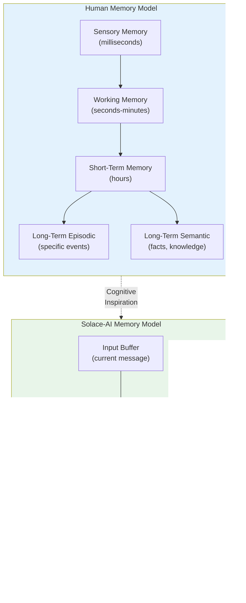

# Solace-AI: Memory & Context Management Module
## Complete System Architecture & Design

> **Version**: 2.0  
> **Date**: December 30, 2025  
> **Author**: System Architecture Team  
> **Status**: Technical Blueprint  
> **Integration**: All Modules (Core Infrastructure)

---

## Executive Summary

This document presents the complete architecture for the Memory & Context Management Module of Solace-AI. The module serves as the central nervous system for context persistence, enabling therapeutic continuity across sessions, maintaining user profiles, tracking clinical progress, and supporting all other modules with rich contextual information.

### Key Architecture Decisions

| Decision | Pattern | Rationale |
|----------|---------|-----------|
| **Memory Hierarchy** | 5-Tier Cognitive Model | Mirrors human memory (working → long-term) |
| **Primary Store** | Temporal Knowledge Graph (Zep) | 94.8% accuracy on deep memory retrieval |
| **Vector Database** | Weaviate Hybrid Search | BM25 + semantic for therapeutic terminology |
| **Session Memory** | ConversationSummaryBuffer | Verbatim recent + summarized history |
| **Consolidation** | Event-Driven Pipeline | Session end triggers memory processing |
| **Decay Model** | Ebbinghaus with Safety Override | Natural forgetting, but safety info persists |
| **Retrieval** | Agentic Corrective RAG | Self-correcting retrieval with grading |

---

## Table of Contents

1. [Architecture Philosophy](#1-architecture-philosophy)
2. [High-Level System Architecture](#2-high-level-system-architecture)
3. [Memory Hierarchy Model](#3-memory-hierarchy-model)
4. [Working Memory System](#4-working-memory-system)
5. [Episodic Memory System](#5-episodic-memory-system)
6. [Semantic Memory System](#6-semantic-memory-system)
7. [Therapeutic Context Store](#7-therapeutic-context-store)
8. [Memory Consolidation Pipeline](#8-memory-consolidation-pipeline)
9. [Retrieval Architecture](#9-retrieval-architecture)
10. [Memory Decay & Retention](#10-memory-decay--retention)
11. [Vector Database Architecture](#11-vector-database-architecture)
12. [Data Flow Architecture](#12-data-flow-architecture)
13. [Integration Interfaces](#13-integration-interfaces)
14. [Event-Driven Architecture](#14-event-driven-architecture)

---

## 1. Architecture Philosophy

### 1.1 Core Design Principles

```
┌─────────────────────────────────────────────────────────────────────────────┐
│                    MEMORY MODULE DESIGN PRINCIPLES                           │
├─────────────────────────────────────────────────────────────────────────────┤
│                                                                              │
│   ┌─────────────┐   ┌─────────────┐   ┌─────────────┐   ┌─────────────┐    │
│   │ COGNITIVE   │   │ THERAPEUTIC │   │   SAFETY    │   │  PRIVACY    │    │
│   │  INSPIRED   │   │  CONTINUITY │   │  CRITICAL   │   │   FIRST     │    │
│   └──────┬──────┘   └──────┬──────┘   └──────┬──────┘   └──────┬──────┘    │
│          │                 │                 │                 │            │
│          ▼                 ▼                 ▼                 ▼            │
│   ┌─────────────┐   ┌─────────────┐   ┌─────────────┐   ┌─────────────┐    │
│   │ 5-tier      │   │ Session-to- │   │ Crisis info │   │ HIPAA       │    │
│   │ hierarchy   │   │ session     │   │ NEVER       │   │ compliant   │    │
│   │ mirrors     │   │ context     │   │ decays      │   │ encryption  │    │
│   │ human       │   │ preservation│   │ or deletes  │   │ & access    │    │
│   │ cognition   │   │             │   │             │   │ control     │    │
│   └─────────────┘   └─────────────┘   └─────────────┘   └─────────────┘    │
│                                                                              │
│   INSPIRATION: MemGPT OS-like memory management + Zep Temporal KG           │
│   RETRIEVAL: Agentic Corrective RAG with self-healing queries               │
│   STORAGE: Hybrid (Vector + Structured + Cache) for optimal access          │
└─────────────────────────────────────────────────────────────────────────────┘
```

### 1.2 Cognitive Memory Model Inspiration



---

## 2. High-Level System Architecture

### 2.1 Complete Memory Module Overview


### 2.2 System Context

```mermaid
flowchart TB
    subgraph SOLACE["Solace-AI Platform"]
        subgraph CONSUMERS["Memory Consumers"]
            DIAG["🔍 Diagnosis Module"]
            THERAPY["💆 Therapy Module"]
            PERSONALITY["🎭 Personality Module"]
            RESPONSE["💬 Response Module"]
            SAFETY["🛡️ Safety Module"]
            ORCHESTRATOR["🎼 Orchestrator"]
        end
        
        subgraph MEMORY_MODULE["🧠 MEMORY MODULE"]
            MM_CORE["Memory Core"]
        end
    end

    subgraph INFRASTRUCTURE["Infrastructure"]
        REDIS[("Redis Cluster")]
        WEAVIATE[("Weaviate")]
        POSTGRES[("PostgreSQL")]
        S3[("S3/MinIO")]
    end

    DIAG <-->|"Diagnostic history"| MM_CORE
    THERAPY <-->|"Treatment context"| MM_CORE
    PERSONALITY <-->|"Profile storage"| MM_CORE
    RESPONSE <-->|"Conversation context"| MM_CORE
    SAFETY <-->|"Crisis history"| MM_CORE
    ORCHESTRATOR <-->|"Session state"| MM_CORE
    
    MM_CORE --> REDIS
    MM_CORE --> WEAVIATE
    MM_CORE --> POSTGRES
    MM_CORE --> S3

    style MEMORY_MODULE fill:#e8f5e9,stroke:#2e7d32
```



---

## 3. Memory Hierarchy Model

### 3.1 Five-Tier Memory Architecture

```mermaid
flowchart TB
    subgraph HIERARCHY["Five-Tier Memory Hierarchy"]
        direction TB
        
        subgraph TIER1["⚡ Tier 1: INPUT BUFFER"]
            T1_DESC["Current message being processed"]
            T1_STORE["In-memory only"]
            T1_TTL["TTL: Request duration"]
            T1_SIZE["Size: Single message"]
        end
        
        subgraph TIER2["🔥 Tier 2: WORKING MEMORY"]
            T2_DESC["Active context window for LLM"]
            T2_STORE["Redis + In-memory"]
            T2_TTL["TTL: Session duration"]
            T2_SIZE["Size: 4K-8K tokens"]
        end
        
        subgraph TIER3["📋 Tier 3: SESSION MEMORY"]
            T3_DESC["Full current session transcript"]
            T3_STORE["Redis with persistence"]
            T3_TTL["TTL: 24 hours after session"]
            T3_SIZE["Size: Full session"]
        end
        
        subgraph TIER4["📚 Tier 4: EPISODIC MEMORY"]
            T4_DESC["Past session summaries & events"]
            T4_STORE["PostgreSQL + Weaviate"]
            T4_TTL["TTL: Based on decay model"]
            T4_SIZE["Size: Summarized"]
        end
        
        subgraph TIER5["🧠 Tier 5: SEMANTIC MEMORY"]
            T5_DESC["Persistent user knowledge & facts"]
            T5_STORE["Weaviate + PostgreSQL"]
            T5_TTL["TTL: Permanent (with versioning)"]
            T5_SIZE["Size: Extracted facts"]
        end
    end

    TIER1 --> TIER2
    TIER2 --> TIER3
    TIER3 -->|"Consolidation"| TIER4
    TIER3 -->|"Extraction"| TIER5

    style TIER1 fill:#ffcdd2
    style TIER2 fill:#fff3e0
    style TIER3 fill:#fff9c4
    style TIER4 fill:#c8e6c9
    style TIER5 fill:#bbdefb
```



### 3.2 Memory Tier Specifications


---

## 4. Working Memory System

### 4.1 Context Window Management


### 4.2 Working Memory State Machine


### 4.3 LangChain Memory Pattern Implementation


---

## 5. Episodic Memory System

### 5.1 Session Transcript Storage


### 5.2 Event Timeline Architecture

```mermaid
flowchart TB
    subgraph TIMELINE["Therapeutic Event Timeline"]
        direction LR
        
        subgraph EVENTS["Event Types"]
            E1["🟢 Session Events<br/>(start, end, milestone)"]
            E2["📊 Assessment Events<br/>(PHQ-9, GAD-7 scores)"]
            E3["💊 Treatment Events<br/>(technique used, homework)"]
            E4["🚨 Crisis Events<br/>(detection, resolution)"]
            E5["🎯 Progress Events<br/>(goal achieved, skill learned)"]
        end
        
        subgraph STRUCTURE["Event Structure"]
            ST1["event_id: UUID"]
            ST2["event_type: EventType"]
            ST3["occurred_at: DateTime"]
            ST4["ingested_at: DateTime"]
            ST5["validity_interval: [start, end]"]
            ST6["payload: JSON"]
            ST7["related_events: UUID[]"]
        end
    end

    subgraph TEMPORAL["Bi-Temporal Model"]
        TM1["Transaction Time: When recorded"]
        TM2["Valid Time: When occurred"]
        TM3["Enables: Point-in-time queries"]
    end

    EVENTS --> STRUCTURE
    STRUCTURE --> TEMPORAL
```



### 5.3 Session Summary Generation

```mermaid
flowchart TB
    subgraph SUMMARY_PIPELINE["Session Summary Pipeline"]
        direction TB
        
        SESSION_END["Session Ends"] --> EXTRACT
        
        subgraph EXTRACT["Extraction Phase"]
            EX1["Key topics discussed"]
            EX2["Emotional high/low points"]
            EX3["Techniques used"]
            EX4["Insights gained"]
            EX5["Homework assigned"]
            EX6["Safety concerns (if any)"]
        end
        
        EXTRACT --> SUMMARIZE
        
        subgraph SUMMARIZE["Summarization Phase"]
            SUM1["LLM generates summary"]
            SUM2["Structured format"]
            SUM3["Max 500 tokens"]
        end
        
        SUMMARIZE --> STORE
        
        subgraph STORE["Storage Phase"]
            ST1["Summary → PostgreSQL"]
            ST2["Embedding → Weaviate"]
            ST3["Key facts → Semantic Memory"]
        end
    end

    subgraph SUMMARY_TEMPLATE["Summary Template"]
        TEMP["Session #N Summary (Date)<br/>─────────────────<br/>Main Topics: [topics]<br/>Emotional State: [arc]<br/>Techniques: [list]<br/>Key Insights: [insights]<br/>Homework: [assignments]<br/>Next Focus: [recommendation]"]
    end

    STORE --> SUMMARY_TEMPLATE
```



---

## 6. Semantic Memory System

### 6.1 User Knowledge Graph

```mermaid
flowchart TB
    subgraph KNOWLEDGE_GRAPH["User Knowledge Graph"]
        direction TB
        
        subgraph USER_NODE["👤 User Node"]
            UN1["user_id"]
            UN2["demographics"]
            UN3["preferences"]
        end
        
        subgraph RELATIONSHIP_NODES["Relationship Nodes"]
            RN1["👨‍👩‍👧 Family Members"]
            RN2["👥 Friends"]
            RN3["💼 Colleagues"]
            RN4["🐕 Pets"]
        end
        
        subgraph CONTEXT_NODES["Context Nodes"]
            CN1["🏠 Living Situation"]
            CN2["💼 Work Context"]
            CN3["🎯 Goals"]
            CN4["😰 Triggers"]
            CN5["🛡️ Coping Strategies"]
        end
        
        subgraph CLINICAL_NODES["Clinical Nodes"]
            CLN1["📋 Diagnoses"]
            CLN2["💊 Treatments"]
            CLN3["📈 Progress Markers"]
            CLN4["⚠️ Risk Factors"]
        end
    end

    USER_NODE --> RELATIONSHIP_NODES
    USER_NODE --> CONTEXT_NODES
    USER_NODE --> CLINICAL_NODES

    style USER_NODE fill:#e3f2fd
    style CLINICAL_NODES fill:#ffcdd2
```



### 6.2 Knowledge Triple Extraction

```mermaid
flowchart TB
    subgraph TRIPLE_EXTRACTION["Knowledge Triple Extraction"]
        direction TB
        
        INPUT["User says: 'My sister Sarah has been<br/>really supportive during my anxiety'"]
        
        INPUT --> NLP["NLP Processing"]
        
        NLP --> TRIPLES["Extracted Triples"]
        
        subgraph TRIPLES["Knowledge Triples"]
            T1["(User, has_sibling, Sarah)"]
            T2["(Sarah, relationship_type, sister)"]
            T3["(Sarah, provides, support)"]
            T4["(User, experiences, anxiety)"]
            T5["(Sarah, helpful_for, anxiety)"]
        end
        
        TRIPLES --> GRAPH["Add to Knowledge Graph"]
        
        GRAPH --> RETRIEVAL["Enables Retrieval:<br/>'Who supports the user?'<br/>→ Sarah (sister)"]
    end

    style TRIPLES fill:#e8f5e9
```



### 6.3 Fact Management System

```mermaid
flowchart TB
    subgraph FACT_MANAGEMENT["Fact Management System"]
        direction TB
        
        subgraph FACT_TYPES["Fact Categories"]
            F1["📌 Permanent Facts<br/>(Name, DOB, Family)"]
            F2["🔄 Evolving Facts<br/>(Job, Location, Status)"]
            F3["💭 Preferences<br/>(Communication style)"]
            F4["🎯 Goals<br/>(Treatment objectives)"]
            F5["⚠️ Safety Facts<br/>(Crisis history, triggers)"]
        end
        
        subgraph OPERATIONS["Fact Operations"]
            OP1["Add: New information"]
            OP2["Update: Changed information"]
            OP3["Conflict Resolution: Contradictions"]
            OP4["Verification: Confirm with user"]
        end
        
        subgraph VERSIONING["Fact Versioning"]
            V1["Each fact has version history"]
            V2["Source tracking (which session)"]
            V3["Confidence scoring"]
            V4["Last verified timestamp"]
        end
    end

    FACT_TYPES --> OPERATIONS --> VERSIONING
```



---

## 7. Therapeutic Context Store

### 7.1 Treatment Plan Memory


### 7.2 Safety-Critical Memory

```mermaid
flowchart TB
    subgraph SAFETY_MEMORY["Safety-Critical Memory (NEVER DECAYS)"]
        direction TB
        
        subgraph CRISIS_HISTORY["Crisis History"]
            CH1["Past crisis events"]
            CH2["Triggers identified"]
            CH3["De-escalation strategies that worked"]
            CH4["Emergency contacts"]
        end
        
        subgraph RISK_FACTORS["Risk Factor Tracking"]
            RF1["Static factors (history)"]
            RF2["Dynamic factors (current)"]
            RF3["Protective factors"]
            RF4["Warning signs to monitor"]
        end
        
        subgraph SAFETY_PLAN["Safety Plan Storage"]
            SP1["Warning signs"]
            SP2["Coping strategies"]
            SP3["Reasons for living"]
            SP4["Support contacts"]
            SP5["Professional resources"]
            SP6["Environment safety steps"]
        end
    end

    subgraph SPECIAL_RULES["Special Rules for Safety Memory"]
        SR1["🚨 NEVER subject to decay"]
        SR2["🔒 Highest access priority"]
        SR3["📋 Audit every access"]
        SR4["🔄 Regular verification prompts"]
    end

    SAFETY_MEMORY --> SPECIAL_RULES

    style SAFETY_MEMORY fill:#ffcdd2,stroke:#c62828
    style SPECIAL_RULES fill:#fff3e0
```



### 7.3 Session Continuity Bridge


---

## 8. Memory Consolidation Pipeline

### 8.1 Consolidation Architecture


### 8.2 Consolidation Event Flow


### 8.3 Incremental vs Batch Consolidation


---

## 9. Retrieval Architecture

### 9.1 Agentic Corrective RAG Pipeline

```mermaid
flowchart TB
    subgraph RAG_PIPELINE["Agentic Corrective RAG Pipeline"]
        direction TB
        
        QUERY["Context Query"] --> ROUTER
        
        subgraph ROUTER["Query Router"]
            R1["Classify query type"]
            R2["Select retrieval sources"]
            R3["Determine search strategy"]
        end
        
        ROUTER --> RETRIEVE
        
        subgraph RETRIEVE["Multi-Source Retrieval"]
            RET1["Vector Search (Weaviate)"]
            RET2["Keyword Search (BM25)"]
            RET3["Graph Traversal (KG)"]
            RET4["Structured Query (PostgreSQL)"]
        end
        
        RETRIEVE --> GRADE
        
        subgraph GRADE["Document Grading"]
            G1["Relevance scoring"]
            G2["Recency weighting"]
            G3["Source credibility"]
            G4["Threshold filtering"]
        end
        
        GRADE --> CHECK{Grade<br/>Acceptable?}
        
        CHECK -->|No| REPHRASE["Rephrase Query"]
        REPHRASE --> RETRIEVE
        
        CHECK -->|Yes| RERANK
        
        subgraph RERANK["Re-ranking"]
            RR1["Cross-encoder scoring"]
            RR2["Diversity enforcement"]
            RR3["Final selection"]
        end
        
        RERANK --> OUTPUT["Retrieved Context"]
    end

    style GRADE fill:#fff3e0
    style RERANK fill:#e8f5e9
```

### 9.2 Hybrid Search Architecture

```mermaid
flowchart TB
    subgraph HYBRID_SEARCH["Hybrid Search Strategy"]
        direction TB
        
        QUERY["Search Query"] --> PARALLEL
        
        subgraph PARALLEL["Parallel Search"]
            direction LR
            
            subgraph SEMANTIC["Semantic Search"]
                SEM1["Embed query"]
                SEM2["Vector similarity"]
                SEM3["Top-K results"]
            end
            
            subgraph KEYWORD["Keyword Search"]
                KEY1["BM25 tokenization"]
                KEY2["Term matching"]
                KEY3["Top-K results"]
            end
        end
        
        PARALLEL --> FUSION
        
        subgraph FUSION["Score Fusion"]
            FUS1["Normalize scores"]
            FUS2["Alpha weighting (0.5)"]
            FUS3["Reciprocal Rank Fusion"]
        end
        
        FUSION --> FINAL["Final Ranked Results"]
    end

    subgraph CONFIG["Hybrid Configuration"]
        C1["alpha = 0.5 (balanced)"]
        C2["Semantic for: meaning, concepts"]
        C3["Keyword for: names, terms, codes"]
    end
```

### 9.3 Context Assembly for LLM

```mermaid
flowchart TB
    subgraph ASSEMBLY["Context Assembly Pipeline"]
        direction TB
        
        REQUEST["Context Request"] --> GATHER
        
        subgraph GATHER["Gather Context Components"]
            G1["User profile summary"]
            G2["Recent conversation (verbatim)"]
            G3["Relevant past sessions"]
            G4["Current treatment context"]
            G5["Safety information (always)"]
        end
        
        GATHER --> PRIORITIZE
        
        subgraph PRIORITIZE["Prioritization"]
            P1["Safety info: Highest priority"]
            P2["Recent context: High"]
            P3["Retrieved history: Medium"]
            P4["Background info: Low"]
        end
        
        PRIORITIZE --> FIT
        
        subgraph FIT["Fit to Token Budget"]
            F1["Mandatory items first"]
            F2["Fill remaining budget"]
            F3["Truncate if needed"]
            F4["Preserve coherence"]
        end
        
        FIT --> FORMAT
        
        subgraph FORMAT["Format for LLM"]
            FM1["Structure with headers"]
            FM2["Clear delimiters"]
            FM3["Recency markers"]
        end
        
        FORMAT --> OUTPUT["Assembled Context<br/>(Ready for LLM)"]
    end
```

---

## 10. Memory Decay & Retention

### 10.1 Ebbinghaus Decay Model

```mermaid
flowchart TB
    subgraph DECAY_MODEL["Memory Decay Model"]
        direction TB
        
        subgraph FORMULA["Ebbinghaus Formula"]
            F1["R(t) = e^(-λt) × S"]
            F2["R = Retention strength"]
            F3["t = Time elapsed"]
            F4["λ = Decay rate"]
            F5["S = Stability (from reinforcement)"]
        end
        
        subgraph FACTORS["Decay Factors"]
            DF1["Base decay: λ = 0.1/day"]
            DF2["Reinforcement: Each recall × 1.5 stability"]
            DF3["Importance: Clinical info × 0.5 decay"]
            DF4["Emotional: High emotion × 0.7 decay"]
        end
        
        subgraph THRESHOLDS["Retention Thresholds"]
            TH1["R > 0.7: Active memory"]
            TH2["R 0.3-0.7: Archive candidate"]
            TH3["R < 0.3: Archive/delete"]
        end
    end

    FORMULA --> FACTORS --> THRESHOLDS
```

### 10.2 Retention Categories

```mermaid
flowchart TB
    subgraph RETENTION["Memory Retention Categories"]
        direction TB
        
        subgraph PERMANENT["🔒 PERMANENT (Never Decay)"]
            P1["Safety plan details"]
            P2["Crisis history"]
            P3["Emergency contacts"]
            P4["Core diagnoses"]
            P5["Severe risk factors"]
            P6["Medication allergies"]
        end
        
        subgraph LONG_TERM["📚 LONG-TERM (Slow Decay)"]
            L1["Treatment plans"]
            L2["Major milestones"]
            L3["Effective techniques"]
            L4["Key relationships"]
            L5["Core values/goals"]
        end
        
        subgraph MEDIUM_TERM["📋 MEDIUM-TERM (Standard Decay)"]
            M1["Session summaries"]
            M2["Homework history"]
            M3["Emotional patterns"]
            M4["Discussed topics"]
        end
        
        subgraph SHORT_TERM["📝 SHORT-TERM (Fast Decay)"]
            S1["Casual conversation details"]
            S2["Minor preferences"]
            S3["Temporary context"]
        end
    end

    style PERMANENT fill:#ffcdd2,stroke:#c62828
    style LONG_TERM fill:#c8e6c9,stroke:#2e7d32
    style MEDIUM_TERM fill:#fff9c4,stroke:#f9a825
    style SHORT_TERM fill:#e3f2fd,stroke:#1565c0
```

### 10.3 Archive Pipeline

```mermaid
flowchart TB
    subgraph ARCHIVE_PIPELINE["Archive Pipeline"]
        direction TB
        
        SCAN["Daily Scan: Low Retention Items"] --> EVALUATE
        
        subgraph EVALUATE["Evaluation"]
            E1["Check retention score"]
            E2["Check last access date"]
            E3["Check clinical importance"]
            E4["Check safety relevance"]
        end
        
        EVALUATE --> DECISION{Archive<br/>Decision}
        
        DECISION -->|Keep| REINFORCE["Boost Stability"]
        DECISION -->|Archive| ARCHIVE["Move to Cold Storage"]
        DECISION -->|Delete| DELETE["Secure Deletion"]
        
        subgraph ARCHIVE["Archive Process"]
            A1["Compress data"]
            A2["Move to S3 Glacier"]
            A3["Maintain index reference"]
            A4["Log archive event"]
        end
        
        subgraph DELETE["Deletion Process"]
            D1["HIPAA-compliant deletion"]
            D2["Remove from all stores"]
            D3["Audit log entry"]
            D4["Verify removal"]
        end
    end

    style DELETE fill:#ffcdd2
```

---

## 11. Vector Database Architecture

### 11.1 Weaviate Schema Design

```mermaid
flowchart TB
    subgraph WEAVIATE_SCHEMA["Weaviate Schema Design"]
        direction TB
        
        subgraph COLLECTIONS["Collections"]
            C1["ConversationMemory"]
            C2["SessionSummary"]
            C3["TherapeuticInsight"]
            C4["UserFact"]
            C5["CrisisEvent"]
        end
        
        subgraph CONVERSATION_MEM["ConversationMemory Schema"]
            CM1["content: text"]
            CM2["user_id: string (filterable)"]
            CM3["session_id: string"]
            CM4["timestamp: date"]
            CM5["role: string"]
            CM6["emotion: string"]
            CM7["importance: number"]
        end
        
        subgraph SESSION_SUM["SessionSummary Schema"]
            SS1["summary: text"]
            SS2["user_id: string"]
            SS3["session_number: int"]
            SS4["key_topics: text[]"]
            SS5["emotional_arc: number[]"]
            SS6["techniques_used: string[]"]
        end
    end

    C1 --> CONVERSATION_MEM
    C2 --> SESSION_SUM
```

### 11.2 Embedding Strategy

```mermaid
flowchart TB
    subgraph EMBEDDING["Embedding Strategy"]
        direction TB
        
        subgraph MODELS["Embedding Models"]
            M1["text-embedding-3-small (1536d)<br/>Primary: Best quality"]
            M2["all-MiniLM-L6-v2 (384d)<br/>Backup: Local/privacy"]
        end
        
        subgraph CHUNKING["Text Chunking"]
            CH1["Session summaries: Full text"]
            CH2["Conversations: Per message"]
            CH3["Long content: 512 token chunks"]
            CH4["Overlap: 50 tokens"]
        end
        
        subgraph INDEXING["Index Configuration"]
            IX1["Algorithm: HNSW"]
            IX2["efConstruction: 128"]
            IX3["M: 16"]
            IX4["Distance: Cosine"]
            IX5["Expected recall: ~99%"]
        end
    end

    MODELS --> CHUNKING --> INDEXING
```

### 11.3 Query Optimization

```mermaid
flowchart TB
    subgraph QUERY_OPT["Query Optimization"]
        direction TB
        
        subgraph FILTERS["Pre-filtering"]
            F1["user_id: Always filter first"]
            F2["timestamp: Date range"]
            F3["importance: Threshold"]
            F4["Reduces search space 99%+"]
        end
        
        subgraph SEARCH["Search Parameters"]
            S1["Hybrid alpha: 0.5"]
            S2["Limit: 20 candidates"]
            S3["Autocut: Enabled"]
            S4["Certainty threshold: 0.7"]
        end
        
        subgraph CACHING["Query Caching"]
            CA1["Common queries: Redis cache"]
            CA2["TTL: 5 minutes"]
            CA3["Cache key: hash(query + filters)"]
        end
    end

    FILTERS --> SEARCH --> CACHING
```

---

## 12. Data Flow Architecture

### 12.1 Complete Memory Data Flow

```mermaid
flowchart TB
    subgraph WRITE_FLOW["Write Flow"]
        direction TB
        
        W1["New Data (Message/Event)"] --> W2["Validation"]
        W2 --> W3["Classification (Memory Type)"]
        W3 --> W4["Enrichment (Embeddings, Metadata)"]
        W4 --> W5["Route to Storage"]
        
        W5 --> W6["Redis (Working Memory)"]
        W5 --> W7["Weaviate (Vector Memory)"]
        W5 --> W8["PostgreSQL (Structured)"]
        
        W6 & W7 & W8 --> W9["Publish Event"]
    end

    subgraph READ_FLOW["Read Flow"]
        direction TB
        
        R1["Context Request"] --> R2["Query Planning"]
        R2 --> R3["Multi-Source Query"]
        
        R3 --> R4["Redis (Recent)"]
        R3 --> R5["Weaviate (Semantic)"]
        R3 --> R6["PostgreSQL (Structured)"]
        
        R4 & R5 & R6 --> R7["Result Aggregation"]
        R7 --> R8["Ranking & Filtering"]
        R8 --> R9["Context Assembly"]
        R9 --> R10["Return to Requester"]
    end

    style WRITE_FLOW fill:#e8f5e9
    style READ_FLOW fill:#e3f2fd
```

### 12.2 Cross-Module Data Flow

```mermaid
sequenceDiagram
    participant User as User
    participant Orch as Orchestrator
    participant Memory as Memory Module
    participant Diag as Diagnosis
    participant Therapy as Therapy
    participant Response as Response Gen

    User->>Orch: Message
    Orch->>Memory: Store message + Get context
    
    Memory->>Memory: Store in working memory
    Memory->>Memory: Retrieve relevant history
    Memory-->>Orch: Assembled context
    
    Orch->>Diag: Assess (with context)
    Diag->>Memory: Get diagnostic history
    Memory-->>Diag: Past assessments
    Diag-->>Orch: Assessment result
    
    Orch->>Therapy: Generate response (with context)
    Therapy->>Memory: Get treatment context
    Memory-->>Therapy: Treatment plan, effective techniques
    Therapy-->>Orch: Therapeutic response
    
    Orch->>Response: Format response
    Response->>Memory: Store response
    Memory->>Memory: Update working memory
    
    Response-->>User: Final response
```

---

## 13. Integration Interfaces

### 13.1 Public Service Interfaces

```mermaid
classDiagram
    class IMemoryService {
        <<interface>>
        +store(userId, data, memoryType) MemoryRecord
        +retrieve(userId, query, options) RetrievalResult
        +getContext(userId, tokenBudget) AssembledContext
        +update(recordId, updates) MemoryRecord
        +archive(recordId) ArchiveResult
    }

    class ISessionMemoryService {
        <<interface>>
        +startSession(userId) SessionState
        +addMessage(sessionId, message) void
        +getSessionContext(sessionId) SessionContext
        +endSession(sessionId) SessionSummary
        +getSessionHistory(userId, limit) Session[]
    }

    class ISemanticMemoryService {
        <<interface>>
        +addFact(userId, fact) FactRecord
        +updateFact(factId, newValue) FactRecord
        +queryFacts(userId, query) Fact[]
        +getKnowledgeGraph(userId) KnowledgeGraph
    }

    class ITherapeuticMemoryService {
        <<interface>>
        +getTreatmentContext(userId) TreatmentContext
        +updateTreatmentPlan(userId, updates) TreatmentPlan
        +recordIntervention(userId, intervention) void
        +getEffectiveTechniques(userId) Technique[]
        +getSafetyContext(userId) SafetyContext
    }

    class AssembledContext {
        +String systemContext
        +String userProfile
        +String recentConversation
        +String relevantHistory
        +String therapeuticContext
        +String safetyInfo
        +Int totalTokens
    }

    IMemoryService --> AssembledContext
```

### 13.2 Module Integration Map

```mermaid
flowchart TB
    subgraph MEMORY_PROVIDES["Memory Module Provides"]
        MP1["Assembled Context"]
        MP2["User Profile"]
        MP3["Session History"]
        MP4["Treatment Context"]
        MP5["Safety Information"]
        MP6["Diagnostic History"]
        MP7["Personality Profile Storage"]
    end

    subgraph CONSUMERS["Consumer Modules"]
        direction TB
        
        subgraph DIAG_NEEDS["Diagnosis Module Needs"]
            DN1["Past assessments"]
            DN2["Symptom history"]
            DN3["Risk factor tracking"]
        end
        
        subgraph THERAPY_NEEDS["Therapy Module Needs"]
            TN1["Treatment plan state"]
            TN2["Effective techniques"]
            TN3["Homework history"]
            TN4["Session continuity"]
        end
        
        subgraph PERSONALITY_NEEDS["Personality Module Needs"]
            PN1["Profile storage"]
            PN2["Assessment history"]
            PN3["Preference tracking"]
        end
        
        subgraph RESPONSE_NEEDS["Response Module Needs"]
            RN1["Full assembled context"]
            RN2["Conversation history"]
            RN3["User preferences"]
        end
    end

    MP1 --> RESPONSE_NEEDS
    MP2 --> THERAPY_NEEDS & PERSONALITY_NEEDS
    MP3 --> THERAPY_NEEDS & DIAG_NEEDS
    MP4 --> THERAPY_NEEDS
    MP5 --> DIAG_NEEDS & THERAPY_NEEDS
    MP6 --> DIAG_NEEDS
    MP7 --> PERSONALITY_NEEDS
```

---

## 14. Event-Driven Architecture

### 14.1 Memory Events

```mermaid
flowchart TB
    subgraph PUBLISHERS["📤 Event Publishers"]
        P1["Session Service"]
        P2["Memory Core"]
        P3["Consolidation Pipeline"]
        P4["Archive Service"]
    end

    subgraph EVENTS["📨 Event Topics"]
        E1["memory.message.stored"]
        E2["memory.context.retrieved"]
        E3["memory.session.started"]
        E4["memory.session.ended"]
        E5["memory.consolidated"]
        E6["memory.fact.extracted"]
        E7["memory.safety.updated"]
        E8["memory.archived"]
    end

    subgraph SUBSCRIBERS["📥 Event Subscribers"]
        S1["All Modules (context updates)"]
        S2["Analytics Service"]
        S3["Audit Logger"]
        S4["Notification Service"]
        S5["Safety Monitor"]
    end

    P1 --> E1 & E3 & E4
    P2 --> E2 & E7
    P3 --> E5 & E6
    P4 --> E8

    E1 --> S2 & S3
    E4 --> S1 & S2
    E5 --> S1 & S2
    E7 --> S5 & S3
```

### 14.2 Event Schema

```mermaid
classDiagram
    class MemoryEvent {
        <<abstract>>
        +UUID eventId
        +DateTime timestamp
        +UUID userId
        +String eventType
    }

    class MessageStoredEvent {
        +UUID messageId
        +UUID sessionId
        +String role
        +MemoryTier tier
    }

    class SessionEndedEvent {
        +UUID sessionId
        +Int messageCount
        +Duration duration
        +String[] topicsCovered
    }

    class MemoryConsolidatedEvent {
        +UUID sessionId
        +String summaryId
        +Int factsExtracted
        +Int embeddingsCreated
    }

    class SafetyMemoryUpdatedEvent {
        +String updateType
        +String[] changedFields
        +RiskLevel previousRisk
        +RiskLevel newRisk
    }

    class MemoryArchivedEvent {
        +UUID[] archivedIds
        +String archiveLocation
        +String reason
    }

    MemoryEvent <|-- MessageStoredEvent
    MemoryEvent <|-- SessionEndedEvent
    MemoryEvent <|-- MemoryConsolidatedEvent
    MemoryEvent <|-- SafetyMemoryUpdatedEvent
    MemoryEvent <|-- MemoryArchivedEvent
```

---

## Appendix A: Memory Tier Quick Reference

| Tier | Name | Storage | TTL | Access Time | Use Case |
|------|------|---------|-----|-------------|----------|
| 1 | Input Buffer | In-memory | Request | <1ms | Current message |
| 2 | Working Memory | Redis | Session | <10ms | LLM context window |
| 3 | Session Memory | Redis+PostgreSQL | 24h | <50ms | Full session transcript |
| 4 | Episodic Memory | PostgreSQL+Weaviate | Decay-based | <200ms | Past session summaries |
| 5 | Semantic Memory | Weaviate+PostgreSQL | Permanent | <200ms | User facts, knowledge |

## Appendix B: Retention Categories

| Category | Decay Rate | Examples |
|----------|------------|----------|
| **Permanent** | 0 (Never) | Safety plans, crisis history, diagnoses |
| **Long-term** | 0.02/day | Treatment plans, major milestones |
| **Medium-term** | 0.05/day | Session summaries, homework history |
| **Short-term** | 0.15/day | Casual details, temporary context |

## Appendix C: Storage Backend Selection

| Data Type | Primary Store | Secondary Store | Rationale |
|-----------|---------------|-----------------|-----------|
| Working memory | Redis | - | Speed, TTL support |
| Session transcripts | PostgreSQL | S3 (archive) | ACID, queryable |
| Semantic search | Weaviate | - | Vector similarity |
| Structured data | PostgreSQL | - | Relationships, queries |
| Archives | S3 Glacier | - | Cost-effective cold storage |

---

*Document Version: 2.0*  
*Last Updated: December 30, 2025*  
*Status: Technical Blueprint*  
*Dependencies: All Modules (Core Infrastructure)*
