# Solace-AI Memory Module - Master Architecture Diagrams

> **Version**: 2.0  
> **Date**: December 30, 2025  
> **Purpose**: Visual Reference for Memory & Context Management Module

---

## Quick Reference

| Diagram | Description |
|---------|-------------|
| [1. System Architecture](#1-complete-system-architecture) | High-level module overview |
| [2. Memory Hierarchy](#2-five-tier-memory-hierarchy) | 5-tier cognitive model |
| [3. Working Memory](#3-working-memory-system) | Context window management |
| [4. Episodic Memory](#4-episodic-memory-system) | Session transcripts |
| [5. Semantic Memory](#5-semantic-memory-system) | Knowledge graph |
| [6. Consolidation](#6-memory-consolidation-pipeline) | Session end processing |
| [7. Retrieval](#7-agentic-rag-retrieval) | Corrective RAG pipeline |
| [8. Decay Model](#8-memory-decay--retention) | Ebbinghaus + Safety override |
| [9. Data Flow](#9-complete-data-flow) | Read/Write patterns |
| [10. Module Integration](#10-module-integration) | Cross-module communication |

---

## 1. Complete System Architecture

```mermaid
flowchart TB
    subgraph INPUT["📥 Input Layer"]
        MSG["User Messages"]
        EVENTS["Module Events"]
        CONTEXT["Context Requests"]
    end

    subgraph MEMORY_ENGINE["🧠 Memory Engine"]
        WORKING["Working Memory"]
        SESSION["Session Memory"]
        EPISODIC["Episodic Memory"]
        SEMANTIC["Semantic Memory"]
    end

    subgraph STORAGE["💾 Storage Layer"]
        REDIS[("Redis<br/>Session State")]
        POSTGRES[("PostgreSQL<br/>Structured")]
        WEAVIATE[("Weaviate<br/>Vector")]
    end

    subgraph OUTPUT["📤 Output"]
        CONTEXT_OUT["Assembled Context"]
        PROFILE["User Profile"]
        HISTORY["Session History"]
    end

    INPUT --> MEMORY_ENGINE
    MEMORY_ENGINE <--> STORAGE
    MEMORY_ENGINE --> OUTPUT

    style MEMORY_ENGINE fill:#e8f5e9,stroke:#2e7d32
    style STORAGE fill:#fff3e0,stroke:#ef6c00
```

## 2. Five-Tier Memory Hierarchy

```mermaid
flowchart TB
    subgraph HIERARCHY["Memory Hierarchy (Cognitive-Inspired)"]
        T1["⚡ TIER 1: Input Buffer<br/>Current message | <1ms"]
        T2["🔥 TIER 2: Working Memory<br/>LLM context window | <10ms"]
        T3["💾 TIER 3: Session Memory<br/>Full session transcript | <50ms"]
        T4["📚 TIER 4: Episodic Memory<br/>Past session summaries | <200ms"]
        T5["🧠 TIER 5: Semantic Memory<br/>Facts & knowledge | Permanent"]
    end

    T1 --> T2 --> T3
    T3 -->|"Consolidation"| T4
    T3 -->|"Extraction"| T5

    style T1 fill:#ffcdd2
    style T2 fill:#fff3e0
    style T3 fill:#fff9c4
    style T4 fill:#c8e6c9
    style T5 fill:#bbdefb
```

## 3. Working Memory System

## 4. Episodic Memory System

## 5. Semantic Memory System

```mermaid
flowchart TB
    subgraph KNOWLEDGE_GRAPH["User Knowledge Graph"]
        USER["👤 User Node"]
        
        DEMO["Demographics<br/>Age, location"]
        CLINICAL["Clinical History<br/>Diagnoses, meds"]
        SOCIAL["Social Context<br/>Relationships, work"]
        PREFS["Preferences<br/>Communication style"]
    end

    USER --> DEMO
    USER --> CLINICAL
    USER --> SOCIAL
    USER --> PREFS

    subgraph TRIPLES["Knowledge Triples"]
        EXAMPLE["(User, HAS_DIAGNOSIS, Depression)<br/>(User, WORKS_AS, Teacher)<br/>(User, PREFERS, Direct_Feedback)"]
    end

    KNOWLEDGE_GRAPH --> TRIPLES

    style CLINICAL fill:#ffcdd2
```

## 6. Memory Consolidation Pipeline

```mermaid
flowchart TB
    TRIGGER["📤 Session End Event"] --> PIPELINE

    subgraph PIPELINE["Consolidation Pipeline"]
        P1["1. Generate Summary"]
        P2["2. Extract Key Insights"]
        P3["3. Update Knowledge Graph"]
        P4["4. Create Embeddings"]
        P5["5. Store in Vector DB"]
        P6["6. Archive Full Transcript"]
        P7["7. Apply Decay Model"]
        P8["8. Publish Events"]
    end

    P1 --> P2 --> P3 --> P4 --> P5 --> P6 --> P7 --> P8

    PIPELINE --> STORAGE["Multi-Store Updates"]

    style PIPELINE fill:#e3f2fd
```

## 7. Agentic RAG Retrieval

## 8. Memory Decay & Retention

```mermaid
flowchart TB
    subgraph RETENTION["Memory Retention Categories"]
        PERM["🔒 PERMANENT (Never Decay)<br/>Safety plans, crisis history<br/>Emergency contacts, diagnoses"]
        
        LONG["📚 LONG-TERM (Slow Decay)<br/>Treatment progress, insights<br/>Relationship patterns"]
        
        MED["📝 MEDIUM-TERM (Standard)<br/>Session summaries<br/>Homework completion"]
        
        SHORT["💨 SHORT-TERM (Fast Decay)<br/>Casual conversation<br/>Minor preferences"]
    end

    subgraph DECAY["Ebbinghaus Model"]
        FORMULA["R = e^(-t/S)<br/>R: Retention, t: Time, S: Strength"]
    end

    style PERM fill:#ffcdd2,stroke:#c62828
    style LONG fill:#c8e6c9,stroke:#2e7d32
    style MED fill:#fff9c4,stroke:#f9a825
    style SHORT fill:#e3f2fd,stroke:#1565c0
```

## 9. Complete Data Flow

## 10. Module Integration

```mermaid
flowchart TB
    subgraph MEMORY["🧠 Memory Module"]
        PROVIDES["PROVIDES:<br/>• Assembled Context<br/>• User Profile<br/>• Session History<br/>• Pattern Insights"]
    end

    subgraph CONSUMERS["All Modules Consume Memory"]
        DIAG["🔍 Diagnosis<br/>Longitudinal context"]
        THERAPY["💆 Therapy<br/>Treatment continuity"]
        PERSONALITY["🎭 Personality<br/>Profile history"]
        SAFETY["🛡️ Safety<br/>Crisis history"]
    end

    MEMORY --> CONSUMERS

    subgraph EVENTS["📨 Events Published"]
        E1["MemoryConsolidated"]
        E2["ProfileUpdated"]
        E3["PatternDetected"]
        E4["MemoryArchived"]
    end

    MEMORY --> EVENTS

    style MEMORY fill:#e8f5e9,stroke:#2e7d32
```

---

## Key Architecture Decisions

| Decision | Pattern | Rationale |
|----------|---------|-----------|
| **Memory Hierarchy** | 5-Tier Cognitive Model | Mirrors human memory (working → long-term) |
| **Primary Store** | Temporal Knowledge Graph | 94.8% accuracy on deep memory retrieval |
| **Vector Database** | Weaviate Hybrid Search | BM25 + semantic for therapeutic terminology |
| **Session Memory** | ConversationSummaryBuffer | Verbatim recent + summarized history |
| **Consolidation** | Event-Driven Pipeline | Session end triggers memory processing |
| **Decay Model** | Ebbinghaus + Safety Override | Natural forgetting, safety info persists |
| **Retrieval** | Agentic Corrective RAG | Self-correcting retrieval with grading |

---

## Memory Tier Quick Reference

| Tier | Name | Storage | TTL | Access Time |
|------|------|---------|-----|-------------|
| 1 | Input Buffer | In-memory | Request | <1ms |
| 2 | Working Memory | Redis | Session | <10ms |
| 3 | Session Memory | Redis+PostgreSQL | 24h | <50ms |
| 4 | Episodic Memory | PostgreSQL+Weaviate | Decay-based | <200ms |
| 5 | Semantic Memory | Weaviate+PostgreSQL | Permanent | <500ms |

---

## Cross-Reference

For detailed explanations, refer to:
- **[ARCHITECTURE.md](ARCHITECTURE.md)** - Complete technical blueprint

---

*Generated for Solace-AI Memory Module v2.0*  
*Last Updated: December 30, 2025*
